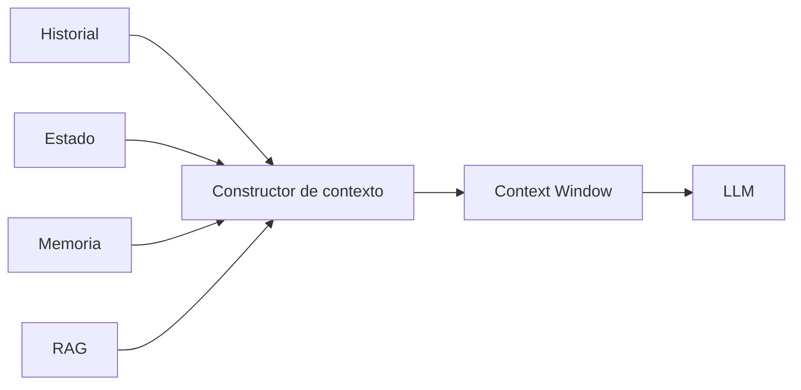

# Módulo 2 — Prompt Engineering Profesional

# Capítulo 19 — Ingeniería Conversacional

## Sección 03 — Gestión del Contexto Conversacional

> *"El contexto no consiste en enviar más información al modelo. Consiste en enviar únicamente la información correcta en el momento adecuado."*

---

## Objetivos de aprendizaje

- Comprender cómo administrar el contexto conversacional.
- Analizar el impacto del contexto sobre calidad, costo y rendimiento.
- Estudiar estrategias para mantener conversaciones extensas.
- Diseñar mecanismos de construcción dinámica del contexto.

---

## Introducción

El estado define qué sabe el sistema sobre la conversación. El contexto define qué parte de ese conocimiento llega al modelo en cada inferencia.

En los Large Language Models (LLM), el contexto se materializa dentro del *context window*: el espacio de tokens disponible para cada llamada. Una estrategia ingenua consistiría en reenviar todo el historial en cada consulta. Aunque sencilla, esta aproximación incrementa el consumo de tokens, aumenta la latencia y termina deteriorando la eficiencia del sistema.

La Ingeniería Conversacional propone un enfoque diferente: construir dinámicamente el contexto necesario para cada inferencia.

---

## El contexto como recurso limitado

El contexto constituye un recurso finito.

Cada token utilizado para transmitir información histórica reduce el espacio disponible para nuevas instrucciones, documentos o respuestas.

El diagrama muestra cuatro fuentes que alimentan un componente central: el **Constructor de contexto**. Este componente es una pieza arquitectónica gestionada por la aplicación —no por el modelo— cuya responsabilidad es seleccionar, combinar y filtrar información proveniente del historial, el estado, la memoria persistente y los resultados de recuperación externa. Decide qué entra al context window y qué se descarta. Una implementación típica aplica criterios como relevancia para la consulta actual, antigüedad de la información, prioridad del estado sobre el historial, y límites de tamaño configurables.

El término RAG (Retrieval-Augmented Generation, o Generación con Recuperación Aumentada) hace referencia a una técnica que permite recuperar información de bases de datos externas —documentos, repositorios, bases de conocimiento— y suministrarla al modelo como parte del contexto, sin necesidad de haberla incorporado en el entrenamiento. En el marco de la Ingeniería Conversacional, RAG permite enriquecer el contexto con información relevante bajo demanda, sin sobrecargar el historial.

La calidad del sistema depende tanto de **qué información se incorpora** como de **qué información se descarta**.

---

## Estrategias de construcción

La siguiente tabla consolida las estrategias principales para administrar el contexto en conversaciones extensas.

| Estrategia | Descripción | Ventajas | Limitaciones | Cuándo usar |
|------------|-------------|----------|--------------|-------------|
| Historial completo | Se envía todo el historial en cada consulta. | Máxima fidelidad. | Alto consumo de tokens; poco escalable. | Conversaciones breves o de bajo costo. |
| Ventana deslizante | Solo se conservan los mensajes más recientes. | Baja latencia. | Puede perder información anterior relevante. | Cuando la continuidad reciente es suficiente. |
| Resúmenes progresivos | Los segmentos antiguos se reemplazan por síntesis. | Reduce costos manteniendo continuidad. | Requiere generar resúmenes de calidad. | Conversaciones de larga duración. |
| Estado estructurado | Solo se envía información relevante del proceso. | Contexto preciso y controlado. | Requiere modelado explícito del estado. | Procesos guiados con etapas definidas. |
| Contexto híbrido | Combina estado, memoria y recuperación mediante RAG. | Alta precisión y escalabilidad. | Mayor complejidad de implementación. | Aplicaciones empresariales complejas. |

Cada alternativa representa un equilibrio diferente entre costo, precisión y complejidad. No existe una estrategia universal; la elección depende del dominio y de los objetivos de la aplicación.

---

## Selección inteligente del contexto

Desde la perspectiva del AI Engineering, el contexto debería construirse respondiendo preguntas como:

- ¿Qué información resulta imprescindible para resolver esta consulta?
- ¿Qué datos pertenecen al estado actual?
- ¿Qué información puede recuperarse bajo demanda mediante RAG?
- ¿Qué elementos dejaron de ser relevantes?

Este proceso convierte la construcción del contexto en una decisión arquitectónica y no simplemente en una concatenación de mensajes.

---

## Caso de estudio

Un asistente acompaña durante varias semanas el proceso de implementación de un sistema ERP.

Enviar todas las conversaciones anteriores al modelo resulta inviable: el volumen de mensajes excede rápidamente el context window disponible y el costo de cada inferencia se vuelve prohibitivo.

La solución adoptada combina:

- estado estructurado del proyecto (etapa actual, decisiones vigentes, bloqueantes activos);
- resumen de reuniones anteriores generado al cierre de cada sesión;
- recuperación de documentos técnicos mediante RAG cuando el usuario hace preguntas específicas;
- últimos mensajes intercambiados para mantener continuidad inmediata.

El Constructor de contexto selecciona qué combinación de estas fuentes enviar en cada llamada, descartando la información que ya no es relevante para la consulta actual. El modelo recibe únicamente lo necesario para continuar la conversación con coherencia.

---

## Buenas prácticas

- Construir el contexto dinámicamente en cada inferencia.
- Minimizar información redundante o desactualizada.
- Separar historial, estado y memoria como fuentes independientes.
- Evaluar periódicamente el tamaño promedio del contexto para controlar costos.
- Definir criterios explícitos de selección para el Constructor de contexto.

---

## Errores frecuentes

- Reenviar el historial completo en todas las consultas.
- Confiar únicamente en el contexto reciente sin incorporar estado ni memoria.
- Mezclar información temporal y permanente sin distinción.
- Ignorar el costo asociado al crecimiento del contexto.

---

## Ideas clave

- El contexto es un recurso limitado que debe administrarse, no acumularse.
- El Constructor de contexto es un componente arquitectónico de la aplicación, no del modelo.
- Una buena arquitectura conversacional envía menos información, pero más relevante.

---

## Transición hacia la siguiente sección

El contexto resuelve qué información llega al modelo en una sesión activa. El problema siguiente es distinto: qué ocurre cuando la sesión termina y el usuario regresa días después. En la próxima sección estudiaremos la **memoria conversacional** y cómo conservar información útil entre sesiones sin depender del contexto enviado al modelo.
