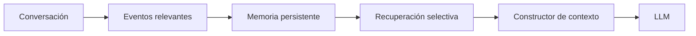

# Módulo 2 — Prompt Engineering Profesional

# Capítulo 19 — Ingeniería Conversacional

## Sección 04 — Memoria Conversacional

> *"La memoria no consiste en recordar todo. Consiste en conservar aquello que seguirá siendo útil cuando la conversación haya terminado."*

---

## Objetivos de aprendizaje

- Comprender el concepto de memoria conversacional.
- Diferenciar memoria de corto y largo plazo.
- Analizar estrategias para persistir conocimiento entre sesiones.
- Diseñar mecanismos de memoria alineados con las necesidades del negocio.

---

## Introducción

El contexto conversacional permite resolver una interacción utilizando la información disponible dentro del *context window*. Sin embargo, muchas aplicaciones requieren continuidad incluso después de finalizar una sesión.

Un asistente comercial debe recordar preferencias de un cliente.

Un tutor virtual necesita conocer el progreso de un estudiante.

Un agente corporativo debe reutilizar información obtenida días o semanas atrás.

Estos escenarios introducen el concepto de **memoria conversacional**: el mecanismo mediante el cual la aplicación conserva información relevante para enriquecer conversaciones futuras.

---

## ¿Qué es la memoria conversacional?

La memoria representa el conjunto de datos persistentes que una aplicación conserva para enriquecer conversaciones futuras.

A diferencia del contexto, la memoria no se envía automáticamente al modelo en cada inferencia. Debe recuperarse de manera selectiva cuando resulte relevante para la consulta en curso.

Un punto fundamental: la memoria no es una propiedad del LLM. El modelo no recuerda nada entre llamadas distintas; esa es su naturaleza técnica. La memoria es siempre una responsabilidad de la aplicación, que debe implementar los mecanismos de almacenamiento, recuperación y expiración correspondientes.

---

## Tipos de memoria

| Tipo | Características | Ejemplos |
|------|-----------------|----------|
| Corto plazo | Vigente durante una conversación o sesión. | Variables temporales, estado actual. |
| Largo plazo | Persiste entre sesiones. | Preferencias, historial relevante, perfil del usuario. |

La decisión sobre qué conservar depende de los objetivos funcionales y de las políticas de la organización. No toda la información tiene el mismo valor a lo largo del tiempo; lo relevante hoy puede no serlo en tres meses.

---

## ¿Qué conviene recordar?

No toda la información merece almacenarse.

Algunos candidatos habituales son:

- preferencias del usuario;
- configuraciones personalizadas;
- decisiones de procesos largos;
- objetivos pendientes;
- conocimiento explícitamente validado.

En cambio, mensajes efímeros, errores tipográficos o conversaciones irrelevantes suelen descartarse.

---

## Arquitecturas de memoria

Una implementación empresarial puede combinar diferentes mecanismos:

- bases de datos relacionales;
- almacenes documentales;
- bases vectoriales para recuperación semántica;
- sistemas de eventos;
- perfiles estructurados por usuario.

La memoria deja de ser un componente del modelo y pasa a formar parte de la arquitectura de la aplicación. Esto implica diseñar políticas explícitas de gobierno: qué se almacena, con qué formato, durante cuánto tiempo, quién puede acceder y cuándo debe actualizarse o eliminarse.

---

## Caso de estudio

Un asistente de soporte técnico atiende solicitudes recurrentes de una misma organización.

Gracias a la memoria persistente, cada nueva sesión comienza con un contexto enriquecido que incluye:

- tecnologías utilizadas por la organización;
- idioma y formato de comunicación preferidos;
- procedimientos previamente aprobados;
- incidentes abiertos o recientemente cerrados.

Esto elimina preguntas repetitivas en cada apertura de sesión y mejora la continuidad de la experiencia sin necesidad de reenviar historiales completos.

---

## Buenas prácticas

- Conservar únicamente información con valor futuro demostrable.
- Establecer políticas de actualización y expiración para cada tipo de dato.
- Validar la calidad de los datos almacenados antes de incorporarlos al contexto.
- Separar claramente memoria operativa de memoria histórica.
- Implementar los mecanismos de persistencia y recuperación en la aplicación, no en el modelo.

---

## Errores frecuentes

- Asumir que el LLM retiene información entre sesiones sin implementación explícita.
- Utilizar la memoria como un historial completo sin criterios de selección.
- Persistir información innecesaria que incrementa el ruido en el contexto.
- No definir reglas de eliminación o expiración.
- Recuperar información irrelevante para la consulta actual.

---

## Ideas clave

- La memoria complementa al contexto, pero no lo reemplaza.
- Persistir información implica diseñar políticas de gobierno de datos, no solo técnicas de almacenamiento.
- La memoria es una responsabilidad de la aplicación; el LLM no la gestiona por sí solo.

---

## Transición hacia la siguiente sección

La memoria responde al desafío de la continuidad entre sesiones. El siguiente problema es diferente: cómo gestionar el crecimiento del historial dentro de una misma conversación extensa. En la próxima sección analizaremos estrategias de **gestión del historial conversacional**, incluyendo cuándo resumir, cuándo conservar y cuándo descartar información para mantener conversaciones escalables.
