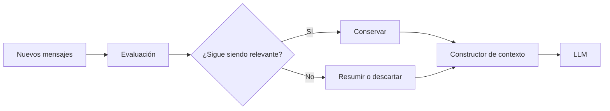

# Módulo 2 — Prompt Engineering Profesional

# Capítulo 19 — Ingeniería Conversacional

## Sección 05 — Gestión del Historial Conversacional

> *"Una conversación extensa no se sostiene recordando cada palabra. Se sostiene preservando aquello que mantiene vivo el significado."*

---

## Objetivos de aprendizaje

- Comprender el papel del historial conversacional.
- Analizar estrategias para administrar conversaciones de larga duración.
- Estudiar técnicas de resumen progresivo y compresión del contexto.
- Diseñar conversaciones escalables desde una perspectiva de AI Engineering.

---

## Introducción

Las secciones anteriores presentaron el estado como la situación actual del proceso y la memoria como la información persistente entre sesiones. El historial es la tercera pieza del rompecabezas: el registro acumulado de lo que ocurrió durante la conversación en curso.

A medida que una conversación crece, también lo hace la cantidad de información potencialmente relevante. Reenviar todo el historial en cada interacción incrementa el consumo de tokens, aumenta la latencia y dificulta identificar qué información continúa siendo útil.

La Ingeniería Conversacional propone administrar el historial como un recurso dinámico, preservando el significado de la conversación sin depender de una copia íntegra de todos los mensajes.

---

## El ciclo de vida del historial

El historial no es un bloque estático de texto.

Cada nueva interacción modifica su valor para futuras consultas.

Administrar el historial implica decidir activamente qué conservar, qué resumir y qué eliminar.

---

## Estrategias habituales

La sección anterior presentó una tabla completa de estrategias de construcción de contexto con descripción, ventajas, limitaciones y criterios de uso (ver Sección 03). A continuación se destacan las características diferenciales de cada enfoque aplicado específicamente a la gestión del historial:

- **Historial completo**: garantiza máxima fidelidad pero escala mal. Apropiado para conversaciones breves.
- **Ventana deslizante**: conserva solo los mensajes más recientes. Simple de implementar, pero puede perder información anterior crítica.
- **Resúmenes progresivos**: reemplaza segmentos antiguos por síntesis estructuradas. Permite conversaciones de alta duración con costo controlado.
- **Historial híbrido**: combina mensajes recientes, resúmenes históricos y estado estructurado. Es la estrategia más potente y la más compleja.

No existe una estrategia universal. La elección depende del dominio y de los objetivos de la aplicación.

---

## Resúmenes progresivos

Una técnica ampliamente utilizada en conversaciones de larga duración consiste en reemplazar segmentos antiguos del historial por un resumen estructurado generado al finalizar cada bloque de interacciones.

Este resumen conserva:

- decisiones tomadas;
- objetivos pendientes;
- hechos relevantes;
- restricciones acordadas;
- eventos significativos.

La calidad del resumen es crítica: un resumen incompleto puede omitir información que el sistema necesitará más adelante. Por eso, las implementaciones robustas incluyen criterios explícitos para activar la generación del resumen (por ejemplo, al superar un umbral de tokens), mecanismos de validación del contenido resumido, y la posibilidad de mantener el segmento original en un almacén secundario como respaldo ante pérdidas.

De este modo, el sistema mantiene la continuidad sin consumir innecesariamente el context window disponible.

---

## Caso de estudio

Un asistente acompaña durante meses la implementación de un proyecto tecnológico.

Cada semana se intercambian cientos de mensajes entre el equipo del cliente y el asistente.

En lugar de conservar todo el historial, la plataforma genera automáticamente un resumen al finalizar cada reunión y actualiza el estado del proyecto con las decisiones y próximos pasos acordados.

Cuando el usuario retoma la conversación semanas después, el sistema reconstruye el contexto utilizando:

- el estado actual del proyecto;
- los resúmenes históricos de reuniones anteriores;
- los mensajes de la sesión más reciente;
- documentación técnica específica recuperada mediante RAG (Retrieval-Augmented Generation), es decir, recuperación de información relevante desde repositorios externos.

La conversación continúa con coherencia sin necesidad de reenviar miles de mensajes.

---

## Buenas prácticas

- Definir políticas claras sobre cuándo y cómo generar resúmenes del historial.
- Validar periódicamente la calidad de los resúmenes generados.
- Diferenciar historial operativo (mensajes activos) de memoria persistente (decisiones de largo plazo).
- Establecer umbrales de tamaño que activen la compresión del historial.

---

## Errores frecuentes

- Mantener indefinidamente todo el historial sin política de compresión.
- Resumir información crítica sin mecanismos de validación.
- Mezclar eventos históricos con estado actual en el mismo bloque de contexto.
- Ignorar el impacto del crecimiento del historial sobre costos y rendimiento.

---

## Ideas clave

- El historial conversacional debe administrarse activamente, no acumularse.
- Los resúmenes progresivos permiten escalar conversaciones extensas sin perder continuidad.
- Escalar una conversación es un problema de preservación del significado, no de capacidad de almacenamiento.

---

## Transición hacia la siguiente sección

Hasta aquí hemos tratado los componentes internos de la arquitectura conversacional: estado, contexto, memoria e historial. En la próxima sección salimos de los componentes y nos ocupamos del **flujo conversacional**: cómo diseñar conversaciones orientadas a objetivos, con transiciones de estado definidas, que conduzcan al usuario hacia un resultado concreto sin perder naturalidad.
