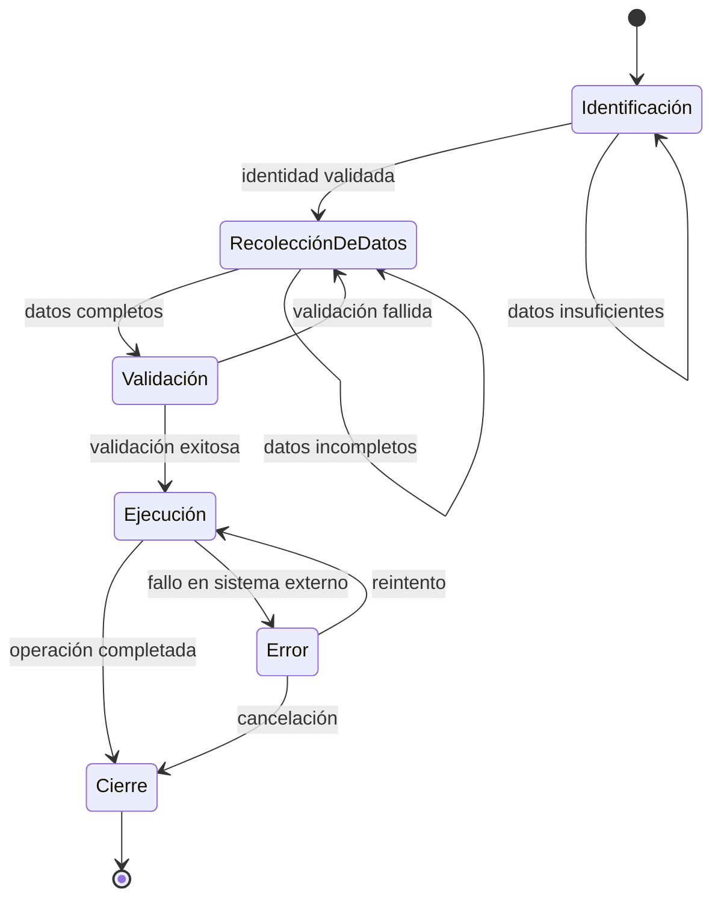

# Módulo 2 — Prompt Engineering Profesional

# Capítulo 19 — Ingeniería Conversacional

## Sección 06 — Flujos Conversacionales y Diseño Orientado a Objetivos

> *"Una buena conversación no consiste únicamente en responder preguntas. Consiste en conducir al usuario hacia un objetivo sin perder naturalidad."*

---

## Objetivos de aprendizaje

- Comprender el concepto de flujo conversacional.
- Analizar cómo modelar conversaciones orientadas a objetivos.
- Diferenciar conversaciones libres y guiadas, y comprender cómo combinarlas.
- Diseñar transiciones de estado para aplicaciones empresariales.

---

## Introducción

No todas las conversaciones poseen el mismo grado de libertad.

Un asistente creativo puede aceptar cambios permanentes de tema sin afectar su propósito.

Un asistente para tramitar una licencia, registrar un reclamo o completar un proceso administrativo necesita conducir la interacción hacia un resultado concreto. En estos escenarios, el diseño del flujo conversacional constituye una responsabilidad arquitectónica tan importante como el diseño del prompt.

---

## Conversaciones orientadas a objetivos

En una conversación guiada, cada interacción busca acercar al usuario a un estado final deseado.

Ese objetivo puede consistir en:

- completar un formulario;
- generar un documento;
- resolver una incidencia;
- registrar una operación;
- finalizar una compra.

El modelo deja de responder únicamente mensajes aislados y comienza a participar en un proceso con etapas, condiciones y resultados esperados.

El diagrama muestra que el flujo no es lineal: cada estado tiene transiciones condicionales, incluyendo retrocesos ante datos insuficientes, fallos de validación y errores de ejecución. Esta variabilidad es la norma en aplicaciones empresariales reales.

---

## Estados y transiciones

Una forma habitual de representar estos procesos consiste en modelar estados.

Cada estado define:

| Elemento | Función |
|----------|---------|
| Objetivo | Qué debe lograrse antes de avanzar. |
| Información requerida | Datos necesarios para continuar. |
| Reglas | Validaciones y restricciones. |
| Próximos estados | Caminos posibles según la interacción. |

El LLM participa en la conversación generando respuestas naturales, pero la lógica de transición permanece bajo control de la aplicación. Delegar esa lógica al modelo no es solo una decisión de eficiencia: es un riesgo de gobernanza. El modelo puede generar transiciones incorrectas basadas en el texto del usuario, eludiendo validaciones que deberían ser deterministas. En entornos regulados —seguros, administración pública, salud— este riesgo tiene consecuencias directas.

---

## Conversaciones libres y guiadas

| Conversación libre | Conversación guiada |
|--------------------|---------------------|
| Alta flexibilidad. | Objetivo definido. |
| Cambios frecuentes de tema. | Flujo controlado. |
| Menor estructura. | Estados explícitos. |
| Predomina la creatividad. | Predomina la consistencia. |

Muchas soluciones empresariales combinan ambos enfoques. La combinación más habitual consiste en que el asistente opere en modo libre para responder preguntas generales o de política interna, y cambie a modo guiado cuando el usuario activa un proceso específico. La transición entre modos es explícita: la aplicación detecta la intención de inicio de proceso, activa el estado correspondiente e instruye al modelo sobre el nuevo marco de la conversación. Al finalizar el proceso guiado, el asistente puede retornar al modo libre sin pérdida del estado intermedio.

---

## Caso de estudio

Un asistente ayuda a los empleados a solicitar vacaciones.

El usuario puede formular preguntas abiertas sobre políticas internas —modo libre—, pero cuando decide iniciar la solicitud, el proceso sigue un flujo definido:

1. identificar al empleado;
2. seleccionar fechas;
3. validar disponibilidad;
4. confirmar la solicitud;
5. registrar la operación.

Si el empleado menciona en el paso 3 que quiere cambiar las fechas, el sistema retrocede al paso 2 sin perder la información de identidad ya validada. La conversación conserva naturalidad mientras la aplicación controla el avance y los retrocesos entre estados.

---

## Buenas prácticas

- Definir objetivos claros para cada etapa del flujo.
- Separar la lógica de negocio del comportamiento conversacional.
- Validar la información antes de avanzar de estado, usando reglas deterministas en la aplicación.
- Permitir retrocesos cuando el usuario necesite corregir información anterior.
- Documentar los caminos alternativos y los estados de error desde el diseño.

---

## Errores frecuentes

- Delegar completamente el control del flujo y las validaciones al modelo.
- No representar explícitamente el estado del proceso en la aplicación.
- Diseñar flujos solo para el camino feliz, sin contemplar excepciones o retrocesos.
- Mezclar la lógica de negocio con las instrucciones del prompt.

---

## Ideas clave

- Una conversación empresarial suele estar orientada a objetivos con etapas, condiciones y resultados esperados.
- El modelado de estados es el instrumento para representar y controlar esa complejidad.
- El LLM conversa; la aplicación gobierna el flujo. Delegar ese gobierno al modelo es un riesgo de gobernanza.

---

## Transición hacia la siguiente sección

Los flujos bien diseñados asumen un comportamiento relativamente predecible del usuario. En la práctica, los usuarios interrumpen, corrigen y cambian de intención con frecuencia. En la próxima sección estudiaremos cómo gestionar **interrupciones y cambios de intención**, y cómo recuperar el contexto para que la conversación continúe sin perder el hilo.
