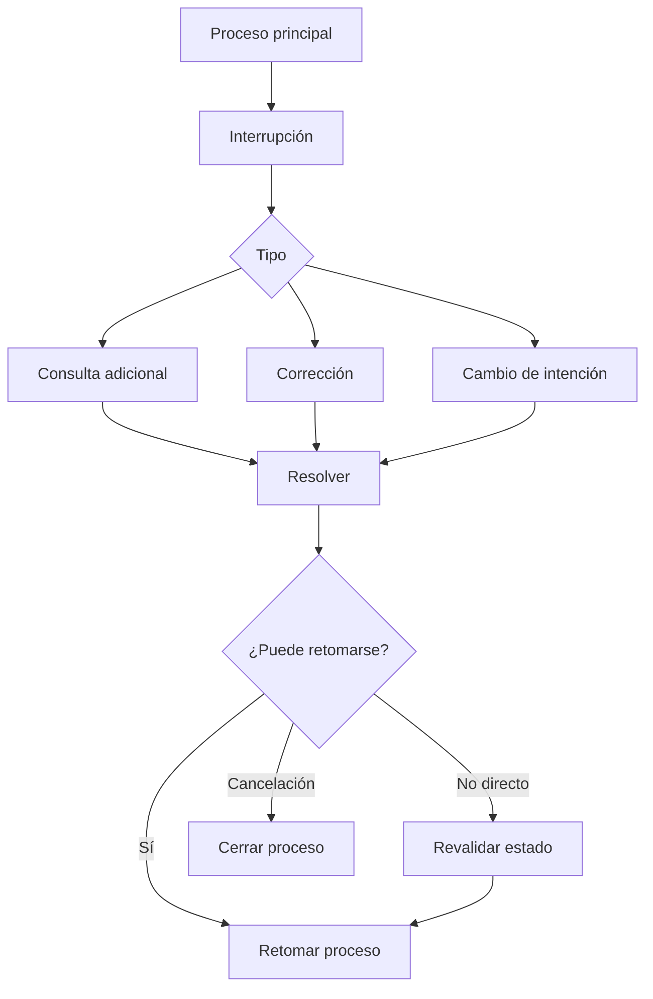

# Módulo 2 — Prompt Engineering Profesional

# Capítulo 19 — Ingeniería Conversacional

## Sección 07 — Interrupciones, Cambios de Intención y Recuperación del Contexto

> *"Una conversación robusta no es aquella en la que el usuario nunca se desvía. Es aquella que siempre encuentra el camino para continuar."*

---

## Objetivos de aprendizaje

- Comprender cómo gestionar interrupciones y cambios de intención.
- Analizar estrategias para recuperar el contexto conversacional.
- Diseñar conversaciones resilientes frente a comportamientos impredecibles.
- Introducir mecanismos de recuperación y continuidad.

---

## Introducción

En los ejemplos estudiados hasta ahora, las conversaciones evolucionaron siguiendo un recorrido relativamente ordenado.

Sin embargo, los usuarios reales rara vez mantienen ese comportamiento.

Durante una misma interacción pueden:

- cambiar de tema;
- formular varias preguntas simultáneamente;
- corregir información previamente ingresada;
- retomar un asunto tratado mucho tiempo atrás;
- abandonar temporalmente el proceso principal.

La Ingeniería Conversacional debe contemplar estas situaciones desde el diseño de la arquitectura y no únicamente mediante instrucciones incluidas en el prompt.

---

## Interrupciones conversacionales

Una interrupción representa cualquier evento que modifica temporalmente el flujo principal de la conversación.

No necesariamente constituye un error.

En muchos casos forma parte del comportamiento esperado del usuario.

El objetivo consiste en responder la interrupción sin perder el estado del proceso original. Sin embargo, no todas las interrupciones permiten un retorno directo: una corrección de datos puede invalidar validaciones ya realizadas y requerir retroceder a un estado anterior.

---

## Cambios de intención

Uno de los mayores desafíos consiste en detectar cuándo el usuario ha cambiado realmente de objetivo.

Por ejemplo:

- pasar de solicitar vacaciones a consultar una política interna;
- abandonar un trámite para iniciar otro diferente;
- interrumpir una compra para modificar datos personales.

La detección del cambio de intención puede implementarse mediante distintos mecanismos:

- **Clasificación por el modelo**: el sistema envía el último mensaje del usuario junto con el contexto activo y solicita al LLM que clasifique si se trata de una pregunta dentro del proceso actual o un cambio de objetivo. Este enfoque es flexible pero introduce latencia adicional.
- **Reglas heurísticas en la aplicación**: patrones de texto que sugieren cambio de proceso (palabras clave, verbos de inicio de nuevo proceso) activan una respuesta determinista sin consultar al modelo.
- **Umbral de confianza**: si la clasificación supera un umbral definido, el sistema actúa automáticamente; si no, solicita confirmación al usuario.
- **Confirmación explícita**: ante ambigüedad, el sistema siempre pregunta antes de cambiar de contexto.

Una vez detectado el posible cambio, la aplicación debe decidir si:

- mantiene el flujo actual;
- suspende temporalmente el proceso;
- inicia una nueva conversación;
- solicita confirmación antes de cambiar de contexto.

---

## Recuperación del contexto

Una vez resuelta la interrupción, el sistema debe reconstruir el contexto necesario para continuar.

Las estrategias más habituales incluyen:

| Estrategia | Beneficio |
|------------|-----------|
| Estado estructurado | Recuperación inmediata del proceso sin depender del historial. |
| Resumen del último objetivo | Facilita retomar la conversación con una síntesis del punto de abandono. |
| Memoria de corto plazo | Conserva información reciente de la sesión activa. |
| Historial resumido | Evita reenviar conversaciones completas sin perder continuidad. |

La recuperación del contexto debe ser transparente para el usuario: el asistente retoma exactamente donde quedó, sin solicitar información ya proporcionada.

---

## Caso de estudio

Un ciudadano inicia el trámite para renovar un permiso.

Mientras completa el proceso, pregunta cuáles son los requisitos para un familiar.

El asistente responde la consulta adicional —preservando el estado del trámite original en paralelo— y luego continúa exactamente en el punto donde había quedado la renovación, sin solicitar nuevamente la información ya proporcionada.

La conversación mantiene coherencia gracias a una correcta administración del estado: el trámite principal no se pierde durante la interrupción, y el retorno a él es inmediato una vez resuelta la consulta secundaria.

---

## Buenas prácticas

- Modelar explícitamente las interrupciones posibles como parte del diseño del flujo.
- Preservar el estado del proceso principal durante cualquier interrupción.
- Confirmar cambios de intención cuando exista ambigüedad, en lugar de asumir.
- Separar claramente los procesos activos de las consultas secundarias.
- Evaluar si una corrección requiere revalidar estados anteriores antes de continuar.

---

## Errores frecuentes

- Reiniciar la conversación ante cualquier interrupción, descartando el estado acumulado.
- Perder el estado del proceso principal al atender una consulta secundaria.
- Mezclar objetivos diferentes dentro del mismo bloque de contexto.
- Asumir cambios de intención sin validarlos con el usuario.

---

## Ideas clave

- Las interrupciones forman parte del comportamiento normal de los usuarios y deben diseñarse, no evitarse.
- La robustez conversacional no se logra impidiendo desviaciones, sino diseñando para recuperarse de ellas.
- La recuperación del contexto es una capacidad arquitectónica que depende del estado, no del historial.

---

## Transición hacia la siguiente sección

Gestionar interrupciones en conversaciones de un solo proceso es complejo. En la próxima sección añadimos una dimensión más: la **coordinación de múltiples conversaciones** simultáneas, asistentes especializados y procesos paralelos dentro de una misma sesión empresarial.
