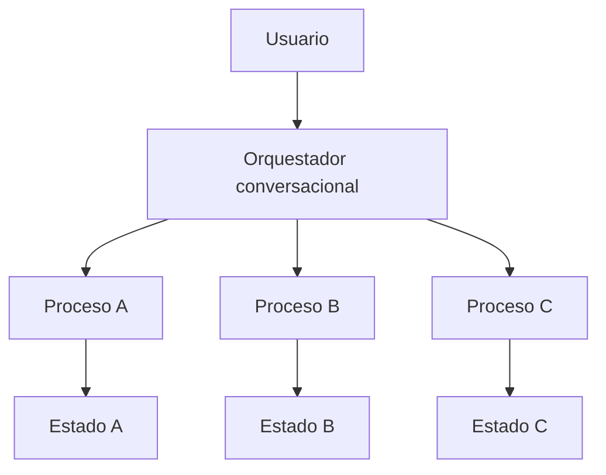

# Módulo 2 — Prompt Engineering Profesional

# Capítulo 19 — Ingeniería Conversacional

## Sección 08 — Coordinación de Múltiples Conversaciones y Orquestación

> *"Las conversaciones complejas no se vuelven inmanejables por su duración. Se vuelven inmanejables cuando no existe una estrategia para coordinarlas."*

---

## Objetivos de aprendizaje

- Comprender cómo coordinar conversaciones complejas con múltiples procesos activos.
- Analizar el concepto de conversaciones paralelas y asistentes especializados.
- Introducir patrones de orquestación conversacional y sus criterios de decisión.
- Diseñar soluciones escalables para entornos empresariales.

---

## Introducción

Hasta este punto hemos considerado conversaciones que persiguen un único objetivo, aunque con interrupciones y cambios de intención.

Sin embargo, muchas soluciones empresariales requieren administrar múltiples procesos simultáneamente dentro de la misma sesión. Un asistente puede responder preguntas generales, consultar documentación mediante RAG (Retrieval-Augmented Generation), ejecutar herramientas externas, coordinar agentes especializados y mantener varios procesos abiertos con el mismo usuario —todo al mismo tiempo.

La Ingeniería Conversacional moderna debe organizar esta complejidad sin perder coherencia.

---

## Conversaciones paralelas

Una conversación puede contener varios hilos activos simultáneamente.

Por ejemplo:

- un trámite administrativo en curso;
- una consulta sobre normativa;
- una solicitud de generación de un informe.

Cada hilo posee su propio estado, aunque todos comparten un mismo usuario y una misma sesión.

La arquitectura debe impedir que el contexto de un proceso contamine a los demás. El aislamiento se implementa mediante identificadores de proceso separados en el contexto enviado al modelo, instrucciones explícitas de delimitación en el system prompt, y estructuras de estado independientes que eviten que el historial de un proceso sea accesible desde otro. Cuando este aislamiento falla en producción, los errores son difíciles de diagnosticar y costosos de corregir.

---

## Orquestación conversacional

En lugar de construir un único asistente monolítico que gestione todo, muchas plataformas utilizan un **orquestador conversacional**: un componente de la aplicación que coordina los procesos activos y decide qué ocurre en cada turno.

Sus decisiones incluyen:

| Decisión | Ejemplo | Criterio habitual |
|----------|---------|-------------------|
| Qué proceso continúa activo | Retomar un trámite iniciado previamente. | Intención detectada en el último mensaje. |
| Qué especialista interviene | Consultar un agente financiero o legal. | Clasificación del dominio de la consulta. |
| Qué memoria recuperar | Preferencias del usuario o datos del proceso. | Relevancia para el contexto actual. |
| Qué herramientas utilizar | ERP, CRM, RAG o APIs externas. | Tipo de acción requerida. |

El orquestador toma estas decisiones usando una combinación de reglas deterministas y, en algunos casos, clasificación asistida por el modelo. Las reglas deterministas cubren transiciones de proceso predecibles; la clasificación por modelo se reserva para ambigüedades de intención. Cuando dos procesos paralelos reclaman atención simultánea, el orquestador aplica prioridades configuradas o solicita al usuario que especifique.

El LLM participa en la conversación generando respuestas, mientras que la aplicación —a través del orquestador— coordina el flujo global y garantiza que cada proceso reciba el contexto correcto.

---

## Beneficios del enfoque modular

Una arquitectura basada en conversaciones coordinadas por un orquestador ofrece:

- mayor escalabilidad al incorporar nuevos dominios o procesos;
- reutilización de componentes especializados;
- aislamiento entre procesos que previene contaminación de contexto;
- mantenimiento más sencillo al poder actualizar un asistente sin afectar a los demás;
- incorporación gradual de nuevas capacidades.

Estos beneficios resultan especialmente relevantes en plataformas empresariales de gran tamaño donde los requisitos evolucionan continuamente.

---

## Caso de estudio

Una universidad implementa un asistente institucional para su comunidad estudiantil.

Durante la misma sesión, un estudiante:

1. consulta el calendario académico;
2. inicia un trámite administrativo de inscripción tardía;
3. solicita ayuda sobre el contenido de una materia;
4. pregunta por el estado de una solicitud de beca.

Cada una de estas interacciones corresponde a un dominio diferente. El orquestador mantiene cada proceso de forma independiente, con su propio estado y su propio contexto. Cuando el estudiante retoma cualquiera de ellos —incluso después de haber pasado por los otros tres—, el sistema reconstruye el contexto adecuado sin mezclar información entre dominios.

La experiencia permanece fluida porque la complejidad está organizada, no porque el modelo la gestione por sí solo.

---

## Buenas prácticas

- Mantener estados independientes por proceso, con identificadores que el orquestador pueda distinguir.
- Centralizar las decisiones de coordinación en el orquestador, no en el modelo.
- Recuperar únicamente el contexto necesario para el proceso activo en cada turno.
- Implementar mecanismos de aislamiento explícitos para evitar contaminación entre procesos.
- Definir responsabilidades claras para cada asistente especializado y los límites de su dominio.

---

## Errores frecuentes

- Compartir un único bloque de contexto para todos los procesos simultáneos.
- Delegar toda la coordinación al modelo, esperando que infiera qué proceso corresponde.
- Mezclar memorias pertenecientes a dominios distintos en el mismo almacén.
- No contemplar en el diseño la posibilidad de conversaciones paralelas.
- Asumir que el aislamiento de procesos es automático sin implementarlo explícitamente.

---

## Ideas clave

- Una plataforma empresarial puede mantener múltiples conversaciones lógicas simultáneas para el mismo usuario.
- El orquestador es el componente que decide qué proceso atiende cada mensaje y con qué contexto.
- Coordinar múltiples conversaciones es un problema de arquitectura de sistemas, no de calidad de prompts.

---

## Transición hacia la siguiente sección

Con los componentes individuales y los patrones de coordinación establecidos, la próxima sección cierra el capítulo integrando todo en un conjunto de **principios de diseño conversacional** que guíen la construcción de experiencias empresariales consistentes, medibles y sostenibles.
