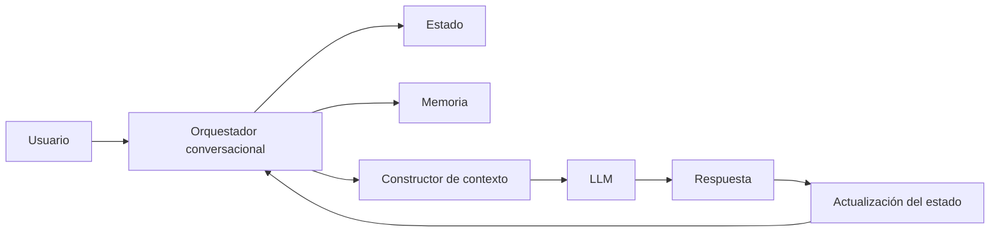

# Módulo 2 — Prompt Engineering Profesional

# Capítulo 19 — Ingeniería Conversacional

## Sección 09 — Principios de Diseño Conversacional e Integración

> *"Una conversación bien diseñada no se mide por la cantidad de respuestas generadas, sino por la facilidad con la que el usuario alcanza su objetivo."*

---

## Objetivos de aprendizaje

- Integrar los principios fundamentales de la Ingeniería Conversacional.
- Analizar criterios para diseñar experiencias conversacionales consistentes.
- Comprender la relación entre conversación, arquitectura y experiencia de usuario.
- Preparar la transición hacia las arquitecturas basadas en prompts.

---

## Introducción

A lo largo de este capítulo estudiamos cómo una conversación empresarial requiere mucho más que un modelo capaz de responder preguntas.

Analizamos el estado conversacional, el contexto, la memoria, el historial, los flujos guiados, la gestión de interrupciones y la coordinación entre múltiples procesos.

Todos estos elementos convergen en un mismo objetivo: construir experiencias conversacionales útiles, coherentes y sostenibles.

La calidad de una conversación no depende únicamente del modelo utilizado. Depende, sobre todo, de las decisiones arquitectónicas que organizan la interacción y del rigor con que se diseñan sus componentes.

---

## Principios de diseño

Toda solución conversacional madura debería apoyarse en un conjunto de principios estables.

| Principio | Finalidad |
|-----------|-----------|
| Claridad | Facilitar la comprensión de cada interacción para el usuario. |
| Continuidad | Mantener coherencia entre mensajes y sesiones. |
| Relevancia | Incorporar únicamente el contexto necesario en cada inferencia. |
| Recuperación | Permitir retomar procesos sin pérdida de información tras interrupciones. |
| Gobernanza | Registrar estado, memoria y decisiones relevantes para auditoría y mejora. |

Estos principios constituyen una guía para el diseño de asistentes empresariales de cualquier dominio.

---

## Gobernanza y observabilidad conversacional

El principio de Gobernanza merece desarrollo específico. En entornos regulados —seguros, administración pública, salud— la capacidad de auditar lo que ocurrió en una conversación no es opcional.

Implementar gobernanza conversacional implica registrar:

- eventos de inicio y cierre de sesión;
- transiciones de estado y sus causas;
- decisiones críticas tomadas durante el proceso (con el mensaje que las motivó);
- errores, interrupciones y retrocesos;
- información recuperada de memoria o mediante RAG.

Estos registros tienen múltiples propósitos: auditoría regulatoria, depuración de errores, análisis de calidad y mejora continua del sistema. La granularidad del registro debe calibrarse según el contexto: más detalle en procesos críticos, menos en consultas informativas.

---

## Arquitectura conversacional integrada

La conversación deja de depender exclusivamente del modelo y pasa a ser coordinada por una arquitectura especializada donde cada componente tiene una responsabilidad bien delimitada.

---

## Conversación como proceso de negocio

Desde la perspectiva del AI Engineering, una conversación puede entenderse como un proceso de negocio.

Cada interacción:

- modifica el estado;
- consume contexto;
- puede recuperar memoria;
- produce nuevos eventos;
- genera información para futuras decisiones.

Este enfoque facilita la integración con sistemas corporativos, motores de workflow y agentes especializados. Un asistente conversacional que opera con este modelo puede integrarse con ERP, CRM, bases de conocimiento y APIs externas con los mismos principios de diseño que cualquier otro componente empresarial.

---

## Indicadores de calidad conversacional

El diseño de un asistente conversacional no concluye en el lanzamiento. La calidad de la experiencia debe medirse con indicadores objetivos que permitan identificar problemas y guiar mejoras.

Los indicadores más relevantes incluyen:

| Indicador | Qué mide |
|-----------|----------|
| Tasa de resolución de objetivo | Porcentaje de sesiones en que el usuario completó el proceso iniciado. |
| Número de turnos por objetivo | Eficiencia de la conversación: cuántos intercambios requiere alcanzar el resultado. |
| Tasa de abandono | Porcentaje de sesiones terminadas antes de alcanzar el objetivo. |
| Tasa de interrupciones no recuperadas | Porcentaje de interrupciones de las que el sistema no retomó el proceso principal. |
| Tasa de repreguntas | Frecuencia con la que el asistente solicita información ya proporcionada, indicando pérdida de estado. |

Medir estos indicadores de forma continua permite distinguir problemas de diseño conversacional de problemas de calidad del modelo, y priorizar las mejoras con mayor impacto en la experiencia del usuario.

---

## Caso de estudio

Una compañía de seguros implementa un asistente para gestionar siniestros.

El usuario puede iniciar una denuncia, consultar documentación, cargar evidencia fotográfica, solicitar el estado del trámite y recibir recomendaciones.

Aunque todas estas acciones forman parte de una misma conversación, la plataforma administra estados independientes por tipo de proceso, memoria persistente con el historial del asegurado, y recuperación selectiva del contexto relevante para cada acción.

El resultado es una experiencia continua que acompaña al usuario durante todo el ciclo de vida del siniestro. Los registros de gobernanza permiten además auditar cada decisión del proceso ante requerimientos regulatorios.

---

## Síntesis de principios y anti-patrones del capítulo

| Principio | Anti-patrón correspondiente |
|-----------|----------------------------|
| Administrar el estado de forma explícita. | Tratar cada mensaje como una consulta independiente. |
| Construir el contexto dinámicamente. | Reenviar el historial completo en todas las inferencias. |
| Gestionar la memoria como componente de la aplicación. | Asumir que el LLM recuerda entre sesiones. |
| Controlar el flujo conversacional con lógica determinista. | Delegar validaciones críticas de negocio al modelo. |
| Modelar interrupciones y retrocesos como parte del diseño. | Reiniciar la conversación ante cualquier desviación. |
| Aislar el estado entre procesos paralelos. | Compartir un único contexto para múltiples procesos. |
| Medir la calidad conversacional con indicadores objetivos. | Evaluar el sistema únicamente por la calidad del texto generado. |

---

## Buenas prácticas

- Diseñar conversaciones alineadas con procesos de negocio, no como secuencias de prompts.
- Mantener responsabilidades separadas entre conversación y lógica de negocio.
- Construir mecanismos explícitos de contexto, estado, memoria y gobernanza.
- Medir la experiencia conversacional con indicadores de resolución, eficiencia y abandono.

---

## Errores frecuentes

- Considerar que un LLM resuelve por sí solo la experiencia conversacional completa.
- Utilizar historiales ilimitados como única estrategia de continuidad.
- Acoplar el flujo conversacional a reglas de negocio difíciles de mantener y auditar.
- Ignorar la evolución de la conversación a lo largo del tiempo y del sistema.

---

## Ideas clave

- La Ingeniería Conversacional integra múltiples componentes arquitectónicos: estado, contexto, memoria, historial, orquestador y Constructor de contexto.
- El modelo constituye solo una parte de la solución; la arquitectura que lo rodea determina la calidad de la experiencia.
- Diseñar conversaciones implica diseñar procesos, estados, decisiones y métricas de evaluación.

---

## Transición hacia el siguiente capítulo

En el próximo capítulo estudiaremos las **Arquitecturas Basadas en Prompts**, analizando cómo estructurar aplicaciones donde los prompts dejan de ser instrucciones aisladas para convertirse en componentes reutilizables dentro de soluciones complejas de AI Engineering.

---

> **"Un arquitecto no memoriza respuestas. Comprende problemas para poder diseñar soluciones."**
