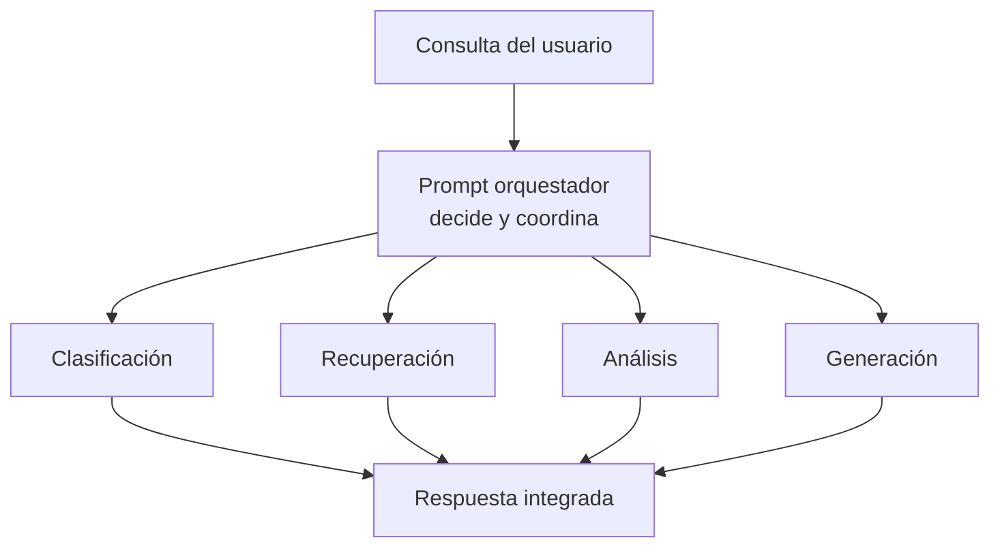

# Módulo 2 — Prompt Engineering Profesional

# Capítulo 20 — Arquitecturas Basadas en Prompts

> *"Una arquitectura jerárquica no busca concentrar decisiones. Busca distribuir responsabilidades de forma organizada."*

---

## Objetivos de aprendizaje

- Comprender el concepto de arquitecturas jerárquicas de prompts.
- Analizar el papel de un prompt orquestador.
- Diferenciar coordinación de ejecución.
- Diseñar soluciones escalables mediante componentes especializados.

---

## Introducción

A medida que una plataforma incorpora nuevos casos de uso, aumenta la cantidad de prompts necesarios para resolverlos.

Intentar conectar todos los componentes entre sí genera dependencias difíciles de mantener. Cuando cada prompt conoce directamente a los demás, cualquier modificación puede desestabilizar el sistema completo.

Una alternativa consiste en introducir un nivel de coordinación que organice la interacción entre prompts especializados. En este enfoque aparece el **prompt orquestador**: un componente con lógica propia que decide qué otros componentes deben intervenir y en qué momento. A diferencia del pipeline secuencial, el orquestador no sigue una secuencia fija; evalúa el contexto y toma decisiones de coordinación en cada ejecución.

---

## Arquitectura jerárquica

En una arquitectura jerárquica los prompts no colaboran de manera desordenada.

Existe un componente coordinador que interpreta la solicitud, determina la estrategia de resolución y delega cada tarea al prompt más apropiado.

La inteligencia de la solución surge de la colaboración entre componentes, no de un único prompt de gran tamaño. El orquestador no genera la respuesta final: integra los resultados parciales de los componentes especializados.

---

## Responsabilidades del orquestador

El componente coordinador puede asumir funciones como:

| Responsabilidad | Objetivo |
|-----------------|----------|
| Interpretar la intención | Comprender el objetivo principal del usuario. |
| Seleccionar componentes | Elegir el prompt adecuado para cada tarea. |
| Construir el contexto | Enviar únicamente la información necesaria. |
| Integrar resultados | Unificar respuestas parciales. |
| Gestionar errores | Definir estrategias de recuperación ante fallos. |

Es importante observar que el orquestador no reemplaza a los componentes especializados. Su función consiste en coordinar su trabajo.

La gestión de errores merece atención particular. En una arquitectura jerárquica, el orquestador es el responsable de definir qué ocurre cuando un componente especializado falla: si debe reintentarse la llamada, si existe un componente de fallback que pueda asumir la tarea, o si la situación debe comunicarse al usuario. Esta responsabilidad no puede delegarse al componente fallido ni resolverse dentro del prompt; debe diseñarse explícitamente como parte de la lógica de coordinación.

---

## Coordinación y desacoplamiento

Una arquitectura jerárquica favorece el desacoplamiento.

Cada prompt puede evolucionar de manera independiente mientras respete el contrato definido por el orquestador.

Esto permite:

- incorporar nuevos componentes sin modificar todo el sistema;
- sustituir prompts por versiones mejoradas;
- reutilizar componentes en distintos flujos;
- realizar pruebas de manera aislada.

---

## Caso de estudio

Una organización desarrolla un asistente corporativo que responde consultas legales, financieras y de recursos humanos.

El orquestador identifica el dominio de la consulta y deriva el procesamiento al componente correspondiente. No ejecuta las consultas; evalúa la intención, selecciona el especialista adecuado y construye el contexto que ese especialista necesita.

Posteriormente integra la información obtenida y genera una respuesta consistente para el usuario.

Cuando el área financiera modifica sus políticas, únicamente evoluciona el prompt especializado de ese dominio. La arquitectura completa permanece estable porque el contrato entre el orquestador y el componente financiero no ha cambiado.

---

## Buenas prácticas

Las consideraciones propias de la orquestación son:

- Mantener al orquestador enfocado en la coordinación; si comienza a ejecutar lógica de negocio, está asumiendo responsabilidades que no le corresponden.
- Definir contratos claros entre el orquestador y cada componente especializado.
- Minimizar el acoplamiento entre prompts especializados: deben desconocerse entre sí.
- Registrar las decisiones del orquestador para facilitar auditoría y diagnóstico.
- Diseñar explícitamente las estrategias de recuperación ante fallos de componentes.

---

## Errores frecuentes

- Convertir al orquestador en un componente monolítico que concentra toda la lógica.
- Duplicar responsabilidades entre prompts especializados.
- Permitir dependencias directas entre componentes especializados, saltando al orquestador.
- Acoplar la lógica de negocio al mecanismo de coordinación.

---

## Ideas clave

- La jerarquía organiza la colaboración entre prompts mediante un componente que coordina sin ejecutar.
- El orquestador coordina; los componentes especializados ejecutan.
- El desacoplamiento entre componentes especializados facilita la evolución independiente de cada uno.

---

## Transición hacia la siguiente sección

En la próxima sección estudiaremos arquitecturas basadas en cadenas y grafos de prompts, analizando cómo modelar flujos dinámicos que adapten su comportamiento según el contexto y los resultados obtenidos en cada etapa. Veremos también en qué se diferencia el grafo de un orquestador: mientras el orquestador es un componente con lógica propia, el grafo es una representación de la topología posible del flujo, donde las condiciones de transición guían la ejecución.
