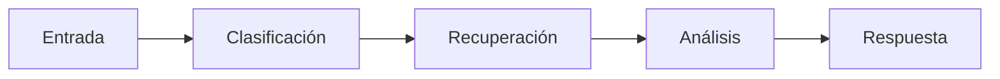
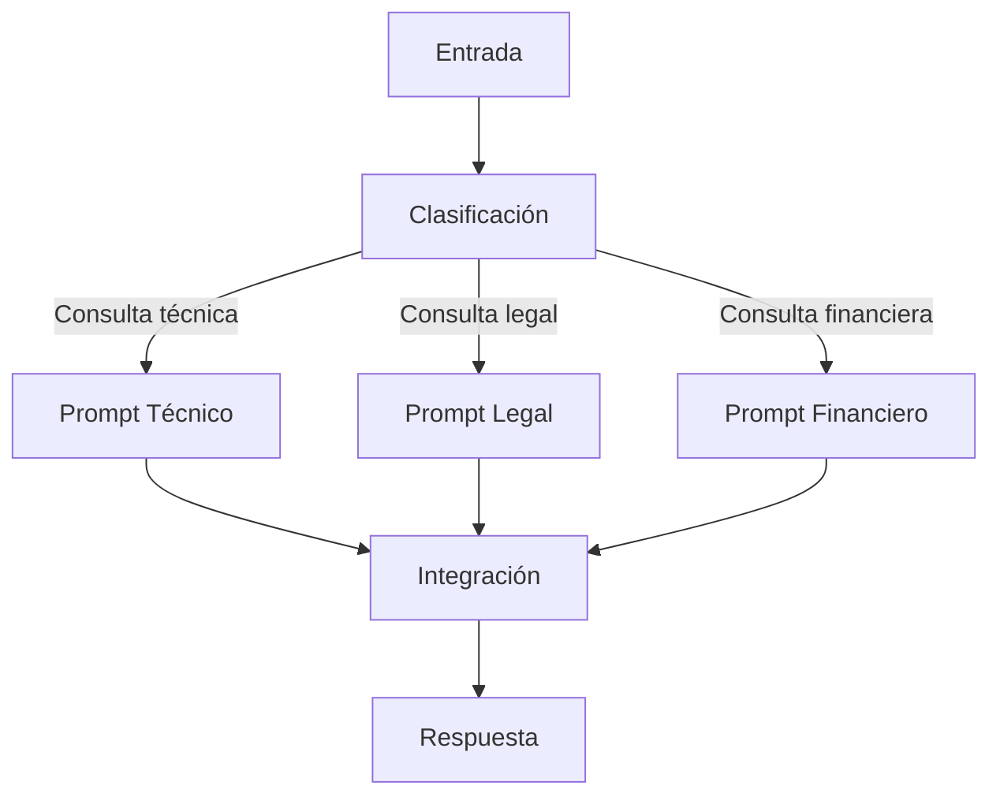

# Módulo 2 — Prompt Engineering Profesional

# Capítulo 20 — Arquitecturas Basadas en Prompts

> *"Las arquitecturas más flexibles no siguen siempre el mismo camino. Deciden el camino mientras avanzan."*

---

## Objetivos de aprendizaje

- Comprender las diferencias entre cadenas y grafos de prompts.
- Analizar flujos secuenciales y dinámicos.
- Diseñar arquitecturas adaptativas basadas en decisiones.
- Introducir criterios para modelar rutas de ejecución.

---

## Introducción

Las primeras aplicaciones construidas con Large Language Models (LLM) resolvían los problemas mediante secuencias lineales de prompts.

Con el crecimiento de la complejidad aparecieron escenarios donde el siguiente paso dependía del resultado obtenido en el anterior.

En esos casos, una cadena fija deja de ser suficiente y la arquitectura comienza a comportarse como un grafo de decisiones. Vale la pena precisar la distinción con el orquestador estudiado en la sección anterior: el **orquestador** es un componente con lógica propia que coordina; el **grafo de prompts** es una topología que describe la estructura posible del flujo, con nodos que representan componentes y transiciones etiquetadas que expresan las condiciones bajo las cuales el flujo avanza de un nodo al siguiente. La diferencia es entre un componente y una representación arquitectónica.

---

## Cadenas de prompts

Una cadena representa una secuencia predefinida.

Cada componente recibe la salida del anterior y ejecuta una única responsabilidad.

Las cadenas resultan apropiadas cuando el proceso es estable y todas las ejecuciones siguen el mismo recorrido.

---

## Grafos de prompts

En un grafo, el flujo puede bifurcarse según el contexto, el resultado de una validación o la información recuperada. A diferencia del diagrama del orquestador, las transiciones entre nodos llevan condiciones explícitas que determinan qué camino seguirá cada ejecución.

Cada nodo representa un componente especializado y cada transición responde a una condición arquitectónica explícita. No hay un componente central que decida: la decisión está codificada en las reglas de transición del grafo.

---

## ¿Cuándo utilizar cada enfoque?

| Arquitectura | Escenario recomendado |
|--------------|----------------------|
| Cadena | Procesos repetitivos y lineales. |
| Grafo | Procesos con múltiples alternativas o condiciones dinámicas. |
| Híbrida | Soluciones empresariales complejas. |

En la práctica, la mayoría de las plataformas modernas combinan ambos modelos. Una arquitectura puede usar cadenas para las etapas estables y grafos para las secciones del flujo que requieren decisiones condicionales.

---

## Decisiones dinámicas

Una arquitectura basada en grafos permite decidir en tiempo de ejecución:

- qué prompts ejecutar;
- cuáles omitir;
- qué herramientas invocar;
- cuándo finalizar el proceso;
- cuándo solicitar información adicional.

La aplicación deja de ejecutar una secuencia rígida y pasa a construir el recorrido más adecuado para cada situación.

Esta flexibilidad tiene un costo que debe considerarse en el diseño: cada nodo activado implica una llamada al modelo, con el correspondiente impacto sobre la latencia y el consumo de tokens. En un grafo con múltiples bifurcaciones, el número de nodos que se activan varía según el caso. Diseñar el grafo con criterio —activando solo los nodos necesarios y manteniendo reglas de transición explícitas y verificables— es parte del trabajo del arquitecto.

---

## Caso de estudio

Un sistema de soporte técnico multinivel recibe incidencias de distinta naturaleza.

El primer componente clasifica la incidencia según su tipo: software, hardware o conectividad.

A partir de esa clasificación, el flujo deriva hacia el prompt especializado correspondiente, que a su vez puede recuperar documentación técnica específica mediante Retrieval-Augmented Generation (RAG) o escalar a un nivel de soporte más avanzado si la incidencia supera su capacidad de resolución.

El recorrido cambia para cada incidencia sin modificar la arquitectura general. El grafo define los caminos posibles; la condición de clasificación decide cuál recorrer.

---

## Buenas prácticas

- Diseñar nodos con responsabilidades bien definidas.
- Mantener reglas explícitas y verificables para las transiciones; la lógica de decisión no debe ocultarse dentro de los prompts.
- Evitar grafos excesivamente complejos: si el grafo se vuelve difícil de leer, probablemente deba revisarse la estructura.
- Registrar el camino seguido durante cada ejecución para facilitar diagnóstico y auditoría.
- Considerar el impacto sobre latencia y tokens al diseñar el número de nodos posibles en cada ruta.

---

## Errores frecuentes

- Modelar todos los procesos como cadenas lineales cuando el problema requiere bifurcaciones.
- Incorporar bifurcaciones innecesarias que complican el grafo sin añadir valor.
- Ocultar la lógica de decisión dentro de los prompts en lugar de expresarla como condiciones de transición.
- No registrar las rutas recorridas, lo que impide diagnosticar comportamientos inesperados.

---

## Ideas clave

- Las cadenas simplifican procesos lineales y estables; los grafos permiten adaptar el flujo a cada situación particular.
- La diferencia entre orquestador y grafo es la diferencia entre un componente con lógica y una topología con condiciones: conceptos complementarios, no equivalentes.
- La arquitectura debe equilibrar simplicidad, flexibilidad y mantenibilidad, y considerar el costo operativo de cada ruta posible.

---

## Transición hacia la siguiente sección

En la próxima sección estudiaremos cómo integrar arquitecturas basadas en prompts con RAG, Tool Calling y agentes, mostrando cómo estos componentes colaboran dentro de una plataforma moderna de AI Engineering.
