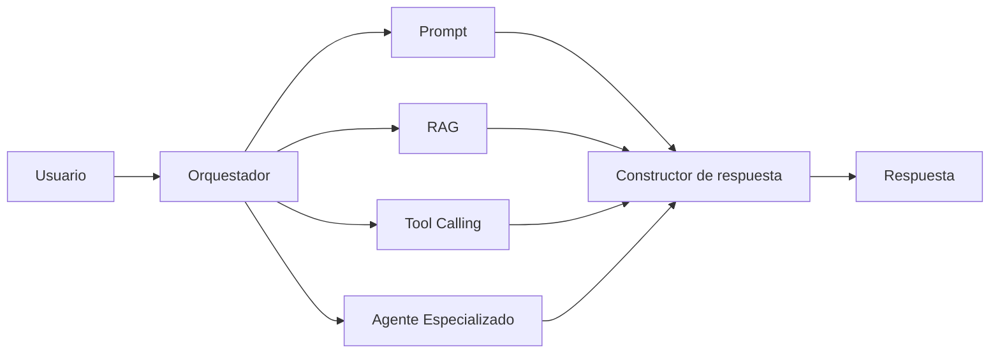

# Módulo 2 — Prompt Engineering Profesional

# Capítulo 20 — Arquitecturas Basadas en Prompts

> *"Una arquitectura moderna no elige entre prompts, RAG o herramientas. Los integra para resolver problemas reales."*

---

## Objetivos de aprendizaje

- Comprender cómo se integran los prompts con otras capacidades de IA.
- Analizar el papel de RAG, Tool Calling y agentes dentro de una arquitectura.
- Diferenciar responsabilidades entre componentes.
- Diseñar soluciones desacopladas y extensibles.

---

## Introducción

Las arquitecturas basadas en prompts constituyen el núcleo lógico de muchas aplicaciones modernas, pero rara vez operan de forma aislada.

Una solución empresarial suele combinar múltiples capacidades:

- prompts especializados;
- recuperación de información mediante Retrieval-Augmented Generation (RAG);
- ejecución de herramientas mediante Tool Calling;
- integración con APIs;
- agentes especializados;
- motores de workflow.

El desafío consiste en coordinar estos componentes sin convertir la solución en un sistema monolítico.

---

## Arquitectura integrada

En esta arquitectura, el prompt deja de ser el único protagonista y pasa a colaborar con otros componentes especializados. El orquestador decide qué componentes intervienen; el constructor de respuesta integra sus salidas en un mensaje coherente para el usuario.

---

## Responsabilidades de cada componente

| Componente | Responsabilidad |
|------------|-----------------|
| Prompt | Interpretar instrucciones y generar razonamiento. |
| RAG | Recuperar conocimiento externo actualizado. |
| Tool Calling | Ejecutar acciones verificables sobre sistemas externos. |
| Agente Especializado | Coordinar tareas complejas con cierto grado de autonomía. |
| Orquestador | Decidir el flujo y administrar el estado. |
| Constructor de respuesta | Sintetizar las salidas de los distintos componentes en una respuesta coherente. |

Cada componente tiene una responsabilidad única y una interfaz definida. Esta separación favorece la mantenibilidad y la evolución independiente de cada elemento.

Vale la pena precisar tres términos que se usan en la tabla. **RAG** (Retrieval-Augmented Generation) es el patrón que combina recuperación de información con generación de texto: el sistema recupera documentos relevantes y los incorpora al contexto del modelo antes de generar la respuesta. **Tool Calling** es la capacidad del modelo de invocar funciones o APIs externas para ejecutar acciones que van más allá de la generación de texto: consultar una base de datos, leer el estado de un sistema o escribir en un registro. Un **Agente Especializado** es un componente que puede tomar decisiones y ejecutar acciones de manera autónoma para alcanzar un objetivo, gestionando su propio ciclo de razonamiento y acción. Estos tres patrones se desarrollarán en profundidad en módulos posteriores; aquí se presentan en su rol dentro de una arquitectura integrada.

---

## El constructor de respuesta

El constructor de respuesta es el componente que recibe las salidas del prompt, el RAG, el Tool Calling y el agente especializado, y las sintetiza en una respuesta única y coherente para el usuario.

Su función no es generar razonamiento nuevo sino integrar información ya procesada: eliminar redundancias entre las distintas salidas, resolver posibles contradicciones y construir una respuesta que respete el formato y el tono esperados.

Sin un constructor de respuesta explícito, la integración de múltiples fuentes queda sin responsable definido, lo que suele derivar en respuestas inconsistentes o que exponen al usuario la estructura interna del sistema.

---

## Cuándo usar RAG versus contexto estático

Una decisión frecuente en el diseño de arquitecturas integradas es cuándo incorporar información mediante RAG y cuándo incluirla directamente en el contexto del prompt.

RAG resulta preferible cuando el conocimiento es dinámico, se actualiza con frecuencia, tiene un volumen que supera el espacio disponible en el contexto, o solo es relevante para un subconjunto de las consultas. Incluir la información directamente en el contexto es apropiado cuando es estática, breve y siempre relevante para el componente que la recibe.

Esta decisión tiene consecuencias sobre la latencia, el costo y la calidad de la respuesta. Incorporar RAG añade una etapa de recuperación al flujo; incluir información en el contexto consume tokens en cada llamada aunque esa información no sea necesaria.

---

## Principios de integración

Al diseñar una arquitectura integrada conviene respetar algunos principios:

- cada componente debe tener una responsabilidad única;
- la información debe circular mediante contratos claros;
- el contexto debe construirse dinámicamente, enviando solo lo necesario a cada componente;
- las decisiones deben ser observables y auditables;
- la lógica de negocio debe permanecer bajo el control de la aplicación cuando sea posible.

Estos principios permiten escalar la solución sin incrementar innecesariamente la complejidad.

---

## Caso de estudio

Una empresa implementa un asistente para soporte técnico.

El flujo de resolución incluye:

1. clasificar la consulta mediante un prompt;
2. recuperar documentación técnica utilizando RAG;
3. consultar el inventario de equipos mediante una API a través de Tool Calling;
4. ejecutar un diagnóstico con una herramienta especializada;
5. sintetizar toda la información en una respuesta personalizada mediante el constructor de respuesta.

Cada componente cumple una función concreta. El orquestador decide cuándo interviene cada uno según el tipo de consulta. El constructor de respuesta integra los resultados en un mensaje que el usuario puede leer sin necesidad de conocer la arquitectura subyacente.

---

## Buenas prácticas

- Diseñar componentes independientes con responsabilidades claras.
- Utilizar RAG para conocimiento dinámico o voluminoso; reservar el contexto estático para información breve y siempre relevante.
- Reservar Tool Calling para acciones verificables sobre sistemas externos.
- Incluir al constructor de respuesta en la tabla de responsabilidades y en el diseño explícito del sistema.
- Delegar la coordinación en el orquestador; delegar la síntesis en el constructor de respuesta.
- Medir el desempeño de cada etapa del flujo.

---

## Errores frecuentes

- Resolver todos los problemas con un único prompt, ignorando las capacidades complementarias disponibles.
- Duplicar información entre RAG y contexto, incrementando el costo sin añadir valor.
- Mezclar razonamiento con lógica de integración dentro del mismo componente.
- Acoplar herramientas directamente al modelo sin pasar por la capa de orquestación.
- Omitir el constructor de respuesta del diseño, dejando la integración de resultados sin responsable definido.

---

## Ideas clave

- Las arquitecturas modernas integran múltiples capacidades: prompts, RAG, Tool Calling, agentes y un constructor de respuesta.
- Los prompts constituyen un componente más del ecosistema, no el centro exclusivo de la solución.
- La separación de responsabilidades entre todos los componentes, incluido el constructor de respuesta, es lo que permite escalar la solución con calidad.

---

## Transición hacia la siguiente sección

En la próxima sección analizaremos patrones arquitectónicos reutilizables para aplicaciones basadas en Large Language Models (LLM) y construiremos un catálogo de referencia que servirá de base para los módulos de RAG, Agentes y AI Engineering.
