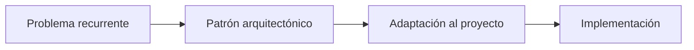

# Módulo 2 — Prompt Engineering Profesional

# Capítulo 20 — Arquitecturas Basadas en Prompts

> *"Las arquitecturas maduras no nacen de la improvisación. Surgen de patrones que demostraron ser útiles una y otra vez."*

---

## Objetivos de aprendizaje

- Comprender el concepto de patrón arquitectónico aplicado a aplicaciones con Large Language Models (LLM).
- Identificar patrones reutilizables en soluciones basadas en prompts.
- Analizar criterios para seleccionar un patrón adecuado.
- Preparar las bases para arquitecturas de RAG y Agentes.

---

## Introducción

En ingeniería de software, un patrón arquitectónico representa una solución reutilizable para un problema recurrente.

No constituye una implementación específica, sino una guía que resume experiencias acumuladas y buenas prácticas.

Las aplicaciones basadas en LLM presentan desafíos similares. Con el tiempo han surgido patrones que permiten organizar prompts, herramientas, memoria y flujos conversacionales de manera consistente.

Comprender estos patrones facilita el diseño de soluciones más robustas y reduce la necesidad de reinventar la arquitectura en cada proyecto.

---

## ¿Qué es un patrón arquitectónico?

Un patrón arquitectónico describe cómo se relacionan distintos componentes para resolver un tipo de problema.

No impone tecnologías concretas ni modelos específicos.

Su propósito consiste en ofrecer una estructura que pueda adaptarse a distintos contextos.

El patrón actúa como una referencia que guía las decisiones de diseño, no como una receta que debe seguirse al pie de la letra.

---

## Patrones frecuentes en aplicaciones con LLM

A continuación se presentan los patrones más utilizados, incluyendo los desarrollados en las secciones anteriores del capítulo.

| Patrón | Objetivo principal |
|--------|--------------------|
| Pipeline | Resolver tareas mediante un flujo lineal y predecible. |
| Router | Derivar solicitudes al componente más adecuado según el tipo de consulta. |
| Orquestador | Coordinar múltiples componentes especializados con lógica de decisión centralizada. |
| Retrieval-Augmented | Incorporar conocimiento externo mediante RAG para enriquecer el contexto del modelo. |
| Workflow | Modelar procesos con estados persistentes y reglas de negocio explícitas que pueden abarcar múltiples etapas o sesiones. |
| Multiagente | Distribuir responsabilidades entre agentes con capacidad autónoma de decisión y acción, cada uno especializado en un dominio. |

Los patrones Pipeline, Router, Orquestador y Retrieval-Augmented se han desarrollado en las secciones anteriores. Workflow y Multiagente merecen una aclaración.

El patrón **Workflow** se distingue de un pipeline o un orquestador por la presencia de estado persistente entre etapas: el proceso puede detenerse, reanudarse en otro momento y seguir reglas de negocio explícitas que determinan las transiciones. Un trámite administrativo que requiere aprobaciones en distintos momentos y guarda el estado entre sesiones es un ejemplo típico.

El patrón **Multiagente** se diferencia del Orquestador en el grado de autonomía de los componentes: mientras que en una arquitectura orquestada los componentes especializados son prompts que esperan instrucciones del orquestador, en una arquitectura multiagente los agentes tienen capacidad de tomar decisiones propias, observar su entorno y actuar sin instrucción explícita en cada paso. Este patrón se desarrollará en profundidad en el módulo dedicado a agentes.

---

## ¿Cómo seleccionar un patrón?

La elección no depende únicamente de la tecnología disponible.

Conviene analizar aspectos como:

- naturaleza del problema;
- cantidad de componentes involucrados;
- necesidad de escalabilidad;
- requisitos de mantenimiento;
- volumen esperado de usuarios;
- complejidad del flujo de negocio.

Para orientar la decisión, algunos indicadores concretos: si el proceso es siempre el mismo para todas las consultas, un Pipeline es suficiente. Si distintos tipos de consulta requieren tratamientos distintos pero el flujo de cada uno es lineal, un Router agrega la derivación necesaria. Si el proceso requiere coordinar múltiples componentes con lógica de decisión entre pasos, un Orquestador aporta esa capa. Si el proceso incluye estados persistentes y reglas de negocio que trascienden una sola sesión, el patrón Workflow es el apropiado. Si se necesita que múltiples componentes operen con autonomía en paralelo, la arquitectura Multiagente es el nivel siguiente.

En muchos casos, la mejor solución consiste en combinar varios patrones dentro de una misma arquitectura.

---

## Caso de estudio

Una empresa de servicios financieros desarrolla una plataforma de onboarding para nuevos clientes.

Durante la primera etapa implementa un **Pipeline** para procesar los datos del formulario de alta: validación, verificación de identidad y apertura de cuenta.

Cuando incorpora múltiples tipos de productos, agrega un **Router** que deriva cada solicitud al flujo correspondiente según el tipo de cuenta solicitada.

Al necesitar consultar normativa regulatoria actualizada, incorpora un componente **Retrieval-Augmented** que recupera los requisitos vigentes para cada producto.

Finalmente, para gestionar los procesos de aprobación que requieren intervención humana en distintos momentos y pueden extenderse varios días, agrega un **Workflow** que mantiene el estado del trámite entre sesiones.

La arquitectura evoluciona sin reemplazar los componentes existentes. Cada nuevo patrón amplía las capacidades del sistema respetando el diseño previo.

---

## Buenas prácticas

- Seleccionar patrones en función del problema y no de la tecnología o la novedad.
- Favorecer la composición de patrones sencillos antes de recurrir a uno más complejo.
- Documentar las decisiones arquitectónicas y el razonamiento detrás de cada patrón elegido.
- Mantener desacopladas las responsabilidades entre patrones combinados.

---

## Errores frecuentes

- Elegir patrones por moda o por familiaridad tecnológica en lugar de por adecuación al problema.
- Implementar arquitecturas excesivamente complejas desde el inicio, cuando un pipeline simple resolvería el problema.
- Confundir un patrón con una herramienta específica: el patrón es una guía estructural, no una biblioteca.
- Reemplazar una arquitectura estable sin una necesidad justificada.

---

## Ideas clave

- Los patrones arquitectónicos representan conocimiento reutilizable acumulado en la práctica del AI Engineering.
- No existe un patrón universal: la elección depende de las características del problema, no de la preferencia tecnológica.
- Una arquitectura madura suele combinar varios patrones complementarios, cada uno resolviendo el aspecto del problema para el que fue diseñado.

---

## Transición hacia la siguiente sección

En la próxima sección construiremos un catálogo de referencia que reunirá las arquitecturas estudiadas en el capítulo y mostrará cómo evolucionan desde soluciones simples hasta plataformas modernas de AI Engineering.
