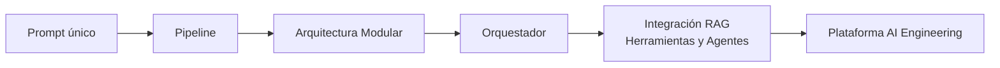

# Módulo 2 — Prompt Engineering Profesional

# Capítulo 20 — Arquitecturas Basadas en Prompts

> *"Una buena arquitectura no intenta prever todas las soluciones posibles. Intenta facilitar su evolución."*

---

## Objetivos de aprendizaje

- Construir un mapa de referencia de arquitecturas basadas en prompts.
- Comprender la evolución desde soluciones simples hasta plataformas complejas.
- Identificar cuándo aumentar el nivel de sofisticación arquitectónica.
- Integrar los conceptos desarrollados a lo largo del capítulo.

---

## Introducción

Durante este capítulo analizamos cómo los prompts dejan de ser instrucciones aisladas para convertirse en componentes arquitectónicos.

Estudiamos modularidad, composición, orquestación, cadenas, grafos e integración con RAG, Tool Calling y agentes.

En esta sección reuniremos todos estos conceptos en un catálogo de referencia que servirá como guía para seleccionar la arquitectura más adecuada según la complejidad del problema.

---

## Evolución arquitectónica

Las arquitecturas basadas en prompts suelen evolucionar de manera incremental. Cada nivel incorpora nuevas capacidades sin reemplazar necesariamente las del nivel anterior.

El diagrama refleja que RAG, herramientas y agentes no son etapas secuenciales independientes sino capacidades que pueden incorporarse en conjunto al alcanzar el nivel de integración avanzada. Su separación o combinación depende de las necesidades del proyecto, no de una secuencia tecnológica obligatoria.

---

## Catálogo de referencia

| Nivel | Características | Escenarios recomendados |
|-------|-----------------|-------------------------|
| Prompt único | Una única responsabilidad, sin flujo entre componentes. | Automatizaciones simples y tareas puntuales. |
| Pipeline | Flujo lineal de procesamiento con etapas predecibles. | Procesos repetitivos y sin bifurcaciones. |
| Modular | Componentes especializados con contratos definidos. | Aplicaciones empresariales con múltiples funcionalidades. |
| Orquestado | Coordinación dinámica mediante un componente con lógica de decisión. | Sistemas complejos con múltiples dominios o tipos de consulta. |
| Integrado | RAG, Tool Calling, agentes y constructor de respuesta coordinados. | Plataformas corporativas con necesidad de conocimiento externo y acciones verificables. |
| Multiagente | Agentes con autonomía de decisión especializados por dominio. | Ecosistemas de IA avanzados donde múltiples procesos operan en paralelo con independencia. |

La diferencia entre el nivel Orquestado y el nivel Multiagente merece precisión: en el primero, el orquestador coordina prompts especializados que responden a instrucciones; en el segundo, los agentes tienen capacidad autónoma de razonar, observar su entorno y decidir sin instrucción explícita en cada paso. Esta diferencia en el grado de autonomía es la que define el salto entre ambos niveles.

La transición entre niveles responde al crecimiento de los requisitos del negocio y no a una preferencia tecnológica.

---

## ¿Cuándo evolucionar la arquitectura?

No existe una regla universal. Sin embargo, algunos indicadores habituales son:

- aumento de funcionalidades que superan la capacidad del nivel actual;
- crecimiento del número de prompts hasta el punto en que la gestión manual se vuelve inviable;
- incorporación de nuevas fuentes de información que requieren recuperación dinámica;
- necesidad de reutilización entre proyectos o equipos;
- incremento del volumen de usuarios que exige mayor escalabilidad;
- mayores exigencias de gobernanza y auditoría.

La evolución debe producirse cuando la arquitectura actual deja de satisfacer los objetivos del sistema, no antes. La complejidad prematura es uno de los errores más frecuentes en el diseño de plataformas de AI Engineering.

---

## Caso de estudio

Una empresa inicia un proyecto con un único asistente para responder consultas frecuentes.

Con el tiempo incorpora documentación técnica mediante Retrieval-Augmented Generation (RAG), integra el sistema ERP utilizando Tool Calling y agrega agentes especializados para distintas áreas del negocio.

La plataforma evoluciona gradualmente sin perder coherencia porque cada etapa se apoya sobre principios arquitectónicos previamente establecidos: contratos entre componentes, responsabilidades bien delimitadas y lógica de negocio bajo el control de la aplicación.

---

## Ideas clave

- Las arquitecturas evolucionan junto con las necesidades del negocio; la complejidad se introduce cuando los requisitos lo justifican.
- La modularidad facilita el crecimiento controlado: un nivel puede incorporarse sin reemplazar el anterior.
- El objetivo final no es construir más componentes, sino resolver problemas con mayor calidad y menor complejidad operativa.
- La distinción entre orquestación y multiagente radica en el grado de autonomía de los componentes, no en la cantidad de nodos del sistema.

---

## Transición hacia el siguiente capítulo

En el próximo capítulo comenzaremos la parte práctica del módulo mediante una serie de laboratorios donde aplicaremos todos los conceptos estudiados sobre Prompt Engineering, Ingeniería Conversacional y Arquitecturas Basadas en Prompts para resolver problemas reales de AI Engineering.

---

> **"Un arquitecto no memoriza respuestas. Comprende problemas para poder diseñar soluciones."**
