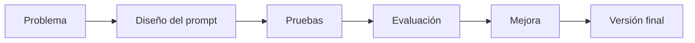

# Módulo 2 — Prompt Engineering Profesional

# Capítulo 21 — Laboratorios de Prompt Engineering

> *"La ingeniería se aprende comprendiendo conceptos, pero se domina resolviendo problemas."*

---

## Objetivos de aprendizaje

- Comprender la finalidad de los laboratorios del módulo.
- Integrar los conceptos estudiados en escenarios prácticos.
- Introducir una metodología sistemática para experimentar con prompts.
- Preparar al lector para resolver casos reales de AI Engineering.

---

## Introducción

Los capítulos anteriores desarrollaron los fundamentos del Prompt Engineering desde una perspectiva de ingeniería. Se estudiaron patrones, prácticas para producción, ingeniería conversacional y arquitecturas basadas en prompts.

A partir de este capítulo cambia la dinámica del aprendizaje. El objetivo deja de ser incorporar nuevos conceptos y pasa a ser **aplicarlos** en situaciones representativas del mundo profesional.

Cada laboratorio propone un problema, una estrategia de resolución y un conjunto de criterios para evaluar el resultado obtenido. Los laboratorios no buscan presentar "la respuesta correcta", sino reproducir el proceso de diseño propio de un AI Engineer.

El capítulo recorre cinco laboratorios progresivos:

| Laboratorio | Sección | Competencia principal |
|-------------|---------|----------------------|
| Clasificación | 02 | Diseñar prompts para categorización consistente. |
| Extracción estructurada | 03 | Transformar lenguaje natural en datos utilizables. |
| Generación controlada | 04 | Respetar restricciones de formato y estilo. |
| Ingeniería conversacional | 05 | Administrar estado, contexto y memoria. |
| Integración | 06 | Coordinar múltiples componentes dentro de una arquitectura. |

---

## ¿Por qué laboratorios?

Leer un prompt bien diseñado permite comprender una técnica. Construirlo, evaluarlo y mejorarlo permite desarrollar una competencia.

Por este motivo, los laboratorios no buscan presentar "la respuesta correcta", sino reproducir el proceso de diseño propio de un AI Engineer.

Cada iteración aporta información para la siguiente. El laboratorio no termina cuando el prompt funciona una vez, sino cuando demuestra un comportamiento consistente ante un conjunto de pruebas variado.

---

## Metodología de trabajo

Todos los laboratorios del módulo seguirán una estructura común.

| Etapa | Objetivo |
|-------|----------|
| Análisis | Comprender el problema de negocio. |
| Diseño | Elaborar una primera versión del prompt. |
| Ejecución | Probar la solución con distintos casos. |
| Evaluación | Medir calidad, consistencia y costo. |
| Refinamiento | Incorporar mejoras basadas en evidencia. |

Esta metodología refleja un ciclo de mejora continua similar al utilizado en proyectos reales.

Cada laboratorio debe conservar evidencia del proceso: los casos ejecutados, las versiones sucesivas del prompt, las métricas obtenidas y las conclusiones del equipo. Sin ese registro, la iteración pierde su valor metodológico.

La evaluación de cada ejecución conviene organizarla en tres dimensiones independientes:

- **Evaluación funcional**: ¿el prompt produce el resultado correcto?
- **Evaluación de formato**: ¿la salida respeta la estructura requerida?
- **Evaluación de costo y latencia**: ¿el consumo de tokens y el tiempo de respuesta son aceptables?

Separar estas dimensiones facilita el diagnóstico. Si un prompt clasifica bien pero produce un formato variable, el problema es de formato, no de razonamiento.

---

## Buenas prácticas

Las siguientes prácticas son transversales a todos los laboratorios del capítulo:

- Formular hipótesis antes de modificar un prompt.
- Cambiar una variable por vez.
- Registrar resultados de cada iteración.
- Construir conjuntos de prueba representativos, que incluyan casos límite, ambiguos y fuera de alcance.
- Documentar las decisiones de diseño y las razones de cada cambio.
- Conservar versiones anteriores para detectar regresiones.
- Definir criterios mínimos de aceptación antes de promover una solución a entorno productivo.

---

## Errores frecuentes

Los errores que aparecen con más frecuencia en laboratorios de Prompt Engineering también son transversales:

- Optimizar sin medir.
- Cambiar varias variables simultáneamente.
- Evaluar únicamente ejemplos favorables.
- Concluir un laboratorio tras una única ejecución exitosa.
- Avanzar hacia producción sin establecer umbrales mínimos de calidad.

---

## Ideas clave

- Los laboratorios desarrollan criterio de ingeniería, no solo conocimiento teórico.
- La experimentación debe ser sistemática y medible.
- Cada iteración aporta evidencia para mejorar la solución.
- Un laboratorio sin registro de evidencia es una demostración, no una práctica de ingeniería.

---

## Transición hacia la siguiente sección

En la próxima sección comenzamos el primer laboratorio práctico: el diseño y evaluación de prompts para tareas de clasificación, aplicando la metodología presentada en esta introducción.
