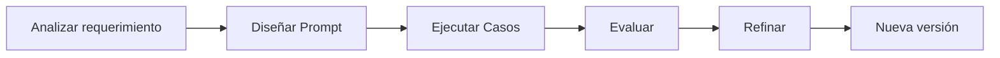

# Módulo 2 — Prompt Engineering Profesional

# Capítulo 21 — Laboratorios de Prompt Engineering

## Sección 02 — Laboratorio de Clasificación

> *"Un laboratorio no busca demostrar que una idea funciona. Busca descubrir por qué funciona y cómo mejorarla."*

---

## Objetivos de aprendizaje

- Aplicar un proceso sistemático de diseño de prompts.
- Construir un laboratorio de clasificación de información.
- Evaluar resultados mediante criterios objetivos.
- Introducir la iteración basada en evidencia.

---

## Introducción

La clasificación es una de las tareas más frecuentes en aplicaciones empresariales basadas en Large Language Models (LLM). Asignar una categoría a un correo electrónico, identificar el tipo de incidente de una mesa de ayuda o determinar el área responsable de un expediente son ejemplos habituales.

Aunque estas tareas parecen sencillas, representan un excelente escenario para practicar Prompt Engineering porque permiten medir con precisión el impacto de pequeños cambios en el diseño del prompt.

---

## El problema

Una organización recibe cientos de consultas diarias. Cada mensaje debe clasificarse en una de las siguientes categorías:

- Recursos Humanos
- Finanzas
- Tecnología
- Compras
- Legal

El objetivo consiste en diseñar un prompt capaz de asignar correctamente cada consulta a su categoría correspondiente, de forma consistente y sin intervención manual.

---

## Metodología

Cada iteración modifica un único aspecto del prompt para poder evaluar su impacto de forma aislada. Modificar varios elementos al mismo tiempo impide determinar cuál cambio produjo la mejora o el empeoramiento.

---

## Conjunto de pruebas

El laboratorio debe contemplar diferentes tipos de consultas. La diversidad del conjunto de pruebas resulta tan importante como la cantidad de ejemplos.

| Tipo de caso | Ejemplo |
|--------------|----------|
| Directo | "Necesito actualizar mis datos bancarios." |
| Ambiguo | "Tengo un problema con un pago." |
| Múltiple | "No cobré el sueldo y además mi notebook no funciona." |
| Incompleto | "Necesito ayuda urgente." |
| Fuera de alcance | "¿Cómo está el clima?" |

Los casos ambiguos, múltiples e incompletos son los que revelan las limitaciones más importantes del prompt. Incluirlos desde la primera iteración evita descubrirlos en producción.

---

## Criterios de evaluación

Cada ejecución puede evaluarse mediante indicadores como:

- **Clasificación correcta**: porcentaje de mensajes asignados a la categoría adecuada sobre el total del conjunto de pruebas.
- **Consistencia entre ejecuciones**: resultado de ejecutar el mismo caso tres veces y verificar que la clasificación no varía.
- **Cumplimiento del formato solicitado**: la respuesta respeta el esquema de salida definido en el prompt.
- **Cantidad de aclaraciones requeridas**: número de casos en los que el modelo solicita información adicional en lugar de clasificar.
- **Consumo aproximado de tokens**: estimación del costo operativo de cada versión del prompt.

Estos indicadores permiten comparar distintas versiones del prompt de forma objetiva, separando la calidad funcional de la calidad de formato y del costo.

---

## Caso de estudio

El equipo desarrolla una primera versión del prompt y obtiene buenos resultados con consultas simples. Sin embargo, las consultas que contienen más de un tema producen clasificaciones inconsistentes: el modelo selecciona una sola categoría cuando el mensaje involucra dos áreas distintas, y esa elección varía entre ejecuciones.

En lugar de reescribir completamente el prompt, el equipo incorpora una instrucción específica para manejar múltiples intenciones: cuando el mensaje involucra más de un área, el prompt ahora indica al modelo que solicite una aclaración al usuario antes de clasificar.

La nueva versión reduce significativamente los errores sin aumentar la complejidad general. La principal enseñanza del caso es que identificar con precisión el escenario problemático —mensajes con múltiples temas— permite una intervención quirúrgica sobre el prompt, sin necesidad de alterar su estructura completa.

---

## Buenas prácticas

- Cambiar una sola variable por iteración.
- Registrar los resultados de todas las pruebas, incluyendo los casos fallidos.
- Conservar versiones anteriores del prompt para detectar regresiones.
- Incorporar nuevos casos de prueba cuando aparezcan errores en producción.

---

## Errores frecuentes

- Evaluar únicamente consultas favorables.
- Optimizar sin métricas definidas previamente.
- Reemplazar completamente el prompt ante un fallo menor en lugar de intervenir solo sobre el aspecto problemático.
- No documentar las decisiones tomadas en cada iteración.

---

## Ideas clave

- La clasificación constituye un excelente laboratorio inicial porque permite medir resultados con precisión.
- La mejora continua depende de la evidencia obtenida durante las pruebas, no de la intuición sobre el modelo.
- Un prompt evoluciona mediante iteraciones controladas, donde cada cambio tiene una hipótesis y una medición.

---

## Transición hacia la siguiente sección

En la próxima sección desarrollamos un laboratorio dedicado a la extracción estructurada de información, incorporando formatos de salida, validaciones y criterios de calidad propios de aplicaciones empresariales.
