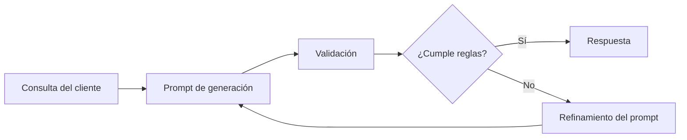

# Módulo 2 — Prompt Engineering Profesional

# Capítulo 21 — Laboratorios de Prompt Engineering

## Sección 04 — Laboratorio de Generación Controlada

> *"Generar texto es sencillo. Generarlo respetando reglas de negocio, formato y estilo constituye un verdadero desafío de ingeniería."*

---

## Objetivos de aprendizaje

- Diseñar prompts para generación controlada de contenido.
- Aplicar restricciones de formato, estilo y longitud.
- Comprender la importancia de la consistencia en aplicaciones empresariales.
- Evaluar la calidad de la generación mediante criterios objetivos.

---

## Introducción

Los laboratorios anteriores abordaron tareas donde el output esperado era estructurado y verificable: una categoría, un conjunto de campos extraídos. En este laboratorio el desafío es diferente.

Muchos asistentes empresariales deben producir documentos, correos electrónicos, informes o respuestas destinadas a clientes y colaboradores. Aunque un LLM puede generar texto de alta calidad, en producción no basta con que la respuesta sea correcta. También debe cumplir restricciones previamente definidas:

- respetar un tono institucional;
- mantener un formato estable;
- limitar la longitud;
- utilizar terminología aprobada;
- evitar información no solicitada.

Este laboratorio tiene como objetivo diseñar prompts capaces de controlar esos aspectos de manera sistemática.

---

## El problema

Una empresa desea automatizar la redacción de respuestas a consultas de clientes. Cada respuesta debe cumplir las siguientes reglas:

- lenguaje profesional y cordial;
- extensión máxima de 250 palabras;
- estructura fija de tres secciones;
- ausencia de opiniones personales;
- inclusión de un cierre institucional.

La salida será enviada directamente al cliente sin edición manual. Esto convierte la consistencia en un requisito tan crítico como la corrección del contenido.

---

## Flujo del laboratorio

El ciclo continúa hasta obtener un comportamiento consistente. La validación puede realizarse mediante revisión manual con una rúbrica (¿cumple la estructura de tres secciones?, ¿respeta el límite de palabras?, ¿mantiene el tono?) o, cuando es posible, mediante verificaciones automáticas como conteo de palabras o comprobación de la presencia del cierre institucional.

---

## Casos de prueba

Para evaluar la solución conviene utilizar consultas variadas que cubran los escenarios más exigentes:

| Tipo de caso | Objetivo |
|--------------|----------|
| Consulta simple | Validar comportamiento básico. |
| Reclamo complejo | Evaluar capacidad de síntesis. |
| Solicitud ambigua | Verificar manejo de incertidumbre. |
| Consulta extensa | Comprobar respeto por la longitud máxima. |
| Mensajes con tono agresivo | Evaluar mantenimiento del estilo institucional. |

Los casos con tono agresivo y las solicitudes ambiguas son especialmente reveladores: exponen si el modelo mantiene el registro institucional bajo presión y si puede producir una respuesta válida cuando el input no es claro.

---

## Criterios de evaluación

Los criterios de este laboratorio conviene separarlos en dos grupos:

**Criterios de forma** (evaluables automáticamente o con rúbrica):
- cumplimiento del formato requerido (estructura de tres secciones);
- respeto por la restricción de longitud (máximo 250 palabras);
- coherencia del estilo y tono institucional a lo largo de la respuesta;
- presencia del cierre institucional en todas las respuestas.

**Criterios de contenido** (requieren revisión manual):
- ausencia de información inventada o no solicitada;
- estabilidad entre distintas ejecuciones del mismo caso.

Esta separación permite transformar un criterio subjetivo ("me gusta la respuesta") en una evaluación repetible, y facilita identificar en cuál dimensión se producen los problemas cuando el prompt no rinde como se espera.

---

## Caso de estudio

En una primera versión, el modelo genera respuestas técnicamente correctas en cuanto a contenido, pero con extensiones variables —algunas de 180 palabras, otras de 340— y sin respetar de forma consistente la estructura de tres secciones. En algunos casos el cierre institucional aparece en la segunda sección en lugar de la tercera.

El equipo decide no reescribir el prompt completo. En cambio, introduce instrucciones explícitas sobre cada restricción: define las tres secciones con sus nombres exactos, especifica el límite de palabras y agrega un ejemplo de cierre institucional dentro del prompt.

Tras ejecutar nuevamente el conjunto de pruebas, las respuestas mantienen una presentación uniforme y requieren muchas menos correcciones manuales. La mejora no proviene del modelo, sino del refinamiento del prompt y de la inclusión de restricciones explícitas y verificables.

---

## Buenas prácticas

- Especificar claramente cada restricción de salida: formato, longitud, tono, terminología y cierre.
- Separar contenido obligatorio de contenido opcional dentro del prompt.
- Validar automáticamente los criterios de forma cuando sea posible, y de forma manual los criterios de contenido.
- Medir la consistencia entre ejecuciones además de la calidad individual de cada respuesta.

---

## Errores frecuentes

- Confiar en que el modelo mantendrá el mismo estilo sin indicaciones explícitas.
- Mezclar múltiples objetivos en un único prompt sin separarlos claramente.
- Evaluar únicamente la calidad del contenido e ignorar el cumplimiento de los criterios de forma.
- Ignorar el impacto del formato sobre los sistemas o flujos que consumirán la respuesta.

---

## Ideas clave

- La generación controlada requiere tanto diseño como validación sistemática.
- Las restricciones explícitas reducen la variabilidad y hacen el comportamiento predecible.
- Un buen prompt facilita la integración con procesos posteriores y disminuye la necesidad de edición manual.

---

## Transición hacia la siguiente sección

En la próxima sección desarrollamos un laboratorio orientado al diseño de conversaciones con estado, aplicando conceptos de memoria y contexto para construir asistentes capaces de mantener interacciones prolongadas y coherentes.
