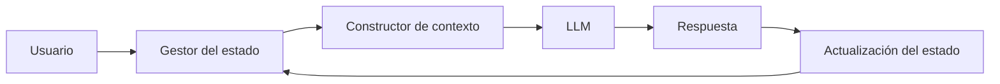

# Módulo 2 — Prompt Engineering Profesional

# Capítulo 21 — Laboratorios de Prompt Engineering

## Sección 05 — Laboratorio de Ingeniería Conversacional

> *"Una conversación de calidad no se mide por la cantidad de respuestas. Se mide por la capacidad de mantener un objetivo común a lo largo del tiempo."*

---

## Objetivos de aprendizaje

- Aplicar los conceptos de Ingeniería Conversacional en un caso práctico.
- Diseñar un asistente con estado, contexto y memoria.
- Evaluar la continuidad de una conversación prolongada.
- Medir la robustez frente a interrupciones y cambios de intención.

---

## Introducción

Los laboratorios anteriores se centraron en tareas puntuales: clasificar un mensaje, extraer campos de un correo, generar una respuesta con restricciones de formato. En cada caso, el desafío consistía en responder correctamente a una entrada única.

En este laboratorio el desafío cambia. El objetivo ya no consiste en responder correctamente un único mensaje, sino en mantener una conversación coherente durante múltiples interacciones, administrando el estado del proceso y reconstruyendo el contexto cuando resulte necesario.

Para trabajar con este laboratorio conviene precisar la diferencia entre tres conceptos que suelen confundirse:

- **Estado**: los datos estructurados que describen el progreso del proceso (ticket abierto, información ya recopilada, etapa actual del flujo).
- **Contexto**: la información que se envía al LLM en cada turno para que pueda generar una respuesta adecuada; es una selección del estado, no el estado completo.
- **Historial**: el registro cronológico de todos los intercambios de la conversación; su uso directo como contexto suele ser costoso e ineficiente en conversaciones prolongadas.

Mantener estas tres nociones separadas es la clave del diseño conversacional robusto.

---

## El problema

Una organización desea implementar un asistente para gestionar solicitudes de soporte interno. Durante una misma conversación el usuario puede:

- informar un incidente;
- consultar el estado de un ticket;
- corregir información previamente enviada;
- realizar preguntas adicionales;
- retomar una solicitud iniciada horas antes.

La solución debe conservar continuidad sin reenviar permanentemente todo el historial al modelo en cada turno, ya que eso incrementa el costo de inferencia y puede superar el límite de la ventana de contexto (context window) en conversaciones extensas.

---

## Arquitectura del laboratorio

El **Gestor del estado** mantiene los datos estructurados del proceso: el incidente reportado, la información ya recopilada y la etapa actual del flujo. No es el historial completo, sino una representación compacta del progreso.

El **Constructor de contexto** selecciona, a partir del estado, qué información es relevante para el turno actual y la incluye en el prompt enviado al LLM. Dependiendo de la etapa del proceso, el contexto puede incluir el resumen del incidente, la última pregunta del usuario o el estado del ticket.

El foco del laboratorio no es el modelo en sí, sino la arquitectura que sostiene la conversación.

---

## Casos de prueba

| Escenario | Objetivo |
|-----------|----------|
| Conversación lineal | Validar el flujo básico sin interrupciones. |
| Cambio de intención | Verificar recuperación del contexto tras un desvío. |
| Corrección de datos | Actualizar el estado sin inconsistencias. |
| Conversación extensa | Evaluar la administración del contexto a lo largo del tiempo. |
| Reanudación de sesión | Comprobar el uso de memoria persistente entre sesiones. |

Las pruebas de conversación extensa y de reanudación de sesión son las más importantes: son las que revelan si la arquitectura escala más allá de los casos simples.

---

## Criterios de evaluación

La solución puede evaluarse mediante indicadores técnicos:

- **Continuidad de la conversación**: el asistente retoma el proceso en el punto correcto tras una interrupción.
- **Consistencia del estado**: los datos almacenados en el estado son coherentes con lo que el usuario expresó a lo largo de la conversación.
- **Recuperación correcta del contexto**: la información enviada al modelo en cada turno es relevante y no contiene datos del proceso que no corresponden a ese momento.
- **Cantidad de información redundante enviada al modelo**: indicador del costo operativo de la arquitectura; una buena solución envía solo lo necesario.
- **Número de turnos necesarios para completar el proceso**: permite comparar versiones del asistente y detectar cuando el diseño conversacional genera fricciones innecesarias.

---

## Caso de estudio

Durante las pruebas, un usuario inicia un ticket, interrumpe la conversación para consultar una política interna y luego retoma el incidente original. La primera implementación envía todo el historial como contexto en cada turno. Cuando el usuario retoma el incidente, el modelo pierde el hilo del proceso y solicita nuevamente información que el usuario ya había proporcionado.

El problema no está en el modelo: está en la ausencia de un estado estructurado. Sin un componente que registre qué datos ya fueron recopilados y en qué etapa se encuentra el proceso, el asistente no tiene forma de retomar desde donde se detuvo.

Tras incorporar un estado estructurado y un constructor dinámico de contexto, el asistente retoma el proceso exactamente donde había quedado. La mejora no surge del modelo, sino del diseño de la arquitectura conversacional.

---

## Buenas prácticas

- Mantener el estado separado del historial; el estado contiene lo que importa, el historial contiene todo lo que se dijo.
- Recuperar únicamente el contexto relevante para el turno actual, no el estado completo.
- Registrar eventos significativos de la conversación en el estado, no como texto libre sino como datos estructurados.
- Validar la continuidad mediante pruebas que incluyan conversaciones prolongadas y reanudaciones de sesión.

---

## Errores frecuentes

- Utilizar el historial completo como única memoria: encarece la inferencia y no escala en conversaciones largas.
- Reiniciar el flujo ante cualquier interrupción, en lugar de retomar desde el estado almacenado.
- Mezclar estado, memoria y contexto: tratar los tres como si fueran la misma cosa dificulta el diagnóstico cuando el asistente falla.
- No probar conversaciones extensas: los problemas de gestión de contexto solo aparecen cuando la conversación supera cierta duración.

---

## Ideas clave

- La calidad conversacional de un asistente depende de la arquitectura, no solo del modelo.
- Estado y contexto son componentes explícitos del diseño que deben definirse antes de construir el prompt.
- Una conversación robusta debe mantener continuidad frente a cambios de intención e interrupciones.

---

## Transición hacia la siguiente sección

En la próxima sección desarrollamos el laboratorio integrador, donde combinamos clasificación, extracción, generación controlada e ingeniería conversacional para resolver un caso completo de AI Engineering de principio a fin.
