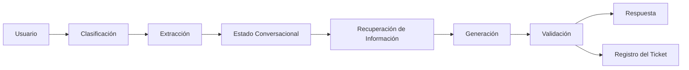

# Módulo 2 — Prompt Engineering Profesional

# Capítulo 21 — Laboratorios de Prompt Engineering

## Sección 06 — Laboratorio Integrador

> *"La ingeniería alcanza su mayor valor cuando integra múltiples capacidades para resolver un único problema de negocio."*

---

## Objetivos de aprendizaje

- Integrar todos los conceptos estudiados durante el módulo.
- Diseñar una solución completa basada en Prompt Engineering.
- Aplicar criterios de arquitectura, evaluación y operación.
- Comprender el trabajo de un AI Engineer frente a un caso real.

---

## Introducción

Los laboratorios anteriores abordaron capacidades específicas: clasificación, extracción estructurada, generación controlada y conversaciones de larga duración. Cada uno desarrolló una competencia en forma aislada.

En este laboratorio el desafío consiste en integrarlas dentro de una única solución. El objetivo no es construir el mejor prompt posible, sino diseñar una arquitectura capaz de resolver un problema empresarial de principio a fin.

---

## El problema

Una organización desea implementar un asistente corporativo para su mesa de ayuda. El sistema debe ser capaz de:

- interpretar la consulta del usuario;
- clasificar automáticamente el tipo de solicitud;
- extraer información relevante;
- consultar documentación interna;
- mantener una conversación coherente;
- generar una respuesta profesional;
- registrar el incidente en el sistema de tickets cuando corresponda.

El desafío consiste en coordinar todas estas capacidades sin perder mantenibilidad.

---

## Arquitectura propuesta

Cada componente representa una responsabilidad independiente dentro de la solución. El componente de Recuperación de Información tiene como función consultar bases de conocimiento o documentación interna para enriquecer la respuesta con contenido relevante y verificado, en lugar de depender exclusivamente de lo que el modelo puede producir desde sus parámetros de entrenamiento. Si el módulo cubrió Retrieval-Augmented Generation (RAG) en capítulos anteriores, este componente es donde esa técnica se integra dentro de la arquitectura.

---

## Plan de trabajo

El laboratorio propone recorrer las siguientes etapas.

| Etapa | Objetivo |
|--------|----------|
| Análisis | Comprender el problema del negocio. |
| Diseño | Definir la arquitectura y los prompts de cada componente. |
| Construcción por componente | Desarrollar y probar cada componente de forma aislada. |
| Integración | Conectar todos los componentes y validar la interacción. |
| Evaluación | Ejecutar casos de prueba completos sobre el sistema integrado. |
| Mejora | Refinar componentes según la evidencia obtenida. |

Construir y probar cada componente por separado antes de integrarlos es la práctica más importante de este laboratorio. Los errores de integración son más difíciles de diagnosticar cuando no existe una línea de base individual para cada componente.

---

## Casos de prueba

El conjunto de evaluación debe contemplar los escenarios más representativos del sistema completo:

- consultas simples con respuesta directa;
- solicitudes incompletas que requieren aclaración;
- conversaciones largas con cambios de intención;
- casos que requieren recuperación de información desde documentación interna;
- generación y registro de tickets;
- errores de integración entre componentes;
- escenarios fuera del alcance previsto.

La solución debe demostrar estabilidad frente a todos ellos. Los casos de error de integración y fuera de alcance son los que con mayor frecuencia revelan fragilidades en la arquitectura que no se detectan en las pruebas de componentes individuales.

---

## Criterios de evaluación

La evaluación ya no se centra únicamente en el prompt, sino en el comportamiento del sistema completo. Los criterios se distribuyen en varios niveles:

**Nivel funcional:**
- precisión en la clasificación de solicitudes;
- exactitud en la extracción de información;
- calidad y adecuación de la respuesta generada.

**Nivel arquitectónico:**
- reutilización de componentes sin duplicación de lógica;
- facilidad de mantenimiento ante cambios en uno de los componentes;
- trazabilidad de las decisiones a lo largo del flujo.

**Nivel operativo:**
- consistencia conversacional a lo largo de sesiones prolongadas;
- costo aproximado de inferencia por interacción;
- estabilidad de los formatos de salida de cada componente.

---

## Caso de estudio

Una empresa implementa este laboratorio como prueba piloto. Durante las primeras iteraciones, los componentes individuales funcionan correctamente cuando se prueban por separado. Sin embargo, al integrarlos, aparecen problemas que ningún test individual había detectado: el componente de generación recibe un contexto mal formado cuando el estado conversacional no se actualiza correctamente tras una corrección del usuario; el clasificador devuelve categorías que el componente de extracción no reconoce como válidas.

El equipo identifica que el problema central es el acoplamiento entre componentes: cada uno fue diseñado asumiendo cierto formato de entrada, pero esos supuestos no estaban documentados ni probados en la integración.

La respuesta es rediseñar la arquitectura con interfaces explícitas entre componentes, desacoplar las responsabilidades y construir casos de prueba de integración específicos. Como resultado, disminuyen los errores, se reducen los costos operativos y aumenta la estabilidad del sistema.

La principal conclusión es que el éxito depende de la arquitectura mucho más que de un único prompt optimizado.

---

## Buenas prácticas

- Diseñar primero la arquitectura, definiendo las interfaces entre componentes, y luego los prompts.
- Validar cada componente de forma aislada antes de integrarlo.
- Documentar los supuestos de formato de entrada y salida de cada componente.
- Automatizar las pruebas de integración.
- Registrar todas las versiones del sistema, no solo las versiones de los prompts individuales.
- Medir el desempeño global del sistema además del comportamiento individual de cada componente.

---

## Errores frecuentes

- Optimizar únicamente los prompts sin considerar la interacción entre componentes.
- Ignorar los errores que aparecen solo en la integración, que no se detectan en pruebas individuales.
- Acoplar excesivamente los componentes, haciendo que un cambio en uno rompa los demás.
- No medir el impacto de cada cambio sobre el sistema completo.

---

## Ideas clave

- Los problemas empresariales requieren integrar múltiples capacidades en una arquitectura coherente.
- El Prompt Engineering constituye solo una parte de la solución: el diseño de las interfaces entre componentes es igualmente crítico.
- La arquitectura determina la escalabilidad y mantenibilidad del sistema a lo largo del tiempo.

---

## Transición hacia la siguiente sección

En la próxima sección realizamos el cierre del capítulo: consolidamos los aprendizajes de los cinco laboratorios y preparamos la transición hacia el Proyecto Integrador del Módulo 2.
