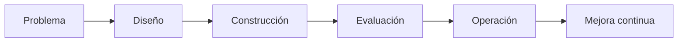

# Módulo 2 — Prompt Engineering Profesional

# Capítulo 21 — Laboratorios de Prompt Engineering

## Sección 07 — Cierre del capítulo y criterios de madurez

> *"El propósito de un laboratorio no es confirmar lo que creemos saber. Es revelar aquello que todavía necesitamos aprender."*

---

## Objetivos de aprendizaje

- Consolidar los aprendizajes obtenidos durante los laboratorios.
- Identificar criterios para evaluar la madurez de una solución basada en LLM.
- Reflexionar sobre el proceso de mejora continua.
- Preparar la transición hacia el Proyecto Integrador.

---

## Introducción

Los laboratorios desarrollados en este capítulo reprodujeron situaciones habituales en proyectos de AI Engineering. En cada uno de ellos el objetivo fue diferente, pero el método se mantuvo constante: comprender el problema, diseñar una solución, medir resultados e iterar sobre la evidencia obtenida.

Esta forma de trabajo constituye una de las principales diferencias entre experimentar con Inteligencia Artificial (IA) y desarrollar soluciones empresariales. Experimentar con IA puede hacerse sin documentación, sin métricas y sin versiones. Desarrollar una solución empresarial requiere que cada decisión sea registrada, cada cambio sea medido y cada iteración deje evidencia para la siguiente.

---

## Síntesis de los laboratorios

| Laboratorio | Competencia principal | Técnica clave |
|-------------|----------------------|---------------|
| Clasificación | Diseñar prompts para categorización consistente. | Instrucciones explícitas de categorías y manejo de múltiples intenciones. |
| Extracción estructurada | Transformar lenguaje natural en datos utilizables. | Formato de salida forzado con nombres de campos definidos. |
| Generación controlada | Respetar restricciones de formato y estilo. | Restricciones explícitas de estructura, longitud y tono. |
| Ingeniería conversacional | Administrar estado, contexto y memoria. | Gestión explícita de estado separado del historial. |
| Integración | Coordinar múltiples componentes dentro de una arquitectura. | Interfaces definidas entre componentes y pruebas de integración. |

Cada laboratorio desarrolló una capacidad específica que será reutilizada en proyectos de mayor complejidad.

---

## Criterios de madurez

Antes de considerar finalizada una solución, conviene responder las siguientes preguntas:

- ¿El comportamiento es consistente? (Referencia orientativa: al menos el 85% de los casos del conjunto de prueba producen resultados equivalentes en tres ejecuciones consecutivas.)
- ¿Puede reproducirse el resultado? ¿Existe un conjunto de pruebas documentado que permita verificarlo?
- ¿Existen métricas objetivas para cada criterio de evaluación relevante?
- ¿La arquitectura facilita el mantenimiento? ¿Un cambio en un componente puede hacerse sin romper los demás?
- ¿El costo operativo resulta aceptable para el volumen esperado?
- ¿La solución resuelve efectivamente el problema del negocio que motivó el proyecto?

Estas preguntas desplazan el foco desde el modelo hacia el valor entregado por la solución. Una demostración exitosa no responde ninguna de ellas.

---

## Caso de estudio

Dos equipos desarrollan asistentes similares. El primero obtiene respuestas de gran calidad en demostraciones, pero carece de pruebas documentadas, versionado de prompts y métricas de desempeño. Cuando el modelo cambia de versión o el volumen de consultas aumenta, no tiene forma de saber qué empeoró ni por qué.

El segundo equipo produce resultados inicialmente más modestos, pero mantiene un proceso sistemático: cada cambio tiene una hipótesis, cada iteración tiene métricas, cada incidente se convierte en un nuevo caso de prueba. Cuando algo falla, pueden identificar el componente y la versión responsable.

Después de varios meses, el segundo equipo logra una plataforma más estable, más económica y más fácil de evolucionar. La diferencia no radica en el modelo utilizado, sino en la disciplina de ingeniería aplicada durante el desarrollo.

---

## La deuda técnica en los prompts

Uno de los errores más frecuentes al cerrar un proyecto de Prompt Engineering es ignorar la deuda técnica acumulada en los prompts. La deuda técnica de prompts ocurre cuando una solución crece sin documentación, sin versionado y sin criterios de diseño explícitos: prompts que funcionan pero nadie sabe exactamente por qué, instrucciones duplicadas en distintos componentes, comportamientos que dependen de características no especificadas del modelo.

Esta deuda tiene consecuencias concretas: cuando el modelo actualiza su versión, cuando el volumen de casos aumenta o cuando un nuevo miembro del equipo necesita modificar el sistema, la ausencia de documentación convierte cada cambio en un riesgo. Un prompt no documentado es tan difícil de mantener como cualquier otro artefacto de software sin especificación.

El antídoto es tratar cada prompt como un artefacto de ingeniería: con versión, con pruebas, con documentación de las decisiones de diseño y con criterios de aceptación definidos.

---

## Buenas prácticas

- Documentar cada decisión relevante, incluyendo las razones por las que se descartaron alternativas.
- Medir antes de optimizar: sin métricas, no hay evidencia de que un cambio mejoró la solución.
- Incorporar retroalimentación de usuarios reales en el conjunto de pruebas.
- Revisar periódicamente la arquitectura para detectar acoplamiento innecesario.
- Convertir cada incidente en producción en un nuevo caso de prueba documentado.

---

## Errores frecuentes

- Considerar terminada una solución después de una demostración exitosa.
- Optimizar sin evidencia: cambiar el prompt porque "parece que puede mejorar" sin una hipótesis medible.
- Acumular deuda técnica en los prompts: crecer sin documentación, sin versiones y sin criterios de diseño explícitos.
- No capturar el aprendizaje obtenido durante los laboratorios, lo que obliga a redescubrir los mismos errores en el siguiente proyecto.

---

## Ideas clave

- La práctica desarrolla criterio de ingeniería; sin un proceso sistemático, la experiencia no se acumula.
- La calidad de una solución depende del proceso completo, no de una única iteración exitosa.
- Cada laboratorio constituye un paso hacia soluciones empresariales de mayor escala.

---

## Transición hacia el siguiente capítulo

En el próximo capítulo desarrollamos el **Proyecto Integrador del Módulo 2**, donde todos los conceptos estudiados se aplicarán en el diseño de una solución completa de AI Engineering, siguiendo un proceso similar al de un proyecto profesional.

---

> **"Un arquitecto no memoriza respuestas. Comprende problemas para poder diseñar soluciones."**
