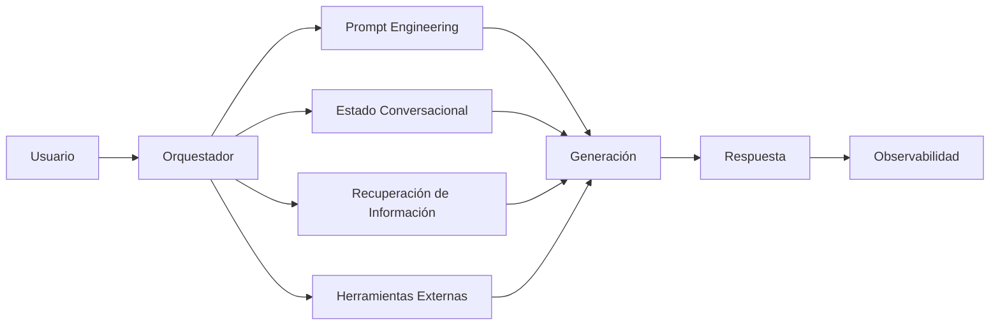

# Módulo 2 — Prompt Engineering Profesional

# Capítulo 22 — Proyecto Integrador del Módulo 2

## Sección 01 — Presentación del Proyecto Integrador

# Objetivos de aprendizaje

- Integrar todos los conceptos desarrollados durante el módulo.
- Diseñar una solución completa desde la perspectiva del AI Engineering.
- Aplicar un proceso profesional de análisis, diseño, implementación y evaluación.
- Preparar la transición hacia el estudio de los modelos fundacionales.

# Introducción

Los capítulos anteriores abordaron cada componente de forma individual: Ingeniería del Prompt, patrones de Prompt Engineering, Prompt Engineering para producción, ingeniería conversacional, arquitecturas basadas en prompts y laboratorios prácticos.

Este proyecto integrador propone combinar todos esos conocimientos para resolver un caso de negocio de principio a fin. El objetivo no consiste en construir un prompt aislado, sino en diseñar una solución completa que pueda crecer, mantenerse y evaluarse con criterios de ingeniería.

# El desafío

Una organización desea implementar un **Asistente Corporativo Inteligente** basado en un Large Language Model (LLM). El sistema deberá:

- responder consultas internas;
- recuperar documentación institucional;
- clasificar solicitudes;
- generar respuestas estructuradas;
- registrar incidentes cuando corresponda;
- mantener conversaciones de larga duración;
- integrarse con sistemas existentes.

El proyecto deberá diseñarse como si fuera a evolucionar hasta convertirse en un sistema de producción.

# Alcance del proyecto

El siguiente diagrama representa el alcance conceptual del proyecto: los grandes bloques de responsabilidad que se trabajarán a lo largo de las secciones.

Este diagrama no describe la arquitectura técnica interna — eso corresponde a la Sección 03. Aquí el foco está en identificar qué capacidades integra el sistema y cómo se relacionan a nivel conceptual.

La arquitectura propuesta constituye un punto de partida que podrá ampliarse en módulos posteriores.

# Entregables esperados

| Entregable | Objetivo |
|---|---|
| Análisis del problema | Comprender el dominio de negocio. |
| Arquitectura | Definir componentes y responsabilidades. |
| Diseño de prompts | Especificar prompts reutilizables. |
| Estrategia conversacional | Estado, contexto y memoria. |
| Plan de evaluación | Casos de prueba y métricas. |
| Estrategia de despliegue | Versionado, observabilidad y mejora continua. |

# Caso de estudio motivador

Un equipo construye una primera versión del asistente con un único prompt. El prototipo funciona durante las demostraciones, pero incorporar nuevas funcionalidades se vuelve cada vez más costoso.

Tras aplicar los principios estudiados en este módulo, el equipo divide responsabilidades, incorpora un orquestador, define prompts especializados, agrega evaluación continua y establece un proceso de PromptOps. La nueva arquitectura requiere un mayor esfuerzo inicial, pero reduce significativamente el costo de evolución del sistema.

Este recorrido —del prototipo al sistema sostenible— es el que este capítulo propone transitar.

# Cómo leer este capítulo

Las secciones siguientes avanzan en secuencia:

- **Sección 02** define el análisis del problema y el dominio de negocio.
- **Sección 03** especifica la arquitectura técnica del sistema.
- **Sección 04** trabaja el diseño de prompts y la estrategia conversacional.
- **Sección 05** aborda el plan de evaluación y las métricas de éxito.
- **Sección 06** describe la estrategia de despliegue y operación continua.
- **Sección 07** cierra el módulo con la síntesis de aprendizajes y la transición al Módulo 3.

Cada sección puede leerse de forma independiente como referencia, pero el proyecto cobra sentido completo al recorrerlas en orden.
