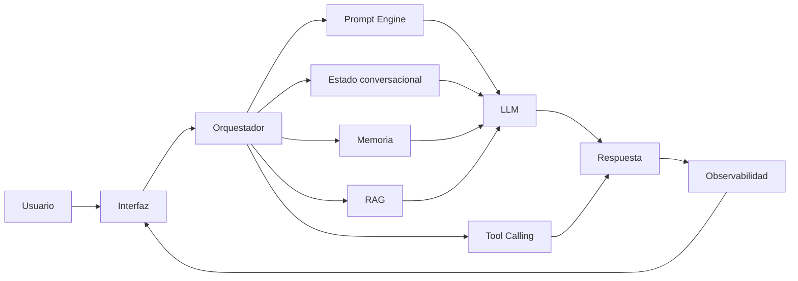

# Módulo 2 — Prompt Engineering Profesional

# Capítulo 22 — Proyecto Integrador del Módulo 2

## Sección 03 — Arquitectura de Referencia

> "Una arquitectura no describe únicamente cómo funciona un sistema. Describe cómo podrá evolucionar durante los próximos años."

## Objetivos de aprendizaje

- Diseñar una arquitectura de referencia para el proyecto integrador.
- Identificar los principales componentes de una solución basada en Large Language Model (LLM).
- Definir responsabilidades y relaciones entre los distintos módulos.
- Aplicar los principios de desacoplamiento —la capacidad de modificar un componente sin afectar al resto del sistema— y escalabilidad estudiados durante el módulo.

## Introducción

Con el problema de negocio claramente definido, el siguiente paso consiste en diseñar la arquitectura que permitirá implementar la solución.

En esta etapa aún no se desarrollan prompts ni se elige un modelo específico. El objetivo es identificar los componentes necesarios, establecer sus responsabilidades y definir cómo colaborarán entre sí.

Una buena arquitectura permite incorporar nuevas capacidades sin rediseñar completamente el sistema.

## Componentes principales

Para este proyecto se propone una arquitectura compuesta por los siguientes elementos:

| Componente | Responsabilidad |
|------------|-----------------|
| Interfaz de usuario | Recibir consultas y presentar respuestas. |
| Orquestador | Coordinar el flujo general del sistema: decide qué componentes activar en cada turno según la intención detectada, el estado de la sesión y la disponibilidad de información relevante. |
| Prompt Engine | Gestionar los prompts especializados. |
| Estado conversacional | Mantener la continuidad de la interacción dentro de la sesión activa. |
| Memoria | Persistir información relevante entre sesiones distintas. |
| RAG | Recuperar conocimiento actualizado desde fuentes documentales externas. |
| Tool Calling | Ejecutar acciones sobre sistemas externos. |
| Observabilidad | Registrar métricas, eventos y auditoría. |

El Estado conversacional y la Memoria cumplen funciones complementarias pero operacionalmente distintas: el primero sostiene el hilo de la conversación en curso; la segunda conserva lo relevante para sesiones futuras.

Cada componente posee una responsabilidad claramente delimitada. El Orquestador es el nodo central del sistema: evalúa la intención detectada por el clasificador, consulta el estado de la sesión actual y verifica si existe documentación relevante disponible antes de determinar qué componentes deben participar en la generación de la respuesta.

## Arquitectura de referencia

A diferencia del esquema conceptual presentado en la Sección 01, el siguiente diagrama detalla la arquitectura técnica del sistema con las responsabilidades diferenciadas de cada componente.

La arquitectura prioriza la separación de responsabilidades y facilita la incorporación de nuevos componentes.

## Decisiones de diseño

Durante esta etapa conviene responder preguntas como:

- ¿Qué componentes deberán ser reutilizables?
- ¿Qué información permanecerá fuera del modelo?
- ¿Dónde se administrará el estado conversacional?
- ¿Qué servicios externos participarán del proceso?
- ¿Cómo se registrarán métricas y eventos?

Responder estas preguntas antes de implementar reduce considerablemente el riesgo de rediseños posteriores. También es el momento de definir los contratos de interacción —la especificación formal de entradas y salidas esperadas de cada componente— que harán posible desarrollar y probar cada módulo de forma independiente.

## Caso de estudio

El equipo responsable del proyecto decide incorporar una base documental mediante RAG varios meses después del inicio del desarrollo.

Gracias a la arquitectura modular, el nuevo componente se integra sin modificar el resto de la solución. El Orquestador incorpora una nueva condición dentro del flujo de procesamiento: cuando detecta que la consulta requiere información documental, activa el componente RAG antes de construir el prompt y enviarlo al LLM.

La inversión realizada durante el diseño arquitectónico demuestra su valor al facilitar la evolución del sistema.

## Actividades propuestas

1. Dibujar la arquitectura del proyecto.
2. Identificar responsabilidades de cada componente.
3. Definir contratos de interacción para cada módulo.
4. Detectar posibles puntos de acoplamiento —lugares donde un cambio en un componente podría forzar cambios en otros.
5. Justificar las principales decisiones de diseño.

## Buenas prácticas

- Mantener responsabilidades bien definidas en cada componente.
- Diseñar componentes independientes que puedan modificarse sin afectar al resto.
- Favorecer la reutilización entre proyectos similares.
- Documentar todas las decisiones de diseño con su justificación en el momento en que se toman.

## Errores frecuentes

- Incorporar lógica de negocio dentro de los prompts.
- Acoplar directamente todos los componentes sin pasar por el Orquestador.
- Diseñar una arquitectura excesivamente compleja desde el inicio.
- No contemplar el crecimiento futuro del sistema.

## Ideas clave

- La arquitectura constituye el esqueleto de toda solución de AI Engineering.
- El desacoplamiento facilita el mantenimiento y la evolución del sistema.
- Diseñar correctamente desde el principio reduce costos a largo plazo.

## Transición hacia la siguiente sección

En la próxima sección comenzaremos el diseño funcional de los componentes, definiendo los prompts, los flujos conversacionales y los mecanismos de evaluación que utilizará el proyecto integrador.
