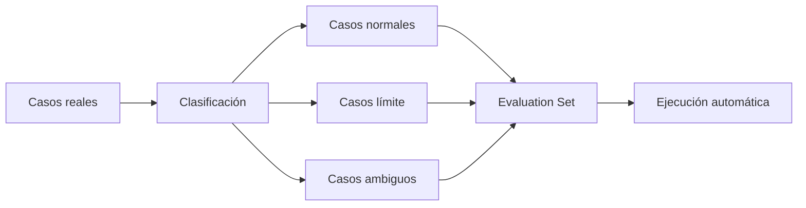

# Módulo 2 — Prompt Engineering Profesional

# Capítulo 22 — Proyecto Integrador del Módulo 2

## Sección 05 — Estrategia de Validación

> "Una solución no está lista para producción cuando funciona una vez. Está lista cuando demuestra que puede funcionar de manera consistente."

## Objetivos de aprendizaje

- Diseñar una estrategia de validación para una solución basada en Large Language Model (LLM).
- Definir conjuntos de evaluación (*Evaluation Sets*).
- Establecer criterios objetivos de aceptación.
- Comprender el papel de las pruebas dentro del AI Engineering.

## Introducción

En proyectos tradicionales de software es habitual verificar que una funcionalidad produzca el resultado esperado. En sistemas basados en LLM, este enfoque resulta insuficiente, y el componente Evaluador presentado en la sección anterior opera precisamente a través de los conjuntos de casos de prueba que se diseñarán en esta etapa. Las respuestas pueden variar entre ejecuciones y la calidad no depende únicamente de la ausencia de errores, sino también de la consistencia, la utilidad y el cumplimiento de restricciones.

Por este motivo, el proyecto integrador incorpora una etapa específica de planificación de pruebas antes de considerar la solución preparada para producción.

## Estrategia de validación

La validación debe contemplar distintos niveles.

| Nivel | Objetivo |
|---|---|
| Pruebas unitarias | Validar cada componente por separado. |
| Pruebas de integración | Verificar la interacción entre módulos. |
| Evaluation Sets | Comparar el comportamiento frente a casos conocidos. |
| Pruebas de usuario | Evaluar utilidad y experiencia. |
| Monitoreo inicial | Detectar desvíos después del despliegue. |

Cada nivel aporta evidencia diferente sobre la calidad de la solución.

## Construcción de Evaluation Sets

La ejecución automática implica que cada nueva versión del sistema se compara contra el conjunto de casos sin intervención manual.

Los conjuntos de evaluación deben evolucionar junto con la aplicación. Cada incidente detectado en producción representa una oportunidad para incorporar un nuevo caso de prueba.

A continuación se muestra un ejemplo de cómo se estructura un caso de prueba en el contexto del asistente corporativo:

| Entrada | Salida esperada | Criterio de aceptación |
|---|---|---|
| ¿Cómo escalo un incidente? | Respuesta con los pasos del proceso de escalamiento según el manual interno. | El formato debe contener al menos tres pasos numerados; no debe inventar procedimientos. |
| ¿Quién aprueba los cambios en producción? | Descripción del rol responsable de aprobación según la política interna. | Debe mencionar el rol correcto; no debe especular con nombres propios. |
| ¿Cuál es el SLA para incidentes críticos? | Tiempo de respuesta definido en el contrato de nivel de servicio. | Debe citar el valor numérico exacto; no debe aproximar ni inventar tiempos. |

## Criterios de aceptación

Antes de avanzar a una nueva versión conviene definir indicadores mínimos. Algunos ejemplos son:

- porcentaje de respuestas correctas;
- estabilidad del formato de salida;
- cumplimiento de reglas de negocio;
- ausencia de alucinaciones críticas;
- tiempo máximo de respuesta;
- costo promedio por interacción.

Estos indicadores deben adaptarse al contexto de cada proyecto.

## Caso de estudio

Durante las pruebas del asistente corporativo, el equipo descubre que determinadas consultas ambiguas generan respuestas inconsistentes. En lugar de corregir únicamente esos ejemplos, incorpora todos los casos al *Evaluation Set* y automatiza su ejecución en cada nueva versión. Con el tiempo, el conjunto de pruebas se convierte en uno de los principales activos del proyecto.

## Actividades propuestas

1. Construir un conjunto inicial de casos de prueba.
2. Clasificar los casos por nivel de dificultad.
3. Definir criterios de aceptación cuantificables.
4. Registrar resultados de cada iteración.
5. Incorporar nuevos casos a medida que evolucione el sistema.

## Buenas prácticas

- Automatizar las pruebas siempre que sea posible.
- Mantener actualizado el *Evaluation Set*.
- Basar las decisiones en métricas.
- Revisar periódicamente los criterios de aceptación.

## Errores frecuentes

- Evaluar únicamente ejemplos favorables.
- No conservar el historial de resultados.
- Cambiar varios componentes antes de medir el impacto.
- Considerar suficientes las pruebas manuales.

## Ideas clave

- La calidad debe demostrarse mediante evidencia objetiva.
- Los *Evaluation Sets* evolucionan junto con la solución.
- Las pruebas constituyen un componente permanente del ciclo de vida del AI Engineering.

## Transición hacia la siguiente sección

En la próxima sección abordaremos la estrategia de despliegue, observabilidad y mejora continua del proyecto integrador, completando el ciclo de vida de una solución profesional basada en Inteligencia Artificial.
