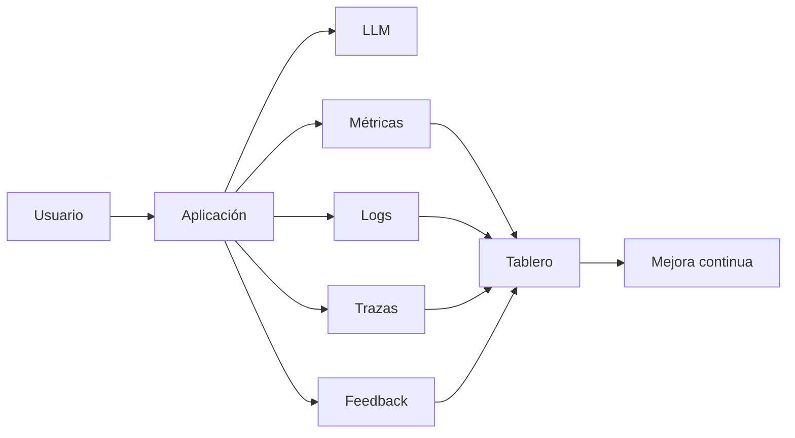

# Módulo 2 — Prompt Engineering Profesional

# Capítulo 22 — Proyecto Integrador del Módulo 2

## Sección 06 — Despliegue, Observabilidad y Mejora Continua

> "El desarrollo termina cuando se despliega. La ingeniería comienza cuando el sistema entra en producción."

## Objetivos de aprendizaje

- Diseñar una estrategia de despliegue para una solución basada en Large Language Model (LLM).
- Incorporar observabilidad y monitoreo desde el inicio.
- Comprender el ciclo de mejora continua.
- Completar el ciclo de vida del proyecto integrador.

## Introducción

Una solución de Inteligencia Artificial no finaliza cuando supera las pruebas internas.

El verdadero desafío comienza cuando interactúa con usuarios reales, datos cambiantes y procesos críticos del negocio.

Por este motivo, el despliegue debe entenderse como una transición controlada y no como el final del proyecto.

## Estrategia de despliegue

Se recomienda realizar la puesta en producción de manera gradual.

| Etapa | Objetivo |
|--------|----------|
| Piloto | Validar el comportamiento con un grupo reducido de usuarios. |
| Despliegue parcial | Incrementar progresivamente el alcance. |
| Producción | Habilitar el servicio para toda la organización. |
| Optimización | Ajustar el sistema utilizando métricas reales. |

Cada etapa debe contar con criterios claros para avanzar o retroceder. En un sistema basado en LLM, retroceder no implica revertir el modelo subyacente: lo que puede restaurarse es el prompt activo, la configuración del orquestador o los parámetros de observabilidad, lo que permite volver a un estado funcional anterior con rapidez y sin riesgo de pérdida estructural.

## Observabilidad

La observabilidad permite comprender cómo se comporta el sistema y detectar oportunidades de mejora antes de que se conviertan en incidentes.

## Métricas recomendadas

Entre los indicadores más útiles se encuentran:

- tiempo medio de respuesta;
- costo por interacción;
- tasa de éxito de las tareas;
- porcentaje de respuestas corregidas por usuarios;
- frecuencia de uso por funcionalidad;
- incidentes detectados en producción.

Las métricas deben analizarse de forma periódica y compararse entre versiones.

## Mejora continua

Una solución madura evoluciona mediante un ciclo permanente.

1. Observar el comportamiento.
2. Detectar oportunidades de mejora.
3. Priorizar cambios.
4. Implementar una nueva versión.
5. Ejecutar nuevamente los *Evaluation Sets*.
6. Desplegar de forma controlada.

Este ciclo convierte el aprendizaje obtenido en producción en conocimiento reutilizable para futuras versiones.

## Caso de estudio

Tras desplegar el asistente corporativo, el equipo observa que muchas consultas requieren una aclaración adicional antes de generar una respuesta útil. Ese dato operativo —la alta frecuencia de turnos de clarificación previos a una respuesta efectiva— llevó al equipo a incorporar un paso de clarificación explícita en el flujo de interacción, lo que constituyó una decisión de diseño conversacional derivada directamente de la observación en producción.

En lugar de modificar directamente el modelo, el equipo analizó los registros, incorporó nuevos casos al conjunto de evaluación, ajustó el diseño conversacional y publicó una nueva versión.

Las métricas mostraron una reducción del número de aclaraciones y un aumento en la satisfacción de los usuarios.

## Actividades propuestas

1. Definir un plan de despliegue gradual.
2. Seleccionar las métricas que serán monitoreadas.
3. Diseñar un tablero de observabilidad.
4. Establecer un proceso de mejora continua.
5. Documentar el procedimiento de liberación de nuevas versiones.

## Buenas prácticas

- Desplegar de forma incremental.
- Establecer líneas de base métricas antes de introducir cualquier cambio en producción.
- Automatizar la recolección de métricas.
- Mantener trazabilidad entre versiones y resultados.
- Incorporar el feedback de los usuarios al proceso de mejora.

## Errores frecuentes

- Considerar el despliegue como el final del proyecto.
- No monitorear el comportamiento real del sistema.
- Introducir cambios sin evidencia.
- Ignorar los incidentes menores detectados por los usuarios.

## Ideas clave

- El despliegue marca el inicio de la operación, no el final del desarrollo.
- La observabilidad es un componente esencial del AI Engineering.
- La mejora continua transforma datos operativos en decisiones de arquitectura.

## Transición hacia la siguiente sección

En la próxima y última sección del proyecto integrador realizaremos el cierre del Módulo 2, revisando los aprendizajes alcanzados y estableciendo las competencias que servirán de base para el estudio de los modelos fundacionales en el Módulo 3.
