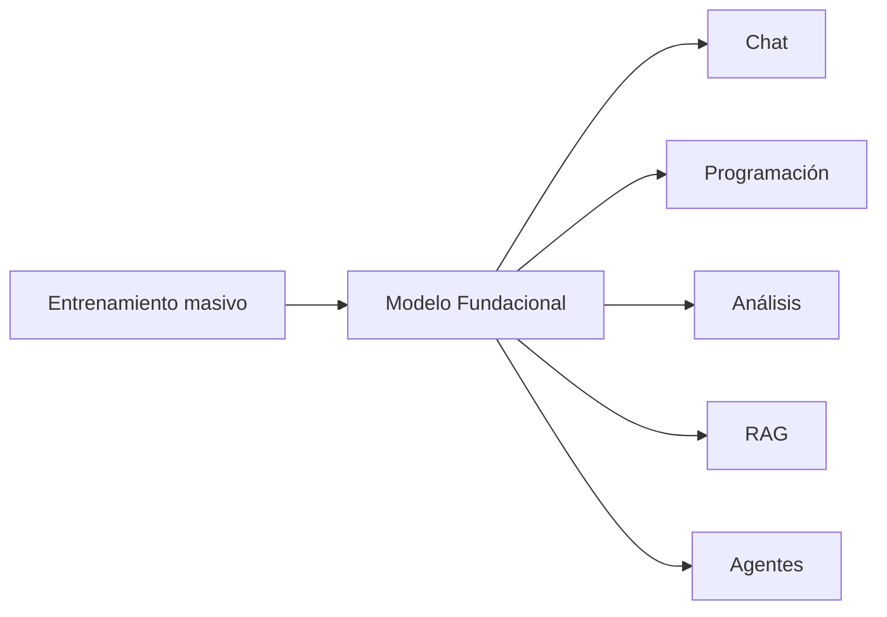

# Capitulo-23-Seccion-01-v0.1

# Módulo 3 — Modelos Fundacionales

# Capítulo 23 — Introducción a los Modelos Fundacionales

**Versión:** 0.1  
**Estado:** Manuscrito del autor

> *"Antes de elegir un modelo conviene comprender qué problema intenta resolver y qué compromisos implica su diseño."*

---

# Objetivos de aprendizaje

- Comprender qué es un modelo fundacional.
- Diferenciar modelos fundacionales de modelos tradicionales de Machine Learning.
- Introducir los criterios que utilizaremos para comparar modelos durante este módulo.
- Preparar una visión de AI Engineering orientada a la selección tecnológica.

---

# Introducción

Hasta el módulo anterior analizamos cómo construir soluciones basadas en Inteligencia Artificial.

A partir de este capítulo cambia la pregunta principal.

Ya no nos preguntaremos **cómo diseñar un buen sistema**, sino **qué modelo conviene utilizar para cada sistema**.

Responder correctamente esta pregunta tiene un impacto directo sobre el costo, el rendimiento, la privacidad, la latencia y la capacidad de evolución de una solución.

---

# ¿Qué es un modelo fundacional?

Un modelo fundacional es un modelo entrenado sobre grandes volúmenes de información con el propósito de servir como base para múltiples tareas.

En lugar de resolver un único problema específico, puede adaptarse a numerosos dominios mediante prompting, ajuste fino o integración con herramientas externas.

---

# ¿Por qué existen tantos modelos?

Cada organización que desarrolla modelos optimiza objetivos diferentes.

Algunos priorizan:

- razonamiento;
- velocidad;
- bajo costo;
- ejecución local;
- multimodalidad;
- contexto extenso;
- privacidad;
- integración empresarial.

Por ese motivo no existe un único modelo "mejor" para todos los escenarios.

---

# Criterios de comparación

Durante este módulo utilizaremos un conjunto estable de criterios.

| Criterio | Pregunta que responde |
|----------|-----------------------|
| Capacidades | ¿Qué tareas realiza mejor? |
| Calidad | ¿Qué nivel de precisión ofrece? |
| Rendimiento | ¿Cuál es su velocidad y consumo? |
| Costos | ¿Qué impacto económico tiene? |
| Privacidad | ¿Dónde se ejecuta la información? |
| Ecosistema | ¿Qué herramientas y APIs ofrece? |
| Casos de uso | ¿Para qué tipo de proyectos resulta conveniente? |

Estos criterios permitirán comparar familias de modelos sin depender de campañas comerciales o percepciones subjetivas.

---

# Caso de estudio

Una empresa necesita construir un asistente interno.

Un equipo propone utilizar el modelo con mayor puntuación en un benchmark.

Otro equipo analiza requisitos de privacidad, costos, integración, volumen esperado de usuarios y disponibilidad de infraestructura.

Aunque ambos conocen los mismos modelos, solo el segundo adopta un enfoque propio del AI Engineering.

---

# Buenas prácticas

- Seleccionar modelos según objetivos del proyecto.
- Evaluar compromisos técnicos y económicos.
- Comparar utilizando criterios consistentes.
- Revisar periódicamente el estado del mercado.

---

# Errores frecuentes

- Elegir el modelo más popular sin análisis.
- Basarse únicamente en benchmarks.
- Ignorar restricciones operativas.
- Suponer que un modelo superior en una tarea lo será en todas.

---

# Ideas clave

- Un modelo fundacional constituye la base de múltiples aplicaciones.
- No existe un modelo universalmente superior.
- La selección forma parte del diseño arquitectónico.

---

# Transición hacia la siguiente sección

En la próxima sección estudiaremos la evolución histórica de los modelos fundacionales y comprenderemos cómo surgieron las principales familias que dominan el ecosistema actual.

---

> **"Un arquitecto no memoriza respuestas. Comprende problemas para poder diseñar soluciones."**
