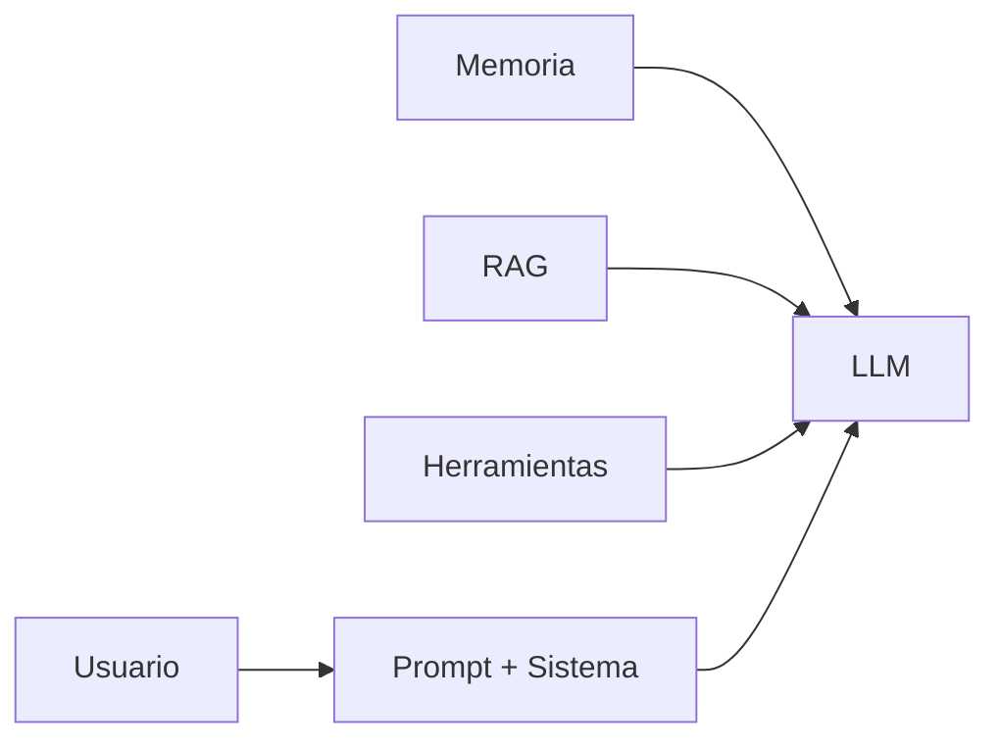

# Capitulo-01-Seccion-07-v1.0

# Caso de estudio: de un prompt a una arquitectura de contexto

> Módulo 3 — Context Engineering Profesional

---

# Introducción

Hasta este punto estudiamos los fundamentos del Context Engineering. Ahora integraremos esos conceptos mediante un caso práctico que muestra cómo evoluciona una solución desde un simple prompt hasta una arquitectura completa de contexto.

---

# Escenario

Una organización desea desarrollar un asistente interno para su mesa de ayuda de TI.

Los usuarios esperan poder:

- consultar el estado de incidentes;
- buscar documentación técnica;
- solicitar nuevas altas;
- conocer el estado de cambios programados.

La primera implementación consiste únicamente en un prompt.

```text
Actuá como un agente de soporte técnico y respondé las preguntas del usuario.
```

Aunque funciona para demostraciones, rápidamente aparecen limitaciones.

---

# Problemas detectados

- El asistente desconoce quién realiza la consulta.
- No tiene acceso al sistema de tickets.
- No recuerda conversaciones anteriores.
- No consulta la documentación vigente.
- Puede responder utilizando información desactualizada.

En consecuencia, las respuestas resultan inconsistentes.

---

# Evolución de la solución

La aplicación incorpora progresivamente nuevas capas de contexto.

## Paso 1 — Instrucciones del sistema

Se definen el rol, el idioma, el formato de salida y las políticas generales.

## Paso 2 — Perfil del usuario

Antes de consultar al modelo se agregan:

- nombre;
- área;
- permisos;
- idioma;
- zona horaria.

## Paso 3 — Recuperación de conocimiento

El sistema consulta la base documental mediante RAG y envía únicamente los documentos relevantes.

## Paso 4 — Herramientas

El modelo obtiene información actualizada desde:

- API de tickets;
- CMDB;
- inventario;
- calendario de mantenimiento.

## Paso 5 — Memoria

Se incorporan preferencias y decisiones persistentes del usuario para evitar repetir información en cada interacción.

---

# Arquitectura resultante



---

# Beneficios obtenidos

La nueva arquitectura permite:

- respuestas más precisas;
- menor cantidad de alucinaciones;
- continuidad entre conversaciones;
- acceso a información actualizada;
- menor cantidad de tokens enviados de forma innecesaria.

---

# Lecciones aprendidas

1. El prompt sigue siendo importante, pero ya no es el centro de la solución.
2. La calidad depende de la arquitectura del contexto.
3. Cada componente debe tener una responsabilidad clara.
4. El contexto debe mantenerse actualizado durante todo el ciclo de vida de la aplicación.

---

# Resumen

El Context Engineering transforma un asistente basado únicamente en prompts en una solución empresarial capaz de combinar memoria, conocimiento, herramientas y reglas de negocio. Esta evolución constituye uno de los cambios más importantes en la Ingeniería de IA moderna.

La siguiente y última sección del capítulo resumirá los conceptos principales y presentará una guía de autoevaluación para el lector.
