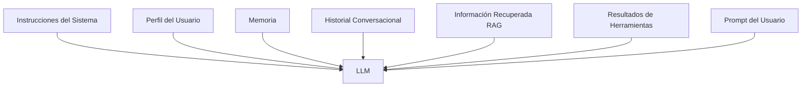

# Capitulo-01-Seccion-04-v1.0

# Las capas del contexto

> Módulo 3 — Context Engineering Profesional

---

# Introducción

En la sección anterior definimos qué entendemos por contexto y vimos cuáles son sus principales componentes. En esta sección profundizaremos en una idea fundamental para cualquier ingenieros de IA: **el contexto debe diseñarse como una arquitectura en capas**, no como un bloque de texto.

Esta forma de pensar permite construir soluciones más mantenibles, escalables y fáciles de evolucionar.

---

# El contexto no es un prompt

Uno de los errores más frecuentes al comenzar a trabajar con LLM consiste en concentrar toda la lógica dentro del prompt del usuario.

En sistemas empresariales, esa aproximación rápidamente se vuelve inmanejable.

Un buen diseño distribuye las responsabilidades entre distintas capas, cada una con un propósito específico.

---

# Arquitectura de capas

Cada una de estas capas puede evolucionar independientemente sin modificar las demás.

---

# Capa 1 — Instrucciones del sistema

Es la capa más estable.

Define:

- identidad del asistente;
- objetivos;
- restricciones;
- tono;
- formato esperado;
- políticas.

Normalmente cambia muy poco durante la vida útil de una aplicación.

---

# Capa 2 — Perfil del usuario

Contiene información relativamente estable.

Ejemplos:

- idioma;
- zona horaria;
- permisos;
- organización;
- preferencias.

No pertenece al prompt, sino al usuario.

---

# Capa 3 — Memoria

La memoria almacena información adquirida durante el uso del sistema.

Puede incluir:

- proyectos activos;
- decisiones previas;
- preferencias aprendidas;
- tareas pendientes.

Su objetivo es evitar que el usuario deba repetir constantemente la misma información.

---

# Capa 4 — Historial

Describe únicamente la conversación actual.

No debe confundirse con la memoria.

Una conversación puede finalizar mientras la memoria continúa existiendo.

Esta separación mejora significativamente la calidad del diseño.

---

# Capa 5 — Información recuperada

Antes de responder, el sistema puede consultar:

- documentación;
- bases de conocimiento;
- normativa;
- manuales;
- bases de datos.

Esta información suele incorporarse mediante técnicas de recuperación (RAG).

---

# Capa 6 — Herramientas

Muchas respuestas requieren ejecutar acciones.

Por ejemplo:

- consultar una API;
- crear un ticket;
- enviar un correo;
- obtener información meteorológica;
- ejecutar una consulta SQL.

Los resultados de esas acciones también forman parte del contexto.

---

# Principio de responsabilidad única

Cada capa debería responder una única pregunta:

| Capa | Pregunta |
|------|----------|
| Sistema | ¿Cómo debe comportarse el modelo? |
| Usuario | ¿Quién realiza la consulta? |
| Memoria | ¿Qué recuerda el sistema? |
| Historial | ¿Qué ocurrió en esta conversación? |
| Recuperación | ¿Qué conocimiento necesito ahora? |
| Herramientas | ¿Qué información debo obtener o qué acción debo ejecutar? |

Cuando una capa intenta resolver responsabilidades de otra, la arquitectura comienza a degradarse.

---

# Nota del arquitecto

Una buena práctica consiste en poder modificar cualquiera de las capas sin afectar al resto del sistema.

Si cambiar el idioma del usuario obliga a modificar el prompt principal, probablemente exista un problema de diseño.

---

# Resumen

El Context Engineering no consiste únicamente en enviar más información al modelo. Consiste en organizar esa información de forma coherente.

Pensar en capas facilita la reutilización, reduce errores y prepara el camino para arquitecturas más avanzadas como RAG, agentes y sistemas multiagente.

En la próxima sección estudiaremos cómo un modelo procesa internamente ese contexto y por qué el orden y la estructura de la información influyen directamente en la calidad de las respuestas.
