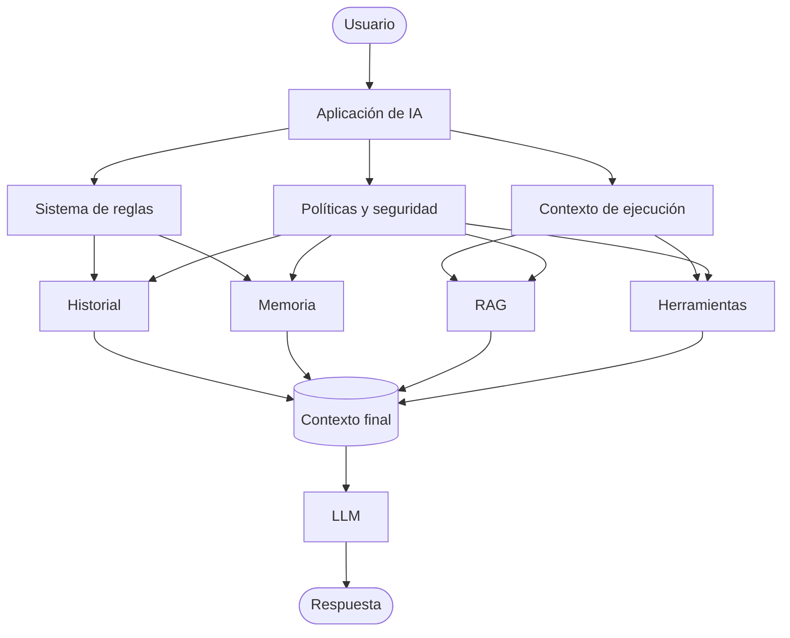

# Capitulo-02-Seccion-10-v1.0

# Integración de la anatomía del contexto

> Módulo 3 — Context Engineering Profesional

---

# Introducción

A lo largo de este capítulo analizamos cada uno de los componentes que forman el contexto de un modelo de lenguaje. En esta sección final los integraremos en una visión unificada para comprender cómo colaboran durante una interacción real.

El objetivo de un ingeniero de IA no consiste únicamente en conocer cada componente por separado, sino en diseñar una arquitectura donde todos trabajen de forma coordinada.

---

# Modelo conceptual

Cada bloque tiene una responsabilidad específica. El éxito de la solución depende de cómo se combinan, no únicamente de la calidad del modelo.

---

# Tabla de responsabilidades y buenas prácticas por componente

| Componente | Responsabilidad | Buenas prácticas clave |
|------------|-----------------|------------------------|
| Sistema de reglas | Comportamiento permanente del asistente | Pocas reglas, claras y estables; separar de capas dinámicas |
| Contexto de ejecución | Estado actual del usuario y el entorno | Construir justo antes de la inferencia; validar autenticación |
| Historial | Continuidad de la conversación actual | Definir política de retención; resumir conversaciones extensas |
| Memoria | Conocimiento persistente entre conversaciones | Versionar estructuras; permitir actualización y eliminación |
| RAG | Conocimiento externo recuperado bajo demanda | Recuperar solo documentos relevantes para la consulta actual |
| Herramientas | Información y acciones sobre sistemas externos | Normalizar resultados; manejar errores explícitamente |
| Políticas y seguridad | Control de acceso y protección de datos | Validar permisos antes de recuperar; respetar mínimo privilegio |

Prácticas transversales a todos los componentes:

- Registrar el origen de los datos incorporados al contexto.
- Auditar periódicamente la calidad de la información.
- Evitar duplicar información entre componentes.
- Priorizar calidad antes que cantidad.

---

# Checklist del arquitecto

Antes de poner una solución en producción, verifique:

- ¿Las instrucciones del sistema son claras y estables?
- ¿El contexto de ejecución contiene solo información relevante?
- ¿Historial y memoria están correctamente separados?
- ¿RAG recupera únicamente documentos pertinentes?
- ¿Las herramientas validan errores y permisos?
- ¿Se aplican políticas de seguridad antes de construir el contexto?
- ¿Existe una estrategia para controlar el consumo de tokens?

Responder afirmativamente a estas preguntas reduce gran parte de los problemas observados en producción.

---

# Errores de diseño

Las implementaciones iniciales suelen presentar alguno de estos problemas:

- utilizar el historial como memoria permanente;
- almacenar documentación completa en memoria;
- mezclar reglas del sistema con datos dinámicos;
- enviar información duplicada al modelo;
- ignorar la seguridad durante la construcción del contexto.

Todos ellos incrementan el costo, reducen la precisión y dificultan el mantenimiento.

---

# Autoevaluación

Intente responder las siguientes preguntas sin consultar el material:

1. ¿Qué diferencia existe entre contexto de ejecución y memoria?
2. ¿Qué información debería recuperar RAG?
3. ¿Por qué las herramientas forman parte del contexto?
4. ¿Qué responsabilidad tienen las instrucciones del sistema?
5. ¿Cómo contribuyen las políticas de seguridad a la calidad del contexto?

Si puede responderlas con claridad, dispone de una base sólida para abordar los capítulos siguientes.

---

# Lo que viene

En el próximo capítulo estudiaremos las **ventanas de contexto y la gestión de tokens**.

Analizaremos:

- cómo los modelos procesan grandes volúmenes de información;
- límites de las ventanas de contexto;
- estrategias de compresión;
- resumido inteligente;
- optimización del costo y del rendimiento.

Estos conocimientos permitirán diseñar aplicaciones escalables capaces de trabajar con conversaciones y documentos de gran tamaño.

---

# Conclusión

La anatomía del contexto constituye el fundamento sobre el que se apoyan todas las aplicaciones modernas de IA. Comprender cada uno de sus componentes y sus responsabilidades permite construir asistentes, agentes y sistemas empresariales más precisos, seguros, mantenibles y escalables.

Con esta base conceptual, ya estamos preparados para estudiar cómo administrar uno de los recursos más valiosos de cualquier modelo de lenguaje: su ventana de contexto.
