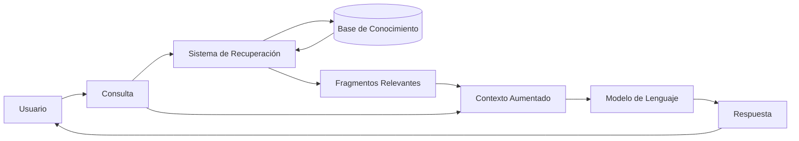

# Módulo 3 — Context Engineering

# Capítulo 06 — RAG (Retrieval-Augmented Generation) como componente del Context Engineering

## Sección 01 — Introducción a RAG como componente del Context Engineering

> *"Un modelo que no puede acceder a información relevante produce respuestas relevantes solo por azar. RAG convierte ese azar en arquitectura."*

---

## Objetivos de aprendizaje

- Comprender qué es RAG y por qué emerge como solución a un problema de diseño específico.
- Ubicar RAG dentro del marco más amplio del Context Engineering.
- Diferenciar RAG de otras estrategias para enriquecer el contexto: memoria, resumen e instrucciones del sistema.
- Establecer el mapa conceptual del capítulo antes de desarrollar cada componente.

---

## El problema que RAG resuelve

En los capítulos anteriores construimos una arquitectura de contexto que incluye instrucciones del sistema, memoria conversacional y estrategias de compresión. Ese contexto es poderoso, pero tiene un límite que ninguno de esos mecanismos puede resolver por sí solo: el modelo no sabe lo que no vio durante su entrenamiento.

Un modelo de lenguaje de gran escala aprende durante el preentrenamiento. Después de ese proceso, su conocimiento queda congelado. No importa cuántas horas de cómputo se invirtieron ni cuántos parámetros tiene: si el evento que el usuario pregunta ocurrió después del corte de entrenamiento, si el documento que necesita es interno a la organización, o si la regulación que debe aplicar es específica del sector, el modelo simplemente no tiene esa información.

Frente a esta limitación, hay dos respuestas posibles.

La primera consiste en actualizar el modelo. Reentrenarlo, ajustarlo con nuevos datos, mantenerlo sincronizado con el mundo que cambia. Esta respuesta es costosa, lenta y difícilmente sostenible para información que se actualiza con frecuencia.

La segunda consiste en diseñar el sistema para que, en el momento en que el usuario hace una consulta, el sistema recupere la información relevante y la entregue al modelo dentro del contexto. El modelo no necesita saberlo de antemano: lo aprende en el momento, en el contexto de cada consulta. Esta es la lógica de RAG.

---

## Qué es RAG

Retrieval-Augmented Generation es una arquitectura de sistema que combina dos operaciones que, sin RAG, permanecen separadas: la recuperación de información relevante de un repositorio externo y la generación de una respuesta por parte de un modelo de lenguaje.

El nombre lo describe con precisión: la generación (Generation) se aumenta (Augmented) mediante recuperación (Retrieval). El modelo no genera desde su conocimiento interno solamente. Genera desde un contexto que el sistema construyó dinámicamente, seleccionando los fragmentos de información más relevantes para la consulta actual.

Este diagrama captura la idea central: la consulta del usuario no va directamente al modelo. Primero pasa por un sistema de recuperación que extrae los fragmentos más relevantes de una base de conocimiento. Esos fragmentos, junto con la consulta original, forman el contexto que el modelo recibe. El modelo genera su respuesta basándose en ese contexto aumentado.

---

## RAG como componente del Context Engineering

En el capítulo 01 de este módulo definimos el Context Engineering como la disciplina que se ocupa de diseñar, construir y gestionar el contexto que un sistema de IA recibe en cada inferencia. Todo lo que se entrega al modelo en el prompt es contexto. El Context Engineering es la ingeniería de ese contenido.

Desde esa perspectiva, RAG es una estrategia de Context Engineering. Su función específica es responder una pregunta de diseño concreta: ¿cómo incorporo al contexto información externa que el modelo no tiene en su conocimiento interno?

Las otras estrategias que exploramos en este módulo responden preguntas diferentes:

| Estrategia | Pregunta que responde |
|---|---|
| Instrucciones del sistema | ¿Cómo defino el comportamiento, el rol y las restricciones del modelo? |
| Memoria conversacional | ¿Cómo mantengo continuidad entre turnos y sesiones? |
| Resumen y compresión | ¿Cómo gestiono el contexto cuando el historial supera la ventana? |
| **RAG** | **¿Cómo incorporo conocimiento externo relevante para la consulta actual?** |

No son estrategias competidoras. Son complementarias. En una aplicación empresarial bien diseñada, las cuatro conviven y se coordinan dentro de la misma arquitectura.

---

## Por qué RAG cambió el diseño de aplicaciones de IA

Antes de RAG, la forma dominante de especializar un modelo era el fine-tuning: ajustar los parámetros del modelo con datos del dominio específico. El fine-tuning produce un modelo que "sabe" más sobre un tema, pero ese conocimiento sigue siendo estático. Si los datos del dominio cambian, el modelo no sabe que cambiaron.

RAG separó el conocimiento del modelo de la actualización del conocimiento. El modelo permanece genérico y estable. El conocimiento específico vive en un índice externo que puede actualizarse de forma independiente, sin necesidad de tocar el modelo. Esta separación tiene consecuencias prácticas profundas:

- Actualizar la información disponible al sistema requiere actualizar el índice, no reentrenar el modelo.
- El mismo modelo puede servir a múltiples dominios con distintos índices.
- La trazabilidad de las respuestas mejora: se puede identificar qué fragmento de qué documento respaldó cada respuesta.
- Los errores de información se pueden corregir editando el índice, no ajustando parámetros.

---

## Qué contiene este capítulo

Este capítulo cubre el ciclo completo de RAG desde la perspectiva de un AI Engineer que debe diseñar, implementar y operar sistemas de recuperación en contextos reales.

Las secciones siguen esta progresión:

1. Limitaciones del conocimiento interno del modelo — Por qué RAG existe.
2. Arquitectura de un sistema RAG — Cómo está compuesto.
3. Embeddings y representación semántica — Cómo se representa el significado.
4. Bases vectoriales y búsqueda por similitud — Dónde vive ese significado.
5. Estrategias de recuperación — Cómo se seleccionan los fragmentos relevantes.
6. Re-ranking y selección de contexto — Cómo se mejora la selección inicial.
7. Diseño de un pipeline RAG empresarial — Cómo se ensambla todo en producción.
8. Patrones y anti-patrones — Qué funciona y qué rompe sistemas reales.
9. Caso de estudio completo — Una implementación de principio a fin.
10. Laboratorio, checklist, resumen y autoevaluación.

---

## Ideas clave

- RAG es una estrategia del Context Engineering que incorpora conocimiento externo al contexto de cada inferencia.
- Separa el conocimiento del modelo del conocimiento del sistema, permitiendo actualizar uno sin tocar el otro.
- No es un sustituto del fine-tuning: es una alternativa arquitectónica con ventajas e inconvenientes distintos.
- En una arquitectura empresarial completa, RAG coexiste con memoria, instrucciones del sistema y estrategias de compresión.

---

## Transición hacia la siguiente sección

Antes de profundizar en cómo RAG funciona, necesitamos entender con precisión por qué existe. La siguiente sección examina las limitaciones del conocimiento interno del modelo: el problema del corte de entrenamiento, el costo de actualizarlo y las restricciones que el conocimiento estático impone sobre aplicaciones que operan en dominios cambiantes.

---

> *"Un arquitecto no memoriza respuestas. Comprende problemas para poder diseñar soluciones."*
