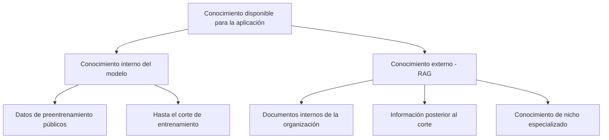

# Módulo 3 — Context Engineering

# Capítulo 06 — RAG (Retrieval-Augmented Generation) como componente del Context Engineering

## Sección 02 — Limitaciones del conocimiento interno del modelo

> *"El modelo sabe mucho. Pero lo que sabe dejó de ser verdad en algún momento entre su entrenamiento y tu consulta."*

---

## Objetivos de aprendizaje

- Comprender la naturaleza del conocimiento interno de un modelo de lenguaje y sus límites inherentes.
- Analizar el problema del corte de entrenamiento y sus consecuencias en aplicaciones reales.
- Evaluar el costo económico y operativo de actualizar el conocimiento vía reentrenamiento frente a la alternativa de actualizar un índice externo.
- Identificar los tipos de conocimiento que RAG cubre mejor que cualquier otra estrategia.

---

## El conocimiento como instantánea

Un modelo de lenguaje de gran escala aprende durante el preentrenamiento. Ese proceso consume meses y recursos computacionales significativos. Su resultado es un modelo con miles de millones de parámetros que codifican, de manera distribuida e implícita, patrones extraídos de una fracción enorme del texto disponible hasta cierta fecha.

Ese "hasta cierta fecha" es el corte de entrenamiento, también llamado knowledge cutoff. A partir de ese momento, el conocimiento del modelo queda congelado. No porque el modelo haya dejado de funcionar, sino porque el proceso que lo habría actualizado —el preentrenamiento con nuevos datos— no volvió a ejecutarse.

Para comprender la dimensión del problema, consideremos lo que sucede en doce meses cualquiera en un dominio activo: nuevas regulaciones entran en vigor, organizaciones cambian de nombre o de estructura, tecnologías emerge o quedan obsoletas, pronunciamientos judiciales reinterpretan marcos legales, precios cambian, líderes de área se reemplazan, productos se descontinúan. Un modelo entrenado antes de esos cambios no sabe que ocurrieron. Si se le pregunta sobre ellos, puede alucinarse una respuesta plausible basada en lo que sí conoce.

---

## Las tres clases de conocimiento que el modelo no tiene

Para diseñar sistemas de recuperación, conviene distinguir tres clases de conocimiento que ningún modelo de lenguaje puede tener en su estado base:

**Conocimiento temporal:** Cualquier información generada después del corte de entrenamiento. Esto incluye desde noticias recientes hasta actualizaciones de versiones de software, pasando por cambios regulatorios o resultados de investigaciones publicadas en el último año.

**Conocimiento privado:** Documentos internos de la organización —políticas, procedimientos, contratos, manuales técnicos, registros de clientes— que por definición no formaron parte de los datos de preentrenamiento porque no son públicos. Un modelo nunca puede conocer el organigrama de una empresa, las tarifas internas de un contrato bilateral o los estándares específicos de un sistema propietario.

**Conocimiento de nicho:** Información altamente especializada que sí es pública pero que está subrepresentada en los datos de preentrenamiento. Normativas sectoriales obscuras, literatura técnica en idiomas de menor difusión, estándares industriales publicados por organismos de baja visibilidad. El modelo puede tener nociones sobre el tema, pero no la profundidad que una aplicación especializada requiere.

---

## El costo de actualizar el modelo

La respuesta intuitiva al problema del conocimiento desactualizado es: "actualizar el modelo". En la práctica, esta respuesta tiene un costo que la hace impracticable para la mayoría de las aplicaciones.

El preentrenamiento de un modelo de lenguaje de gran escala requiere clústeres de GPUs de alta memoria durante semanas o meses, con costos que en la escala de los modelos modernos pueden superar el millón de dólares. Los equipos de ingeniería que desarrollan modelos propietarios —GPT, Claude, Gemini, Llama— tienen ciclos de actualización que se miden en meses, no en días.

El fine-tuning es una alternativa más liviana: en lugar de reentrenar desde cero, se ajustan los pesos del modelo con un conjunto de datos más pequeño y específico. Pero el fine-tuning también tiene limitaciones frente al problema del conocimiento dinámico:

- El modelo ajustado sabe lo que aprendió durante el fine-tuning. Cuando esa información cambia, el proceso debe repetirse.
- El fine-tuning no produce trazabilidad: el modelo no puede señalar qué dato específico respaldó una afirmación concreta.
- Para datos que se actualizan con frecuencia —normativas que cambian cada mes, tarifas que cambian cada semana, inventario que cambia en tiempo real— el ciclo de fine-tuning es insostenible.

| Dimensión | Reentrenamiento | Fine-tuning | RAG |
|---|---|---|---|
| Costo inicial | Muy alto | Moderado | Bajo-Moderado |
| Latencia de actualización | Semanas-Meses | Días-Semanas | Minutos-Horas |
| Trazabilidad de respuestas | Nula | Nula | Alta |
| Adecuado para datos muy dinámicos | No | No | Sí |
| Adecuado para comportamiento general | Sí | Sí | No |
| Riesgo de catastrophic forgetting | Alto | Moderado | Nulo |

El concepto de *catastrophic forgetting* merece una nota específica. Cuando un modelo se ajusta con nuevos datos, puede perder parte del conocimiento que tenía antes. Este fenómeno, conocido como olvido catastrófico, es una limitación estructural de los modelos basados en redes neuronales. Al actualizar un índice de RAG, no existe este riesgo: el modelo permanece intacto.

---

## El índice como alternativa al reentrenamiento

La lógica de RAG parte de una observación simple: si el conocimiento externo puede organizarse en un repositorio recuperable, no necesita estar en los parámetros del modelo. El modelo puede funcionar como un razonador genérico que opera sobre el conocimiento que el sistema le entrega en cada consulta.

Esta separación tiene consecuencias arquitectónicas relevantes:

**Actualización desacoplada.** El índice puede actualizarse en producción sin detener el modelo. Un cambio en la normativa tributaria puede reflejarse en el sistema en el tiempo que tarda en indexarse el nuevo documento, no en el tiempo que tarda en ajustarse el modelo.

**Trazabilidad de las fuentes.** Cuando el modelo genera una respuesta basada en contexto recuperado, el sistema puede registrar qué fragmentos de qué documentos alimentaron esa respuesta. En dominios regulados —finanzas, salud, derecho— esta trazabilidad puede ser un requisito no negociable.

**Separación de dominios.** El mismo modelo base puede servir a múltiples dominios con distintos índices. Un modelo genérico conectado a un índice de documentos legales se comporta como un asistente legal. Conectado a un índice de manuales técnicos, como un asistente de soporte. El modelo no cambia; el conocimiento disponible sí.

---

## Cuándo el modelo sí es suficiente

RAG no es siempre la solución correcta. Hay consultas que el modelo responde perfectamente desde su conocimiento interno: preguntas sobre conceptos generales, razonamiento lógico, redacción, traducción, análisis de texto proporcionado por el usuario. Para estas tareas, agregar un sistema de recuperación introduce latencia y complejidad sin beneficio.

La pregunta de diseño correcta es: ¿la respuesta a esta consulta depende de información que el modelo podría no tener o que podría estar desactualizada? Si la respuesta es sí, RAG es candidato. Si la respuesta es no, no es necesario.

---

## Nota del Arquitecto

> El error más común al decidir si usar RAG no es técnico: es estratégico. Los equipos tienden a indexar todo lo que tienen disponible y a conectarlo al modelo sin evaluar si esa información mejora o degrada las respuestas. Un índice con documentos obsoletos, mal segmentados o irrelevantes puede ser peor que no tener RAG: introduce ruido en el contexto y guía al modelo hacia afirmaciones incorrectas con aparente respaldo documental. La calidad del índice importa más que su tamaño.

---

## Ideas clave

- El conocimiento interno del modelo es estático: queda congelado en la fecha de corte del entrenamiento.
- Hay tres clases de conocimiento que el modelo no puede tener: temporal, privado y de nicho.
- Actualizar el conocimiento vía reentrenamiento o fine-tuning es costoso, lento y no produce trazabilidad.
- RAG desacopla el conocimiento del sistema del conocimiento del modelo, permitiendo actualizar uno sin modificar el otro.
- RAG no es siempre la solución correcta: conviene cuando la respuesta depende de información externa o desactualizada.

---

## Transición hacia la siguiente sección

Ahora que entendemos el problema que RAG resuelve, podemos estudiar cómo lo resuelve. La siguiente sección introduce la arquitectura completa de un sistema RAG: sus fases, sus componentes y el flujo de información que los conecta.

---

> *"Un arquitecto no memoriza respuestas. Comprende problemas para poder diseñar soluciones."*
