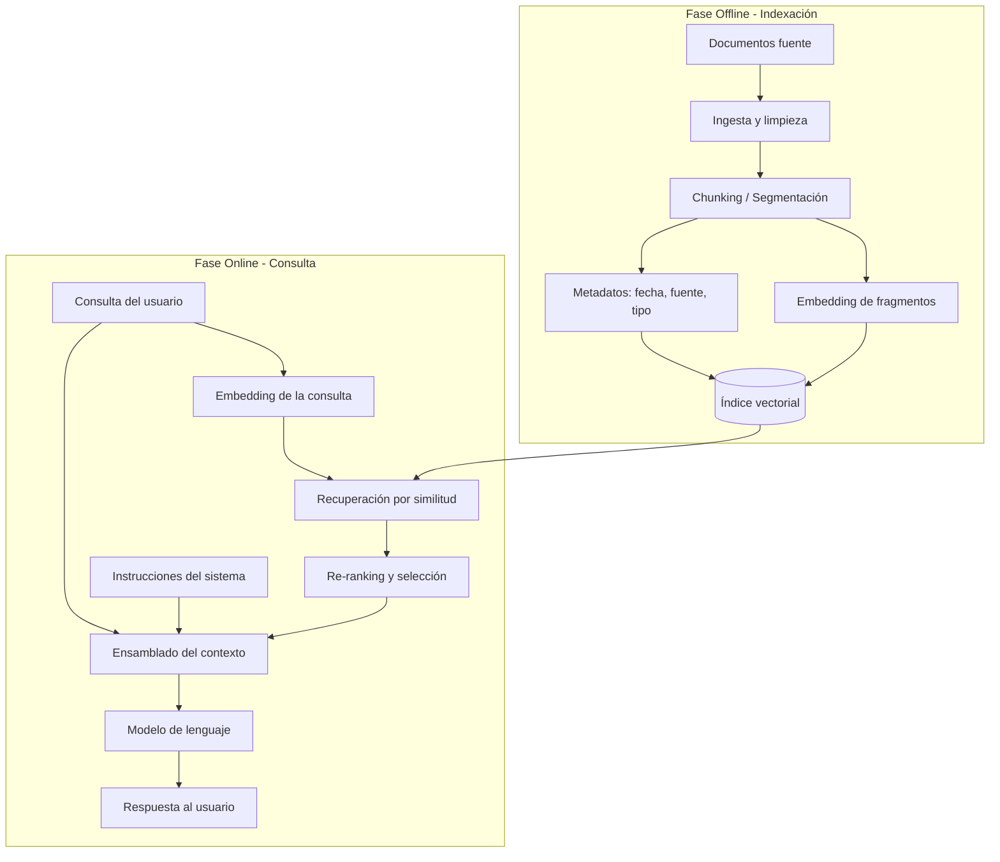

# Módulo 3 — Context Engineering

# Capítulo 06 — RAG (Retrieval-Augmented Generation) como componente del Context Engineering

## Sección 03 — Arquitectura de un sistema RAG

> *"RAG no es una función. Es un pipeline con dos fases distintas, cada una con sus propias decisiones de diseño."*

---

## Objetivos de aprendizaje

- Comprender la arquitectura completa de un sistema RAG como composición de componentes con responsabilidades diferenciadas.
- Distinguir la fase offline (indexación) de la fase online (recuperación e inferencia).
- Identificar cada paso del pipeline y las decisiones técnicas que determina.
- Entender cómo el pipeline RAG se integra con la ventana de contexto del modelo.

---

## Dos fases, no una

El error más común al pensar en RAG es imaginarlo como una operación única: "el sistema busca en los documentos y el modelo responde". En realidad, RAG es un pipeline con dos fases que ocurren en momentos y contextos completamente diferentes.

La **fase offline** —también llamada fase de indexación— ocurre antes de que cualquier usuario haga cualquier consulta. En esta fase el sistema ingiere documentos, los segmenta, convierte cada segmento en una representación matemática y lo almacena en una base vectorial. Esta fase puede tardar segundos o días, dependiendo del volumen de documentos. Su resultado es un índice disponible para consulta.

La **fase online** —también llamada fase de recuperación e inferencia— ocurre en tiempo real, cuando el usuario hace una consulta. En esta fase el sistema convierte la consulta en una representación matemática, busca en el índice los fragmentos más similares, reordena los resultados si corresponde, ensambla el contexto aumentado y lo entrega al modelo para que genere la respuesta.

Entender esta distinción es importante para el diseño: los errores de indexación afectan a todas las consultas futuras. Un documento mal segmentado durante la fase offline generará recuperaciones deficientes durante meses hasta que se detecte y corrija el problema.

---

## El pipeline completo

---

## Fase offline: los pasos de indexación

### 1. Ingesta y limpieza

El primer paso es recolectar los documentos que formarán la base de conocimiento. Esta operación parece trivial pero presenta decisiones no triviales: ¿qué documentos se incluyen?, ¿cómo se manejan los formatos (PDF, Word, HTML, markdown)?, ¿se conservan las tablas y las imágenes o solo el texto?, ¿cómo se tratan los encabezados y los pies de página?

La limpieza incluye eliminar contenido redundante, artefactos de formato y secciones sin valor informativo (como páginas de créditos o disclaimers estándar repetidos en todos los documentos).

### 2. Chunking / Segmentación

Esta es la decisión más crítica de toda la fase offline y la que más impacto tiene sobre la calidad del retrieval. El modelo de embedding tiene una longitud máxima de texto que puede procesar. Los documentos suelen ser más largos. El chunking divide cada documento en fragmentos que quepan dentro de esa ventana.

Los tres enfoques principales son:

**Chunking por tamaño fijo.** Se corta cada N tokens o caracteres, independientemente de la estructura del texto. Es sencillo de implementar pero puede romper ideas en medio de una oración, degradando la coherencia del fragmento.

**Chunking semántico.** Se corta en límites naturales del texto: párrafos, secciones, artículos. Produce fragmentos más coherentes pero de tamaño variable, lo que puede complicar la estimación del uso de la ventana de contexto.

**Chunking jerárquico.** Se producen dos niveles de índice: uno con fragmentos pequeños (para recuperación precisa) y otro con fragmentos grandes (para contexto ampliado). El retrieval usa los fragmentos pequeños, pero al momento de insertar en el contexto se pueden recuperar los fragmentos grandes circundantes para añadir coherencia.

El solapamiento (overlap) es una variante que agrega N tokens del final de un fragmento al comienzo del siguiente, reduciendo el riesgo de que una idea quede partida entre dos fragmentos consecutivos.

### 3. Embedding de fragmentos

Cada fragmento se convierte en un vector numérico usando un modelo de embedding. Este vector captura el "significado" del fragmento en un espacio matemático de alta dimensión. Fragmentos con significados similares producen vectores cercanos en ese espacio.

La elección del modelo de embedding tiene consecuencias directas sobre la calidad del retrieval. Los modelos especializados en un idioma o dominio suelen superar a los modelos generales para ese dominio.

### 4. Almacenamiento en el índice vectorial

Los vectores —junto con los metadatos asociados (fuente, fecha, sección, tipo de documento)— se almacenan en una base vectorial que permite búsquedas por similitud eficientes.

---

## Fase online: los pasos de recuperación

### 1. Embedding de la consulta

Cuando el usuario formula una consulta, esa consulta pasa por el mismo modelo de embedding que procesó los documentos. Este paso produce un vector que representa el significado de la consulta en el mismo espacio vectorial que los fragmentos del índice.

Es crítico que la consulta y los documentos sean procesados por el mismo modelo de embedding, o por modelos diseñados para ser compatibles. Si no lo son, los vectores no son comparables.

### 2. Recuperación por similitud

El sistema busca en el índice los fragmentos cuyo vector sea más cercano al vector de la consulta. La "cercanía" se mide con funciones de similitud como la similitud coseno o el producto punto. El resultado es un conjunto de candidatos ordenados por relevancia estimada.

La cantidad de candidatos recuperados —el parámetro k en "top-k retrieval"— es una decisión de diseño que equilibra calidad con costo: más candidatos aumentan la probabilidad de incluir el fragmento correcto, pero también la cantidad de ruido que el modelo debe procesar.

### 3. Re-ranking y selección

Los candidatos recuperados por similitud vectorial no son necesariamente los mejores candidatos para la consulta. La similitud semántica es una buena señal inicial, pero puede mejorarse con criterios adicionales. Esta etapa se desarrolla en detalle en la Sección 07.

### 4. Ensamblado del contexto

Los fragmentos seleccionados, la consulta del usuario y las instrucciones del sistema se combinan en el prompt que el modelo recibirá. El diseño de este ensamblado determina cómo el modelo "verá" la información recuperada: si los fragmentos van antes o después de la consulta, si se etiquetan con su fuente, si se ordenan por relevancia descendente.

### 5. Inferencia y respuesta

El modelo genera la respuesta basándose en el contexto ensamblado. Dado que ese contexto incluye fragmentos relevantes del índice, el modelo puede responder sobre información que no tenía en su conocimiento interno, citar fuentes, comparar documentos y razonar sobre datos actualizados.

---

## La ventana de contexto como restricción de diseño

El contexto que el sistema entrega al modelo tiene un límite: la ventana de contexto del modelo. Esta restricción determina cuántos fragmentos se pueden incluir en cada inferencia. Si el sistema recupera fragmentos demasiado largos o demasiado numerosos, el contexto superará el límite y el sistema deberá truncar, seleccionar o comprimir.

El diseño del chunking y la política de selección de fragmentos deben anticipar este límite. Una práctica común es estimar el presupuesto de tokens disponible en la ventana —descontando las instrucciones del sistema y la consulta del usuario— y seleccionar los fragmentos de mayor relevancia hasta completar ese presupuesto.

---

## Ideas clave

- RAG tiene dos fases bien diferenciadas: indexación (offline) y recuperación (online).
- El chunking es la decisión más crítica de la fase offline: define la granularidad de la recuperación.
- La calidad del embedding determina qué tan bien el sistema puede relacionar consultas con fragmentos relevantes.
- El contexto ensamblado por RAG compite por espacio en la ventana de contexto junto con las instrucciones del sistema y el historial conversacional.
- Los errores en la fase offline afectan a todas las consultas futuras: la indexación debe tratarse con el mismo rigor que el diseño del modelo de inferencia.

---

## Transición hacia la siguiente sección

El paso más técnico del pipeline RAG es la transformación de texto en vectores numéricos: el embedding. Sin comprender cómo funciona esa transformación, no es posible tomar decisiones informadas sobre la calidad del retrieval. La siguiente sección introduce los embeddings como representación semántica y explica qué hace que dos vectores sean "cercanos" en el espacio que importa.

---

> *"Un arquitecto no memoriza respuestas. Comprende problemas para poder diseñar soluciones."*
