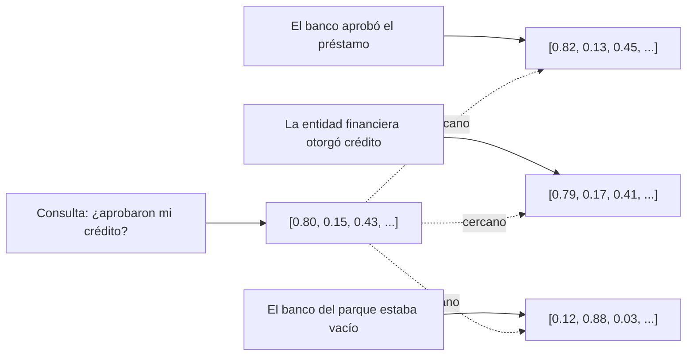

# Módulo 3 — Context Engineering

# Capítulo 06 — RAG (Retrieval-Augmented Generation) como componente del Context Engineering

## Sección 04 — Embeddings y representación semántica

> *"Un embedding no representa palabras. Representa posiciones en un espacio donde el significado tiene geometría."*

---

## Objetivos de aprendizaje

- Comprender qué es un embedding y cómo convierte texto en una representación matemática.
- Interpretar la noción de similitud semántica como cercanía geométrica en un espacio vectorial.
- Identificar las propiedades que hacen a un modelo de embedding adecuado para RAG.
- Evaluar criterios de selección de modelos de embedding para aplicaciones específicas.

---

## El problema de representar significado

Para que un sistema pueda comparar documentos y encontrar los más relevantes para una consulta, necesita representar tanto los documentos como la consulta en un formato comparable. Las computadoras no comprenden texto de la misma manera que los humanos: operan sobre números.

La representación más directa de texto en números es la representación léxica: convertir cada palabra en un identificador numérico. Pero esta representación ignora el significado. Las palabras "auto" y "vehículo" son completamente distintas en la representación léxica, aunque sean sinónimos en la mayoría de los contextos. Las palabras "banco" (institución financiera) y "banco" (asiento) son idénticas en la representación léxica, aunque tengan significados completamente distintos.

Los embeddings resuelven este problema. Un embedding es una representación densa de texto como un vector de números reales —típicamente entre 256 y 4096 dimensiones— donde las posiciones no son arbitrarias: textos con significados similares producen vectores cercanos en el espacio, y textos con significados distintos producen vectores alejados.

---

## El espacio semántico

La idea central es que el significado puede representarse como posición en un espacio matemático. Ese espacio tiene muchas dimensiones —cientos o miles— y cada dimensión captura algún aspecto del significado, aunque esas dimensiones no sean interpretables individualmente de manera directa.

Lo que sí es interpretable es la geometría del espacio. Consideremos tres textos:

- "El banco aprobó el préstamo."
- "La entidad financiera otorgó crédito al solicitante."
- "El banco del parque estaba vacío."

En un espacio semántico bien construido, los vectores de los dos primeros textos estarán cerca entre sí —tienen el mismo significado sobre instituciones financieras— y ambos estarán lejos del tercero, que habla de un objeto de mobiliario urbano.

Esta propiedad de la geometría semántica es lo que hace posible el retrieval por similitud: para encontrar fragmentos relevantes a una consulta, basta encontrar los vectores más cercanos al vector de la consulta.

---

## Cómo se producen los embeddings

Los modelos de embedding son redes neuronales entrenadas específicamente para producir esta representación geométrica del significado. No son los mismos modelos que generan texto: son modelos cuya salida no es texto sino un vector numérico.

El entrenamiento de un modelo de embedding se basa en pares de textos con alguna relación de similitud o disimilitud conocida. El modelo aprende a producir vectores cercanos para textos similares y vectores alejados para textos disímiles. Los datos de entrenamiento pueden provenir de pares pregunta-respuesta, de documentos con sus resúmenes, de oraciones consecutivas en el mismo documento, o de pares marcados manualmente.

El resultado es un modelo que, dado cualquier texto como entrada, produce un vector que "posiciona" ese texto en el espacio semántico aprendido.

---

## Propiedades prácticas de los embeddings

**Dimensionalidad.** Los modelos de embedding producen vectores de dimensión fija. Modelos más simples trabajan con 256 o 384 dimensiones. Modelos más avanzados pueden llegar a 3072. Mayor dimensionalidad suele implicar mayor capacidad para capturar matices semánticos, pero también mayor costo de almacenamiento y de cómputo durante la búsqueda.

**Longitud máxima de entrada.** Cada modelo de embedding tiene una longitud máxima de texto que puede procesar en una sola operación, medida en tokens. Esta limitación es la razón técnica detrás del chunking: si un documento supera la longitud máxima del modelo de embedding, no puede ser procesado como un todo.

**Multilingüismo.** Algunos modelos de embedding han sido entrenados en múltiples idiomas y producen vectores comparables entre idiomas distintos. Esto permite, por ejemplo, recuperar un documento en español usando una consulta en inglés. Los modelos monolingües suelen superar a los multilingües en el idioma para el que fueron optimizados, pero son inflexibles ante mezclas de idiomas.

**Dominio específico.** Un modelo de embedding entrenado con textos generales puede no capturar bien el vocabulario técnico de dominios especializados. Un modelo entrenado con textos legales, médicos o financieros suele producir representaciones más útiles para retrieval en esos dominios. La selección del modelo de embedding debe considerar el dominio del índice que se construirá.

---

## Similitud como distancia

Una vez que documentos y consultas están representados como vectores, la similitud entre ellos se mide como una función de la distancia o el ángulo entre esos vectores.

La métrica más usada en RAG es la **similitud coseno**, que mide el ángulo entre dos vectores independientemente de su magnitud. Dos vectores que apuntan en la misma dirección tienen similitud coseno de 1.0 (máxima similitud). Dos vectores perpendiculares tienen similitud coseno de 0.0. Dos vectores opuestos tienen similitud coseno de -1.0.

La similitud coseno es adecuada cuando los vectores están normalizados. Cuando no lo están, el **producto punto** (dot product) tiene en cuenta tanto la dirección como la magnitud, lo que puede ser apropiado en algunos contextos pero introduce sesgos cuando los fragmentos tienen longitudes muy diferentes.

La **distancia L2** (distancia euclidiana) también se usa, aunque es menos frecuente en RAG puro y más común cuando los vectores no están normalizados.

---

## Consideraciones para la selección del modelo de embedding

La elección del modelo de embedding para una aplicación RAG no es trivial. Los criterios relevantes son:

| Criterio | Preguntas clave |
|---|---|
| Idioma | ¿El corpus es en español, inglés, multilingüe? |
| Dominio | ¿Es texto general, legal, médico, técnico? |
| Longitud de los documentos | ¿Los fragmentos son párrafos cortos o secciones largas? |
| Presupuesto computacional | ¿Cuánto cuesta producir un embedding por fragmento? |
| Latencia requerida | ¿El embedding se produce en tiempo real o en batch? |
| Privacidad | ¿Los textos pueden enviarse a un servicio externo (API) o deben procesarse localmente? |

Para aplicaciones en español, los modelos basados en arquitecturas multilinguales como mE5 o LaBSE suelen ofrecer resultados sólidos. Para inglés, los modelos de la familia text-embedding de OpenAI, los modelos de Cohere o los modelos de código abierto como all-MiniLM o BGE son opciones bien establecidas. Los benchmarks públicos como MTEB (Massive Text Embedding Benchmark) permiten comparar modelos en tareas de retrieval específicas.

---

## Nota del Arquitecto

> Muchos equipos seleccionan el modelo de embedding por popularidad o por disponibilidad en la plataforma que ya usan, sin evaluar si ese modelo es adecuado para el idioma y el dominio del corpus. El error tiene consecuencias invisibles en la etapa de diseño y costosas en producción: el sistema parece funcionar, pero el retrieval está sistemáticamente recuperando fragmentos subóptimos. La forma de detectarlo es construir un conjunto de evaluación con consultas representativas y medir precision@5 con distintos modelos antes de comprometerse con uno.

---

## Ideas clave

- Un embedding convierte texto en un vector numérico donde la posición codifica el significado.
- Textos con significados similares producen vectores cercanos; textos con significados distintos producen vectores alejados.
- La similitud semántica se mide como distancia geométrica entre vectores, típicamente usando similitud coseno.
- La elección del modelo de embedding determina la calidad del retrieval y debe considerar idioma, dominio y restricciones operativas.
- La longitud máxima del modelo de embedding es la razón técnica que impone el chunking en la fase de indexación.

---

## Transición hacia la siguiente sección

Los embeddings resuelven el problema de la representación. El siguiente problema es el almacenamiento y la búsqueda eficiente: ¿cómo encontrar los vectores más cercanos a una consulta dentro de un índice que puede tener millones de fragmentos? La siguiente sección introduce las bases vectoriales y los algoritmos que hacen posible esa búsqueda a escala.

---

> *"Un arquitecto no memoriza respuestas. Comprende problemas para poder diseñar soluciones."*
