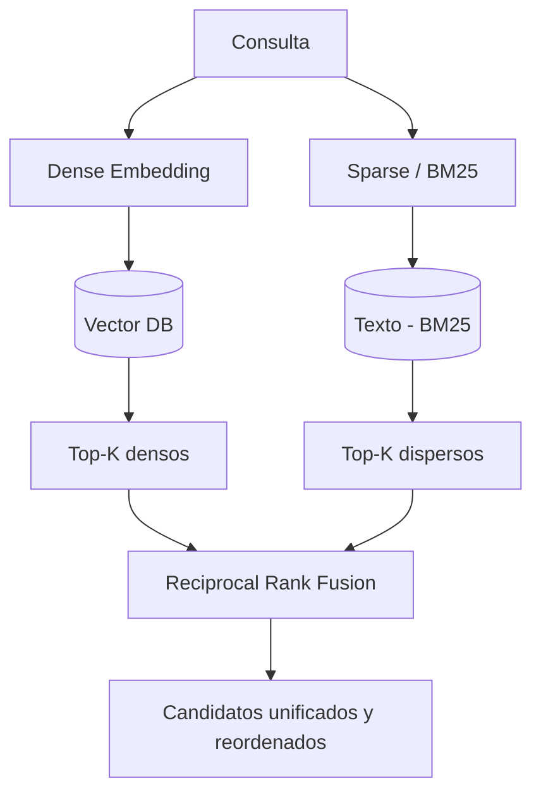

# Módulo 3 — Context Engineering

# Capítulo 06 — RAG (Retrieval-Augmented Generation) como componente del Context Engineering

## Sección 05 — Bases vectoriales y búsqueda por similitud

> *"Una base vectorial no almacena documentos. Almacena significados organizados para ser recuperados por proximidad."*

---

## Objetivos de aprendizaje

- Comprender qué es una base vectorial y en qué se diferencia de una base de datos tradicional.
- Entender cómo los algoritmos de búsqueda aproximada permiten escalar el retrieval a millones de fragmentos.
- Conocer las principales opciones de infraestructura de bases vectoriales y sus características.
- Evaluar criterios de selección de base vectorial según el contexto de la aplicación.

---

## Por qué las bases de datos relacionales no resuelven este problema

El retrieval en RAG requiere encontrar, dentro de un índice de fragmentos, los que más se parecen —semánticamente— a una consulta. Esa operación de "encontrar los más parecidos" no existe en las bases de datos relacionales tradicionales.

Una base de datos relacional busca registros que coincidan exactamente con un valor o que satisfagan una condición booleana. Puede encontrar todos los contratos de un cliente específico, o todos los documentos del departamento legal con fecha posterior al 1 de enero, o todos los artículos que contienen la palabra "riesgo". Lo que no puede hacer es encontrar los documentos cuyo significado sea más cercano al de una frase que el usuario acaba de escribir, especialmente si esa frase no usa exactamente las mismas palabras que los documentos.

Una base vectorial está diseñada para exactamente ese tipo de búsqueda. Almacena vectores y provee operaciones de consulta que retornan los vectores más cercanos al vector de consulta, según la métrica de similitud configurada.

---

## La búsqueda exacta y sus límites

La forma más directa de encontrar el vector más cercano a una consulta es calcular la distancia entre el vector de consulta y cada uno de los vectores almacenados, y retornar los k más cercanos. Esta operación se llama búsqueda de vecinos más cercanos exacta (kNN exacto, por k-Nearest Neighbors).

El problema es la escala. Si el índice contiene un millón de fragmentos y cada vector tiene 768 dimensiones, calcular un millón de distancias para cada consulta es computacionalmente costoso. A medida que el índice crece, la latencia crece linealmente. Para índices de decenas de millones de fragmentos, la búsqueda exacta puede ser impracticable en tiempo real.

Las bases vectoriales modernas resuelven este problema con algoritmos de búsqueda aproximada.

---

## Búsqueda aproximada: el equilibrio entre velocidad y precisión

Los algoritmos de búsqueda aproximada de vecinos más cercanos (ANN, por Approximate Nearest Neighbors) organizan los vectores durante la indexación de una manera que permite recuperar los k vecinos más probables sin comparar contra cada elemento del índice.

La "aproximación" implica un trade-off: la búsqueda puede no retornar el vecino exactamente más cercano en todos los casos, sino uno muy cercano. Para RAG, este compromiso es habitualmente aceptable: la diferencia entre el fragmento más relevante y el segundo más relevante suele ser menor que el beneficio de poder responder en milisegundos en lugar de segundos.

Los dos algoritmos más difundidos en la práctica son:

**HNSW (Hierarchical Navigable Small World).** Organiza los vectores en un grafo jerárquico donde cada nodo está conectado a sus vecinos más cercanos en distintas escalas de resolución. La búsqueda navega desde el nivel más alto del grafo —con pocas conexiones globales— hasta el más bajo —con muchas conexiones locales— convergiendo rápidamente hacia los vecinos más cercanos al vector de consulta. HNSW ofrece alta velocidad y alta precisión, con el costo de mayor consumo de memoria durante la indexación.

**IVF (Inverted File Index).** Agrupa los vectores en clusters usando un algoritmo de cuantización como k-means. Cada cluster tiene un centroide. La búsqueda identifica primero los clusters más cercanos al vector de consulta y examina únicamente los vectores dentro de esos clusters. IVF consume menos memoria que HNSW pero puede ser menos preciso si el número de clusters examinados es bajo.

---

## Filtrado por metadatos

Las bases vectoriales modernas no solo almacenan vectores: almacenan metadatos asociados a cada fragmento (fuente, fecha, autor, tipo de documento, nivel de acceso) y permiten combinar la búsqueda por similitud con filtros sobre esos metadatos.

Este filtrado es crítico en aplicaciones empresariales. Un sistema RAG que responde consultas de empleados de distintas divisiones no debería retornar fragmentos de documentos confidenciales a empleados sin los permisos correspondientes. Un sistema que maneja documentos con vigencia temporal no debería recuperar versiones obsoletas de una normativa.

El filtrado puede aplicarse antes de la búsqueda vectorial (pre-filtrado) o después (post-filtrado). El pre-filtrado reduce el conjunto de candidatos antes de calcular similitudes, lo que puede mejorar la eficiencia pero también puede reducir el recall si el filtro es muy restrictivo. El post-filtrado aplica el filtro sobre los k candidatos recuperados, lo que preserva el recall pero puede retornar menos de k resultados si muchos candidatos son filtrados.

---

## Opciones de infraestructura

El ecosistema de bases vectoriales creció significativamente desde 2022. Las opciones más establecidas al momento de redactar este capítulo incluyen:

| Sistema | Tipo | Características destacadas |
|---|---|---|
| pgvector | Extensión de PostgreSQL | Integración con ecosistema SQL, HNSW e IVF, adecuado para volúmenes moderados |
| Chroma | Base vectorial embebida | Ideal para prototipos y aplicaciones de un solo servicio, interfaz simple |
| Weaviate | Base vectorial distribuida | Búsqueda híbrida integrada, módulos para embedding automático |
| Qdrant | Base vectorial distribuida | Alto rendimiento, filtrado avanzado, soporte para búsqueda híbrida |
| Pinecone | SaaS administrado | Sin infraestructura a gestionar, latencia baja, costo variable por uso |
| Milvus | Base vectorial distribuida | Alta escala, soporte para múltiples índices simultáneos |
| Redis con RediSearch | Redis con módulo vectorial | Útil cuando Redis ya está en la arquitectura, latencia muy baja |

La selección de la base vectorial depende de factores como el volumen de fragmentos, los requisitos de latencia, la disponibilidad de equipo para gestionar infraestructura, los requisitos de privacidad (local vs. SaaS) y la integración con el resto del stack tecnológico.

---

## Búsqueda híbrida: combinando dense y sparse

La búsqueda vectorial pura (dense retrieval) basa la similitud en el significado global del texto. Pero a veces el retrieval precisa también de coincidencia exacta de términos: nombres propios, identificadores, siglas, números de artículo. Una búsqueda semántica puede no recuperar el fragmento correcto si la consulta incluye un número de contrato específico que el modelo de embedding no representa con suficiente precisión.

La búsqueda híbrida combina retrieval denso (vectorial) con retrieval disperso (basado en términos, típicamente BM25). BM25 es un algoritmo clásico de recuperación de información que pondera la frecuencia de los términos de consulta en cada documento, ajustada por la longitud del documento. Es efectivo para recuperar documentos que contienen exactamente los términos buscados.

La combinación se realiza generalmente mediante una función de fusión de rankings como Reciprocal Rank Fusion (RRF), que combina las listas de resultados de ambos sistemas sin necesidad de conocer las puntuaciones absolutas de ninguno.

La búsqueda híbrida suele superar a cualquiera de los dos enfoques individuales en términos de recall. Weaviate y Qdrant incluyen soporte nativo para búsqueda híbrida. En otros sistemas, puede implementarse combinando dos pipelines de recuperación.

---

## Ideas clave

- Las bases vectoriales están diseñadas para recuperar documentos por similitud semántica, no por coincidencia exacta de términos.
- Los algoritmos de búsqueda aproximada (HNSW, IVF) permiten escalar el retrieval a millones de fragmentos manteniendo latencias bajas.
- El filtrado por metadatos es esencial para implementar control de acceso y relevancia temporal en aplicaciones empresariales.
- La búsqueda híbrida combina retrieval denso (vectorial) y disperso (BM25) para mejorar el recall en consultas que incluyen términos específicos.
- La elección de la base vectorial debe considerar volumen, latencia, privacidad y capacidad operativa del equipo.

---

## Transición hacia la siguiente sección

Con los embeddings y la base vectorial establecidos, el sistema puede recuperar candidatos. Pero la lista de candidatos que retorna la búsqueda vectorial no siempre es la lista óptima para incluir en el contexto del modelo. La siguiente sección examina las estrategias de recuperación avanzadas que mejoran la calidad de esa primera selección.

---

> *"Un arquitecto no memoriza respuestas. Comprende problemas para poder diseñar soluciones."*
