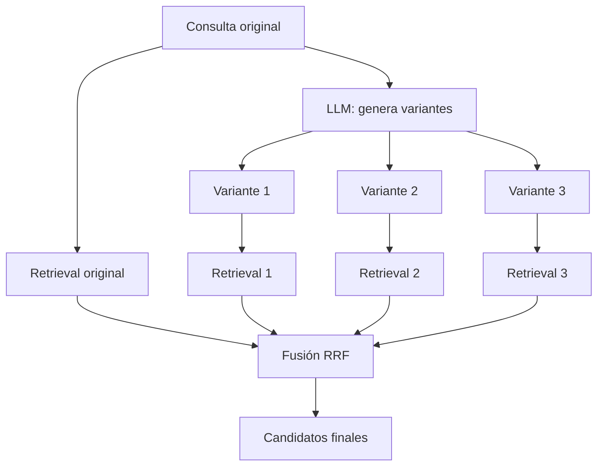

# Módulo 3 — Context Engineering

# Capítulo 06 — RAG (Retrieval-Augmented Generation) como componente del Context Engineering

## Sección 06 — Estrategias de recuperación

> *"Recuperar los k fragmentos más cercanos es el punto de partida, no la solución final. La estrategia de recuperación define qué tan lejos llega el sistema de ese punto de partida."*

---

## Objetivos de aprendizaje

- Comprender las limitaciones del retrieval naive por similitud vectorial y las situaciones en que falla.
- Analizar estrategias de recuperación avanzadas: búsqueda con expansión de consulta, HyDE, MMR y recuperación multipasos.
- Evaluar cuándo aplicar cada estrategia en función del tipo de consulta y del corpus.
- Diseñar una política de recuperación que equilibre recall, precisión y costo computacional.

---

## El retrieval naive y sus límites

La estrategia de recuperación más directa —calcular el embedding de la consulta y retornar los k fragmentos más cercanos— funciona sorprendentemente bien para consultas simples, directas y bien formuladas sobre un corpus coherente. Pero falla en situaciones habituales en aplicaciones reales.

**Consultas vagas o cortas.** "¿Cómo funciona el proceso?" es una consulta válida en muchos contextos, pero su vector de embedding captura poco significado discriminante. El retrieval retorna fragmentos genéricos en lugar de los específicos que el usuario necesita.

**Consultas que usan vocabulario diferente al del corpus.** Si el usuario pregunta "¿cuándo vence el contrato con el proveedor de infraestructura?" y los documentos usan "fecha de expiración del acuerdo de servicios de nube", la similitud semántica puede ser insuficiente si el modelo de embedding no captura bien esas equivalencias en el dominio.

**Consultas con múltiples sub-preguntas.** "Dame los tres casos de uso más relevantes junto con sus costos estimados y tiempos de implementación" requiere recuperar información de distintas partes del corpus. Un único retrieval puede no cubrir todas las dimensiones.

**Necesidad de diversidad.** Si los k fragmentos más cercanos provienen todos del mismo documento o de la misma sección, el contexto puede ser redundante. El modelo recibe la misma información repetida en lugar de perspectivas complementarias.

---

## Expansión de consulta

La expansión de consulta es la estrategia que amplía o reformula la consulta original antes de ejecutar el retrieval, para aumentar la probabilidad de recuperar fragmentos relevantes.

Una forma simple de expansión usa el propio LLM: se le pide que reformule la consulta en tres o cinco variantes diferentes, cada una desde un ángulo distinto. Luego se ejecuta el retrieval con cada variante y se fusionan los resultados usando Reciprocal Rank Fusion.



Esta técnica es especialmente efectiva cuando el usuario no sabe exactamente qué términos usa el corpus, o cuando la consulta es ambigua y puede interpretarse de varias maneras legítimas.

El costo es mayor: se ejecutan N veces el embedding y el retrieval, y se hace una llamada adicional al LLM. Para aplicaciones donde la latencia es crítica, puede ser un factor limitante.

---

## HyDE: Hypothetical Document Embeddings

HyDE es una estrategia que aborda el problema de las consultas cortas o vagas de una manera diferente. En lugar de buscar directamente el embedding de la consulta en el índice, el sistema le pide al LLM que genere un documento hipotético que respondería a la consulta. Luego busca en el índice el fragmento más cercano a ese documento hipotético.

La lógica es que un documento hipotético tiene mayor longitud y vocabulario que una consulta corta, y por lo tanto su embedding captura más señal semántica. Si el LLM genera un párrafo sobre el tema de la consulta —aunque ese párrafo sea inventado y potencialmente incorrecto en los detalles— ese párrafo se parece más a los fragmentos reales del corpus que una consulta de cinco palabras.

```
Consulta: "¿Por qué falla el sistema en producción?"

Documento hipotético generado por LLM:
"Los sistemas distribuidos en producción pueden fallar por diversas causas:
agotamiento de recursos (memoria, CPU, conexiones de base de datos), latencia
de red excesiva entre servicios, timeouts mal configurados, o condiciones de
carrera en operaciones concurrentes. La monitorización proactiva mediante
métricas de health check y alertas por percentiles de latencia permite
detectar degradaciones antes de que se conviertan en fallos totales."

→ El embedding de este párrafo recupera fragmentos más específicos del corpus
  que el embedding de la consulta original.
```

HyDE mejora el recall para consultas vagas pero introduce un riesgo: si el documento hipotético contiene afirmaciones incorrectas sobre el dominio, puede sesgar el retrieval hacia fragmentos que no son los más relevantes. Su efectividad depende de la calidad del LLM para generar documentos coherentes con el dominio.

---

## Maximum Marginal Relevance (MMR)

MMR es una estrategia de selección de fragmentos que combina relevancia con diversidad. En lugar de seleccionar los k fragmentos más similares a la consulta, selecciona los fragmentos que maximizan simultáneamente la similitud con la consulta y la diferencia entre sí.

El algoritmo es iterativo: en cada paso selecciona el fragmento que mejor equilibra ser relevante para la consulta y ser distinto de los fragmentos ya seleccionados. Un parámetro lambda controla el equilibrio entre relevancia y diversidad: con lambda = 1.0 se comporta como retrieval puro por similitud; con lambda = 0.0 maximiza la diversidad ignorando la relevancia.

MMR es especialmente útil cuando:
- El corpus tiene muchos fragmentos muy similares entre sí (por ejemplo, múltiples versiones del mismo documento).
- La consulta requiere perspectivas distintas para ser respondida bien.
- El presupuesto de contexto es limitado y se quiere maximizar la información útil por token.

---

## Recuperación multipasos (multi-hop retrieval)

Algunas consultas no pueden responderse con un único retrieval porque la información necesaria está distribuida en múltiples fragmentos no directamente relacionados entre sí. Para responder "¿cuál es el presupuesto del departamento que lidera el proyecto con mayor impacto en 2024?", el sistema necesita primero identificar el proyecto con mayor impacto, luego identificar el departamento que lo lidera, y finalmente recuperar el presupuesto de ese departamento. Cada paso requiere información del anterior.

La recuperación multipasos encadena varios ciclos de retrieval donde el resultado de cada ciclo informa la consulta del siguiente. Esto puede implementarse con un agente que orquesta la recuperación o con un pipeline que genera consultas intermedias basadas en los fragmentos recuperados en cada paso.

La complejidad y la latencia aumentan significativamente con cada salto. Para la mayoría de las aplicaciones empresariales, dos pasos son suficientes. Más de tres pasos suelen indicar que el problema debería resolverse con una estrategia de agentes, no con RAG puro.

---

## Consideraciones de diseño para la política de recuperación

La elección de la estrategia de recuperación no debe ser universal: debe ajustarse al tipo de consulta y al corpus.

| Escenario | Estrategia recomendada |
|---|---|
| Consultas directas sobre corpus coherente | Retrieval simple top-k |
| Consultas vagas o cortas | HyDE o expansión de consulta |
| Corpus con documentos similares entre sí | MMR |
| Consultas que mezclan términos exactos y semántica | Búsqueda híbrida (dense + BM25) |
| Consultas que requieren encadenar información | Multi-hop retrieval |
| Corpus muy grande con distribución desigual | IVF con expansión de consulta |

En aplicaciones reales, lo más común es combinar varias estrategias: búsqueda híbrida para el retrieval inicial, MMR para la selección de candidatos, y expansión de consulta para consultas que el sistema detecta como vagas.

---

## Nota del Arquitecto

> El retrieval naive falla silenciosamente. El sistema sigue respondiendo, pero responde basándose en fragmentos subóptimos. Esta es la razón por la que los equipos que no miden la calidad del retrieval independientemente de la calidad de la respuesta final pueden creer que su sistema RAG funciona bien durante semanas, hasta que un caso extremo expone el problema. Medir recall@5 y precision@5 sobre un conjunto de consultas conocidas antes de desplegar cualquier cambio en la estrategia de recuperación es una práctica no opcional.

---

## Ideas clave

- El retrieval naive por similitud vectorial es el punto de partida, no la solución final.
- La expansión de consulta y HyDE mejoran el retrieval para consultas cortas o ambiguas, a costo de latencia adicional.
- MMR balancea relevancia y diversidad, maximizando la información útil dentro del presupuesto de contexto.
- La búsqueda híbrida (dense + sparse) mejora el recall para consultas con términos específicos.
- La política de recuperación debe diseñarse para el tipo de consulta predominante en la aplicación, no para un escenario genérico.

---

## Transición hacia la siguiente sección

Las estrategias de recuperación mejoran el conjunto de candidatos. Pero incluso con buenos candidatos, el orden en que se presentan al modelo importa, y algunos candidatos que parecen relevantes pueden no serlo al analizar el contexto completo de la consulta. La siguiente sección introduce el re-ranking como la etapa que refina la selección final antes de ensamblar el contexto.

---

> *"Un arquitecto no memoriza respuestas. Comprende problemas para poder diseñar soluciones."*
