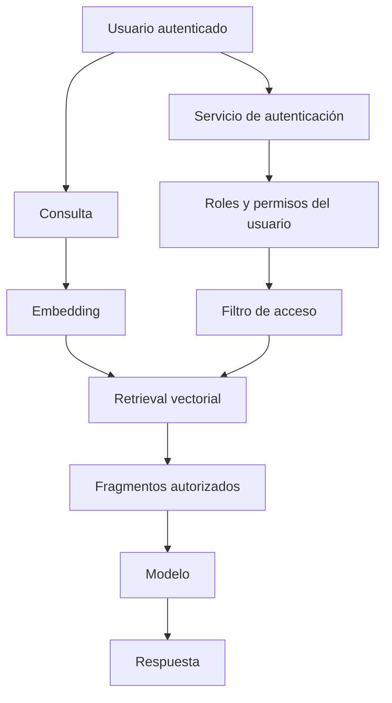
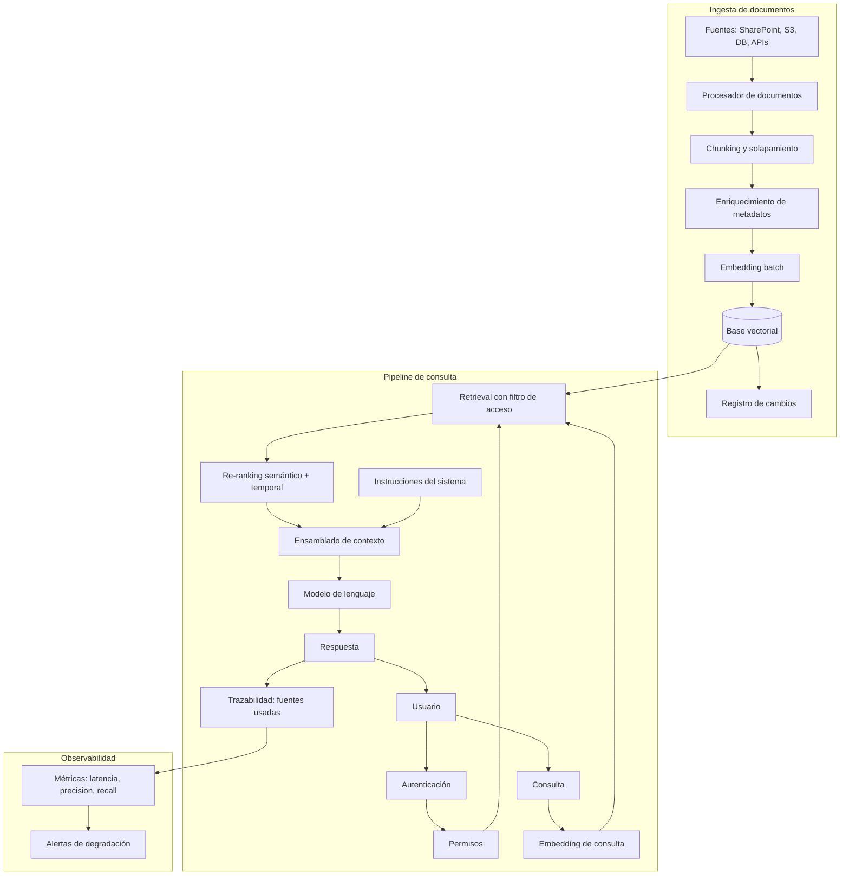

# Módulo 3 — Context Engineering

# Capítulo 06 — RAG (Retrieval-Augmented Generation) como componente del Context Engineering

## Sección 08 — Diseño de un pipeline RAG empresarial

> *"En producción, RAG no es recuperar tres fragmentos y pasarlos al modelo. Es un sistema con política de ingesta, gestión de acceso, indexación incremental y monitoreo de relevancia."*

---

## Objetivos de aprendizaje

- Diseñar un pipeline RAG completo considerando todas las etapas de producción.
- Comprender las decisiones de chunking, solapamiento y enriquecimiento de metadatos en función de los requisitos del negocio.
- Aplicar políticas de control de acceso a nivel de documento durante el retrieval.
- Diseñar una estrategia de actualización incremental del índice que mantenga la relevancia a lo largo del tiempo.
- Identificar las métricas de monitoreo que indican degradación en la calidad del retrieval.

---

## De los componentes al sistema

Las secciones anteriores introdujeron los componentes del pipeline RAG de forma aislada. En una aplicación empresarial, esos componentes deben ensamblarse en un sistema coherente que cumpla requisitos no técnicos: seguridad, trazabilidad, actualización continua, escalabilidad y observabilidad.

Un pipeline RAG empresarial no es solo la suma de sus partes técnicas. Es la suma de las decisiones de diseño que determinan cómo esas partes se comportan bajo carga real, con usuarios reales, sobre datos que cambian.

---

## Decisiones de diseño en la fase de ingesta

### Política de chunking

La primera decisión es la estrategia de segmentación. Para la mayoría de los corpus empresariales, el chunking semántico —dividir en párrafos o secciones lógicas— produce mejores resultados que el chunking por tamaño fijo. Sin embargo, requiere más trabajo de preprocesamiento, especialmente para documentos mal estructurados.

Una heurística práctica:
- Documentos con estructura clara (manuales, normativas, contratos): chunking por sección o artículo.
- Documentos narrativos o densos (informes, papers): chunking por párrafo con solapamiento del 10-15%.
- Documentos tabulares (hojas de cálculo, reportes con tablas): tratamiento especial que preserva las relaciones entre filas y columnas.

El tamaño del chunk debe estar calibrado al rango de tokens que el modelo de embedding puede procesar eficientemente, que para los modelos más comunes es entre 256 y 512 tokens. Chunks más cortos producen fragmentos más precisos pero con menos contexto; chunks más largos proporcionan más contexto pero pueden diluir la señal semántica.

### Solapamiento

El solapamiento (overlap) entre chunks consecutivos es una decisión que afecta la calidad del retrieval para preguntas cuya respuesta está en la frontera entre dos fragmentos. Un solapamiento del 10-20% del tamaño del chunk es adecuado para la mayoría de los casos. Más solapamiento aumenta el tamaño del índice y puede introducir redundancia excesiva.

### Enriquecimiento de metadatos

Cada fragmento debe almacenarse junto con metadatos que permitan filtrado, re-ranking temporal y trazabilidad:

| Metadato | Propósito |
|---|---|
| `fuente` | URL o ruta del documento original |
| `fecha_creacion` | Para re-ranking temporal |
| `fecha_modificacion` | Detectar si el fragmento está desactualizado |
| `tipo_documento` | Política, manual, contrato, normativa, etc. |
| `division_organizacional` | Filtrado por división o departamento |
| `nivel_acceso` | Control de permisos de recuperación |
| `idioma` | Filtrado en corpus multilingüe |
| `version` | Para gestionar versiones de documentos que se actualizan |

---

## Control de acceso en el retrieval

En aplicaciones empresariales, los usuarios tienen distintos niveles de autorización para acceder a documentos. Un sistema RAG que no implementa control de acceso puede filtrar a un usuario documentos que no debería ver, aunque el sistema no lo muestre explícitamente: si un fragmento confidencial aparece en el contexto del modelo, el modelo puede parafrasearlo en su respuesta.

La implementación de control de acceso en RAG sigue el patrón de filtrado por metadatos:

1. Al indexar cada fragmento, se almacena su nivel de acceso o los roles que pueden verlo.
2. Al ejecutar el retrieval, la consulta se enriquece con el perfil de permisos del usuario autenticado.
3. El retrieval filtra candidatos cuyo nivel de acceso no coincide con los permisos del usuario.

El filtro puede aplicarse como pre-filtro (antes del retrieval, reduciendo el espacio de búsqueda) o como post-filtro (después del retrieval, descartando candidatos no autorizados). El pre-filtro es más eficiente pero puede afectar la calidad del retrieval si el espacio resultante es muy pequeño. El post-filtro preserva la calidad pero puede retornar menos de k fragmentos cuando muchos candidatos son filtrados.

---

## Indexación incremental

Un índice RAG que se construye una vez y no se actualiza se convierte en un pasivo de información. Los documentos cambian, se crean nuevos documentos, algunos quedan obsoletos. Sin una política de actualización, el sistema sigue recuperando información que ya no es válida.

La indexación incremental es la estrategia que mantiene el índice sincronizado con el corpus fuente sin necesidad de reindexar desde cero cada vez.

Las operaciones necesarias son:

**Agregar nuevos fragmentos.** Cuando se incorpora un documento nuevo, se procesa (chunk, embed) y se agrega al índice sin tocar los fragmentos existentes.

**Actualizar fragmentos de documentos modificados.** Cuando un documento existente se actualiza, los fragmentos anteriores deben eliminarse del índice y los nuevos fragmentos deben agregarse. Esto requiere que cada fragmento tenga un identificador que permita relacionarlo con el documento fuente.

**Eliminar fragmentos de documentos obsoletos.** Cuando un documento se retira (una normativa derogada, un procedimiento discontinuado), sus fragmentos deben eliminarse del índice para evitar que sigan siendo recuperados.

**Detección de contenido obsoleto.** Para documentos que no tienen una fecha de retiro explícita, el sistema puede implementar políticas de caducidad automática basadas en antigüedad, o alertas que notifiquen a los administradores del índice sobre fragmentos que superan cierto umbral de antigüedad.

Una implementación práctica usa un registro de eventos (event log) de cambios en el corpus fuente. Un proceso periódico —o un trigger en tiempo real— procesa esos eventos y actualiza el índice en consecuencia.

---

## Monitoreo de la calidad del retrieval

Un sistema RAG puede degradarse silenciosamente: el pipeline sigue funcionando, el modelo sigue generando respuestas, pero el índice ya no refleja la realidad del corpus y los fragmentos recuperados son cada vez menos relevantes.

Las métricas de monitoreo que permiten detectar esta degradación son:

**Precision@k:** De los k fragmentos recuperados, ¿qué proporción es realmente relevante para la consulta? Requiere un conjunto de evaluación con consultas anotadas.

**Recall@k:** ¿Qué proporción de los fragmentos relevantes existentes en el corpus es recuperada dentro de los top-k resultados?

**Mean Reciprocal Rank (MRR):** ¿En qué posición aparece el primer fragmento relevante? MRR penaliza sistemas que recuperan el fragmento correcto pero lo ubican en posiciones bajas de la lista.

**Tasa de respuestas "sin información suficiente":** Si el modelo declara frecuentemente que no encontró información para responder, puede indicar que el retrieval no está encontrando los fragmentos correctos.

**Latencia del pipeline completo:** La latencia de extremo a extremo (desde la consulta hasta la respuesta) debe monitorearse por percentiles (p50, p95, p99), no solo por promedio. Un aumento en el p99 puede indicar problemas de indexación o sobrecarga del sistema de retrieval.

El conjunto de evaluación debe construirse con consultas representativas del uso real, con los fragmentos esperados marcados. Mantener y actualizar este conjunto es parte del trabajo operativo de un sistema RAG en producción.

---

## Arquitectura de referencia para un pipeline empresarial

---

## Ideas clave

- Un pipeline RAG empresarial incluye ingesta, control de acceso, indexación incremental, monitoreo y trazabilidad.
- El chunking y el enriquecimiento de metadatos son las decisiones de diseño con mayor impacto en la calidad del sistema a largo plazo.
- El control de acceso debe implementarse a nivel de fragmento, no solo a nivel de interfaz de usuario.
- La indexación incremental es un requisito operativo, no opcional: un índice estático se convierte en un pasivo de información.
- Las métricas de retrieval (precision@k, recall@k, MRR) deben monitorearse independientemente de la calidad de la respuesta final del modelo.

---

## Transición hacia la siguiente sección

Ahora que tenemos la arquitectura completa, podemos analizar qué funciona y qué no en la práctica. La siguiente sección cataloga los patrones de RAG que producen sistemas robustos y los anti-patrones que explican la mayoría de los fracasos en proyectos reales.

---

> *"Un arquitecto no memoriza respuestas. Comprende problemas para poder diseñar soluciones."*
