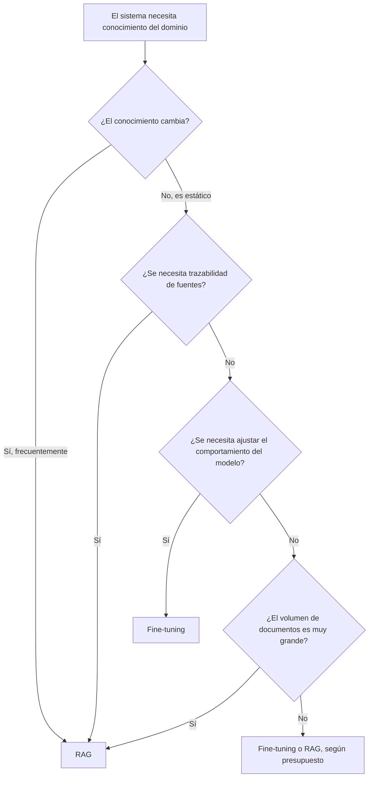

# Módulo 3 — Context Engineering

# Capítulo 06 — RAG (Retrieval-Augmented Generation) como componente del Context Engineering

## Sección 09 — Patrones y anti-patrones de RAG

> *"Los patrones documentan lo que funciona en sistemas reales. Los anti-patrones documentan lo que inevitablemente falla, a veces después de meses de funcionamiento aparentemente correcto."*

---

## Objetivos de aprendizaje

- Identificar los patrones de diseño que producen sistemas RAG robustos y mantenibles.
- Reconocer los anti-patrones más frecuentes en proyectos reales y comprender por qué ocurren.
- Evaluar cuándo RAG es la solución correcta y cuándo el fine-tuning del modelo es preferible.
- Aplicar criterios de decisión arquitectónica al diseñar sistemas de recuperación.

---

## Patrones de RAG

### Patrón 1: RAG con filtrado por metadatos (Filtered RAG)

**Descripción:** El retrieval combina búsqueda por similitud vectorial con filtros explícitos sobre metadatos (fecha, tipo de documento, división organizacional, nivel de acceso).

**Cuándo aplicarlo:** Cuando el corpus contiene documentos con distintos ámbitos de aplicación y la relevancia de un fragmento depende tanto de su contenido como de sus atributos.

**Ejemplo:** Un sistema de consultas sobre procedimientos de RRHH donde los procedimientos varían por país. El retrieval filtra primero por `pais = "Argentina"` y luego aplica similitud vectorial dentro de ese subconjunto. Sin el filtro, el sistema podría recuperar el procedimiento correcto pero de la región equivocada.

**Señal de que es necesario:** Cuando los usuarios reportan respuestas correctas en contenido pero incorrectas en ámbito ("eso aplica a México, no a mí").

---

### Patrón 2: RAG jerárquico (Hierarchical RAG)

**Descripción:** El índice se construye en dos niveles: un índice de resúmenes de alto nivel y un índice de fragmentos detallados. El retrieval usa primero el índice de resúmenes para identificar los documentos más relevantes, y luego recupera los fragmentos detallados de esos documentos.

**Cuándo aplicarlo:** Cuando el corpus contiene documentos largos y estructurados (informes extensos, manuales completos) donde el retrieval directo por fragmentos puede recuperar secciones correctas de documentos incorrectos.

**Ejemplo:** Un corpus de 500 informes anuales de distintas empresas. El retrieval de primer nivel identifica el informe de la empresa correcta. El retrieval de segundo nivel recupera los fragmentos específicos dentro de ese informe.

**Beneficio:** Mejora la coherencia del contexto: todos los fragmentos provienen de los documentos más relevantes para la consulta, no de una mezcla de documentos distintos.

---

### Patrón 3: RAG con verificación de relevancia (Self-RAG)

**Descripción:** Después del retrieval, el sistema usa el propio LLM para evaluar si los fragmentos recuperados son relevantes para la consulta. Si la relevancia es insuficiente, el sistema reintenta el retrieval con una estrategia diferente antes de generar la respuesta.

**Cuándo aplicarlo:** Cuando la calidad de la respuesta es crítica y el corpus es heterogéneo, con documentos de muy distinta relevancia entre sí.

**Ejemplo:** Un asistente médico que, antes de responder una consulta sobre dosificación, verifica que los fragmentos recuperados correspondan a la indicación específica preguntada y no a contraindicaciones de otras indicaciones.

**Costo:** Introduce una llamada adicional al LLM antes de la generación, aumentando la latencia. No es adecuado para aplicaciones con restricciones estrictas de tiempo de respuesta.

---

### Patrón 4: RAG con reescritura de consulta

**Descripción:** Antes del retrieval, el LLM reescribe la consulta del usuario en una forma más favorable para la búsqueda en el corpus específico.

**Cuándo aplicarlo:** Cuando el lenguaje de los usuarios difiere sistemáticamente del lenguaje de los documentos, o cuando las consultas son conversacionales y contienen referencias implícitas al contexto anterior.

**Ejemplo:** El usuario pregunta "¿y el plazo para el otro caso que mencionaste?" —una referencia implícita al historial conversacional. El sistema reescribe: "¿Cuál es el plazo de prescripción para reclamaciones por defectos ocultos en contratos de compraventa?"

---

## Anti-patrones de RAG

### Anti-patrón 1: RAG como sustituto de fine-tuning

**Descripción:** El equipo decide usar RAG para enseñarle al modelo cómo comportarse en el dominio —tono, vocabulario, formato de respuesta, criterios de evaluación—, indexando ejemplos de respuestas correctas como si fueran documentos de conocimiento.

**Por qué falla:** El comportamiento del modelo —cómo responde— es una función de su entrenamiento, no de su contexto. Insertar "ejemplos de cómo responder correctamente" en el índice no ajusta el comportamiento del modelo con la consistencia y la generalización que produce el fine-tuning. El contexto puede influir sobre la respuesta inmediata, pero esa influencia es frágil y no sistemática.

**Cuándo el fine-tuning es preferible a RAG:**

| Criterio | RAG | Fine-tuning |
|---|---|---|
| El conocimiento cambia frecuentemente | Mejor | Peor |
| Se necesita trazabilidad de fuentes | Mejor | No disponible |
| Se requiere ajustar el tono/formato del modelo | No adecuado | Mejor |
| El corpus es estático y bien delimitado | Comparable | Mejor |
| Se necesita el modelo en producción sin latencia de retrieval | No adecuado | Mejor |
| El conocimiento es altamente especializado y estático | Comparable | Mejor |

La regla práctica: RAG para datos que cambian o que necesitan trazabilidad; fine-tuning para ajustar comportamiento consistente del modelo.

---

### Anti-patrón 2: Indexación sin política de actualización

**Descripción:** El equipo construye el índice una vez, sobre el corpus disponible en el momento del desarrollo, y lo despliega en producción sin ningún mecanismo para actualizarlo.

**Por qué falla:** Los documentos cambian. Normativas se actualizan, precios varían, procedimientos se revisan. Un índice estático convierte información desactualizada en respuestas con apariencia de veracidad. El sistema no solo no sabe la información nueva: afirma activamente la información vieja, con citas de fragmentos que el usuario puede interpretar como fuente de verdad.

**Señal de alerta:** Los usuarios reportan que el sistema cita documentos que ya no están vigentes, o que la información que provee difiere de la que encuentran en el repositorio oficial.

**Solución:** Diseñar la política de actualización desde el primer día, incluso si en el MVP solo se ejecuta manualmente una vez por semana. La política debe incluir cómo se detectan cambios, cómo se eliminan fragmentos obsoletos y cómo se agregan nuevos documentos.

---

### Anti-patrón 3: k=1 o corpus sin diversidad de recuperación

**Descripción:** El sistema recupera un solo fragmento (k=1) o un número muy pequeño de fragmentos, asumiendo que el fragmento más similar es suficiente para responder la consulta.

**Por qué falla:** Muchas consultas requieren información distribuida en múltiples fragmentos. Con k=1, el modelo solo tiene acceso a una perspectiva parcial del tema. Además, el fragmento más similar no siempre es el más relevante: puede ser el más similar en vocabulario pero no el que contiene la información específica que la consulta necesita.

**Consecuencia práctica:** El modelo genera respuestas parciales o debe recurrir a su conocimiento interno para completar la respuesta, aumentando el riesgo de alucinación sobre los detalles que el fragmento no cubre.

---

### Anti-patrón 4: Chunking descuidado

**Descripción:** Los fragmentos se dividen por tamaño fijo sin considerar la estructura del documento, partiendo definiciones en medio, separando condiciones de sus cláusulas base, o cortando tablas por la mitad.

**Por qué falla:** Un fragmento que comienza con "...en cuyo caso el plazo se extiende a 30 días" carece de contexto para determinar cuál es el caso y qué plazo está siendo extendido. El modelo recibirá ese fragmento como relevante para una consulta sobre plazos, pero no podrá usarlo correctamente porque el antecedente de la condición está en el fragmento anterior.

**Señal de alerta:** Las respuestas del modelo son temáticamente correctas pero factualmente incompletas; el modelo reconoce que "hay más información al respecto" pero no puede precisarla.

---

### Anti-patrón 5: Ignorar la calidad del corpus

**Descripción:** El equipo indexa todos los documentos disponibles sin curaduría, incluyendo documentos obsoletos, borradores, versiones duplicadas, documentos escaneados con OCR de baja calidad y contenido irrelevante para el dominio de la aplicación.

**Por qué falla:** El retrieval recupera fragmentos del corpus tal como existe. Si el corpus incluye basura, el retrieval recuperará basura con alta similitud semántica. El modelo recibirá fragmentos contradictorios (versión actualizada y versión obsoleta del mismo procedimiento), fragmentos sin sentido (artefactos de OCR) o fragmentos irrelevantes (documentos de otro dominio que coinciden superficialmente con la consulta).

---

## Cómo tomar la decisión: ¿RAG o fine-tuning?

La pregunta que más frecuentemente debe responder un AI Engineer al diseñar un sistema de conocimiento es: ¿agrego RAG o hago fine-tuning?

El árbol de decisión simplificado:

En la práctica, muchos sistemas de producción usan ambas técnicas en conjunto: fine-tuning para ajustar el comportamiento base del modelo (tono, formato, estilo de razonamiento en el dominio) y RAG para proveer el conocimiento factual actualizable.

---

## Ideas clave

- Los patrones de RAG más robustos combinan filtrado por metadatos, retrieval jerárquico y verificación de relevancia.
- RAG no es sustituto del fine-tuning: cada uno resuelve un problema diferente.
- Un índice sin política de actualización se convierte en un pasivo de información.
- La calidad del corpus es tan importante como la calidad del algoritmo de retrieval.
- k=1 es casi siempre insuficiente para aplicaciones reales.

---

## Transición hacia la siguiente sección

Los patrones y anti-patrones describen situaciones genéricas. La siguiente sección materializa ese conocimiento en un caso de estudio completo: una aplicación empresarial diseñada de principio a fin, con justificación de cada decisión técnica.

---

> *"Un arquitecto no memoriza respuestas. Comprende problemas para poder diseñar soluciones."*
