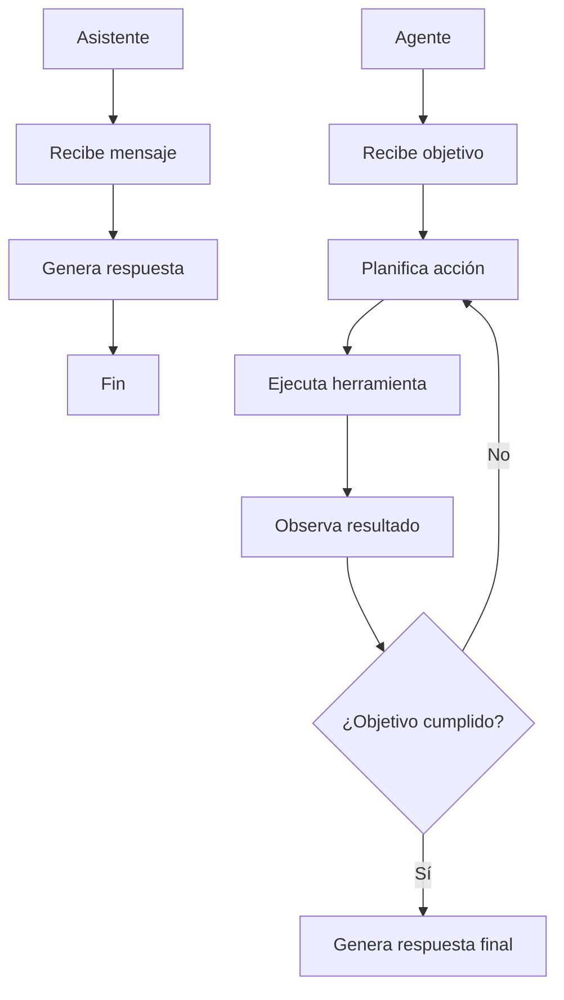

# Módulo 3 — Context Engineering

# Capítulo 08 — Agentes de IA: Arquitectura y Orquestación

## Sección 02 — De asistentes a agentes autónomos

> *"La diferencia entre un asistente y un agente no es cuánto sabe. Es si puede actuar, observar y replanearse."*

---

## Objetivos de aprendizaje

- Comprender el salto cualitativo entre un asistente conversacional y un agente autónomo.
- Identificar qué capacidades nuevas aparecen en la transición y qué problemas de diseño traen consigo.
- Analizar casos concretos donde un asistente es insuficiente y un agente es la respuesta correcta.
- Reconocer los distintos niveles de autonomía como un espectro de decisiones de diseño.

---

## El asistente conversacional: fortalezas y límites

Un asistente conversacional bien diseñado es una herramienta poderosa. Puede responder preguntas complejas, redactar documentos, analizar datos presentados en el contexto, resumir conversaciones largas y adaptar su tono al usuario. Todo esto lo hace dentro de un ciclo simple y determinista: el usuario envía un mensaje, el asistente responde.

Ese ciclo tiene una limitación estructural: el asistente no puede hacer nada que no sea responder. No puede ir a buscar información adicional si la que tiene es insuficiente. No puede ejecutar una secuencia de pasos y ajustarla según los resultados intermedios. No puede completar una tarea que requiere múltiples acciones sobre sistemas externos. Puede describir cómo se haría, pero no puede hacerlo.

Esta limitación no es un defecto de implementación. Es una consecuencia de la arquitectura estímulo-respuesta.

---

## Cuándo el asistente resulta insuficiente

Considerar la siguiente solicitud: "Analiza las ventas del último trimestre, identifica los tres productos con mayor caída respecto al trimestre anterior, y redacta un informe ejecutivo con las posibles causas y recomendaciones."

Un asistente puede hacer esto si los datos ya están en el contexto. Pero en una empresa real, esos datos están en un sistema de análisis de ventas. El asistente necesitaría:

1. Consultar el sistema de ventas para obtener los datos del trimestre actual.
2. Consultar el sistema para obtener los datos del trimestre anterior.
3. Calcular las diferencias y ordenar los productos por caída.
4. Posiblemente consultar registros adicionales para identificar causas.
5. Redactar el informe con ese análisis completo.

Cada paso depende del resultado del anterior. El paso 3 no puede ejecutarse sin los resultados de los pasos 1 y 2. Si el sistema de ventas devuelve un error en el paso 1, la respuesta correcta no es continuar con datos incompletos: es detectar el error, intentar una alternativa o reportar el problema.

Esta estructura secuencial, dependiente y adaptativa es exactamente lo que define un agente.

---

## El salto cualitativo

La transición del asistente al agente introduce tres capacidades nuevas:

**Acción sobre sistemas externos.** El agente no solo genera texto: ejecuta herramientas que modifican el estado del mundo o recuperan información que no estaba en el contexto inicial. Una búsqueda en una base de datos, una llamada a una API, la escritura de un archivo: estas son acciones que el agente puede realizar.

**Observación de resultados intermedios.** Después de cada acción, el agente recibe una observación: el resultado de la herramienta, el error que produjo, los datos que devolvió. Esa observación se incorpora al razonamiento del siguiente paso.

**Replanificación basada en observaciones.** Si una acción no produce el resultado esperado, el agente puede cambiar de estrategia. No está obligado a seguir el plan original si el plan ya no funciona. Esta capacidad de adaptación es la que distingue al agente de una cadena de herramientas con orden fijo.

La diferencia visual es clara: el asistente tiene un camino lineal. El agente tiene un bucle. Ese bucle es el corazón de la arquitectura agéntica.

---

## El espectro de autonomía

La autonomía de un agente no es un interruptor binario. Es un espectro con múltiples posiciones:

| Nivel | Descripción | Ejemplo |
|---|---|---|
| 0 — Asistente | Responde sin actuar | Chatbot de preguntas frecuentes |
| 1 — Asistente con herramientas | Ejecuta una herramienta por consulta | Búsqueda web integrada en el chat |
| 2 — Agente supervisado | Múltiples herramientas, confirma cada acción | Agente de soporte que requiere aprobación |
| 3 — Agente semi-autónomo | Actúa libremente en pasos seguros, escala en pasos críticos | Agente de análisis que escala solo al modificar datos |
| 4 — Agente autónomo | Opera sin intervención dentro de límites definidos | Pipeline de procesamiento de datos nocturno |

Ningún nivel es mejor que otro por defecto. El nivel correcto depende del riesgo de las acciones, la reversibilidad de los errores, el costo de la supervisión y la confianza en el sistema.

En aplicaciones empresariales, los niveles 2 y 3 son los más comunes. La autonomía total (nivel 4) se reserva para procesos donde los errores son detectables y reversibles, o donde el costo de la supervisión humana supera con creces el riesgo de error.

---

## Qué cambia en el diseño

La transición del asistente al agente no es solo agregar herramientas a un prompt. Es un cambio de paradigma de diseño que afecta múltiples dimensiones:

**Diseño de la interacción.** El usuario ya no espera una respuesta inmediata. Espera el resultado de un proceso que puede tomar múltiples pasos y un tiempo no despreciable. El diseño de la experiencia debe reflejar ese proceso.

**Gestión de errores.** Un asistente que no puede responder genera una respuesta de error. Un agente que no puede completar una tarea debe detectar cuándo está bloqueado, reportar el estado en que quedó y ofrecer opciones de recuperación.

**Trazabilidad.** Cada acción del agente deja una huella. En producción, es necesario poder auditar qué hizo el agente, en qué orden, con qué herramientas y qué resultados obtuvo. Sin trazabilidad, depurar fallos o explicar el comportamiento del sistema es prácticamente imposible.

**Límites y condiciones de terminación.** Un agente sin condiciones de terminación bien definidas puede operar indefinidamente, agotando recursos o entrando en bucles. Establecer cuándo el agente debe declarar éxito, cuándo debe declarar fracaso y cuándo debe escalar es una decisión de diseño crítica.

---

## Nota del Arquitecto

> La transición de asistente a agente amplía enormemente las capacidades del sistema, pero también amplía enormemente el espacio de fallos posibles. Un asistente que falla, falla de manera visible: genera una respuesta incorrecta o incompleta. Un agente que falla puede hacerlo silenciosamente: ejecutar una secuencia de acciones que producen un estado incorrecto sin que ningún paso individual genere un error observable. Diseñar agentes robustos requiere pensar sistemáticamente en todos los estados de fallo posibles antes de desplegar el sistema.

---

## Ideas clave

- El asistente conversacional tiene una limitación estructural: opera dentro del ciclo estímulo-respuesta y no puede ejecutar acciones sobre sistemas externos ni adaptar un plan según resultados intermedios.
- El agente introduce tres capacidades nuevas: acción sobre sistemas externos, observación de resultados intermedios y replanificación basada en observaciones.
- La autonomía es un espectro de diseño, no un atributo fijo. El nivel correcto depende del riesgo, la reversibilidad y el costo de la supervisión.
- La transición al agente cambia el paradigma de diseño: la interacción, la gestión de errores, la trazabilidad y las condiciones de terminación deben rediseñarse.

---

## Transición hacia la siguiente sección

Comprender el salto cualitativo entre asistente y agente es el primer paso. El segundo es entender de qué partes está hecho un agente. La siguiente sección descompone la arquitectura de un agente en sus componentes fundamentales y explica qué hace cada uno.

---

> *"Un arquitecto no memoriza respuestas. Comprende problemas para poder diseñar soluciones."*
