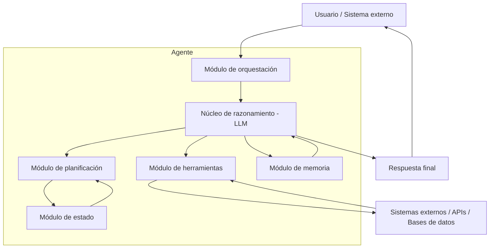

# Módulo 3 — Context Engineering

# Capítulo 08 — Agentes de IA: Arquitectura y Orquestación

## Sección 03 — Componentes fundamentales de un agente

> *"Antes de diseñar un agente, es necesario saber de qué está hecho. Una arquitectura mal comprendida produce un sistema mal construido."*

---

## Objetivos de aprendizaje

- Identificar los componentes fundamentales que componen cualquier arquitectura de agente.
- Comprender el rol específico de cada componente y cómo interactúan entre sí.
- Relacionar cada componente con las capacidades desarrolladas en capítulos anteriores del módulo.
- Utilizar este mapa de componentes como referencia para las decisiones de diseño del resto del capítulo.

---

## La arquitectura de referencia

Un agente de IA está compuesto por seis componentes que trabajan en conjunto. Este diagrama es la referencia visual del capítulo: cada sección posterior se enfoca en uno o más de estos componentes.



Los seis componentes son: el núcleo de razonamiento, el módulo de planificación, el módulo de estado, el módulo de herramientas, el módulo de memoria y la capa de orquestación.

---

## Núcleo de razonamiento: el modelo de lenguaje

El modelo de lenguaje es el componente central del agente. No es una pieza más de la arquitectura: es el motor de todo el sistema. Es el que interpreta el objetivo, genera el plan, decide qué herramienta usar en cada paso, analiza los resultados y formula la respuesta final.

Esta centralidad del LLM es la característica definitoria de un agente basado en modelos de lenguaje. En sistemas de agentes más tradicionales (robótica, automatización de procesos), el módulo de razonamiento puede ser un sistema de reglas, un árbol de decisión o un planificador simbólico. En los agentes que estudiamos en este capítulo, el LLM asume ese rol.

Las implicaciones son importantes. El LLM no está programado explícitamente para cada decisión: razona en lenguaje natural y genera la siguiente acción como parte de ese razonamiento. Eso hace al agente flexible y capaz de generalizar, pero también introduce incertidumbre: el LLM puede cometer errores de razonamiento, malinterpretar herramientas o generar acciones inesperadas.

---

## Módulo de planificación

El módulo de planificación estructura cómo el agente aborda el objetivo. En su forma más simple, la planificación ocurre dentro del propio razonamiento del LLM: el modelo genera un "pensamiento" sobre qué hacer a continuación antes de ejecutar la acción. En formas más elaboradas, el agente genera un plan completo al inicio y lo ejecuta paso a paso, ajustándolo según los resultados.

Los patrones de planificación se detallan en la sección 04. Lo que importa aquí es entender que la planificación no es opcional: todo agente que ejecuta más de una acción en secuencia está planificando, ya sea de forma explícita o implícita dentro del razonamiento del LLM.

---

## Módulo de estado

El estado del agente es el registro de lo que ha ocurrido durante la ejecución actual. Incluye:

- El objetivo original recibido.
- Las acciones ejecutadas hasta el momento.
- Las herramientas invocadas y los parámetros usados.
- Los resultados observados de cada herramienta.
- El paso actual del plan.
- Los errores encontrados y cómo fueron manejados.

El estado es diferente de la memoria. El estado es local a una ejecución: cuando el agente termina su tarea, el estado de esa ejecución no necesariamente persiste. La memoria, en cambio, puede persistir entre ejecuciones y proporcionar continuidad entre sesiones. Esta distinción se desarrolla en detalle en la sección 06.

El estado también es la fuente principal del contexto que el LLM recibe en cada paso del ciclo. En cada iteración, el agente incluye en el prompt del LLM el historial de acciones y observaciones previas, de modo que el modelo pueda razonar teniendo en cuenta todo lo que ha ocurrido.

---

## Módulo de herramientas

Las herramientas son los efectores del agente: los mecanismos mediante los cuales el agente actúa sobre sistemas externos. Sin herramientas, el agente solo puede razonar y generar texto; no puede actuar sobre el mundo.

El capítulo 07 estudió en detalle cómo se definen, implementan y gestionan las herramientas. En el contexto del agente, el módulo de herramientas agrega una capa adicional: la decisión de qué herramienta usar en cada momento es parte del razonamiento del LLM, no un paso predefinido.

El LLM recibe la lista de herramientas disponibles con sus descripciones y firma, y decide cuál invocar en cada paso del ciclo. Esa decisión puede cambiar según los resultados observados. Si una herramienta falla, el agente puede intentar una herramienta alternativa. Si el resultado de una herramienta indica que se necesita información adicional, el agente puede invocar otra herramienta para obtenerla.

---

## Módulo de memoria

El módulo de memoria proporciona continuidad al agente más allá del ciclo de ejecución actual. Puede almacenar y recuperar:

- Preferencias y características del usuario relevantes para interacciones futuras.
- Resultados de tareas anteriores que pueden ser reutilizados.
- Conocimiento acumulado sobre el dominio o el contexto del usuario.
- Resúmenes de conversaciones previas que sería costoso incluir completos.

La arquitectura de memoria para agentes sigue los mismos principios del capítulo 04, pero con una complicación adicional: el agente debe decidir qué información del estado actual merece persistir en la memoria y qué puede descartarse. Esa decisión de qué recordar es en sí misma parte del razonamiento del agente.

---

## Capa de orquestación

La capa de orquestación coordina la ejecución del ciclo completo del agente. Es responsable de:

- Recibir el objetivo inicial y prepararlo para el primer ciclo.
- Invocar al LLM con el prompt correcto en cada iteración.
- Recibir la decisión del LLM (qué herramienta usar, con qué parámetros).
- Ejecutar la herramienta y capturar el resultado.
- Incorporar el resultado al estado y preparar el prompt del siguiente ciclo.
- Detectar las condiciones de terminación (objetivo cumplido, máximo de iteraciones alcanzado, error irrecuperable).
- Devolver la respuesta final al usuario o sistema que invocó al agente.

En implementaciones simples, la orquestación es un bucle de control explícito en el código de la aplicación. En frameworks como LangGraph o el SDK de Claude, la orquestación está abstraída en constructos de más alto nivel. Independientemente de la implementación, la lógica de orquestación siempre está presente.

---

## Cómo interactúan los componentes en un ciclo

Para hacer tangible la interacción entre componentes, considerar un ciclo simple:

```
1. El usuario envía el objetivo: "Resume los tres contratos más recientes del cliente Alfa."

2. La capa de ORQUESTACIÓN recibe el objetivo y prepara el primer prompt para el LLM.

3. El NÚCLEO DE RAZONAMIENTO (LLM) analiza el objetivo y genera:
   - Pensamiento: "Necesito buscar los contratos de Alfa. Usaré la herramienta buscar_contratos."
   - Acción: buscar_contratos(cliente="Alfa", limite=10, orden="fecha_desc")

4. La ORQUESTACIÓN detecta la acción, invoca el MÓDULO DE HERRAMIENTAS.

5. El MÓDULO DE HERRAMIENTAS ejecuta la búsqueda y devuelve: 5 contratos con sus fechas y títulos.

6. La ORQUESTACIÓN añade la observación al MÓDULO DE ESTADO y prepara el prompt para el siguiente ciclo.

7. El LLM recibe el historial (objetivo + acción + observación) y razona:
   - "Ya tengo los contratos. Ahora necesito leer el contenido de los tres más recientes."
   - Ejecuta tres llamadas secuenciales a leer_contrato(id=...) para cada uno.

8. Con el contenido de los tres contratos en el estado, el LLM genera la respuesta final.

9. La ORQUESTACIÓN detecta que el objetivo está cumplido y entrega la respuesta al usuario.
```

En este ejemplo simple ya están activos cinco de los seis componentes: razonamiento, planificación implícita, estado, herramientas y orquestación. La memoria no interviene porque la tarea no requiere información de sesiones anteriores.

---

## Nota del Arquitecto

> El diagrama de arquitectura de un agente es engañosamente simple. Seis cajas y algunas flechas no transmiten la complejidad de coordinar razonamiento, herramientas y estado en tiempo real. La dificultad está en los casos borde: qué ocurre cuando una herramienta devuelve un resultado ambiguo, cuando el LLM genera una acción que la herramienta no puede ejecutar, o cuando el estado crece tanto que ya no cabe en la ventana de contexto. Diseñar cada componente por separado es necesario pero insuficiente: el comportamiento emergente de su interacción requiere pruebas de integración sistemáticas.

---

## Ideas clave

- Un agente está compuesto por seis componentes: núcleo de razonamiento (LLM), módulo de planificación, módulo de estado, módulo de herramientas, módulo de memoria y capa de orquestación.
- El LLM es el motor central: decide qué herramienta usar, interpreta los resultados y genera la respuesta final.
- El estado es el registro local de la ejecución actual; la memoria proporciona continuidad entre ejecuciones. Son conceptos distintos con roles distintos.
- La capa de orquestación coordina el ciclo completo: desde el objetivo inicial hasta la respuesta final, gestionando las iteraciones y las condiciones de terminación.

---

## Transición hacia la siguiente sección

Los componentes son los ladrillos. Las arquitecturas son los planos que indican cómo ensamblarlos. La siguiente sección estudia los patrones de arquitectura de agentes más utilizados en producción: sus supuestos, sus ventajas y las situaciones en que cada uno es la opción correcta.

---

> *"Un arquitecto no memoriza respuestas. Comprende problemas para poder diseñar soluciones."*
