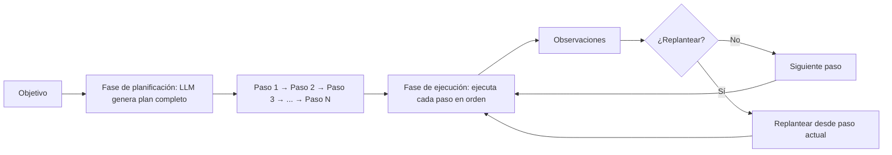
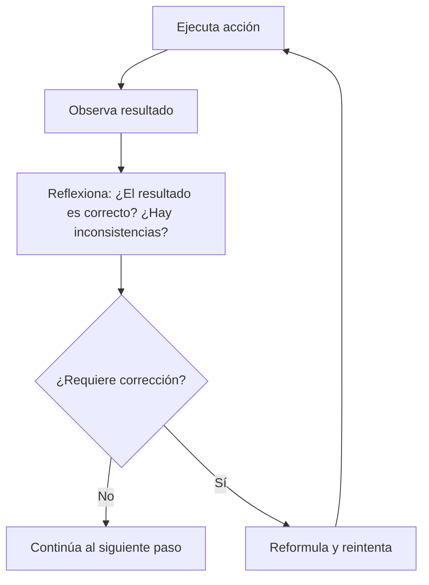

# Módulo 3 — Context Engineering

# Capítulo 08 — Agentes de IA: Arquitectura y Orquestación

## Sección 04 — Arquitecturas de agentes modernas

> *"Los patrones de arquitectura no son recetas. Son soluciones a problemas recurrentes, con supuestos explícitos sobre el contexto en que funcionan."*

---

## Objetivos de aprendizaje

- Conocer los patrones de arquitectura de agentes más utilizados en producción y sus fundamentos teóricos.
- Comprender los supuestos y limitaciones de cada patrón para poder elegir el correcto según el problema.
- Distinguir entre patrones estables, que pueden incluirse en un libro, y patrones en rápida evolución que requieren seguimiento continuo.
- Establecer criterios de selección de arquitectura para aplicaciones empresariales reales.

---

## Por qué existen múltiples arquitecturas

No existe una arquitectura de agente universalmente óptima. Las diferentes arquitecturas surgieron como respuestas a problemas distintos: tareas que requieren planificación anticipada versus tareas donde el objetivo no puede determinarse de antemano; entornos donde los errores son costosos y reversibles versus entornos donde la velocidad es prioritaria; sistemas donde el LLM razona bien de forma autónoma versus sistemas donde el control explícito es necesario.

Conocer las arquitecturas disponibles no significa que deban implementarse todas. Significa poder elegir la correcta para cada problema.

---

## Patrón ReAct: Reason + Act

ReAct es el patrón de agente más implementado en producción. Su nombre combina los dos pasos centrales del ciclo: razonamiento (Reason) y acción (Act).

En cada iteración del ciclo, el LLM genera tres elementos en secuencia:

- **Thought (pensamiento):** El modelo razona explícitamente sobre el estado actual, lo que ya sabe y lo que necesita hacer a continuación.
- **Action (acción):** El modelo especifica la herramienta a invocar y sus parámetros.
- **Observation (observación):** El resultado que devuelve la herramienta después de ser ejecutada. Este elemento lo genera el sistema, no el LLM, y se incorpora al prompt del siguiente ciclo.

```
Objetivo: "¿Cuál es el precio actual del dólar en Argentina y cómo se compara con el precio de hace una semana?"

--- Iteración 1 ---
Thought: Para responder necesito el precio actual del dólar. Usaré la herramienta de tipo_de_cambio.
Action: tipo_de_cambio(moneda="USD", mercado="oficial")
Observation: {"fecha": "2026-07-25", "valor": 1050.50, "moneda": "ARS"}

--- Iteración 2 ---
Thought: Tengo el precio actual. Ahora necesito el precio de hace una semana.
Action: tipo_de_cambio(moneda="USD", mercado="oficial", fecha="2026-07-18")
Observation: {"fecha": "2026-07-18", "valor": 1032.75, "moneda": "ARS"}

--- Iteración 3 ---
Thought: Tengo ambos valores. La variación es de 17.75 pesos (1.72%). Puedo responder.
Action: [ninguna — el agente genera la respuesta final]
Respuesta: "El dólar oficial cotiza hoy a $1.050,50. Hace una semana valía $1.032,75, lo que representa un incremento de $17,75 (1,72%) en el período."
```

La fortaleza de ReAct es su transparencia: el razonamiento explícito del agente es auditable. Los errores de razonamiento son visibles en el pensamiento antes de que produzcan una acción incorrecta. La debilidad es que el razonamiento explícito consume tokens adicionales y puede resultar redundante para tareas simples.

---

## Patrón Plan-and-Execute

Plan-and-Execute separa la fase de planificación de la fase de ejecución. En la primera fase, el agente genera un plan completo para alcanzar el objetivo. En la segunda, ejecuta ese plan paso a paso.



Este patrón es ventajoso cuando:
- El objetivo es complejo y puede descomponerse en pasos bien definidos antes de ejecutar.
- Se quiere reducir la latencia de razonamiento durante la ejecución (el plan ya fue generado).
- Es útil poder auditar el plan completo antes de autorizar la ejecución.

La limitación principal es que el plan inicial puede quedar obsoleto rápidamente si los primeros pasos devuelven resultados inesperados. La versión más robusta del patrón incluye un mecanismo de replanificación que revisa el plan restante cada vez que una observación difiere significativamente de lo esperado.

---

## Patrón Reflection

Reflection agrega una etapa de autoevaluación después de cada acción o al final del ciclo. El agente no solo actúa y observa: también evalúa la calidad de sus propias acciones y resultados antes de continuar.



Reflection es especialmente útil para tareas donde la corrección del resultado es verificable internamente: generación de código (el código debe compilar y pasar tests), resolución de problemas matemáticos (el resultado puede verificarse con una herramienta de cálculo), o redacción de documentos (la coherencia interna puede evaluarse).

El costo es significativo: añade una llamada al LLM por cada ciclo de reflexión. Para tareas simples, ese costo no está justificado. Para tareas donde un error no detectado tiene consecuencias graves, es una inversión razonable.

---

## Patrón Self-Ask

Self-Ask es un patrón donde el agente descompone una pregunta compleja en subpreguntas más simples y las responde secuencialmente antes de sintetizar la respuesta final.

```
Pregunta: "¿Cuál es la empresa tecnológica con mayor crecimiento de ingresos en el último año fiscal entre las que tienen sede en América Latina?"

Self-Ask:
¿Necesito hacer una búsqueda? Sí.
Sub-pregunta 1: ¿Cuáles son las principales empresas tecnológicas con sede en América Latina?
→ [Resultado de búsqueda]

Sub-pregunta 2: Para cada empresa identificada, ¿cuál fue su crecimiento de ingresos en el último año fiscal?
→ [Resultado para cada empresa]

Sub-pregunta 3: ¿Cuál de esas empresas tiene el mayor crecimiento?
→ [Comparación y selección]

Respuesta final: [Síntesis basada en las respuestas a las sub-preguntas]
```

Self-Ask es efectivo para preguntas complejas donde el razonamiento correcto requiere responder primero preguntas intermedias. Su debilidad es que el agente puede formular sub-preguntas incorrectas o innecesarias, especialmente si el objetivo es ambiguo.

---

## Criterios de selección de arquitectura

| Criterio | ReAct | Plan-and-Execute | Reflection | Self-Ask |
|---|---|---|---|---|
| Tarea con pasos predefinibles | Moderado | Alto | Bajo | Bajo |
| Tarea exploratoria (pasos dependen del resultado) | Alto | Bajo | Moderado | Moderado |
| Auditoría del proceso necesaria | Alto | Alto | Alto | Alto |
| Costo computacional | Moderado | Moderado | Alto | Moderado |
| Corrección verificable automáticamente | Bajo | Bajo | Alto | Bajo |
| Preguntas complejas con sub-preguntas | Moderado | Bajo | Bajo | Alto |

Para la mayoría de las aplicaciones empresariales, ReAct es el punto de partida correcto. Es el patrón más documentado, el más implementado y el que mejor balancea capacidad y costo. La complejidad adicional de Plan-and-Execute o Reflection se justifica cuando el problema específico lo exige.

---

## Una nota sobre la velocidad de cambio

El ecosistema de arquitecturas de agentes evoluciona rápidamente. Nuevos patrones aparecen regularmente en papers y frameworks. LATS (Language Agent Tree Search), ReWOO, Reflexion, y otros han sido propuestos y evaluados en los últimos años.

Los cuatro patrones presentados aquí tienen en común que son conceptualmente estables: sus principios no dependen de un framework específico, son implementables directamente y sus ventajas e inconvenientes son comprensibles y predecibles. Los patrones más recientes y especializados requieren seguimiento de la literatura técnica actualizada, ya que su madurez en producción es aún limitada.

---

## Nota del Arquitecto

> La elección de arquitectura no debe hacerse al inicio del proyecto, antes de conocer el problema en detalle. Empezar con ReAct y una implementación mínima proporciona una línea base concreta contra la cual evaluar si la complejidad adicional de otro patrón está justificada. La optimización prematura de la arquitectura de agentes es uno de los errores más costosos en este tipo de proyectos.

---

## Ideas clave

- ReAct (Reason + Act) es el patrón de agente más utilizado en producción. Combina pensamiento explícito, acción y observación en un ciclo transparente y auditable.
- Plan-and-Execute separa la planificación de la ejecución, con ventajas para tareas donde el plan puede establecerse anticipadamente.
- Reflection añade autoevaluación al ciclo, aumentando la robustez a costo de mayor consumo computacional.
- Self-Ask descompone preguntas complejas en sub-preguntas para mejorar el razonamiento encadenado.
- El criterio de selección principal es el tipo de tarea: exploratoria versus predefinible, verificable versus no verificable, simple versus compleja.

---

## Transición hacia la siguiente sección

Los patrones de arquitectura describen la estructura del ciclo del agente. La siguiente sección entra en el detalle de ese ciclo: cómo funciona exactamente el ciclo de percepción, planificación y acción en ReAct, con un ejemplo completo de tres iteraciones que muestra cada elemento del proceso.

---

> *"Un arquitecto no memoriza respuestas. Comprende problemas para poder diseñar soluciones."*
