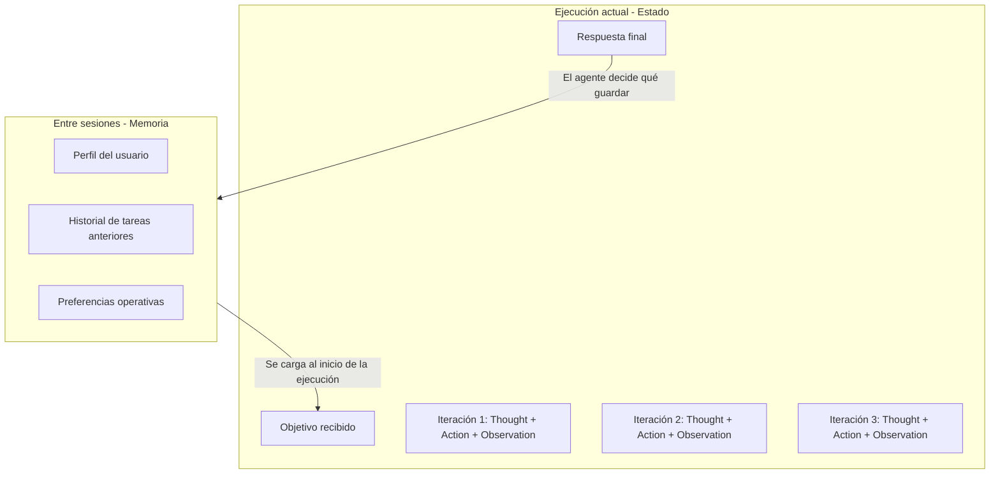

# Módulo 3 — Context Engineering

# Capítulo 08 — Agentes de IA: Arquitectura y Orquestación

## Sección 06 — Gestión del estado y memoria del agente

> *"El estado dice qué está haciendo el agente ahora. La memoria dice quién es el usuario y qué ocurrió antes. Confundirlos produce sistemas que olvidan lo que importa o recuerdan lo que no sirve."*

---

## Objetivos de aprendizaje

- Distinguir con precisión el estado del agente de la memoria persistente del usuario.
- Comprender qué información debe estar en el estado, qué en la memoria y qué puede descartarse.
- Analizar los desafíos de gestión de estado en tareas largas o que abarcan múltiples sesiones.
- Diseñar una estrategia de memoria para agentes que opere de forma eficiente dentro de la ventana de contexto.

---

## Dos conceptos frecuentemente confundidos

En la arquitectura de un agente conviven dos formas distintas de información temporal: el estado de la ejecución actual y la memoria persistente. Tratarlos como equivalentes produce diseños defectuosos. Separarlos con claridad es la base de una arquitectura de agente coherente.

---

## El estado del agente

El estado es el registro de lo que está ocurriendo en la ejecución actual del agente. Es específico a una tarea, comienza cuando el agente recibe el objetivo y termina cuando la tarea concluye o falla.

El estado contiene:

- El objetivo original recibido.
- El plan generado (si el patrón lo incluye explícitamente).
- El paso actual del plan en ejecución.
- El historial de acciones ejecutadas y sus parámetros.
- Las observaciones recibidas de cada herramienta.
- Los errores encontrados y cómo fueron manejados.
- Las decisiones tomadas y el razonamiento que las justificó.

El estado vive en el prompt del agente en cada iteración. La sección 05 mostró cómo ese prompt crece iteración a iteración: cada pensamiento, acción y observación anterior se añade al contexto. El estado es, operativamente, el contenido acumulado en ese contexto durante la ejecución.

La característica clave del estado es que es efímero. Cuando la tarea termina, el estado de esa ejecución no necesariamente se conserva. Puede archivarse para auditoría, puede resumirse y almacenarse en memoria, o puede descartarse completamente. La decisión depende del diseño del sistema.

---

## La memoria persistente

La memoria persistente es el mecanismo que permite al agente mantener continuidad entre ejecuciones separadas. Es lo que permite que el agente "recuerde" al usuario, sus preferencias, el contexto de interacciones anteriores y los resultados de tareas previas relevantes para la nueva.

El capítulo 04 desarrolló en detalle los tipos de memoria (episódica, semántica, procedimental) y las estrategias de gestión. En el contexto del agente, estos mecanismos se aplican con una particularidad: el agente no solo lee de la memoria, también decide qué escribir en ella como resultado de su ejecución.

Los tipos de información que suelen persistir en la memoria de un agente incluyen:

| Tipo | Ejemplo | Vida útil típica |
|---|---|---|
| Perfil del usuario | Preferencias, rol, idioma | Larga (semanas a meses) |
| Resultados de tareas previas | "El análisis del Q2 se generó el 15/07" | Media (días a semanas) |
| Preferencias operativas | "El usuario prefiere respuestas concisas" | Larga |
| Contexto en curso | "El usuario está trabajando en el proyecto X" | Media |
| Errores conocidos | "La herramienta Y falla con este tipo de consulta" | Variable |

---

## La distinción en un diagrama

Al inicio de cada ejecución, el agente recupera de la memoria la información relevante para la tarea y la incluye en el contexto inicial. Al finalizar, decide qué información del estado merece persistir en la memoria para ejecuciones futuras.

---

## El problema de qué recordar

Uno de los desafíos de diseño más delicados en agentes con memoria es decidir qué guardar. Guardar demasiado produce una memoria que crece sin control y degrada la relevancia de lo que se recupera. Guardar demasiado poco hace que el agente parezca olvidadizo.

Algunas heurísticas de diseño probadas:

**Guardar resultados, no procesos.** El detalle de cada iteración del ciclo no suele ser útil en futuras ejecuciones. El resultado final de la tarea, en cambio, puede ser muy relevante. Guardar "el análisis de ventas del Q2 fue completado el 15/07 con los datos del sistema CRM" es útil. Guardar cada pensamiento del ciclo que generó ese análisis generalmente no lo es.

**Guardar hechos, no inferencias efímeras.** Las inferencias que el agente realiza sobre el usuario en una sesión pueden ser incorrectas o estar sujetas a cambio. Los hechos explícitos ("el usuario indicó que trabaja en el departamento de finanzas") son más estables y útiles.

**Aplicar TTL (time-to-live) a la información temporal.** La información sobre el contexto en curso ("el usuario está preparando la presentación del Q3") tiene una vida útil corta. Diseñar la memoria con mecanismos de expiración evita acumular contexto obsoleto que puede confundir al agente.

**Considerar la privacidad desde el diseño.** La memoria de un agente puede contener información sensible. La arquitectura de memoria debe incluir desde el inicio mecanismos de control de acceso y políticas de retención que cumplan con las obligaciones legales y los requisitos del negocio.

---

## Estado en tareas largas: el problema del contexto creciente

Las tareas largas plantean un problema específico de gestión de estado. Si la tarea requiere 30 iteraciones y cada iteración produce observaciones extensas, el contexto acumulado puede superar la ventana del modelo antes de que la tarea termine.

Las estrategias para manejar este problema son:

**Compresión progresiva del historial.** Después de un número determinado de iteraciones, el agente resume las iteraciones más antiguas y las reemplaza en el contexto por ese resumen. Las iteraciones recientes se mantienen completas. Esto preserva la continuidad del razonamiento sin exceder el límite de contexto.

**Estado estructurado separado del historial.** En lugar de incluir todo el historial de iteraciones en cada prompt, se mantiene un estado estructurado separado (un objeto JSON con los campos relevantes: objetivo, pasos completados, resultados clave, errores encontrados) y se actualiza en cada iteración. El prompt incluye el estado estructurado más solo las últimas N iteraciones completas.

**Puntos de guardado intermedios.** Para tareas muy largas, el agente puede definir hitos donde guarda el estado parcial en la memoria persistente y reinicia el contexto. Si algo falla después de un hito, el agente puede retomar desde el último punto guardado en lugar de empezar desde cero.

---

## Nota del Arquitecto

> La gestión del estado en agentes es una de las áreas donde los frameworks hacen más por el desarrollador y también donde más pueden ocultar problemas. LangGraph, por ejemplo, gestiona el estado como un grafo de nodos con transiciones explícitas, lo que hace el estado auditable y reutilizable. Pero si ese grafo no se diseña correctamente, puede acumular estado irrelevante o perder información crítica entre nodos. Independientemente del framework, es necesario poder responder estas preguntas: ¿qué está en el estado en cada iteración? ¿Qué se guarda en memoria al finalizar? ¿Qué se descarda? Si no se pueden responder, el diseño del estado es incompleto.

---

## Ideas clave

- El estado del agente es efímero y específico a la ejecución actual. Contiene el objetivo, el historial de acciones y observaciones, y el razonamiento del ciclo en curso.
- La memoria persistente proporciona continuidad entre ejecuciones. Contiene información del usuario, resultados de tareas anteriores y preferencias operativas.
- El agente debe decidir activamente qué información del estado merece persistir en memoria. Guardar todo o no guardar nada son igualmente malos diseños.
- Las tareas largas requieren estrategias activas de compresión del historial o uso de estado estructurado para evitar que el contexto creciente degrade el razonamiento o exceda la ventana del modelo.

---

## Transición hacia la siguiente sección

El estado y la memoria determinan qué sabe el agente en cada momento. La siguiente sección estudia cómo el agente usa ese conocimiento para decidir qué hacer: la coordinación entre herramientas y RAG como los dos mecanismos principales de acción y recuperación de información en el ciclo del agente.

---

> *"Un arquitecto no memoriza respuestas. Comprende problemas para poder diseñar soluciones."*
