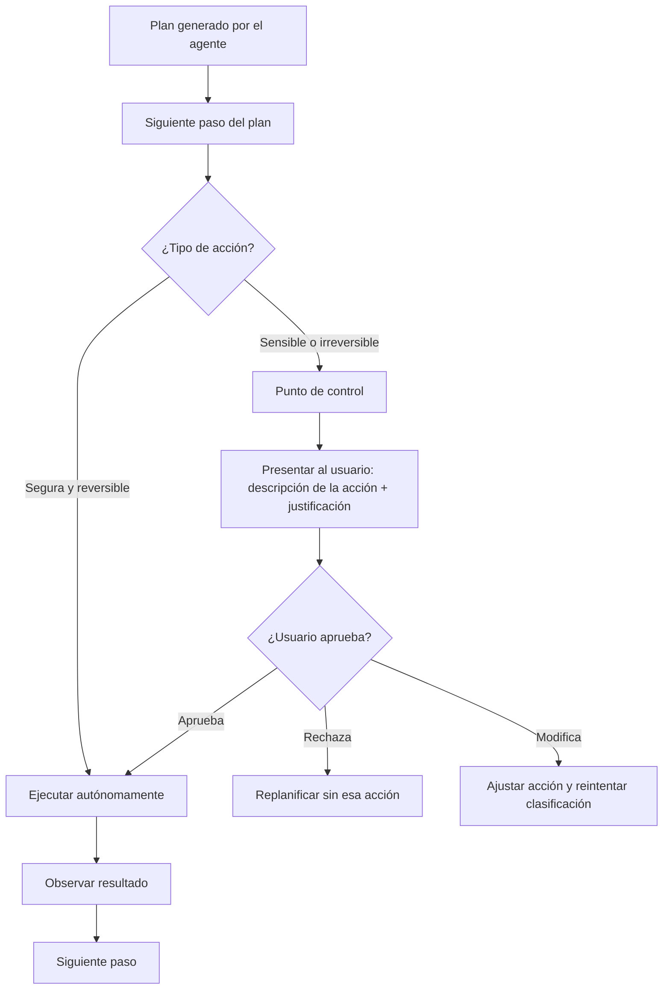

# Módulo 3 — Context Engineering

# Capítulo 08 — Agentes de IA: Arquitectura y Orquestación

## Sección 08 — Orquestación y toma de decisiones

> *"Un agente que nunca se detiene a pedir confirmación no es autónomo: es imprudente. La autonomía controlada es la que produce valor en producción."*

---

## Objetivos de aprendizaje

- Comprender cómo el agente orquesta la secuencia de acciones dentro de su ciclo individual.
- Identificar los puntos de decisión donde el agente debe elegir entre actuar autónomamente o escalar a un humano.
- Diseñar una política de control que equilibre autonomía y supervisión según el riesgo de cada acción.
- Implementar condiciones de parada robustas que eviten los fallos más comunes de agentes en producción.

---

## La orquestación del agente individual

Esta sección tiene un límite conceptual preciso: cubre la orquestación interna del agente individual, es decir, cómo un único agente decide la secuencia de sus propias acciones. La coordinación entre múltiples agentes — cómo un agente orquestador delega trabajo a agentes especializados — es el tema del capítulo 09.

La orquestación interna del agente tiene tres dimensiones:

**Qué hacer a continuación.** En cada iteración, el agente decide la próxima acción basándose en el objetivo, el estado actual y las observaciones recibidas. Esta decisión es parte del razonamiento del LLM y emerge del ciclo ReAct estudiado en la sección 05.

**Actuar autónomamente o escalar.** En ciertos puntos del ciclo, el agente debe evaluar si la acción que está a punto de tomar requiere confirmación humana o si puede proceder de forma autónoma.

**Cuándo declarar que terminó.** El agente debe reconocer cuándo el objetivo está cumplido, cuándo no puede cumplirlo y cuándo la situación requiere intervención externa.

---

## La decisión de cuándo escalar

En aplicaciones empresariales, los agentes rara vez operan con autonomía total. Existen categorías de acciones donde la supervisión humana no es opcional: no por limitación del sistema, sino por diseño deliberado.

Las categorías que típicamente requieren confirmación antes de proceder:

**Acciones irreversibles.** Eliminar datos, enviar comunicaciones a clientes, ejecutar transacciones financieras, modificar configuraciones de sistemas en producción. Una acción irreversible incorrecta puede tener consecuencias que no pueden deshacerse. La confirmación previa es la única salvaguarda disponible.

**Acciones que afectan a terceros.** Enviar un email en nombre de la organización, crear un registro en un sistema externo, publicar contenido. El agente actúa con la autoridad de la organización; esa autoridad debe ser validada antes de ejercerse.

**Acciones en situaciones ambiguas.** Si los datos disponibles no son suficientes para tomar una decisión con certeza razonable, el agente debe reportar la ambigüedad en lugar de adivinar. Una decisión incorrecta tomada con información insuficiente es más costosa que la demora de solicitar aclaración.

**Acciones fuera del alcance definido.** Si el objetivo del usuario o el contexto de la tarea cae fuera de los límites definidos en el system prompt, el agente debe escalar en lugar de improvisarse competencias que no le fueron asignadas.

---

## Implementando los puntos de control

Los puntos de control son el mecanismo técnico para implementar la política de escalada. Un punto de control es un paso en el ciclo del agente donde la ejecución se pausa y espera confirmación antes de continuar.

La clasificación de acciones puede implementarse de varias maneras:

**Clasificación estática.** Se define en el diseño del sistema qué herramientas o tipos de acciones son siempre sensibles. Antes de invocar cualquiera de ellas, el agente inserta un punto de control. Es simple de implementar y predecible.

**Clasificación dinámica.** El agente evalúa el riesgo de cada acción en función de su contexto específico. "Enviar email al equipo interno" puede ser autónomo; "enviar email al cliente" puede requerir confirmación. Esta clasificación es más precisa pero más compleja de implementar.

En la mayoría de los sistemas empresariales, una combinación de ambas es la solución correcta: las herramientas siempre sensibles tienen puntos de control estáticos, y las herramientas de riesgo variable tienen clasificación dinámica.

---

## El problema del agente que no para

Uno de los fallos más documentados en sistemas de agentes es el bucle infinito: el agente continúa iterando sin alcanzar el objetivo, sin detectar que está bloqueado y sin declarar un error. Este comportamiento puede ocurrir por varias razones:

- Una herramienta devuelve resultados que el agente interpreta como parciales y continúa buscando información que no existe.
- El agente genera una acción que falla, intenta alternativas que también fallan, y no tiene criterio para declarar el fallo como irrecuperable.
- El objetivo es ambiguo y el agente no puede determinar cuándo está cumplido.

Las salvaguardas contra el bucle infinito deben estar en la capa de orquestación, no en el razonamiento del LLM:

**Límite absoluto de iteraciones.** El agente nunca puede ejecutar más de N ciclos, independientemente de si ha alcanzado el objetivo. El valor de N debe calibrarse para cada tipo de tarea; un rango razonable para la mayoría de las aplicaciones empresariales es entre 10 y 25 iteraciones.

**Detección de bucle.** Si el agente ejecuta la misma acción con los mismos parámetros más de una vez, la orquestación detecta el patrón y interrumpe el ciclo.

**Timeout absoluto.** Independientemente de las iteraciones, la ejecución no puede superar un tiempo máximo. Esto protege contra casos donde las herramientas responden muy lentamente.

**Presupuesto de tokens.** Si el costo acumulado de la ejecución supera un umbral definido, la orquestación interrumpe el ciclo y reporta el estado parcial.

---

## Diseñar la respuesta de fallo

Un agente que no puede completar su objetivo debe terminar gracefully. La respuesta de fallo debe incluir:

- Qué se intentó hacer.
- En qué punto del proceso se encontró el obstáculo.
- Por qué no se pudo continuar.
- Qué información parcial se obtuvo que pueda ser útil.
- Qué opciones tiene el usuario para continuar (escalar, reformular el objetivo, proveer información adicional).

Una respuesta de fallo bien diseñada convierte un fallo del agente en una interacción útil. El usuario entiende qué ocurrió y puede tomar una acción informada.

---

## Nota del Arquitecto

> La tentación en el diseño de agentes es maximizar la autonomía para minimizar la fricción con el usuario. Esa tentación produce sistemas que cometen errores costosos en nombre de la fluidez. La autonomía controlada no es una limitación del sistema: es una característica de diseño que distingue los agentes que funcionan en producción de los que funcionan en demos. En producción, la pregunta relevante no es "¿puede el agente hacer esto?", sino "¿debería el agente hacer esto sin confirmación?".

---

## Ideas clave

- La orquestación interna del agente cubre tres decisiones: qué hacer a continuación, cuándo actuar autónomamente o escalar, y cuándo declarar que terminó.
- Los puntos de control son el mecanismo técnico para implementar la política de escalada. Deben aplicarse a acciones irreversibles, acciones que afectan a terceros y situaciones ambiguas.
- Las salvaguardas contra bucles infinitos (límite de iteraciones, timeout, detección de bucle) deben estar en la capa de orquestación, no en el razonamiento del LLM.
- Un agente que falla debe terminar gracefully, reportando el estado del proceso y las opciones disponibles para el usuario.

---

## Transición hacia la siguiente sección

Conocer el funcionamiento interno del agente permite identificar qué diseños funcionan bien y cuáles producen problemas. La siguiente sección cataloga los patrones de diseño que los AI Engineers han validado en producción y los anti-patrones que explican los fallos más frecuentes en sistemas de agentes reales.

---

> *"Un arquitecto no memoriza respuestas. Comprende problemas para poder diseñar soluciones."*
