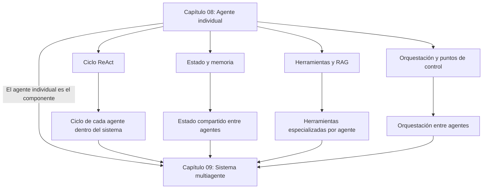

# Módulo 3 — Context Engineering

# Capítulo 08 — Agentes de IA: Arquitectura y Orquestación

## Sección 15 — Transición al Capítulo 9

> *"Un agente resuelve lo que un único modelo no puede resolver solo. Un sistema multiagente resuelve lo que un único agente no puede resolver solo. La escala del problema define la escala de la solución."*

---

## Lo que el capítulo construyó

Este capítulo cubrió la arquitectura del agente individual desde su definición hasta su despliegue. El recorrido fue:

- Definir qué hace que un sistema sea agéntico: la adaptación iterativa del plan según los resultados observados.
- Identificar los seis componentes que componen cualquier agente: razonamiento, planificación, estado, herramientas, memoria y orquestación.
- Estudiar los patrones de arquitectura estables en producción: ReAct como patrón de referencia, y sus variantes para casos específicos.
- Comprender el ciclo de percepción, planificación y acción en detalle, con la trazabilidad completa de un ciclo de tres iteraciones.
- Gestionar el estado efímero de la ejecución y la memoria persistente entre sesiones.
- Coordinar herramientas y RAG como los dos mecanismos principales de acción y recuperación.
- Diseñar la orquestación interna: cuándo actuar autónomamente, cuándo escalar, cuándo declarar terminación.
- Reconocer los patrones que producen sistemas robustos y los anti-patrones que explican los fallos más frecuentes.
- Aplicar todo lo anterior a un caso de estudio empresarial completo y un laboratorio de diseño.

Con este capítulo, el lector puede diseñar, trazar y evaluar agentes de IA individuales en contextos empresariales reales.

---

## El límite del agente individual

El agente individual tiene límites inherentes a su arquitectura:

**Límite de complejidad.** Una tarea que requiere mantener simultáneamente docenas de hilos de razonamiento independientes puede superar la capacidad cognitiva de un único ciclo ReAct. El estado crece, el contexto se vuelve difícil de gestionar, y el razonamiento se degrada.

**Límite de paralelismo.** Un agente individual ejecuta sus acciones de forma secuencial (o con paralelismo limitado en algunas implementaciones). Tareas que se beneficiarían de ejecución paralela de subtareas independientes no pueden aprovecharlo en un diseño de agente único.

**Límite de especialización.** Un agente diseñado para ser generalista inevitablemente es subóptimo en dominios específicos. Un agente diseñado para un dominio específico no puede manejar bien los demás. La especialización y la generalidad son objetivos en tensión dentro de un único agente.

**Límite de confianza.** En algunas aplicaciones, es deseable que diferentes partes del proceso operen con diferentes niveles de privilegio o con capacidades de revisión mutua. Un único agente no puede revisarse a sí mismo de forma independiente.

---

## Cuándo el agente individual no es suficiente

Existen categorías de problemas donde un sistema multiagente es la respuesta correcta:

**Tareas que requieren perspectivas independientes.** Generar un análisis y luego critiquear ese análisis de forma independiente. Un agente que se autoevalúa puede sesgar la crítica hacia validar su propio trabajo. Dos agentes independientes producen una revisión más confiable.

**Tareas con subtareas verdaderamente paralelas.** Analizar simultáneamente tres mercados distintos para sintetizar una recomendación de expansión. Las tres tareas de análisis son independientes entre sí y pueden ejecutarse en paralelo. Un sistema multiagente puede reducir significativamente la latencia total.

**Tareas con dominios claramente distintos.** Un proceso que requiere expertise legal, expertise técnico y expertise comercial puede beneficiarse de agentes especializados en cada dominio, coordinados por un agente orquestador que sintetiza los resultados.

**Tareas de larga duración con múltiples fases.** Un proyecto de análisis que toma días o semanas puede estructurarse como una red de agentes donde cada uno maneja una fase, con transferencias de estado explícitas entre fases.

---

## El salto al capítulo 9

El capítulo 09 estudia sistemas multiagente: arquitecturas donde múltiples agentes individuales se coordinan para resolver tareas que superan la capacidad de uno solo.

Los conceptos de este capítulo son la base de ese estudio:
- El agente individual del capítulo 08 es el componente del sistema multiagente del capítulo 09.
- Los mismos patrones (ReAct, estado, herramientas, puntos de control) se aplican a cada agente individual dentro del sistema.
- Los nuevos desafíos del capítulo 09 son los desafíos de coordinación: cómo los agentes se comunican, cómo se delegan trabajo, cómo mantienen coherencia colectiva y cómo se gestiona el fallo de un agente individual sin que colapse el sistema completo.

---

## Una pregunta de diseño para llevar

Antes de leer el capítulo 09, reflexionar sobre este escenario:

Una empresa quiere construir un sistema de IA que analice contratos legales complejos. El análisis requiere identificar cláusulas de riesgo, verificar el cumplimiento regulatorio, comparar con contratos anteriores del mismo cliente y producir un informe ejecutivo para el área de negocio.

**¿Es este un problema que puede resolver un agente individual bien diseñado, o requiere un sistema multiagente? ¿Qué factores determinan esa decisión?**

No hay una respuesta única. Los factores que importan son: la longitud típica de los contratos, el volumen de contratos por período, los plazos de respuesta esperados, la disponibilidad de expertise especializado que justifique agentes distintos, y la complejidad de coordinación que un sistema multiagente introduce. El capítulo 09 dará las herramientas para responder esta pregunta con criterios técnicos precisos.

---

## Ideas clave de la transición

- El agente individual del capítulo 08 tiene límites de complejidad, paralelismo, especialización y revisión independiente. Esos límites definen cuándo es necesario escalar a sistemas multiagente.
- El sistema multiagente del capítulo 09 está compuesto por agentes individuales. Los conceptos de este capítulo son sus bloques de construcción.
- Los nuevos desafíos del capítulo 09 son desafíos de coordinación: comunicación, delegación, coherencia colectiva y resiliencia ante fallos individuales.

---

> *"Un arquitecto no memoriza respuestas. Comprende problemas para poder diseñar soluciones."*
