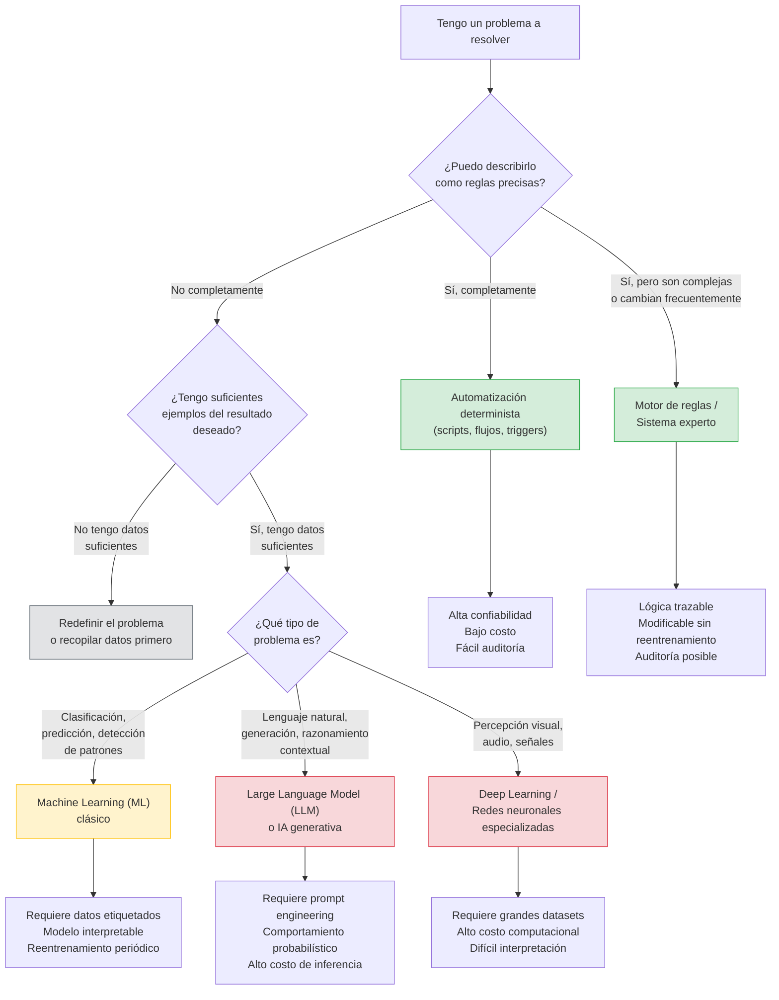

# Ingeniería de IA desde los Fundamentos

---

**Módulo:** I — Los Fundamentos de la Inteligencia Artificial
**Capítulo:** 2 — ¿Por qué nació la Inteligencia Artificial?
**Versión:** 0.5 (Revisión conceptual)
**Estado:** Borrador en revisión

---

## Objetivos de aprendizaje

Al finalizar este capítulo serás capaz de:

1. Explicar cuál fue la motivación original que dio origen a la Inteligencia Artificial (IA), distinguiendo entre razones filosóficas, científicas y prácticas.
2. Diferenciar con precisión automatización, programación tradicional e inteligencia artificial en al menos tres niveles de análisis.
3. Identificar qué tipo de problema justifica el uso de IA y cuándo una solución más simple es la elección correcta.
4. Aplicar el criterio "problema primero, herramienta después" ante requerimientos empresariales concretos.
5. Evaluar escenarios reales y determinar si la IA aportaría valor o si existe una alternativa más adecuada y menos costosa.
6. Articular por qué comprender el origen histórico y filosófico de la IA mejora la calidad de las decisiones técnicas actuales.

---

## Introducción

Después de preguntarnos qué entendemos por inteligencia, aparece una segunda pregunta inevitable:

> ¿Por qué alguien quiso construir una inteligencia artificial?

La respuesta parece obvia: "para reemplazar personas". Sin embargo, esa respuesta es históricamente incorrecta, conceptualmente imprecisa y profesionalmente peligrosa.

La Inteligencia Artificial no nació para reemplazar trabajadores. Tampoco nació para escribir textos, generar imágenes ni programar código. Nació porque el ser humano siempre intentó comprender cómo funciona la inteligencia. Desde Aristóteles sistematizando la lógica, hasta Leibniz imaginando una máquina capaz de calcular verdades, hasta Turing preguntándose si una máquina podría engañar a un humano: la pregunta original no fue "¿cómo automatizo una tarea?" sino "¿puede una máquina razonar?".

Esa distinción no es trivial. Define el tipo de problemas para los que la IA fue diseñada, los límites que todavía enfrenta, y el criterio que debe guiar a cualquier arquitecto que decida cuándo utilizarla. Este capítulo explora esa pregunta original, la contrasta con la automatización, y construye el primer principio de diseño que atravesará todo el libro: el punto de partida siempre es el problema, nunca la herramienta.

---

## Motivación del problema

### ¿Qué problema intentaba resolver la IA?

Para entender por qué nació la IA, hay que entender primero qué problema no podía resolver la informática clásica.

La programación tradicional opera sobre un principio elegante y poderoso: si podemos describir un proceso como una secuencia de reglas precisas, podemos codificarlo y una computadora lo ejecutará con velocidad, escala y exactitud imposibles para un ser humano. Ordenar una lista, calcular un impuesto, verificar un formato de correo electrónico: son problemas perfectamente adecuados para este enfoque.

El problema aparece cuando intentamos describir mediante reglas algo que nosotros mismos hacemos sin poder articular las reglas que seguimos.

¿Cómo le explicarías a una computadora qué hace que una frase sea ambigua? ¿Cómo la instruirías para reconocer si una imagen contiene un perro o un lobo? ¿Cómo la programarías para detectar si un correo electrónico es hostil o simplemente directo?

Los seres humanos resolvemos estos problemas constantemente, con aparente facilidad, sin poder explicar el proceso exacto que seguimos. Ante ese límite, la pregunta científica fue inevitable: ¿podría una máquina aprender a resolver esos problemas observando ejemplos, en lugar de seguir reglas dictadas por un programador?

Esa pregunta es el origen de la IA. No la conveniencia comercial. No la eficiencia operativa. La pregunta científica sobre si el pensamiento podía describirse, y por lo tanto reproducirse.

---

## Desarrollo conceptual desde primeros principios

### El espectro entre automatizar y razonar

Uno de los errores más frecuentes en proyectos tecnológicos es tratar "automatización" e "inteligencia artificial" como sinónimos. No lo son. Tampoco son opuestos: forman un espectro continuo, y comprender dónde se ubica cada tipo de sistema es fundamental para tomar decisiones correctas.

Analicemos ese espectro en tres niveles.

---

#### Nivel 1: Automatización determinista

Un sistema determinista ejecuta exactamente lo que se le instruyó, en cada ejecución, sin importar el contexto. No aprende. No adapta. No interpreta.

Ejemplos:

- Un reloj mecánico marcando la hora.
- Un termostato que enciende la calefacción cuando la temperatura baja de 20°C.
- Un script que renombra archivos según un patrón fijo.
- Un flujo de trabajo que envía un correo cuando se registra una venta.

Estos sistemas son valiosos, confiables y fáciles de mantener. La paradoja es que muchos proyectos que hoy se presentan como "proyectos de IA" podrían resolverse con automatización determinista, a una fracción del costo y la complejidad.

La característica definitoria es esta: si el comportamiento correcto puede describirse completamente como una secuencia de reglas sin ambigüedad, no se necesita IA.

---

#### Nivel 2: Programación basada en reglas con mayor complejidad

Un paso más allá de la automatización simple encontramos sistemas que implementan lógica de negocio compleja mediante reglas: motores de decisión, árboles de condiciones, sistemas expertos.

Ejemplos:

- Un motor de crédito que aprueba o rechaza solicitudes según condiciones codificadas.
- Un sistema de alertas que genera notificaciones cuando ciertos indicadores superan umbrales.
- Un chatbot basado en árboles de decisión con respuestas fijas.

Estos sistemas son más sofisticados que la automatización simple, pero siguen siendo deterministas. Alguien tuvo que escribir cada regla. El sistema no puede manejar situaciones que no fueron anticipadas. Y a medida que el dominio crece en complejidad, el conjunto de reglas se vuelve inmanejable.

Aquí empieza a aparecer el límite de la programación tradicional.

---

#### Nivel 3: Inteligencia artificial y aprendizaje automático

El Machine Learning (ML) surgió para responder a una pregunta específica: ¿puede un sistema inferir las reglas por sí mismo, a partir de ejemplos, sin que un programador las defina explícitamente?

La respuesta fue sí, bajo ciertas condiciones. Un modelo de Machine Learning no ejecuta reglas escritas a mano. Aprende patrones estadísticos de los datos de entrenamiento y los generaliza a nuevos casos.

Ejemplos:

- Un modelo que clasifica correos como spam o no spam, aprendiendo de millones de ejemplos etiquetados.
- Un sistema de detección de fraude que aprende patrones anómalos de transacciones históricas.
- Un Large Language Model (LLM) que genera texto coherente y contextualmente relevante porque fue entrenado sobre una proporción masiva del texto producido por la humanidad.

La característica definitoria es esta: si el comportamiento correcto no puede describirse completamente como reglas sin ambigüedad, pero existe una cantidad suficiente de ejemplos del resultado deseado, entonces ML puede ser apropiado.

---

#### Los tres niveles como criterio de diseño

La distinción no es solo conceptual. Es una herramienta de diagnóstico que todo arquitecto debería aplicar antes de proponer cualquier solución:

1. ¿Puede describirse el problema completamente como reglas precisas? → Automatización determinista.
2. ¿Las reglas existen pero son demasiadas o cambian frecuentemente? → Reglas con motor de decisión.
3. ¿El problema no puede describirse como reglas pero existen suficientes ejemplos? → Machine Learning o IA.

Este criterio evita el error de introducir complejidad innecesaria. Un sistema de IA es más costoso de desarrollar, más difícil de mantener, más opaco en su comportamiento y más exigente en cuanto a datos. Solo tiene sentido cuando el problema lo justifica.

---

### Las motivaciones originales de la IA

Más allá de la taxonomía técnica, conviene entender por qué los fundadores del campo decidieron construir la IA. Las motivaciones no fueron puramente instrumentales.

**Comprendernos mejor.** Intentar construir un sistema que razone obliga a preguntarse cómo razonamos nosotros. Paradójicamente, muchos avances en IA generaron insights sobre psicología cognitiva y neurociencia. El esfuerzo de formalizar la inteligencia humana para reproducirla nos ayudó a entenderla mejor.

**Resolver problemas donde las reglas son insuficientes.** Traducción automática, reconocimiento de voz, diagnóstico médico por imágenes, detección de fraude en tiempo real: estos problemas tienen en común que las reglas necesarias son demasiado numerosas, demasiado sutiles o demasiado cambiantes para codificarse a mano. La IA no surgió para reemplazar la programación donde funciona, sino para extender sus capacidades donde no alcanza.

**Ampliar las capacidades humanas.** Del mismo modo que una calculadora amplía nuestra capacidad aritmética sin reemplazar nuestro razonamiento matemático, un LLM puede ampliar nuestra capacidad de análisis, síntesis y generación de alternativas sin reemplazar el criterio profesional. La herramienta no decide. El profesional decide.

---

## Analogía

Imaginá a un sommelier experimentado. Si le preguntás qué vino marida mejor con un plato, dará una respuesta precisa y justificada. Sin embargo, si le pedís que escriba las reglas exactas que siguió para llegar a esa conclusión, la tarea se vuelve extraordinariamente difícil. El conocimiento existe, pero no está codificado en reglas explícitas: está distribuido en miles de experiencias, sensaciones y comparaciones.

Eso es exactamente el tipo de problema para el que fue creado el Machine Learning. No para ejecutar lo que ya sabemos describir con precisión, sino para aprender lo que sabemos hacer pero no podemos articular completamente.

Un termostato no necesita aprender. El sommelier no podría funcionar como termostato. Ambos son valiosos. Ninguno reemplaza al otro. La confusión ocurre cuando intentamos usar uno donde corresponde el otro.

---

## Diagrama Mermaid

El siguiente diagrama muestra el espectro completo desde la automatización hasta la IA, con los criterios que determinan en qué punto se ubica cada tipo de sistema.



**Lectura del diagrama:** El color verde indica sistemas relativamente simples de construir y mantener. El amarillo indica complejidad media. El rojo indica alta complejidad, alto costo y comportamiento probabilístico. La mayoría de los proyectos deberían aspirar al verde siempre que sea posible.

---

## Ejemplo real

### Caso: Soluciones Empresariales Meridian S.A.

Meridian es una empresa de servicios financieros con 800 empleados y operaciones en tres países. Su equipo directivo decidió que la empresa debía "adoptar IA" durante el año fiscal. El área de tecnología recibió el mandato y comenzó a evaluar plataformas.

Tres meses después, un arquitecto de soluciones revisó los proyectos en curso y encontró lo siguiente:

---

**Proyecto 1: Notificaciones automáticas de vencimiento de contratos.**

El requerimiento era enviar un correo electrónico a los clientes cuando un contrato estaba a 30 días de vencer. El equipo estaba evaluando integrar un LLM para "personalizar" los mensajes.

Diagnóstico del arquitecto: el 95% del valor del proyecto estaba en la notificación en sí, no en la personalización del texto. Un flujo de automatización con una plantilla de correo resolvería el problema en dos días. El LLM agregaría costo, latencia y un punto de falla sin impacto medible en el resultado de negocio.

Decisión: automatización determinista. No se usó IA.

---

**Proyecto 2: Clasificación de reclamos de clientes.**

El equipo de atención recibía entre 400 y 600 reclamos por semana en formato de texto libre, provenientes de correos, formularios y chat. Clasificarlos manualmente para derivarlos al área correcta consumía tiempo significativo e introducía errores.

Diagnóstico del arquitecto: el lenguaje natural, la variabilidad en la redacción de los clientes y la cantidad de categorías posibles hacían que las reglas explícitas no fueran viables. El equipo tenía 18 meses de reclamos históricos con etiquetas de clasificación correctas.

Decisión: modelo de clasificación de texto entrenado sobre datos históricos, o alternativamente un LLM con pocas muestras de cada categoría (few-shot classification). La IA aportaba valor real.

---

**Proyecto 3: Consulta del Data Warehouse en lenguaje natural.**

Los gerentes de área querían poder hacer preguntas en español y obtener datos del Data Warehouse sin depender del equipo de BI. La propuesta inicial era "reemplazar el Data Warehouse con IA".

Diagnóstico del arquitecto: el Data Warehouse seguía siendo necesario. La IA no almacena ni gestiona datos estructurados con confiabilidad transaccional. Lo que podía hacer un LLM era interpretar la intención del usuario expresada en lenguaje natural y traducirla en una consulta SQL que luego se ejecutaría sobre el Data Warehouse existente. La IA complementa la infraestructura, no la reemplaza.

Decisión: arquitectura de texto-a-SQL con validación del esquema. La IA resuelve la capa de interpretación; la base de datos sigue siendo la fuente de verdad.

---

Los tres proyectos partían de "necesitamos IA". Solo uno justificaba un modelo de ML clásico o LLM en su núcleo. Los otros dos habrían sido casos de sobre-ingeniería costosa si no se hubiera aplicado el criterio correcto.

---

## Conversación con un arquitecto

La siguiente conversación ocurre en la sala de reuniones de una empresa de logística durante la revisión de la hoja de ruta tecnológica anual.

---

**Directora de Operaciones:** Necesitamos poner Inteligencia Artificial en la empresa. El mercado avanza y no podemos quedarnos atrás.

**Arquitecto:** De acuerdo. ¿Qué problema queremos resolver?

**Directora de Operaciones:** Bueno... varios. Eficiencia, reducción de costos, mejor experiencia del cliente. Lo que hacen todos.

**Arquitecto:** Entiendo la dirección. Vamos caso por caso. ¿Cuál es el problema que más impacto tendría resolver en los próximos seis meses?

**Directora de Operaciones:** Creo que el mayor problema es la cantidad de reclamos que llegan por demoras en entregas. Nuestro equipo de atención no da abasto para responderlos todos en tiempo.

**Arquitecto:** Bien. Ahí tengo algunas preguntas. ¿Cuántos reclamos por día aproximadamente? ¿En qué canales llegan? ¿En qué formato? ¿Qué responde hoy el equipo de atención, siempre lo mismo o varía mucho?

**Directora de Operaciones:** Unos 300 por día, mayormente por correo y WhatsApp. El 70% son consultas sobre el estado de un envío. El 30% son reclamos más complejos sobre daños o demoras prolongadas.

**Arquitecto:** Eso cambia bastante la solución. El 70% no necesita IA: necesita integración con el sistema de tracking para que el cliente pueda consultarlo directamente o recibir una respuesta automática con el estado real. Solo el 30% restante, los casos complejos, podría beneficiarse de un modelo que ayude a priorizar o a sugerir respuestas al agente. Son dos proyectos distintos con dos niveles de complejidad muy diferentes. ¿Empezamos por donde hay más impacto con menos riesgo?

**Directora de Operaciones:** Eso tiene mucho más sentido que lo que nos propuso el proveedor anterior, que quería implementar IA en todo el proceso.

**Arquitecto:** El objetivo no es maximizar el uso de IA. Es resolver el problema de la manera más efectiva posible. A veces eso implica IA. A veces, no.

---

## Errores frecuentes

### Error 1: Llamar IA a cualquier sistema automático

Este es el error más extendido y el más peligroso porque contamina la toma de decisiones desde el inicio.

Un sistema que envía alertas cuando un valor supera un umbral no es IA. Un motor de reglas que aprueba o rechaza créditos según criterios codificados no es IA. Un chatbot con respuestas fijas en un árbol de decisiones no es IA.

Usar el término IA para describir estos sistemas no solo es incorrecto: crea expectativas equivocadas sobre sus capacidades, dificulta la comunicación técnica con el equipo, complica la evaluación de alternativas y puede llevar a decisiones de arquitectura mal fundamentadas.

La distinción importa porque los sistemas de IA tienen características específicas: comportamiento probabilístico, necesidad de datos de entrenamiento, riesgo de sesgo, necesidad de monitoreo continuo, costo de inferencia. Llamar IA a algo que no lo es oculta todas esas características y sus implicaciones.

---

### Error 2: Comenzar por la herramienta, no por el problema

"Queremos implementar GPT-4 en nuestra empresa" no es un requerimiento. Es una solución buscando un problema.

Este patrón es frecuente cuando la adopción tecnológica está impulsada por presión competitiva o tendencia de mercado en lugar de por una necesidad concreta identificada. El resultado típico es un proyecto que genera un prototipo impressive pero que no resuelve ningún problema real de negocio, o que resuelve un problema que podría haberse resuelto de manera mucho más simple.

El costo no es solo económico. Introducir un LLM en un proceso que no lo necesita agrega latencia, variabilidad en las respuestas, riesgo de alucinaciones, dependencia de un proveedor externo y costo de inferencia recurrente. Si el problema no lo justifica, todos esos costos son innecesarios.

El principio correcto: primero articular el problema con precisión, luego evaluar las opciones, luego seleccionar la herramienta más simple que resuelva el problema con el nivel de confiabilidad requerido.

---

### Error 3: Creer que la IA reemplaza la infraestructura existente

Un LLM no es una base de datos. No almacena información de manera estructurada. No garantiza consistencia transaccional. No puede consultarse con SQL. No tiene una versión "actual" de los datos de tu empresa.

Un modelo de clasificación no es un motor de reglas. No puede explicar su decisión en términos legibles por un auditor. No garantiza el mismo resultado ante la misma entrada (en modelos con temperatura mayor a 0). No puede modificarse sin reentrenamiento.

La confusión entre lo que la IA puede hacer y lo que la infraestructura de datos hace genera propuestas de arquitectura peligrosas: "reemplazamos el Data Warehouse con IA", "ya no necesitamos reglas de negocio, el modelo las aprenderá solo", "no hace falta documentar el proceso, el modelo lo infiere".

La IA complementa la infraestructura. No la reemplaza. Un arquitecto que entiende esto puede diseñar sistemas donde cada componente cumple el rol para el que fue diseñado.

---

### Error 4: Ignorar el costo de los datos

Los modelos de Machine Learning aprenden de datos. Sin datos suficientes, relevantes y de calidad, no hay modelo que funcione.

El error frecuente es asumir que los datos "ya están" porque la empresa tiene un sistema de registro. Tener datos almacenados no significa tener datos de entrenamiento listos. Los datos pueden estar sin etiquetar, distribuidos entre sistemas sin integración, con sesgo histórico, con valores faltantes, con definiciones inconsistentes entre áreas.

Antes de proponer un proyecto de ML, la pregunta obligatoria es: ¿qué datos existen, en qué calidad, con qué etiquetas, y cuánto tiempo requeriría prepararlos? La respuesta a esa pregunta suele cambiar radicalmente el alcance y el costo del proyecto.

---

## Buenas prácticas

**1. Articular el problema antes de evaluar soluciones.**
Antes de mencionar cualquier tecnología, escribir en una sola oración qué problema se quiere resolver, quién lo experimenta, qué impacto tiene y cómo se mediría una solución exitosa. Si no es posible articularlo en una oración, el problema no está suficientemente claro.

**2. Aplicar el principio del mínimo sistema viable.**
Evaluar siempre primero si el problema puede resolverse con automatización simple. Si puede, no agregar complejidad. Si no puede, evaluar reglas complejas. Si tampoco alcanza, evaluar ML. Si el problema involucra lenguaje natural o razonamiento contextual, evaluar LLM. Moverse hacia la derecha del espectro solo cuando sea necesario.

**3. Separar el componente de IA del resto del sistema.**
En un sistema bien diseñado, el modelo de IA es un componente con una interfaz clara: recibe una entrada, devuelve una salida. El resto del sistema no depende de los internos del modelo. Esto permite reemplazar o actualizar el modelo sin modificar la arquitectura del sistema.

**4. Documentar el criterio de decisión.**
Cuando se decide usar IA (o cuando se decide no usarla), documentar el razonamiento. Qué alternativas se evaluaron, por qué se descartaron, qué evidencia justificó la elección. Ese documento es valioso para revisiones futuras y para comunicar la decisión a stakeholders no técnicos.

**5. Planificar el monitoreo desde el diseño.**
Un sistema de automatización falla de manera obvia: o funciona o no funciona. Un modelo de IA puede degradarse silenciosamente: sigue produciendo salidas, pero su precisión disminuye porque el mundo cambió y los datos de entrenamiento ya no son representativos. El monitoreo de métricas de calidad no es opcional; es parte de la arquitectura.

**6. Tratar la elección de la herramienta como reversible.**
Las decisiones de arquitectura más costosas son las irreversibles. Al introducir IA en un sistema, diseñar de manera que el componente de IA pueda cambiarse o removerse sin refactorizar todo el sistema. Esto reduce el riesgo de dependencia a un proveedor o a un modelo específico.

---

## Laboratorio estructurado

### Diagnóstico de problemas: ¿automatización o IA?

**Objetivo:** Desarrollar el criterio para identificar en qué punto del espectro se ubica un problema real y qué tipo de solución es la más adecuada.

**Nivel:** Introductorio

**Tiempo estimado:** 90 minutos

**Prerrequisitos:**
- Haber leído los capítulos 1 y 2 de este módulo.
- Experiencia básica en desarrollo de software o arquitectura de sistemas.

**Herramientas:**
- Papel y lápiz, o cualquier herramienta de diagramado (draw.io, Miro, Excalidraw).
- Acceso a un LLM de uso libre (ChatGPT, Claude, Gemini) para el paso 5.

---

**Escenario:**

Sos el arquitecto de soluciones de TalentFlow S.A., una empresa de recursos humanos con 400 empleados. El CEO acaba de leer un artículo sobre IA y convocó a una reunión donde expresó cinco iniciativas que quiere implementar "con IA" en el próximo trimestre.

---

**Pasos:**

**Paso 1 — Relevamiento (15 minutos)**

Leer las siguientes cinco iniciativas propuestas por el CEO:

1. "Quiero que cuando un candidato complete el formulario de postulación, el sistema lo registre automáticamente en nuestro ATS (Applicant Tracking System) y le envíe un correo de confirmación."

2. "Quiero que el sistema revise los CVs de los candidatos y los puntúe según qué tan bien se ajustan a cada posición."

3. "Quiero que los empleados puedan hacer preguntas sobre sus beneficios, vacaciones y política de licencias en lenguaje natural, sin tener que buscar en el manual."

4. "Quiero que el sistema nos avise cuando un empleado lleva más de 5 días sin registrar actividad en los sistemas de la empresa."

5. "Quiero que el sistema analice el tono emocional de las respuestas en las encuestas de satisfacción y nos avise si detecta señales de riesgo de rotación."

---

**Paso 2 — Clasificación inicial (20 minutos)**

Para cada iniciativa, completar la siguiente tabla:

| Iniciativa | ¿Puede describirse con reglas precisas? | ¿Existen datos suficientes? | Clasificación preliminar |
|---|---|---|---|
| 1 | | | |
| 2 | | | |
| 3 | | | |
| 4 | | | |
| 5 | | | |

Las opciones de clasificación son: Automatización determinista / Motor de reglas / ML clásico / LLM / Requiere más información.

---

**Paso 3 — Análisis de cada caso (25 minutos)**

Para cada iniciativa, responder:

- ¿Qué problema real resuelve?
- ¿Cuál es la solución más simple posible?
- ¿Qué riesgos introduce si se usa IA donde no es necesario?
- ¿Qué riesgos introduce si no se usa IA donde sería beneficioso?

---

**Paso 4 — Diagrama de decisión (15 minutos)**

Dibujar un diagrama que muestre las cinco iniciativas ubicadas en el espectro de automatización a IA, con flechas que indiquen las dependencias entre ellas (por ejemplo, la iniciativa 3 podría requerir que la iniciativa 1 esté implementada primero).

---

**Paso 5 — Contraste con un LLM (15 minutos)**

Abrir un LLM de uso libre y plantear el siguiente prompt:

```
Soy arquitecto de soluciones en una empresa de recursos humanos. 
El CEO propuso las siguientes cinco iniciativas y quiere implementarlas 
todas con IA. Necesito que analices cada una y me digas si realmente 
requiere IA, o si puede resolverse con automatización simple o con 
reglas de negocio codificadas. Sé específico en el razonamiento.

[Pegar las cinco iniciativas del escenario]
```

Comparar la respuesta del LLM con tu propio análisis. ¿Coincide? ¿En qué difiere? ¿El LLM identificó algo que no habías considerado? ¿Tomó alguna decisión sin la información suficiente?

---

**Validación:**

Al finalizar el laboratorio, deberías poder responder estas preguntas:

- ¿Cuántas de las cinco iniciativas realmente justifican el uso de IA?
- ¿Cuál es la secuencia lógica de implementación considerando complejidad y riesgo?
- ¿Identificaste alguna iniciativa donde el uso de IA podría introducir riesgo ético o legal (por ejemplo, en la puntuación de CVs)?

---

**Reflexión:**

- ¿Cambió tu clasificación inicial durante el análisis profundo? ¿Qué la cambió?
- ¿El CEO estaría de acuerdo con tus conclusiones? ¿Cómo lo convencerías?
- ¿Qué información adicional necesitarías para hacer recomendaciones más precisas?

---

**Desafíos opcionales:**

1. Agregar una sexta iniciativa de tu propio contexto laboral y aplicar el mismo análisis.
2. Estimar el costo de implementación y mantenimiento de cada iniciativa si se usa IA versus si se usa la alternativa más simple.
3. Identificar qué datos serían necesarios para entrenar o configurar los modelos que elegiste para las iniciativas que clasificaste como ML o LLM, y evaluar si esos datos existen hoy en la empresa.

---

## Preguntas de reflexión

1. Un colega argumenta que "todo sistema que toma decisiones automáticas es IA". ¿Cómo refutarías ese argumento con precisión técnica? ¿Qué criterios usarías para distinguir decisión automática de aprendizaje automático?

2. ¿Por qué la pregunta original de la IA ("¿puede una máquina razonar?") sigue siendo relevante para un arquitecto de sistemas en 2025? ¿En qué decisiones concretas de diseño influye esa pregunta?

3. Un LLM moderno produce textos que parecen razonados, contextualmente apropiados y coherentes. ¿Eso lo hace "inteligente" en el sentido original del término? ¿Qué diferencia hay entre producir texto que parece razonado y razonar?

4. Si el 70% de los problemas que las empresas presentan como "proyectos de IA" podrían resolverse con automatización simple, ¿cuál es la responsabilidad de un arquitecto ante un cliente que pide específicamente IA? ¿Se implementa lo que pide o se recomienda lo más adecuado?

5. ¿En qué tipo de problema la falta de datos históricos es un obstáculo insalvable para usar ML? ¿Existen alternativas cuando no hay datos suficientes?

6. La iniciativa de puntuación de CVs en el laboratorio podría introducir sesgos históricos en los procesos de selección. ¿Cómo cambia la decisión de usar IA cuando el impacto recae sobre personas y no solo sobre procesos?

7. ¿Qué significa "ampliar capacidades humanas" en el contexto de un LLM que ayuda a un analista a procesar documentos? ¿Dónde está el límite entre ampliar y desplazar?

---

## Resumen

La Inteligencia Artificial no apareció porque alguien quisiera automatizar una tarea. Apareció porque el ser humano quiso comprender si el pensamiento podía formalizarse, describirse como un proceso y reproducirse en una máquina. Esa pregunta filosófica y científica definió el tipo de problemas que la IA puede abordar, y también sus límites.

El concepto central de este capítulo es el espectro entre automatización e inteligencia. Automatización determinista, motores de reglas y sistemas de ML no son sinónimos: son niveles de complejidad creciente que corresponden a tipos de problemas distintos. Un arquitecto que entiende ese espectro puede elegir la herramienta adecuada para cada problema, evitar la sobre-ingeniería, justificar sus decisiones con rigor y comunicarlas con claridad.

Los tres casos de Meridian y las cinco iniciativas de TalentFlow ilustran el principio en acción: el punto de partida siempre es el problema, articulado con precisión. Desde ahí, la elección de la herramienta es una consecuencia del análisis, no una decisión previa que busca justificación.

La habilidad para distinguir cuándo usar IA y cuándo no hacerlo es, paradójicamente, una de las competencias más valiosas en el campo de la ingeniería de IA.

---

## Checklist del capítulo

Antes de avanzar al siguiente capítulo, verificá que puedas responder afirmativamente a cada punto:

- [ ] Puedo explicar cuál fue la motivación original de la IA sin reducirla a "reemplazar personas" ni a "automatizar tareas".
- [ ] Puedo distinguir automatización determinista, motores de reglas y Machine Learning con criterios concretos y ejemplos propios.
- [ ] Puedo aplicar el criterio del espectro para clasificar un problema dado y recomendar el nivel de solución adecuado.
- [ ] Puedo identificar al menos tres señales de que un proyecto denominado "de IA" no requiere en realidad un modelo de ML.
- [ ] Puedo articular por qué la IA complementa la infraestructura de datos en lugar de reemplazarla.
- [ ] Puedo describir al menos tres riesgos de usar IA donde no es necesario.
- [ ] Completé el laboratorio y registré mis reflexiones sobre los casos de TalentFlow.

---

## Glosario breve

**Automatización determinista:** Sistema que ejecuta una secuencia de reglas fijas sin adaptación ni aprendizaje. El comportamiento está completamente especificado por el programador.

**Inteligencia Artificial (IA):** Campo de la informática dedicado a construir sistemas capaces de realizar tareas que, realizadas por seres humanos, requerirían inteligencia: razonamiento, aprendizaje, comprensión del lenguaje, reconocimiento de patrones.

**Machine Learning (ML) / Aprendizaje Automático:** Subcampo de la IA en el que los sistemas aprenden patrones a partir de datos en lugar de seguir reglas codificadas explícitamente.

**Large Language Model (LLM) / Modelo de Lenguaje Grande:** Modelo de ML entrenado sobre grandes volúmenes de texto, capaz de generar, completar y transformar lenguaje natural de manera contextualmente coherente.

**Motor de reglas:** Sistema que implementa lógica de negocio compleja mediante condiciones codificadas, más sofisticado que la automatización simple pero todavía determinista.

**Comportamiento probabilístico:** Característica de los modelos de ML y LLM en la que la misma entrada puede producir salidas distintas, a diferencia de los sistemas deterministas que siempre producen la misma salida ante la misma entrada.

**Alucinación (en LLMs):** Fenómeno por el cual un LLM genera texto que parece coherente y confiable pero que contiene información incorrecta o inventada. No indica intención de engañar; es una consecuencia de cómo los modelos generan texto.

**Sesgo en modelos de ML:** Tendencia de un modelo entrenado sobre datos históricos a reproducir y en algunos casos amplificar patrones discriminatorios presentes en esos datos.

---

## Próximos pasos / Próximo capítulo

**Capítulo 3 — Historia de la Inteligencia Artificial**

Ahora que comprendemos por qué nació la IA, es el momento de recorrer cómo evolucionó. No como una línea de tiempo de hitos, sino como una sucesión de problemas que generaron ideas, de expectativas que chocaron con la realidad, y de fracasos que abrieron los caminos que hoy recorremos.

La historia de la IA no es lineal ni triunfal. Es la historia de un campo que aprendió de sus propios límites.

---

> "Un arquitecto no memoriza respuestas. Comprende problemas para poder diseñar soluciones."
