# Ingeniería de IA desde los Fundamentos

## Módulo I — Los Fundamentos de la Inteligencia Artificial

## Capítulo 3 — Historia de la Inteligencia Artificial

**Versión:** 0.5 (Revisión conceptual)
**Estado:** En revisión

---

## 1. Objetivos de aprendizaje

Al finalizar este capítulo deberías poder:

1. Identificar las principales etapas de la historia de la Inteligencia Artificial (IA) y el problema concreto que cada una intentó resolver.
2. Explicar por qué la evolución de la IA no fue lineal y qué rol jugaron los ciclos de entusiasmo y retracción.
3. Analizar los factores que produjeron los "inviernos" de la IA y reconocer sus señales en el contexto tecnológico actual.
4. Distinguir el aporte diferencial de Machine Learning (ML), Deep Learning (DL) y la arquitectura Transformer.
5. Argumentar por qué los Large Language Models (LLMs) son el resultado de décadas de trabajo acumulado, no una aparición repentina.
6. Aplicar el patrón problema → solución → límite como herramienta de análisis para evaluar tecnologías emergentes.

---

## 2. Introducción

La historia de la Inteligencia Artificial suele narrarse como una lista de hitos gloriosos: la conferencia de Dartmouth, la primera red neuronal, AlphaGo, ChatGPT. Esa narrativa es atractiva y fácil de recordar, pero tiene un problema: omite los fracasos, los períodos de silencio y los cambios de dirección que, en realidad, son los momentos más instructivos.

Este capítulo propone otra lectura. La historia de la IA no es la historia de los éxitos. Es la historia de una serie de problemas que la humanidad intentó resolver, soluciones que funcionaron hasta cierto punto, y límites que forzaron repensar todo desde el principio. Ese patrón —problema, solución, límite— se repite con notable consistencia a lo largo de siete décadas de investigación.

Por qué importa esto para un arquitecto o ingeniero de sistemas que trabaja hoy con LLMs y herramientas de IA generativa. Porque quien no comprende por qué apareció cada solución, tampoco comprende cuándo esa solución deja de ser adecuada. Y en tecnología, ese momento llega siempre.

---

## 3. Motivación del problema: ¿Para qué estudiar historia si trabajamos en el presente?

Es una pregunta legítima. Los frameworks evolucionan, los modelos se actualizan, las API cambian. ¿Qué aporta estudiar lo que se hacía en 1956?

La respuesta es: contexto de decisión.

Cada vez que un equipo evalúa si adoptar un modelo preentrenado o entrenar uno propio, está respondiendo una pregunta que la comunidad de investigación lleva décadas reformulando. Cada vez que alguien decide no usar IA porque "no funciona para este caso", puede estar repitiendo los errores de quienes descartaron ML en los noventa porque los resultados iniciales eran pobres. Cada vez que un directivo cree que la IA resolverá todos los problemas en los próximos dos años, está reproduciendo exactamente el mismo optimismo que llevó al primer invierno de la IA.

La historia no es un conjunto de anécdotas. Es un mapa de patrones que se repiten. Y un arquitecto que reconoce patrones toma mejores decisiones.

---

## 4. Desarrollo conceptual desde primeros principios

### 4.1 Antes de las computadoras — El problema del pensamiento formal

**Problema:** ¿Es posible describir el razonamiento humano mediante reglas explícitas?

Antes de que existiera ninguna computadora, la pregunta ya existía. Aristóteles formalizó la lógica deductiva: si se conocen las premisas y las reglas, la conclusión puede derivarse mecánicamente. Leibniz, siglos después, soñó con una "calculus ratiocinator", una máquina capaz de razonar mediante símbolos. Boole desarrolló el álgebra que lleva su nombre, base de toda la computación binaria. Russell y Whitehead intentaron reducir toda la matemática a lógica formal en los "Principia Mathematica".

**Solución parcial:** La lógica simbólica demostró que ciertos tipos de razonamiento podían codificarse formalmente.

**Límite encontrado:** El mundo real es demasiado complejo para ser capturado completamente por reglas explícitas. El número de reglas necesarias crece de forma inmanejable. Y hay conocimiento que los humanos aplican pero que no saben cómo articular: el conocimiento tácito.

Este límite es fundamental. La idea de que "si lo podemos describir, lo podemos automatizar" es correcta en dominios cerrados y formales. En el mundo abierto, es insuficiente.

---

### 4.2 El nacimiento de la computación — El problema de la ejecución automática

**Problema:** ¿Podemos construir una máquina que ejecute instrucciones de forma repetitiva y confiable?

En la década de 1930, Alan Turing definió formalmente qué es una computación. Su modelo teórico —la máquina de Turing— demostró que cualquier proceso computable podía ejecutarse mediante una combinación de estados, símbolos y reglas de transición. John von Neumann diseñó la arquitectura de las computadoras modernas, separando memoria de procesamiento. El ENIAC, en 1945, fue una de las primeras máquinas electrónicas capaces de ejecutar programas de propósito general.

**Solución parcial:** Las computadoras podían ejecutar instrucciones a velocidades imposibles para un ser humano, sin fatigarse y sin cometer errores de transcripción.

**Límite encontrado:** Una computadora ejecuta exactamente lo que se le indica. No hace nada más. El problema de construir inteligencia se redujo entonces a: ¿cómo describimos en instrucciones todo lo que necesita saber una máquina para comportarse de forma inteligente?

---

### 4.3 El nacimiento formal de la IA — El problema de la ingeniería de la inteligencia

**Problema:** ¿Puede estudiarse la inteligencia como un problema de ingeniería, independientemente de su sustrato biológico?

En el verano de 1956, un grupo de investigadores se reunió en el Dartmouth College, en New Hampshire. John McCarthy, Marvin Minsky, Nathaniel Rochester y Claude Shannon, entre otros, redactaron una propuesta que contenía una afirmación entonces radical: "cada aspecto del aprendizaje o cualquier otra característica de la inteligencia puede en principio ser descrita con suficiente precisión para que una máquina la simule."

La conferencia de Dartmouth no produjo ningún avance técnico inmediato. Su importancia fue otra: definió a la Inteligencia Artificial como disciplina y estableció que la pregunta era legítima y abordable. Antes de Dartmouth, investigar IA era estudiar filosofía o neurología. Después de Dartmouth, existía un campo propio.

**Solución parcial:** Se formalizaron los primeros programas capaces de jugar al ajedrez, demostrar teoremas matemáticos y resolver problemas de planificación en dominios acotados.

**Límite encontrado:** Los programas funcionaban excepcionalmente bien en dominios cerrados con reglas explícitas. Eran completamente inútiles en dominios abiertos. Demostrar un teorema matemático no implica poder leer una oración en lenguaje natural.

---

### 4.4 Los primeros años de entusiasmo — El problema de la escala

**Problema:** Si los primeros programas son prometedores en dominios pequeños, ¿qué impide escalarlos al mundo real?

Entre 1956 y 1974, el campo vivió un período de euforia. Herbert Simon predijo en 1957 que en diez años una computadora sería el ajedrecista número uno del mundo y demostraría un teorema matemático significativo. Marvin Minsky afirmó en 1970 que en tres a ocho años habría una máquina con inteligencia general comparable a la humana.

Los fondos fluyeron. Los laboratorios crecieron. Los avances en dominios acotados eran reales y espectaculares.

**Solución parcial:** Los sistemas de IA simbólica —basados en reglas lógicas escritas por expertos— resolvían problemas específicos razonablemente bien.

**Límite encontrado:** El optimismo ignoró tres problemas estructurales que no se podían resolver simplemente con más presupuesto:

1. **El problema de la combinatoria:** El número de estados posibles en un problema real crece de forma exponencial. El ajedrez tiene aproximadamente 10⁴³ posiciones legales. El mundo real tiene infinitamente más.
2. **El problema del conocimiento tácito:** Los seres humanos aplican conocimiento que no pueden verbalizar. Un niño de tres años distingue un perro de un gato sin poder explicar cómo lo hace. No existe ningún conjunto de reglas explícitas que capture ese proceso.
3. **El problema del sentido común:** Los sistemas simbólicos no podían transferir conocimiento entre dominios. Un programa que sabía resolver ecuaciones no podía responder qué sucede si dejas un cubo de hielo al sol.

---

### 4.5 El primer Invierno de la IA (1974–1980) — El problema de las expectativas

**Problema:** Las promesas no se cumplieron. ¿Qué hacer cuando la tecnología no alcanza las predicciones?

El Informe Lighthill, publicado en el Reino Unido en 1973, fue devastador. James Lighthill, encargado de evaluar el estado de la IA, concluyó que ninguna parte del campo había producido los descubrimientos importantes que prometía. En 1974, la financiación de la DARPA a proyectos de IA fue recortada drásticamente. En el Reino Unido, el gobierno eliminó casi toda la financiación universitaria al área.

**Solución parcial:** La comunidad de investigadores reorganizó sus expectativas. Los sistemas expertos —programas diseñados para resolver problemas en un dominio muy específico usando reglas codificadas por especialistas— demostraron ser útiles y comercialmente viables.

**Límite encontrado:** Los sistemas expertos tenían dos problemas irresolubles. Primero, el costo de mantenimiento: cada cambio en el dominio requería reescribir las reglas manualmente. Segundo, la escala: un sistema experto de medicina podía tener decenas de miles de reglas, pero seguía siendo incapaz de razonar sobre casos que no habían sido previstos explícitamente.

---

### 4.6 El segundo Invierno de la IA (1987–1993) — El problema del costo de las reglas

**Problema:** Los sistemas expertos eran costosos de mantener y no generalizaban. ¿Había una alternativa?

En la segunda mitad de los ochenta, el mercado de hardware especializado para IA colapsó. Las computadoras de propósito general se volvieron más potentes y más baratas que las máquinas Lisp diseñadas para IA simbólica. Los sistemas expertos corporativos fracasaron en producción porque nadie había previsto el costo de actualizarlos continuamente. La DARPA redujo nuevamente el financiamiento.

**Lección estructural de ambos inviernos:** No fueron fracasos de la investigación. Fueron fracasos de expectativas. La tecnología avanzaba, pero más lento que lo prometido. Cuando la brecha entre promesa y realidad se vuelve visible, el financiamiento colapsa. Este patrón —entusiasmo excesivo, decepción, retracción— es predecible y recurrente. Se llama el ciclo de Gartner, aunque Gartner lo formalizó mucho después de que el fenómeno ocurriera.

---

### 4.7 Machine Learning — El problema del conocimiento explícito

**Problema:** ¿Y si en lugar de escribir las reglas, dejamos que el sistema las aprenda a partir de ejemplos?

Este fue el cambio de paradigma más importante de la historia de la IA. La IA simbólica preguntaba: ¿cómo codificamos el conocimiento? El Machine Learning preguntó: ¿cómo lo adquirimos?

La idea no era completamente nueva. Frank Rosenblatt había propuesto el perceptrón en 1958. Backpropagation —el algoritmo que permite a las redes neuronales aprender ajustando sus pesos— fue redescubierto y formalizado por Rumelhart, Hinton y Williams en 1986. Pero fue durante los noventa y la primera década del 2000 cuando el ML comenzó a producir resultados prácticos en reconocimiento de voz, visión por computadora y clasificación de textos.

**Solución:** En lugar de codificar reglas, se alimenta al sistema con datos etiquetados (ejemplos de entrada y salida esperada) y un algoritmo de optimización que ajusta los parámetros del modelo para minimizar el error.

**Límite encontrado:** El ML clásico dependía fuertemente del diseño manual de características (*feature engineering*). Un ingeniero debía decidir qué atributos del dato importaban antes de entrenar el modelo. Ese proceso era costoso, requería expertos en el dominio y generaba cuellos de botella.

---

### 4.8 Deep Learning — El problema del feature engineering

**Problema:** ¿Puede el sistema aprender sus propias representaciones intermedias sin que un humano decida qué atributos son relevantes?

La respuesta llegó con las redes neuronales profundas. La idea era simple en principio: en lugar de una capa de procesamiento, usar muchas capas apiladas. Cada capa aprende representaciones progresivamente más abstractas del dato original. Una red que procesa imágenes aprende primero bordes, luego formas, luego partes de objetos, luego objetos completos.

El problema era computacional. Entrenar redes de muchas capas requería una cantidad de operaciones matemáticas que las CPU de la época no podían ejecutar en tiempo razonable.

El punto de inflexión llegó en 2012. El equipo de Geoff Hinton en la Universidad de Toronto entrenó AlexNet, una red neuronal profunda, en GPU (Unidades de Procesamiento Gráfico) originalmente diseñadas para videojuegos. AlexNet redujo a la mitad el error en el benchmark de clasificación de imágenes ImageNet comparado con el mejor método anterior. Fue el momento en que la comunidad de visión por computadora —y pronto todo el campo— abandonó los métodos tradicionales.

Entre 2012 y 2017, el DL dominó reconocimiento de imágenes, reconocimiento de voz, traducción automática y síntesis de audio.

**Límite encontrado:** Las arquitecturas dominantes —Redes Neuronales Recurrentes (RNN) y LSTM— procesaban texto de forma secuencial, palabra por palabra. Eso creaba dos problemas. Primero, el entrenamiento era difícil de paralelizar: no podías calcular el estado en el paso N sin haber calculado el N-1. Segundo, la información de contextos largos se degradaba: una oración de 200 palabras era difícil de procesar porque los gradientes se atenuaban a lo largo de la secuencia.

---

### 4.9 La Revolución Transformer — El problema de la secuencialidad y el contexto largo

**Problema:** ¿Cómo procesar texto de manera paralela y mantener relaciones de contexto a larga distancia?

En 2017, un equipo de investigadores de Google Brain publicó un artículo titulado *"Attention Is All You Need"*. El mecanismo central de la propuesta —la atención multi-cabeza— permitía a cada token de una secuencia consultar directamente cualquier otro token, independientemente de la distancia. Ya no era necesario procesar de forma secuencial.

Las consecuencias fueron inmediatas:

1. El entrenamiento podía paralelizarse masivamente en GPU y TPU.
2. Los modelos podían manejar contextos mucho más largos sin degradación de información.
3. La misma arquitectura funcionaba para múltiples tareas: traducción, clasificación, generación.

**Solución:** La arquitectura Transformer reemplazó a las RNN en casi todas las aplicaciones de procesamiento de lenguaje natural en menos de tres años.

**Límite actual:** El entrenamiento de modelos Transformer a escala requiere cantidades masivas de datos y cómputo. Los modelos grandes consumen recursos energéticos significativos. La inferencia en tiempo real es costosa. El contexto, aunque más largo, sigue siendo finito. Y la arquitectura tiene dificultades con razonamiento causal y con tareas que requieren más pasos de cómputo que tokens disponibles.

---

### 4.10 La era de los LLM — El problema de la generalización a partir del lenguaje

**Problema:** ¿Puede un único modelo entrenado sobre texto generalizar a tareas de razonamiento, programación, análisis y diálogo?

Los Large Language Models (LLMs) demostraron que la respuesta es sí, dentro de límites. GPT-2 (2019) mostró que un modelo entrenado en texto podía generar narrativa coherente. GPT-3 (2020) demostró que con suficiente escala, el modelo podía seguir instrucciones en lenguaje natural sin haber sido entrenado específicamente para ello. BERT (2018), con su arquitectura bidireccional, estableció nuevos estándares en comprensión de texto. En 2022, InstructGPT y luego ChatGPT mostraron que el ajuste fino con retroalimentación humana (RLHF, Reinforcement Learning from Human Feedback) podía alinear el comportamiento del modelo con las expectativas del usuario de forma dramática.

**La lección fundamental:** Nada de esto apareció en 2022. GPT-3 fue posible porque existían transformers (2017), que existían porque había DL (2012), que existía porque había ML (décadas previas), que existía porque había redes neuronales (1958), que existían porque había lógica formal (siglo XIX). Cada capa construyó sobre la anterior.

---

## 5. Analogía — La física del cohete

Cuando el cohete Falcon 9 de SpaceX aterrizó verticalmente por primera vez en 2015, los titulares dijeron "SpaceX lo logró de la noche a la mañana". Lo que los titulares no mostraron fueron los 57 años de investigación en cohetes desde el Sputnik, las decenas de explosiones previas de SpaceX, los cálculos de Tsiolkovsky a principios del siglo XX sobre propulsión de cohetes, y los materiales desarrollados durante décadas para soportar las temperaturas de reentrada.

El lanzamiento fue instantáneo. La preparación llevó un siglo.

Los LLMs son el cohete que aterrizó en 2022. El siglo de preparación fue la historia que acabamos de revisar.

La analogía no simplifica: aclara la estructura causal. Así como un ingeniero aeroespacial necesita entender termodinámica, mecánica orbital y propulsión para diseñar un cohete, un arquitecto de sistemas de IA necesita entender por qué existen los transformers, qué problema resolvieron, y cuáles son sus límites actuales.

---

## 6. Diagrama Mermaid — Línea de tiempo de ciclos problema → solución → límite

```mermaid
timeline
    title Historia de la IA: Ciclos de Problema → Solución → Límite
    section Pre-computación (antes de 1950)
        Problema : ¿Puede describirse el razonamiento con reglas?
        Solución : Lógica simbólica y álgebra de Boole
        Límite   : El conocimiento tácito no se puede codificar explícitamente
    section Computación (1936-1955)
        Problema : ¿Podemos ejecutar instrucciones automáticamente?
        Solución : Máquina de Turing, arquitectura von Neumann, ENIAC
        Límite   : Una máquina ejecuta lo indicado, no generaliza sola
    section Nacimiento IA (1956)
        Problema : ¿Puede estudiarse la inteligencia como ingeniería?
        Solución : Dartmouth — IA como disciplina formal
        Límite   : Solo funciona en dominios cerrados y con reglas explícitas
    section Entusiasmo (1956-1974)
        Problema : ¿Podemos escalar la IA simbólica al mundo real?
        Solución : Sistemas expertos con miles de reglas codificadas
        Límite   : Combinatoria, conocimiento tácito, sin sentido común
    section Primer Invierno (1974-1980)
        Problema : Las promesas no se cumplen. El financiamiento colapsa.
        Solución : Sistemas expertos comerciales en dominios muy específicos
        Límite   : Mantenimiento inviable, no generalizan, altísimo costo
    section Segundo Invierno (1987-1993)
        Problema : Los sistemas expertos fallan en producción
        Solución : Retorno a enfoques estadísticos, primeras redes neuronales
        Límite   : Falta de datos, cómputo insuficiente, feature engineering manual
    section Machine Learning (1990-2012)
        Problema : ¿Podemos aprender reglas desde ejemplos en lugar de codificarlas?
        Solución : Algoritmos supervisados, SVM, árboles de decisión, backpropagation
        Límite   : Requiere feature engineering manual y expertos por dominio
    section Deep Learning (2012-2017)
        Problema : ¿Puede el sistema aprender sus propias representaciones?
        Solución : Redes profundas en GPU — AlexNet 2012
        Límite   : Procesamiento secuencial de texto, contexto largo se degrada
    section Transformer (2017-2020)
        Problema : ¿Cómo procesar texto en paralelo y mantener contexto largo?
        Solución : Attention Is All You Need — mecanismo de atención
        Límite   : Costo masivo de entrenamiento e inferencia, contexto finito
    section Era LLM (2020-hoy)
        Problema : ¿Puede un modelo generalizar a múltiples tareas desde texto?
        Solución : GPT-3, BERT, InstructGPT, ChatGPT, modelos multimodales
        Límite   : Alucinaciones, razonamiento causal, costo energético, alineación
```

---

## 7. Ejemplo real — La lección de los inviernos aplicada hoy

En 2016, varias empresas de tecnología anunciaron que los vehículos autónomos Nivel 5 —sin intervención humana en ninguna condición— estarían disponibles masivamente en 2020. Elon Musk afirmó que Tesla tendría un millón de robotaxis en servicio ese año. Waymo predijo flota comercial a gran escala para la misma fecha.

En 2026, los vehículos autónomos existen en zonas geográficas muy acotadas, con supervisión y condiciones controladas. El problema resultó ser órdenes de magnitud más complejo de lo estimado.

Esto no es un fracaso de la tecnología. Es un fracaso de expectativas que reproduce exactamente el patrón de los inviernos de la IA.

La lección aplicable es concreta: cuando un proveedor de tecnología garantiza que su sistema de IA resolverá un problema complejo en un plazo específico, la respuesta de un arquitecto experimentado es preguntar:

- ¿Qué problema concreto resuelve esta tecnología?
- ¿Qué límites conocidos tiene?
- ¿Qué parte del problema sigue siendo responsabilidad del sistema que la rodea?

Esas tres preguntas no requieren escepticismo. Requieren criterio histórico.

---

## 8. Conversación con un arquitecto

**Director de Tecnología:**
"Necesitamos adoptar IA generativa ya. Nuestros competidores la están usando y la IA va a resolver todos nuestros problemas de productividad. ¿Por qué tantas preguntas antes de empezar?"

**Arquitecto:**
"Entiendo la urgencia. Antes de empezar quiero entender qué problema específico estamos resolviendo. Porque si adoptamos la herramienta antes de entender el problema, terminaremos igual que las empresas que desplegaron sistemas expertos en los ochenta: con costos de mantenimiento que nadie previó."

**Director de Tecnología:**
"Los sistemas expertos son otra cosa. Esto es distinto, la IA de hoy es mucho más poderosa."

**Arquitecto:**
"Es más capaz en ciertos dominios, sí. Pero los LLMs tienen límites precisos: alucinan, no razonan causalmente con garantías, y su comportamiento depende del prompt. Si construimos un proceso crítico sobre esa base sin entender esos límites, el riesgo no es que el sistema sea incapaz, sino que falle de formas que no anticipamos. Y eso es exactamente lo que pasó con los sistemas expertos."

**Director de Tecnología:**
"¿Entonces no recomendás adoptarla?"

**Arquitecto:**
"Recomiendo adoptarla donde el problema es adecuado para sus capacidades. Automatizar generación de borradores, asistir a desarrolladores, clasificar tickets de soporte: esos son casos donde los LLMs funcionan bien y los errores son recuperables. Lo que no recomiendo es construir decisiones irreversibles sobre un modelo que no hemos evaluado. La diferencia es la misma que entre usar un asistente de búsqueda y firmar un contrato basándose en lo que el asistente encontró."

**Director de Tecnología:**
"¿Y cómo evaluamos si un caso de uso es adecuado?"

**Arquitecto:**
"Con la misma pregunta que deberíamos hacernos siempre: ¿qué pasa si el sistema falla? Si el impacto es tolerable y recuperable, seguimos. Si el impacto es sistémico o irreversible, necesitamos controles adicionales antes de depender del modelo."

---

## 9. Errores frecuentes

### Error 1 — Creer que la IA es un fenómeno nuevo

El error más común. Los LLMs aparecieron en el mainstream entre 2022 y 2023, pero la investigación que los hizo posibles comenzó en la década de 1950. Quien cree que la IA es nueva tampoco comprende por qué funciona como funciona, y por lo tanto no puede anticipar sus límites.

**Consecuencia práctica:** Adoptar la tecnología sin entender sus fundamentos lleva a expectativas incorrectas y decisiones de arquitectura frágiles.

### Error 2 — Ignorar los inviernos como advertencia histórica

Los inviernos de la IA no fueron interrupciones en un progreso inevitable. Fueron consecuencias predecibles de un desajuste entre las capacidades reales de la tecnología y las expectativas comunicadas al mundo exterior. Ese desajuste existe hoy. Los modelos actuales tienen límites técnicos concretos que frecuentemente no aparecen en las presentaciones comerciales.

**Consecuencia práctica:** Depender de una tecnología sin evaluar sus límites expone al proyecto a un "invierno privado": cuando el modelo no cumple lo prometido, el proyecto pierde financiamiento o confianza interna.

### Error 3 — Tratar los LLMs como sistemas deterministas

Un sistema experto codificado con reglas produce el mismo resultado ante la misma entrada, siempre. Un LLM es estocástico: ante la misma entrada puede producir respuestas distintas en distintas ejecuciones. Además, puede producir respuestas plausibles pero incorrectas con una confianza que no refleja la precisión real del resultado.

**Consecuencia práctica:** Integrar un LLM en un flujo de trabajo sin mecanismos de validación es equivalente a delegar una decisión a un consultor que a veces inventa las respuestas y no siempre avisa cuándo lo hace.

### Error 4 — Confundir el hito mediático con el hito técnico

La atención pública sobre la IA aumentó dramáticamente con ChatGPT en noviembre de 2022. Pero el hito técnico fue la publicación de *Attention Is All You Need* en 2017, o el entrenamiento de GPT-3 en 2020, o el desarrollo de RLHF que permitió alinear InstructGPT. El momento en que algo llega a los titulares no es el momento en que ocurrió.

**Consecuencia práctica:** Tomar decisiones estratégicas basadas en cobertura mediática, en lugar de en comprensión técnica, lleva a adoptar tecnologías en el peor momento del ciclo de expectativas.

### Error 5 — Pensar que más datos y más cómputo resuelven cualquier problema

El DL demostró que escalar datos y cómputo produce mejoras notables. Eso llevó a algunos a concluir que la escala es la solución universal. Los límites actuales de los LLMs —en razonamiento causal, en aritmética de precisión, en tareas que requieren conocimiento actualizado— no se resuelven únicamente con más parámetros. Requieren arquitecturas o enfoques distintos.

---

## 10. Buenas prácticas

### BP-1 — Aplicar el patrón problema → solución → límite al evaluar cualquier tecnología de IA

Antes de adoptar una herramienta, modelo o plataforma, estructurar tres preguntas: ¿qué problema resuelve concretamente? ¿qué solución propone? ¿cuáles son sus límites documentados? Esta práctica convierte la evaluación de tecnología de una decisión de marketing a una decisión de ingeniería.

### BP-2 — Calibrar las expectativas públicas de forma activa

Una de las causas principales de los inviernos de la IA fue la brecha entre lo que los investigadores prometían y lo que la tecnología podía entregar. Como arquitecto o ingeniero, es responsabilidad tuya comunicar capacidades y limitaciones con precisión, especialmente hacia quienes toman decisiones de negocio. Prometer demasiado hoy es construir el invierno privado del proyecto.

### BP-3 — Diseñar con la hipótesis del fallo

Los LLMs fallan. No con excepciones ni con mensajes de error: fallan produciendo respuestas incorrectas con apariencia de corrección. El diseño de cualquier sistema que integre un LLM debe incluir explícitamente: ¿cómo detectamos un fallo? ¿cuál es el impacto si ocurre? ¿cómo lo mitigamos? Esto no es pesimismo. Es arquitectura.

### BP-4 — Separar el ruido mediático del avance técnico

Seguir publicaciones técnicas —arXiv, blogs de investigación de los laboratorios principales, papers de conferencias como NeurIPS o ICML— en lugar de depender exclusivamente de cobertura periodística. Los avances reales aparecen meses o años antes de que sean noticia. Y muchos titulares no corresponden a avances reales.

### BP-5 — Construir sobre comprensión, no sobre herramientas

Las herramientas cambian. Los frameworks se deprecan. Los proveedores de API modifican sus condiciones. Quien entiende por qué funcionan los transformers puede evaluar cualquier nuevo modelo que aparezca. Quien solo sabe usar una API específica queda atado a esa API.

### BP-6 — Documentar las decisiones de arquitectura y sus fundamentos

Cada decisión técnica tiene un contexto: el problema que resolvía, las alternativas que se descartaron, los límites que se aceptaron. Documentar ese razonamiento —no solo la decisión— permite revisarlo cuando el contexto cambia. Los inviernos de la IA fueron, en parte, consecuencias de no haber documentado correctamente qué se sabía y qué se asumía.

---

## 11. Laboratorio estructurado

### Objetivo

Construir una línea de tiempo de la IA con análisis de ciclos problema → solución → límite, e identificar al menos dos paralelos entre patrones históricos y la situación tecnológica actual.

### Nivel

Introductorio — no requiere conocimientos previos de IA ni programación.

### Tiempo estimado

90 minutos.

### Prerrequisitos

- Haber leído el capítulo completo.
- Acceso a internet para consultar referencias.

### Herramientas

- Editor de texto o hoja de cálculo.
- Opcionalmente: Mermaid Live Editor en [mermaid.live](https://mermaid.live) para construir el diagrama visual.
- Opcionalmente: un asistente conversacional (ChatGPT, Claude, Gemini) para resolver preguntas de contexto.

### Escenario

Sos el arquitecto técnico de una empresa de desarrollo de software que está evaluando adoptar IA generativa en sus flujos de trabajo. El CEO acaba de regresar de una conferencia convencido de que "la IA va a transformar todo en los próximos doce meses". Tu rol es preparar una presentación de contexto histórico que ayude al equipo directivo a tomar decisiones calibradas, ni exageradamente optimistas ni injustificadamente escépticas.

### Pasos

**Paso 1 — Construir la tabla de ciclos (30 minutos)**

Completar la siguiente tabla para cada etapa histórica:

| Etapa | Período aproximado | Problema que enfrentaba | Solución propuesta | Límite encontrado | ¿Relevante hoy? |
|-------|-------------------|------------------------|-------------------|-------------------|-----------------|
| IA simbólica | 1956–1974 | | | | |
| Primer invierno | 1974–1980 | | | | |
| Sistemas expertos | 1980–1987 | | | | |
| Segundo invierno | 1987–1993 | | | | |
| Machine Learning | 1993–2012 | | | | |
| Deep Learning | 2012–2017 | | | | |
| Transformer | 2017–2020 | | | | |
| Era LLM | 2020–hoy | | | | |

**Paso 2 — Identificar paralelos contemporáneos (20 minutos)**

Para cada invierno histórico, identificar una situación actual que presente características similares. Por ejemplo:

- ¿Qué tecnología o promesa actual recuerda al optimismo previo al primer invierno?
- ¿Qué limitación técnica actual podría generar un período de retracción de expectativas?

**Paso 3 — Preparar la presentación de contexto (30 minutos)**

Redactar tres párrafos (no más):

1. Por qué la historia de la IA es relevante para tomar decisiones hoy.
2. Cuáles son los límites técnicos actuales más importantes de los LLMs.
3. Cuál es la recomendación para avanzar de forma calibrada.

**Paso 4 — Opcional: Diagrama Mermaid (tiempo extra)**

Replicar o ampliar el diagrama del capítulo usando Mermaid Live Editor, incorporando información adicional que encontraste durante la investigación.

### Validación

El laboratorio está completo cuando:

- [ ] La tabla tiene todas las celdas completadas con información específica (no genérica).
- [ ] Los paralelos contemporáneos son concretos y argumentados, no abstractos.
- [ ] La presentación puede leerse de forma independiente por alguien que no leyó el capítulo.
- [ ] Al menos un límite actual identificado está respaldado por una fuente técnica (no periodística).

### Reflexión

- ¿Qué etapa histórica encontraste más relevante para tu contexto profesional actual?
- ¿Cambia tu perspectiva sobre alguna tecnología que estabas evaluando?
- Si tuvieras que elegir una sola lección de los inviernos para aplicar hoy, ¿cuál sería?

### Desafíos opcionales

- **Nivel 1:** Investigar el "Hype Cycle" de Gartner y mapear las etapas históricas de la IA a las fases del ciclo.
- **Nivel 2:** Leer el abstract y las conclusiones del Informe Lighthill (1973) e identificar cuáles de sus críticas siguen siendo relevantes para los LLMs actuales.
- **Nivel 3:** Comparar las predicciones de capacidades de los LLMs realizadas en 2020 con el estado actual de los modelos. Documentar qué se cumplió y qué no.

---

## 12. Preguntas de reflexión

1. El patrón problema → solución → límite se repite a lo largo de toda la historia de la IA. ¿Qué implica ese patrón para alguien que hoy diseña sistemas basados en LLMs? ¿Cómo deberías diseñar la arquitectura teniendo en cuenta que los límites actuales serán el problema de la próxima etapa?

2. Los inviernos de la IA no fueron causados por falta de avances técnicos, sino por un desajuste entre expectativas y realidad. ¿Ves ese desajuste hoy? Si es así, ¿en qué áreas específicas y cuáles podrían ser las consecuencias en los próximos tres a cinco años?

3. La transición del enfoque simbólico al estadístico (ML) representó un cambio de paradigma profundo: en lugar de codificar el conocimiento, se decidió adquirirlo. ¿Qué otros cambios de paradigma comparables podrías anticipar para resolver los límites actuales de los LLMs?

4. Geoff Hinton y otros investigadores trabajaron en redes neuronales profundas durante décadas con escaso reconocimiento y financiamiento. ¿Qué dice eso sobre la relación entre la investigación fundamental y los ciclos de financiamiento basados en resultados a corto plazo? ¿Cómo impacta eso en las decisiones de inversión en IA de las organizaciones?

5. Un LLM entrenado en texto produce texto plausible. No verifica hechos, no razona causalmente con garantías, no tiene acceso a información actualizada por defecto. Conociendo esa historia, ¿qué responsabilidades concretas tiene el arquitecto que integra un LLM en un proceso de negocio?

6. La conferencia de Dartmouth estableció la IA como disciplina al definir la inteligencia como un problema de ingeniería. ¿Fue esa la definición correcta? ¿Qué aspectos de la inteligencia humana quedan fuera de esa definición y cómo afecta eso a los límites actuales de los sistemas de IA?

7. Si alguien te dice "los LLMs son solo estadística, no es inteligencia real", ¿cómo responderías desde una perspectiva técnica sin recurrir a argumentos filosóficos?

---

## 13. Resumen

La historia de la Inteligencia Artificial es la historia de una disciplina que aprendió, varias veces y de formas distintas, que el optimismo sin calibración produce inviernos. Cada etapa —desde la lógica simbólica de los años cincuenta hasta los LLMs de hoy— siguió el mismo ciclo: un problema real fue identificado, una solución fue propuesta, esa solución funcionó en ciertos dominios, y sus límites estructurales forzaron a la comunidad a reformular el problema desde el principio. Lo que hace especial al momento actual no es que la IA haya alcanzado su forma definitiva, sino que los límites aún están siendo cartografiados. Los LLMs son extraordinariamente capaces en ciertos dominios y notablemente frágiles en otros. Un arquitecto que comprende esa historia puede leer las capacidades actuales sin euforia ni escepticismo injustificado, y diseñar sistemas que aprovechen lo que funciona mientras mitigan lo que falla. Esa es la habilidad que este capítulo buscó desarrollar.

---

## 14. Checklist del capítulo

- [ ] Puedo nombrar al menos cinco etapas de la historia de la IA y el problema principal que cada una enfrentó.
- [ ] Puedo explicar por qué ocurrieron los inviernos de la IA y qué tienen en común con fenómenos tecnológicos actuales.
- [ ] Puedo distinguir qué cambió con ML respecto a la IA simbólica, y qué cambió con DL respecto a ML clásico.
- [ ] Puedo explicar por qué la arquitectura Transformer fue un punto de inflexión y cuál fue el límite que resolvió.
- [ ] Puedo argumentar por qué los LLMs no aparecieron "de golpe" y qué acumulación de trabajo los hizo posibles.
- [ ] Puedo aplicar el patrón problema → solución → límite para evaluar una tecnología de IA que no conozco.
- [ ] Completé el laboratorio y puedo presentar mis conclusiones a un interlocutor no técnico.

---

## 15. Glosario breve

**Inteligencia Artificial (IA):** Disciplina de la informática orientada a construir sistemas capaces de realizar tareas que, si las realizara un humano, requerirían inteligencia. El término fue acuñado en la conferencia de Dartmouth en 1956.

**Machine Learning (ML):** Subcampo de la IA en el que los sistemas aprenden patrones a partir de datos, en lugar de seguir reglas explícitamente codificadas.

**Deep Learning (DL):** Subcampo del ML que utiliza redes neuronales con múltiples capas para aprender representaciones jerárquicas de los datos. Requiere grandes volúmenes de datos y hardware especializado.

**Large Language Model (LLM):** Modelo de ML basado en la arquitectura Transformer, entrenado sobre grandes corpus de texto. Capaz de generar, clasificar y transformar texto de forma fluida en múltiples tareas.

**Transformer:** Arquitectura de red neuronal introducida en 2017 que utiliza mecanismos de atención para procesar secuencias de texto en paralelo. Base de todos los LLMs modernos.

**Invierno de la IA:** Período histórico de retracción de financiamiento e interés en IA, causado por un desajuste entre las expectativas generadas y los resultados reales de la tecnología.

**Feature Engineering:** Proceso manual de seleccionar y transformar los atributos de los datos de entrada antes de entrenar un modelo de ML. Eliminado en gran medida por el DL.

**Backpropagation:** Algoritmo que permite ajustar los pesos de una red neuronal calculando el gradiente del error respecto a cada peso y propagándolo hacia atrás en la red.

---

## 16. Próximos pasos — Próximo capítulo

El capítulo que acabás de leer estableció el mapa histórico. Ahora corresponde profundizar en la primera gran bifurcación: el momento en que la IA dejó de programar reglas y comenzó a aprender desde datos.

**Capítulo 4 — Machine Learning: aprender en lugar de programar**

Estudiaremos qué significa formalmente que un sistema "aprenda", cuáles son los tipos de aprendizaje, cómo se entrena un modelo y qué garantías —y qué limitaciones— tiene ese proceso. Al terminar ese capítulo, tendrás la base conceptual para entender por qué el DL funcionó donde el ML clásico encontró sus límites, y por qué los LLMs son una extensión natural de ese linaje.

---

> "Un arquitecto no memoriza respuestas. Comprende problemas para poder diseñar soluciones."
