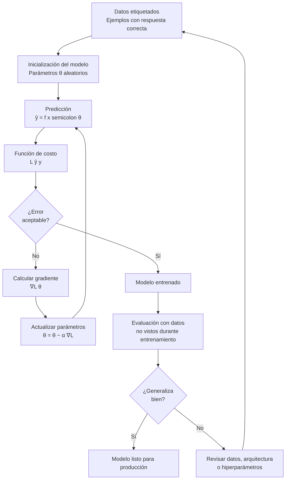
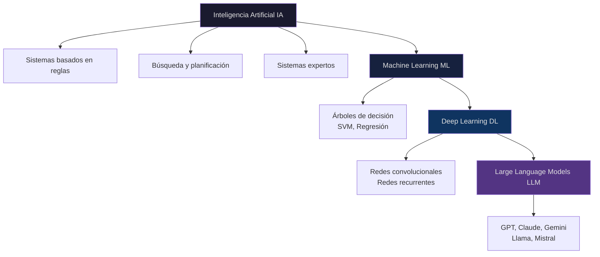

# Ingeniería de IA desde los Fundamentos

## Módulo I — Los Fundamentos de la Inteligencia Artificial

## Capítulo 4 — Machine Learning

---

## Objetivos de aprendizaje

Al finalizar este capítulo serás capaz de:

1. Explicar qué es Machine Learning (ML) desde primeros principios, sin recurrir a definiciones memorizadas.
2. Identificar por qué el paradigma de las reglas explícitas llega a su límite y qué problema viene a resolver ML.
3. Describir el proceso de entrenamiento supervisado: función de costo, predicción y ajuste iterativo.
4. Diferenciar los tres paradigmas de aprendizaje —supervisado, no supervisado y por refuerzo— y dar ejemplos concretos de cada uno.
5. Ubicar ML dentro de la jerarquía Inteligencia Artificial → ML → Deep Learning → Large Language Model.
6. Aplicar criterios de arquitectura para decidir cuándo usar ML y cuándo no.
7. Reconocer errores comunes en la adopción de ML y cómo evitarlos.

---

## Introducción

Existe una tentación muy humana cuando enfrentamos un problema complejo: describir todo lo que sabemos sobre él y esperar que esas descripciones sean suficientes. Durante décadas, así construimos software. Analizábamos un dominio, extraíamos las reglas que lo gobernaban y las codificábamos. El resultado era predecible, auditable y mantenible.

Ese enfoque funcionó extraordinariamente bien durante mucho tiempo. Todavía funciona para millones de sistemas en producción. Pero comenzó a fallar cuando los problemas dejaron de ser describibles mediante reglas finitas: reconocer la escritura a mano, detectar fraudes en millones de transacciones por segundo, entender el tono emocional de un párrafo. En esos casos, el conocimiento que necesitamos no cabe en ningún manual de reglas escrito por un ser humano.

Machine Learning surgió como respuesta a esa limitación. No es una tecnología mágica ni una solución universal. Es un cambio de paradigma: en lugar de decirle a la máquina qué hacer en cada situación, le mostramos ejemplos y dejamos que ajuste su propio modelo matemático. Comprender ese cambio —por qué existe, cómo funciona y cuándo conviene aplicarlo— es el objetivo de este capítulo.

---

## Motivación del problema: cuando las reglas no alcanzan

### El experimento mental del reconocimiento de perros

Supongamos que recibimos el siguiente requerimiento: *"Construir un sistema que identifique si una fotografía contiene un perro."*

El primer instinto de cualquier desarrollador experimentado es pensar en reglas. Algo como:

- Detectar si hay cuatro extremidades en la imagen.
- Detectar presencia de hocico, orejas, cola.
- Verificar que la silueta coincida con una forma canina.

El problema aparece casi de inmediato. ¿Qué ocurre si el perro está sentado? Las cuatro extremidades no son visibles. ¿Si está de espaldas? El hocico desaparece. ¿Si está parcialmente oculto detrás de un objeto? ¿Si es un cachorro de raza inusual? ¿Si la foto fue tomada de noche con poca resolución?

Cada excepción obliga a agregar más reglas. Cada nueva regla introduce nuevas excepciones. El sistema crece en complejidad exponencial mientras su confiabilidad permanece limitada.

Este no es un problema de falta de inteligencia del programador. Es un problema estructural: el conocimiento necesario para reconocer un perro en una imagen no puede expresarse de forma exhaustiva mediante instrucciones condicionales. Existe en los patrones visuales que un ser humano procesa sin poder articular.

### El problema de las reglas en sistemas de negocio

El mismo fenómeno aparece en dominios empresariales. Consideremos la clasificación de correos electrónicos como spam. Un filtro basado en reglas podría incluir:

```
SI contiene "oferta especial" → spam
SI contiene "haga clic aquí" → spam
SI remitente desconocido → spam
```

Cada regla genera falsos positivos (correos legítimos bloqueados) y falsos negativos (spam que pasa el filtro). Los emisores de spam aprenden las reglas y las evitan. El equipo de ingeniería se convierte en mantenedor permanente de un sistema reactivo.

La pregunta que cambió la historia de la informática fue:

> ¿Y si, en lugar de programar las reglas, enseñáramos al sistema mediante ejemplos de lo que queremos que aprenda?

---

## Desarrollo conceptual desde primeros principios

### El cambio de paradigma

En el desarrollo de software tradicional, el conocimiento reside en el código que escribe un programador:

```
Datos de entrada + Reglas escritas por el programador → Resultado
```

En Machine Learning, el conocimiento emerge de los datos durante un proceso llamado entrenamiento:

```
Datos de entrada + Respuestas correctas → Entrenamiento → Modelo

Modelo + Datos nuevos → Predicción
```

La diferencia parece pequeña en la notación, pero cambia completamente la responsabilidad del equipo técnico. En lugar de diseñar reglas, se diseñan procesos de aprendizaje.

### ¿Qué significa "aprender" en ML?

Cuando decimos que un sistema de Machine Learning aprende, no estamos hablando de comprensión en ningún sentido filosófico. Estamos describiendo un proceso matemático preciso.

Un modelo de ML es, en esencia, una función con parámetros ajustables:

```
f(x; θ) = ŷ
```

Donde:
- `x` es la entrada (una fotografía, un correo electrónico, una transacción).
- `θ` (theta) representa los parámetros internos del modelo —miles o millones de números que definen su comportamiento.
- `ŷ` (y-sombrero) es la predicción producida por el modelo.

Al comienzo del entrenamiento, esos parámetros son inicializados de forma aleatoria. El modelo produce predicciones incorrectas. El aprendizaje consiste en ajustar `θ` iterativamente hasta que las predicciones se vuelvan útiles.

### La función de costo: medir el error

Para que un sistema pueda mejorar, primero necesita una forma de saber qué tan equivocado está. Esa forma se llama **función de costo** (también conocida como función de pérdida o *loss function*).

La función de costo compara la predicción del modelo `ŷ` contra la respuesta correcta `y` y produce un número que representa el error:

```
Costo = L(ŷ, y)
```

Si el modelo predice que un correo tiene un 90% de probabilidad de ser spam y en realidad no lo es, el costo es alto. Si predice 95% de spam y el correo efectivamente es spam, el costo es bajo.

El objetivo del entrenamiento es encontrar los parámetros `θ` que minimizan ese costo sobre el conjunto de ejemplos disponibles.

### Gradiente descendente: navegar hacia el mínimo

Una vez que tenemos una función de costo, necesitamos un mecanismo para reducirla. El algoritmo más utilizado para esto se llama **gradiente descendente** (*gradient descent*).

La intuición es geométrica. Imaginemos que la función de costo dibuja un paisaje montañoso: cada posición en ese paisaje corresponde a una configuración de parámetros `θ`, y la altura representa el error. El gradiente descendente es el proceso de caminar cuesta abajo desde donde estamos, siguiendo la dirección en que el error decrece más rápidamente.

Matemáticamente, el gradiente es la derivada del costo respecto a los parámetros: indica en qué dirección y con qué pendiente sube el error. El algoritmo actualiza los parámetros en la dirección opuesta al gradiente:

```
θ_nuevo = θ_actual - α × ∇L(θ)
```

Donde `α` (alfa) es la **tasa de aprendizaje** (*learning rate*): controla qué tan grandes son los pasos que damos cuesta abajo. Un valor demasiado grande hace que el proceso diverja; uno demasiado pequeño hace que el entrenamiento sea extremadamente lento.

Este proceso se repite muchas veces —a menudo millones— sobre distintos subconjuntos del conjunto de entrenamiento, hasta que el costo converge a un valor suficientemente bajo.

### El ciclo completo de entrenamiento supervisado

El proceso que acabamos de describir se repite de forma iterativa:

1. El modelo recibe un ejemplo de entrada `x`.
2. Produce una predicción `ŷ`.
3. Se calcula el costo comparando `ŷ` con la respuesta correcta `y`.
4. Se calcula el gradiente del costo respecto a `θ`.
5. Se ajustan los parámetros en la dirección que reduce el costo.
6. Se repite con el siguiente ejemplo (o lote de ejemplos).

Al finalizar el entrenamiento, el modelo debería generalizar: producir predicciones razonablemente correctas sobre datos que nunca vio durante el entrenamiento. Esa capacidad de generalización es el objetivo real de ML.

---

## Analogía

Imaginemos que estamos aprendiendo a lanzar un dardo al blanco con los ojos vendados.

Al principio lanzamos completamente a ciegas. Después de cada lanzamiento, alguien nos dice si fuimos hacia la izquierda o la derecha, hacia arriba o hacia abajo, y a qué distancia del centro. Ajustamos nuestro siguiente lanzamiento en base a ese feedback.

Con suficientes intentos —y con feedback consistente— comenzamos a mejorar. Eventualmente, somos capaces de lanzar con bastante precisión incluso sin ver el blanco, porque interiorizamos los ajustes necesarios.

Eso es exactamente lo que hace un modelo de ML durante el entrenamiento: recibe feedback cuantificado (la función de costo), ajusta sus parámetros (análogo a ajustar el ángulo del brazo) y mejora iterativamente.

La diferencia con un humano aprendiendo a lanzar dardos es de escala: un modelo puede procesar millones de lanzamientos en horas.

---

## Diagramas

### Diagrama 1: Flujo de entrenamiento supervisado



### Diagrama 2: Jerarquía de la Inteligencia Artificial



---

## Los tres paradigmas de aprendizaje

### Aprendizaje supervisado

Es el paradigma más utilizado en aplicaciones industriales. Disponemos de un conjunto de datos donde cada ejemplo incluye tanto la entrada como la respuesta correcta. El modelo aprende la función que mapea entradas a salidas.

La palabra "supervisado" hace referencia a que existe supervisión humana en la creación de las etiquetas: alguien clasificó previamente miles de correos como spam o no spam, miles de imágenes médicas como benignas o malignas, miles de documentos en sus categorías correspondientes.

Aplicaciones características:
- Clasificación de documentos (legal, médico, financiero).
- Detección de fraude en transacciones.
- Predicción de precios (inmuebles, acciones).
- Diagnóstico médico a partir de imágenes o estudios.
- Reconocimiento de entidades en texto.

### Aprendizaje no supervisado

Aquí no disponemos de respuestas correctas. El objetivo no es predecir una etiqueta conocida, sino descubrir estructuras latentes en los datos: grupos, patrones, relaciones, anomalías.

El desafío es que la evaluación del resultado es más difícil. No podemos calcular un porcentaje de error respecto a una respuesta correcta porque no existe respuesta correcta definida. La validación requiere criterio de dominio y experimentación.

Aplicaciones características:
- Segmentación de clientes en marketing.
- Detección de comportamientos anómalos en redes.
- Compresión y representación de datos (embeddings).
- Descubrimiento de tópicos en grandes corpus de texto.

### Aprendizaje por refuerzo

Un agente aprende mediante interacción con un entorno. No recibe respuestas correctas directas, sino señales de recompensa o penalización según el resultado de sus acciones. El objetivo es que el agente desarrolle una política —una estrategia— que maximice la recompensa acumulada a lo largo del tiempo.

Es el paradigma más complejo de implementar en producción, pero también el más potente para problemas de control y decisión secuencial.

Aplicaciones características:
- Control de robots industriales.
- Optimización de estrategias en videojuegos.
- Gestión de inventario y logística.
- Ajuste fino de modelos de lenguaje mediante feedback humano (RLHF).

---

## El paradigma en código: una ilustración conceptual

El siguiente fragmento de Python ilustra el contraste entre el enfoque tradicional y el de Machine Learning. No es un modelo de producción —es el mínimo necesario para que el concepto sea tangible.

```python
# ============================================================
# ENFOQUE TRADICIONAL: clasificar correos con reglas explícitas
# ============================================================

def clasificar_spam_con_reglas(texto: str) -> str:
    """
    El programador codifica el conocimiento directamente.
    Cada nueva excepción requiere modificar este código.
    """
    palabras_spam = ["oferta", "gratis", "click aqui", "ganaste"]
    texto_lower = texto.lower()

    for palabra in palabras_spam:
        if palabra in texto_lower:
            return "spam"
    return "legitimo"


# ============================================================
# ENFOQUE MACHINE LEARNING: el modelo aprende de ejemplos
# ============================================================
# Requiere: pip install scikit-learn

from sklearn.feature_extraction.text import CountVectorizer
from sklearn.naive_bayes import MultinomialNB

# Datos de entrenamiento: ejemplos con su etiqueta correcta
correos = [
    "oferta especial click aqui gratis",   # spam
    "reunion del equipo manana a las 10",  # legitimo
    "ganaste un premio reclama ya",        # spam
    "adjunto el informe del trimestre",    # legitimo
    "descuento exclusivo solo hoy gratis", # spam
    "recordatorio: entrega el lunes",      # legitimo
]
etiquetas = ["spam", "legitimo", "spam", "legitimo", "spam", "legitimo"]

# Paso 1: convertir texto a representación numérica
vectorizador = CountVectorizer()
X = vectorizador.fit_transform(correos)

# Paso 2: entrenar el modelo (aquí ocurre el aprendizaje)
modelo = MultinomialNB()
modelo.fit(X, etiquetas)

# Paso 3: predecir sobre un correo nuevo (que el modelo nunca vio)
correo_nuevo = ["tienes un regalo esperandote click aqui"]
X_nuevo = vectorizador.transform(correo_nuevo)
prediccion = modelo.predict(X_nuevo)

print(f"Predicción: {prediccion[0]}")
# Output esperado: spam

# OBSERVACIÓN CLAVE:
# No programamos ninguna regla sobre spam.
# El modelo ajustó sus parámetros internos a partir de ejemplos.
# Para mejorar la precisión, agregamos más ejemplos — no más reglas.
```

Este ejemplo opera con un vocabulario mínimo y un algoritmo clásico. En producción, un clasificador de spam real usaría cientos de miles de ejemplos y técnicas más sofisticadas. Pero el paradigma es idéntico: los datos llevan el conocimiento, no el código.

---

## Ejemplo real: Caso Meridian Seguros

**Contexto**

Meridian Seguros procesa aproximadamente 8.000 reclamos por semana a través de su plataforma digital. Hasta 2023, cada reclamo era revisado manualmente por un equipo de 12 analistas que debían clasificarlo en una de 14 categorías (daño vehicular, robo, incendio, responsabilidad civil, etc.) antes de asignarlo al área correspondiente.

El proceso tomaba entre 2 y 4 horas por reclamo solo en la etapa de clasificación. La dirección técnica recibió el mandato de reducir ese tiempo al mínimo posible.

**Las dos opciones en evaluación**

*Opción A: Sistema basado en reglas*

El equipo construiría un árbol de decisión manual con keywords y condiciones para cada categoría. Estimación: 3 semanas de desarrollo inicial, con mantenimiento semanal a cargo de dos analistas que actualizarían las reglas cuando aparecieran nuevos patrones de redacción.

*Opción B: Modelo de Machine Learning supervisado*

Utilizar los 120.000 reclamos históricos ya clasificados como conjunto de entrenamiento. Entrenar un clasificador de texto que aprenda los patrones de cada categoría. Estimación: 4 semanas de desarrollo inicial, pero con mantenimiento significativamente menor una vez en producción.

**El análisis de arquitectura**

La decisión no fue inmediata. El arquitecto responsable evaluó cuatro variables:

| Variable | Opción A — Reglas | Opción B — ML |
|---|---|---|
| Volumen de datos históricos | No los aprovecha | 120K ejemplos: ideal |
| Estabilidad del dominio | Requiere actualización continua | Reentrenamiento periódico |
| Costo de mantenimiento | Alto (humano semanal) | Bajo (pipeline automatizado) |
| Explicabilidad | Total | Parcial |
| Tiempo hasta producción | 3 semanas | 4 semanas |

El factor determinante fue el volumen de datos y la variabilidad del lenguaje. Los reclamos llegan redactados de formas muy diversas: desde texto formal dictado al teléfono hasta descripciones informales escritas desde el celular. Cubrir esa variabilidad con reglas habría requerido un esfuerzo humano prohibitivo y continuo.

**La decisión y sus consecuencias**

Se eligió la Opción B. Tras el entrenamiento y las pruebas de validación, el modelo alcanzó una precisión del 91% sobre el conjunto de prueba. Los reclamos mal clasificados pasaban a revisión manual —reduciendo el trabajo humano al 9% de los casos en lugar del 100%.

El tiempo de clasificación pasó de 2-4 horas a menos de 3 segundos.

La decisión de arquitectura también incluyó un componente de explicabilidad: para las categorías donde el error tiene consecuencias legales (responsabilidad civil), se mantiene revisión humana independientemente de la confianza del modelo.

**Lección para el arquitecto**

Meridian Seguros no adoptó ML porque estaba "de moda". Lo adoptó porque tenía 120.000 ejemplos históricos, un problema con variabilidad lingüística que hacía imposible el enfoque de reglas, y un costo de mantenimiento humano que superaba ampliamente el costo de construir y mantener un pipeline de ML.

---

## Conversación con un arquitecto

**Gerente de producto:** "Queremos usar IA para mejorar la experiencia de nuestros clientes. ¿Por dónde empezamos?"

**Arquitecto:** "Antes de hablar de tecnología, necesito entender el problema. ¿Qué tarea específica tiene hoy dificultades que un sistema automatizado podría resolver?"

**Gerente de producto:** "Clasificar los tickets de soporte. El equipo pierde mucho tiempo enrutando manualmente cada solicitud al área correcta."

**Arquitecto:** "Perfecto, eso es un problema bien definido. La siguiente pregunta es: ¿tienen tickets históricos ya clasificados correctamente?"

**Gerente de producto:** "Sí, llevamos cinco años con el sistema. Debe haber decenas de miles."

**Arquitecto:** "Eso es exactamente lo que necesitamos. Con datos históricos etiquetados podemos entrenar un clasificador supervisado. Antes de comprometerse con eso, sin embargo, quiero que evaluemos si el problema podría resolverse con reglas simples. ¿Cuántas categorías distintas tienen?"

**Gerente de producto:** "Más de cuarenta. Y los clientes escriben de formas muy diferentes."

**Arquitecto:** "Cuarenta categorías con lenguaje libre. Con reglas explícitas tendríamos un mantenimiento permanente y cobertura incompleta. En este caso, ML es la elección correcta. Pero el éxito va a depender de la calidad de esas etiquetas históricas, no del algoritmo que elijamos. ¿Podemos auditar una muestra antes de empezar?"

---

## Errores frecuentes

**Error 1: Confundir ML con IA en general**

ML es una subrama de la Inteligencia Artificial (IA). Existen muchas técnicas de IA que no son ML: sistemas expertos, planificación lógica, búsqueda heurística. Usar los términos como sinónimos genera confusión y decisiones técnicas incorrectas.

**Error 2: Empezar por el algoritmo en lugar de los datos**

El primer impulso frecuente es preguntar "¿qué modelo usamos?" antes de entender qué datos están disponibles, qué calidad tienen y qué problema exacto deben resolver. En ML, los datos son el insumo fundamental. Un modelo excelente sobre datos de mala calidad produce resultados inutilizables.

**Error 3: Ignorar la distribución de los datos de entrenamiento**

Si el modelo se entrena sobre datos que no representan adecuadamente la realidad en producción, sus predicciones serán deficientes exactamente donde más importa. Un clasificador de fraude entrenado solo con datos de 2018 puede fallar ante patrones nuevos de 2024. Este problema se llama *dataset shift* y es una de las causas más comunes de degradación de modelos en producción.

**Error 4: Asumir que más datos siempre mejoran el modelo**

El volumen importa, pero la calidad y la representatividad importan más. Diez millones de ejemplos con etiquetas inconsistentes producen peores resultados que cien mil ejemplos bien curados. La ingeniería de datos es, en la práctica, el cuello de botella más frecuente en proyectos de ML.

**Error 5: Olvidar que el modelo debe mantenerse**

Un modelo entrenado y desplegado no permanece útil indefinidamente. El mundo cambia, los datos cambian, los patrones cambian. Un proyecto de ML exitoso incluye desde el principio una estrategia de monitoreo y reentrenamiento. Desplegar un modelo sin ese plan equivale a instalar un sistema que nadie va a actualizar.

---

## Buenas prácticas

**1. Definir el problema antes de elegir el algoritmo**

El algoritmo es la última decisión, no la primera. Primero: ¿qué problema de negocio queremos resolver? ¿Qué constituye una predicción correcta? ¿Cuál es el costo de equivocarse? ¿Quién va a usar el sistema y cómo?

**2. Auditar los datos antes de comenzar el entrenamiento**

Antes de escribir una sola línea de código de ML, revisar una muestra representativa de los datos: buscar inconsistencias en las etiquetas, valores faltantes, distribuciones inesperadas, sesgos evidentes. Esta inversión temprana evita retrabajo costoso después.

**3. Establecer una línea base con el enfoque más simple posible**

Antes de construir un modelo sofisticado, implementar la solución más simple que pueda funcionar: un clasificador de reglas básico, un modelo de regresión logística, una heurística manual. Esa línea base sirve como referencia para medir si la complejidad adicional aporta valor real.

**4. Separar claramente los datos de entrenamiento, validación y prueba**

El conjunto de prueba debe permanecer completamente invisible durante el desarrollo. Si se usa para tomar decisiones de diseño, deja de ser una medida objetiva de generalización. Este es uno de los errores metodológicos más comunes y uno de los más costosos.

**5. Diseñar el pipeline de reentrenamiento desde el principio**

¿Con qué frecuencia se reentrenará el modelo? ¿Quién revisa las nuevas etiquetas? ¿Cómo se detecta degradación en producción? ¿Cuál es el proceso de aprobación antes de desplegar una nueva versión? Estas decisiones deben tomarse antes del primer despliegue, no después.

**6. Documentar las decisiones de arquitectura con su justificación**

¿Por qué se eligió este algoritmo y no otro? ¿Por qué ese umbral de clasificación? ¿Qué trade-offs se evaluaron? Un proyecto de ML que solo documenta el código —y no las decisiones— es un proyecto que nadie podrá mantener cuando el equipo cambie.

---

## Laboratorio estructurado: Decidir si usar Machine Learning

### Objetivo

Desarrollar criterio para evaluar si un problema de negocio justifica un enfoque de ML o puede resolverse mejor con lógica tradicional. Al completar este laboratorio, el lector habrá aplicado un framework de decisión sobre escenarios reales y habrá implementado un clasificador mínimo funcional.

### Nivel

Inicial

### Tiempo estimado

90 minutos

### Prerrequisitos

- Capítulos 1 a 3 del Módulo I (conceptos de IA y contexto histórico).
- Python 3.8 o superior instalado.
- Familiaridad básica con la terminal.

### Herramientas

- Python 3.8+
- Biblioteca `scikit-learn` (`pip install scikit-learn`)
- Cualquier editor de texto o IDE
- Papel y lápiz para el análisis previo

### Escenario

Sos el arquitecto técnico de una empresa de logística llamada **TransAndina**. El área de operaciones te presenta tres iniciativas para el próximo trimestre y te pide evaluar cuál de ellas justifica un enfoque de Machine Learning:

**Iniciativa A:** Clasificar automáticamente las quejas de clientes en cinco categorías (demora en entrega, paquete dañado, dirección incorrecta, problema de facturación, otro). Disponen de 45.000 quejas históricas ya clasificadas manualmente.

**Iniciativa B:** Verificar si el número de seguimiento ingresado por un cliente tiene el formato correcto (ejemplo: TRK-XXXXXXXX-AR). El formato es fijo y está documentado.

**Iniciativa C:** Predecir qué clientes tienen mayor probabilidad de cancelar su contrato en los próximos 30 días. Disponen de 3 años de datos de uso, facturación y comportamiento.

---

### Paso 1: Aplicar el framework de decisión

Antes de escribir código, analiza cada iniciativa con el siguiente framework. Registra tus respuestas en un documento:

Para cada iniciativa, responde:

1. ¿El problema puede describirse con reglas finitas y estables? (Sí / No / Parcialmente)
2. ¿Existen datos históricos suficientes con etiquetas correctas? (Sí / No / Insuficientes)
3. ¿El dominio cambia con el tiempo de forma que invalida las reglas? (Sí / No)
4. ¿El costo de equivocarse es alto? ¿Requiere explicabilidad completa? (Sí / No)
5. Decisión: ¿ML, reglas tradicionales, o combinación?

**Resultado esperado del análisis:**
- Iniciativa A: ML supervisado. Lenguaje libre, alta variabilidad, datos históricos suficientes.
- Iniciativa B: Regla de validación. El formato es fijo. ML agrega complejidad innecesaria.
- Iniciativa C: ML supervisado. Predicción de churn requiere capturar patrones complejos en múltiples variables. Los datos de 3 años son un insumo valioso.

---

### Paso 2: Explorar los datos disponibles (Iniciativa A)

Antes de entrenar cualquier modelo, explorar una muestra de los datos. Para este laboratorio usamos datos sintéticos que simulan las quejas de TransAndina.

```python
# archivo: lab_04_explorar.py

datos_muestra = [
    ("Mi paquete llegó aplastado y con el contenido roto", "paquete_danado"),
    ("El pedido todavía no llegó y ya pasaron 10 días", "demora_entrega"),
    ("Me cobraron dos veces por el mismo envío", "facturacion"),
    ("La dirección que aparece en el sistema está mal", "direccion_incorrecta"),
    ("Quiero saber cómo ampliar mi contrato", "otro"),
    ("El paquete vino abierto y falta uno de los productos", "paquete_danado"),
    ("Llevo una semana esperando y nada", "demora_entrega"),
]

# Paso 2.1: Contar ejemplos por categoría
from collections import Counter

categorias = [etiqueta for _, etiqueta in datos_muestra]
distribucion = Counter(categorias)

print("Distribución por categoría:")
for categoria, cantidad in distribucion.items():
    print(f"  {categoria}: {cantidad}")

# Paso 2.2: Verificar si hay categorías subrepresentadas
total = len(datos_muestra)
for categoria, cantidad in distribucion.items():
    porcentaje = (cantidad / total) * 100
    if porcentaje < 10:
        print(f"ALERTA: {categoria} tiene solo {porcentaje:.1f}% de los datos")
```

**Motivo de este paso:** Un modelo entrenado sobre datos desbalanceados tiende a favorecer las categorías mayoritarias. Detectar ese problema antes del entrenamiento evita sorpresas en producción.

**Resultado esperado:** Listado de categorías con sus proporciones. Si alguna tiene menos del 10%, se debe ampliar ese subconjunto antes de continuar.

---

### Paso 3: Entrenar el clasificador mínimo funcional

```python
# archivo: lab_04_entrenar.py

from sklearn.feature_extraction.text import TfidfVectorizer
from sklearn.naive_bayes import MultinomialNB
from sklearn.model_selection import train_test_split
from sklearn.metrics import classification_report

# Dataset sintético ampliado para el laboratorio
quejas = [
    ("Mi paquete llegó aplastado", "paquete_danado"),
    ("El contenido estaba roto al abrir la caja", "paquete_danado"),
    ("Vino todo doblado y mojado", "paquete_danado"),
    ("Llevo 8 días esperando y no llegó", "demora_entrega"),
    ("El pedido sigue sin aparecer", "demora_entrega"),
    ("La entrega se retrasó más de una semana", "demora_entrega"),
    ("Me cobraron dos veces", "facturacion"),
    ("El monto de la factura es incorrecto", "facturacion"),
    ("Hay un cobro que no reconozco", "facturacion"),
    ("La dirección del destinatario está mal cargada", "direccion_incorrecta"),
    ("Mandaron el paquete a otra ciudad", "direccion_incorrecta"),
    ("El código postal es incorrecto", "direccion_incorrecta"),
    ("Quiero cambiar mi plan", "otro"),
    ("Necesito información sobre sus servicios", "otro"),
    ("¿Cómo hago para ampliar el contrato?", "otro"),
]

textos = [queja for queja, _ in quejas]
etiquetas = [etiqueta for _, etiqueta in quejas]

# Paso 3.1: Dividir en entrenamiento y prueba
X_train, X_test, y_train, y_test = train_test_split(
    textos, etiquetas, test_size=0.2, random_state=42
)

# Paso 3.2: Vectorizar el texto
vectorizador = TfidfVectorizer()
X_train_vec = vectorizador.fit_transform(X_train)
X_test_vec = vectorizador.transform(X_test)

# Paso 3.3: Entrenar el modelo
modelo = MultinomialNB()
modelo.fit(X_train_vec, y_train)

# Paso 3.4: Evaluar
predicciones = modelo.predict(X_test_vec)
print(classification_report(y_test, predicciones))
```

**Motivo de este paso:** TF-IDF convierte el texto en representaciones numéricas que capturan la importancia relativa de cada palabra. Naive Bayes es un clasificador probabilístico que funciona sorprendentemente bien en texto con pocos datos.

**Resultado esperado:** Un reporte de clasificación con precisión, recall y F1-score por categoría. Con 15 ejemplos sintéticos los resultados serán modestos; ese es precisamente el punto: verás por qué se necesitan más datos.

---

### Paso 4: Experimentar con una queja nueva

```python
# archivo: lab_04_predecir.py
# (ejecutar después de lab_04_entrenar.py o incorporar al mismo archivo)

quejas_nuevas = [
    "El paquete llegó completamente destruido",
    "Todavía no recibí nada y pagué hace dos semanas",
    "Quiero actualizar los datos de mi empresa",
    "La dirección que pusieron no existe",
]

for queja in quejas_nuevas:
    queja_vec = vectorizador.transform([queja])
    categoria = modelo.predict(queja_vec)[0]
    probabilidades = modelo.predict_proba(queja_vec)[0]
    confianza = max(probabilidades)
    print(f"Queja: '{queja}'")
    print(f"  Categoría predicha: {categoria}")
    print(f"  Confianza: {confianza:.2%}")
    print()
```

**Motivo de este paso:** Observar la confianza del modelo —no solo la categoría predicha— es una práctica esencial. Un modelo que predice con 51% de confianza debería tratarse de forma diferente a uno que predice con 97%.

---

### Paso 5: Reflexionar sobre las limitaciones del modelo

Ejecutado el clasificador, responde las siguientes preguntas en tu documento de análisis:

1. ¿Qué ocurre cuando el modelo recibe una queja en un idioma diferente al entrenamiento?
2. ¿Qué pasa si aparece una nueva categoría que no existe en el conjunto de entrenamiento?
3. ¿Qué harías si la precisión en producción cae por debajo del umbral aceptable?
4. ¿Bajo qué circunstancias el sistema debería escalar la queja a un humano en lugar de clasificarla automáticamente?

### Validación

El laboratorio fue completado exitosamente si:

- El framework de decisión fue aplicado a las tres iniciativas con justificación escrita.
- El clasificador Python ejecuta sin errores y produce un reporte de clasificación.
- Las preguntas de reflexión del Paso 5 tienen respuestas documentadas.

### Reflexión final

El objetivo de este laboratorio no era construir un clasificador de producción. Era demostrar que la diferencia entre ML y lógica de reglas no es solo técnica: es una diferencia de paradigma que impacta cómo se diseña el sistema, cómo se mantiene y qué tipo de expertise requiere el equipo.

### Desafíos opcionales

1. **Desafío 1 — Datos reales:** Reemplaza el dataset sintético con 50 tickets reales de tu organización (anonimizados). Observa cómo cambia la calidad de las predicciones.

2. **Desafío 2 — Comparar algoritmos:** Reemplaza `MultinomialNB` por `LogisticRegression` o `RandomForestClassifier` de scikit-learn. ¿Mejora la precisión? ¿A qué costo?

3. **Desafío 3 — Umbral de confianza:** Implementa una lógica que derive a revisión humana todos los casos donde la confianza del modelo sea inferior al 70%. ¿Qué porcentaje de los casos quedarían en revisión manual?

4. **Desafío 4 — Reentrenamiento:** Simula el agregado de 10 nuevos ejemplos al dataset y reentrena el modelo. ¿Cómo cambian las métricas? Diseña un proceso de reentrenamiento mensual para TransAndina.

---

## Preguntas de reflexión

1. ¿En qué tipo de problema la solución basada en reglas siempre será superior a un modelo de ML, independientemente de la cantidad de datos disponibles?

2. La función de costo mide el error del modelo durante el entrenamiento. ¿Cómo medirías el "error" en producción, donde no siempre tenemos la respuesta correcta disponible de inmediato?

3. Un colega propone reemplazar el sistema de clasificación de reclamos de Meridian Seguros con un modelo que alcanza 99% de precisión pero es completamente opaco (no es posible explicar por qué tomó cada decisión). ¿Bajo qué circunstancias aceptarías o rechazarías esa propuesta?

4. Si los datos históricos de entrenamiento contienen sesgos —por ejemplo, ciertos tipos de clientes fueron sistemáticamente mal clasificados en el pasado— ¿qué consecuencias tiene eso sobre el modelo? ¿Cómo lo detectarías y cómo lo mitigarías?

5. ¿Cuándo tiene sentido combinar un sistema de reglas explícitas con un modelo de ML en el mismo pipeline? Da un ejemplo concreto.

6. El gradiente descendente garantiza encontrar el mínimo de la función de costo... ¿o no? ¿Qué limitaciones tiene ese algoritmo y por qué importa para el diseño de sistemas de producción?

7. Meridian Seguros decidió mantener revisión humana para los casos de responsabilidad civil. ¿Qué principio de arquitectura subyace a esa decisión? ¿Cómo generalizarías ese principio a otros dominios?

---

## Resumen narrativo

Machine Learning no apareció para reemplazar el software tradicional. Apareció para resolver una clase específica de problemas que el paradigma anterior no podía abordar: aquellos donde el conocimiento necesario existe en los datos, pero no puede articularse completamente en reglas escritas por un programador.

El núcleo del paradigma es el proceso de entrenamiento: un modelo matemático con parámetros ajustables recibe ejemplos, produce predicciones, mide su propio error mediante una función de costo y ajusta sus parámetros a través del gradiente descendente. Ese ciclo —predicción, error, ajuste— se repite millones de veces hasta que el modelo generaliza sobre datos nuevos.

Los tres paradigmas —supervisado, no supervisado y por refuerzo— no son variantes del mismo mecanismo. Son estrategias fundamentalmente diferentes para problemas con estructuras diferentes. El supervisado requiere etiquetas. El no supervisado descubre estructuras latentes. El por refuerzo aprende de señales de recompensa diferidas.

ML es una subrama de la Inteligencia Artificial (IA), no su sinónimo. Y dentro de ML, Deep Learning (DL) es a su vez una subrama más especializada, que a su vez contiene los Large Language Models (LLM) que hoy ocupan el centro de la atención tecnológica.

La decisión de usar ML en un proyecto no es técnica en primer lugar: es arquitectónica. Requiere evaluar la disponibilidad y calidad de los datos, la complejidad y variabilidad del dominio, el costo de mantenimiento a largo plazo y los requisitos de explicabilidad. Un arquitecto que salta directamente al algoritmo sin responder esas preguntas está construyendo sobre terreno inestable.

---

## Checklist del capítulo

Antes de avanzar al siguiente capítulo, verifica que puedas responder afirmativamente a cada punto:

- [ ] Puedo explicar por qué el paradigma de reglas explícitas llega a su límite con ejemplos concretos.
- [ ] Puedo describir el ciclo de entrenamiento supervisado: predicción, función de costo, gradiente, ajuste de parámetros.
- [ ] Puedo diferenciar aprendizaje supervisado, no supervisado y por refuerzo, y dar un caso de uso de cada uno.
- [ ] Puedo ubicar ML, DL y LLM dentro de la jerarquía de IA.
- [ ] Puedo aplicar el framework de decisión para evaluar si un problema justifica ML o si conviene un enfoque más simple.
- [ ] Identifiqué al menos tres errores frecuentes en proyectos de ML y sé cómo evitarlos.
- [ ] Ejecuté el laboratorio y documenté las respuestas a las preguntas de reflexión.

---

## Glosario breve

**Función de costo (loss function):** Métrica que cuantifica la diferencia entre la predicción del modelo y la respuesta correcta. El entrenamiento busca minimizarla.

**Gradiente descendente (gradient descent):** Algoritmo de optimización que ajusta los parámetros del modelo iterativamente en la dirección que reduce la función de costo.

**Hiperparámetro:** Parámetro que configura el proceso de entrenamiento pero no es aprendido por el modelo. Ejemplos: tasa de aprendizaje, número de capas, tamaño del lote.

**Generalización:** Capacidad de un modelo de producir predicciones útiles sobre datos nuevos que no formaron parte del conjunto de entrenamiento.

**Overfitting (sobreajuste):** Fenómeno en que el modelo aprende los datos de entrenamiento con demasiada precisión, incluyendo su ruido, y falla al generalizar sobre datos nuevos.

**TF-IDF (Term Frequency – Inverse Document Frequency):** Técnica de representación de texto que asigna peso numérico a cada palabra en función de su frecuencia en el documento y su rareza en el corpus total.

**Dataset shift:** Fenómeno en que la distribución de los datos en producción difiere de la distribución del conjunto de entrenamiento, causando degradación del rendimiento del modelo.

**Aprendizaje supervisado:** Paradigma de ML donde el modelo aprende a partir de ejemplos con etiquetas correctas provistas por humanos.

---

## Próximo capítulo

**Capítulo 5 — Deep Learning**

Machine Learning abrió la posibilidad de aprender patrones a partir de datos. Pero cuando los patrones son extremadamente complejos —como el contenido semántico de una imagen o de un párrafo— los algoritmos clásicos de ML alcanzan su propio límite.

Deep Learning (DL) responde a esa limitación con una idea inspirada en la estructura del cerebro: organizar funciones matemáticas simples en capas profundas que componen representaciones progresivamente más abstractas. Exploraremos por qué esa arquitectura transformó el estado del arte en visión artificial, procesamiento de lenguaje y audio, y por qué fue el paso necesario antes de los modelos que hoy conocemos.

---

> "Un arquitecto no memoriza respuestas. Comprende problemas para poder diseñar soluciones."
