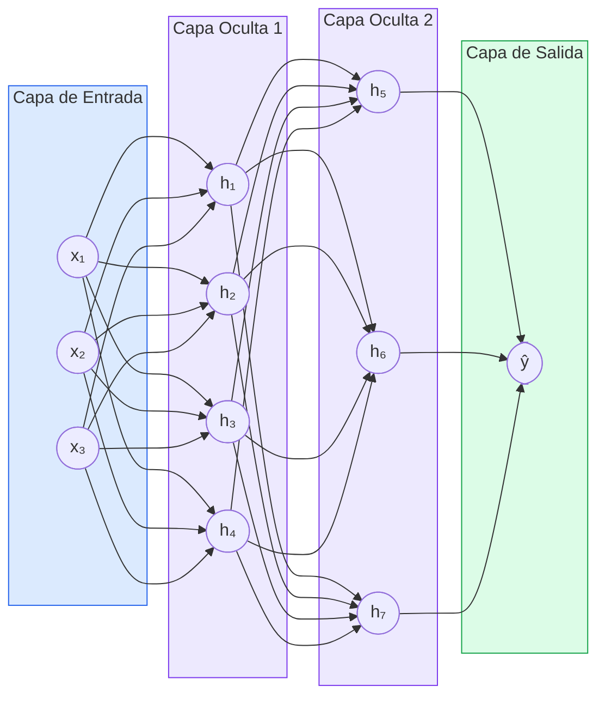
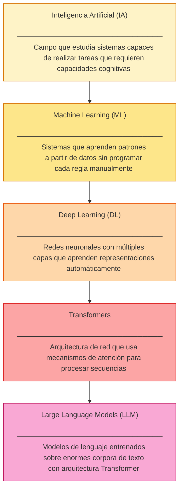
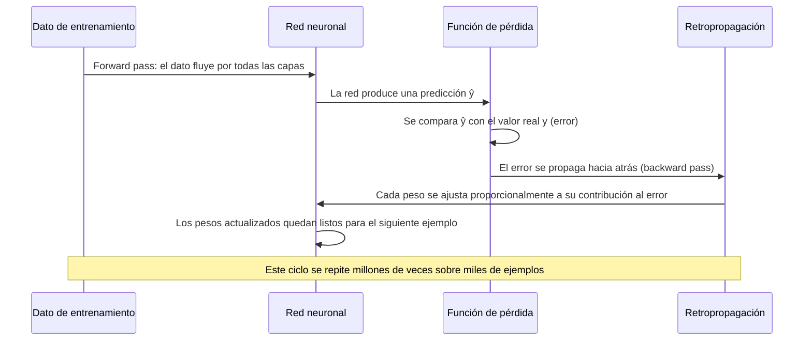

# Ingeniería de IA desde los Fundamentos

# Módulo I — Los Fundamentos de la Inteligencia Artificial

# Capítulo 5 — Deep Learning: Aprender Representaciones desde los Datos

**Versión:** 0.5 (Revisión conceptual)

---

## 1. Objetivos de aprendizaje

Al finalizar este capítulo serás capaz de:

1. Explicar qué es Deep Learning (DL) y por qué representa una evolución respecto de Machine Learning (ML) clásico.
2. Identificar las cuatro condiciones históricas que hicieron posible el surgimiento del DL.
3. Describir en términos no matemáticos cómo aprende una red neuronal a través del ciclo forward pass / backward pass.
4. Diferenciar la ingeniería manual de características del aprendizaje automático de representaciones.
5. Leer un diagrama de arquitectura de red neuronal y explicar el rol de cada capa.
6. Evaluar cuándo DL aporta valor real y cuándo una solución más simple es la decisión correcta.
7. Aplicar los conceptos del capítulo a un caso industrial concreto de control de calidad.

---

## 2. Introducción

En el capítulo anterior establecimos que Machine Learning cambió el paradigma: en lugar de escribir reglas, los modelos aprendían patrones a partir de datos. Ese fue un salto enorme. Pero pronto apareció un problema de escala.

El ML clásico funcionaba bien cuando el ingeniero podía describir qué buscar. En un sistema de detección de fraude bancario, por ejemplo, era razonable construir características como "número de transacciones en los últimos 10 minutos" o "distancia geográfica entre dos operaciones consecutivas". Un experto del dominio sabía qué importaba. El ingeniero lo codificaba. El modelo lo aprendía a ponderar.

El problema emergió con los datos no estructurados: imágenes, audio, texto en lenguaje natural. ¿Cómo describirle a un algoritmo qué es una oreja en una fotografía? ¿Cómo capturar en una lista de características el tono de voz de alguien que miente? Nadie podía escribir esas reglas de forma completa y general. La solución llegó desde una dirección inesperada: en lugar de que el ingeniero definiera las características, que fuera el propio sistema el que las descubriera. Esa es la idea central de Deep Learning.

---

## 3. Motivación: por qué el ML clásico era insuficiente

Para entender por qué surgió el DL conviene mirar de frente las limitaciones del ML clásico en tres dominios que hoy consideramos fundamentales.

### 3.1 Visión por computadora

Reconocer un gato en una fotografía parece trivial para un humano. Para un algoritmo clásico, la fotografía es una matriz de píxeles: números entre 0 y 255 que representan intensidad de color. No hay "gato" en esa matriz. Un ingeniero podía intentar definir características manualmente: proporción de colores, detectores de bordes, histogramas de gradientes. Cada característica requería experiencia, experimentación y ajuste manual. Y lo más crítico: si el gato aparecía de un ángulo diferente, con otra iluminación o parcialmente oculto, el sistema fallaba. El espacio de variaciones posibles es demasiado grande para cubrirlo con reglas.

### 3.2 Reconocimiento de voz

El audio de una persona hablando depende de su acento, velocidad, timbre, ruido ambiente, vocabulario y contexto semántico. Construir características manualmente que capturen toda esa variabilidad es computacionalmente inviable. Los sistemas de voz clásicos funcionaban en condiciones muy controladas. Fuera de ese entorno controlado, su desempeño caía drásticamente.

### 3.3 Comprensión del lenguaje natural

El lenguaje es ambiguo por naturaleza. "El banco cerró temprano" puede referirse a una institución financiera o a un asiento en la plaza. El significado depende del contexto. Los enfoques clásicos basados en reglas lingüísticas y diccionarios alcanzaban un techo rápidamente. Capturar las relaciones semánticas entre palabras, oraciones y párrafos requería algo cualitativamente diferente.

La conclusión es la misma en los tres casos: cuando la información relevante está enterrada en la estructura del dato y no puede ser extraída con reglas escritas por un humano, el ML clásico tiene un límite fundamental. Deep Learning surgió precisamente para operar más allá de ese límite.

---

## 4. Desarrollo conceptual desde primeros principios

### 4.1 ¿Qué significa "Deep"?

La palabra *deep* significa profundo, y hace referencia a la arquitectura del sistema: múltiples capas de procesamiento apiladas en secuencia. No significa que el modelo sea más inteligente ni que tenga comprensión. Significa que la información pasa por muchas transformaciones antes de producir una salida.

Cada capa recibe la salida de la capa anterior y produce una representación más abstracta del dato original. En el contexto de una fotografía:

- Las capas iniciales detectan patrones locales simples: bordes horizontales, verticales, diagonales.
- Las capas intermedias combinan esos bordes para detectar formas: curvas, ángulos, texturas.
- Las capas más profundas combinan formas para representar partes del objeto: una oreja, un neumático, una ventana.
- Las capas finales combinan partes para reconocer el objeto completo: un perro, un automóvil, una persona.

Lo que hace poderoso a este enfoque es que ninguna de esas representaciones fue definida por el ingeniero. El sistema las descubrió durante el proceso de entrenamiento, a partir de miles de ejemplos.

### 4.2 Inspiración biológica: qué se tomó prestado y qué no

Las redes neuronales artificiales tomaron prestada una idea de la neurociencia: muchas unidades simples, conectadas entre sí, pueden producir comportamientos complejos. Una neurona artificial recibe varios valores de entrada, les aplica pesos (importancias relativas), suma esos valores ponderados y pasa el resultado por una función que decide si la neurona se activa o no.

Es importante ser preciso en lo que esta analogía no implica:

- Las redes neuronales artificiales **no son un cerebro artificial**.
- **No reproducen** el funcionamiento del sistema nervioso biológico.
- **No tienen** conciencia, intención ni comprensión semántica.

Son estructuras matemáticas que procesan números. La analogía biológica sirvió como inspiración histórica. La práctica de DL es álgebra lineal y cálculo diferencial aplicados a escala.

### 4.3 Cómo aprende una red: forward pass y backward pass

Este es el núcleo conceptual del capítulo. Entender este ciclo es entender Deep Learning.

**El forward pass (pasada hacia adelante)**

Cuando una red neuronal recibe un ejemplo de entrenamiento —digamos, una imagen etiquetada como "defecto en soldadura"— la imagen entra por la capa de entrada y fluye hacia adelante a través de todas las capas. Cada neurona realiza su cálculo: toma los valores que llegan, los multiplica por sus pesos actuales y produce una salida. Esa salida pasa a la siguiente capa, y así sucesivamente hasta llegar a la capa de salida.

La capa de salida produce una predicción. Al principio del entrenamiento, cuando los pesos son aleatorios, esa predicción es también aleatoria. La red podría decir "93% de probabilidad de que esto sea una soldadura correcta" cuando en realidad es un defecto grave.

Luego se calcula el error: qué tan lejos estuvo la predicción de la respuesta correcta. A esta medida se la llama función de pérdida (*loss function*). Un error alto significa que los pesos actuales producen predicciones malas.

**El backward pass (retropropagación)**

Aquí ocurre el aprendizaje real. Una vez calculado el error, el sistema calcula matemáticamente cuánto contribuyó cada peso a ese error. Esto se hace propagando el error hacia atrás por la red, capa por capa, usando un algoritmo llamado retropropagación (*backpropagation*).

Con esa información, cada peso se ajusta ligeramente en la dirección que reduciría el error. El ajuste es pequeño, controlado por un parámetro llamado tasa de aprendizaje (*learning rate*). Si el ajuste fuera demasiado grande, el sistema oscilaría sin converger. Si fuera demasiado pequeño, el entrenamiento sería extremadamente lento.

Este ciclo —forward pass, calcular error, backward pass, ajustar pesos— se repite miles o millones de veces con muchos ejemplos diferentes. Gradualmente, los pesos se van organizando de manera que la red produce predicciones cada vez más precisas.

El resultado es una estructura matemática cuyos parámetros internos capturan, de forma distribuida, los patrones presentes en los datos de entrenamiento.

### 4.4 Las cuatro condiciones del éxito

La idea de las redes neuronales existía desde los años 50. Sin embargo, no fue hasta la década de 2010 que DL comenzó a superar ampliamente a otras técnicas. ¿Por qué el retraso? Porque su éxito requirió la convergencia simultánea de cuatro condiciones.

**Condición 1: Datos a escala**

Una red neuronal con millones de parámetros necesita millones de ejemplos de entrenamiento para que esos parámetros converjan a valores útiles. Con pocos datos, la red memorizará los ejemplos que vio sin generalizar bien a ejemplos nuevos: un fenómeno llamado sobreajuste (*overfitting*).

La explosión de internet en la primera década del siglo XXI generó volúmenes de datos sin precedentes: imágenes etiquetadas, texto, audio, video. Proyectos como ImageNet —con más de 14 millones de imágenes categorizadas— fueron decisivos para el avance del campo.

**Condición 2: Hardware especializado**

Entrenar una red neuronal requiere ejecutar el mismo tipo de operación matemática —multiplicación de matrices— millones de veces en paralelo. Las unidades de procesamiento gráfico (GPU) fueron diseñadas originalmente para renderizar videojuegos, pero resultaron ser arquitecturas ideales para ese tipo de cómputo paralelo.

Una GPU moderna puede realizar miles de operaciones simultáneamente. Lo que en una CPU convencional tomaría semanas de entrenamiento, en una GPU puede completarse en horas. La disponibilidad de GPUs asequibles a partir de 2010 fue un factor determinante.

**Condición 3: Mejores algoritmos de entrenamiento**

Durante décadas el entrenamiento de redes profundas presentó un problema conocido como desvanecimiento del gradiente (*vanishing gradient*): a medida que el error se propagaba hacia atrás a través de muchas capas, la señal se volvía tan pequeña que las capas iniciales casi no aprendían.

La solución llegó a través de mejores funciones de activación (como ReLU), mejores esquemas de inicialización de pesos, técnicas de regularización (como Dropout) y optimizadores más sofisticados (como Adam). Cada uno de estos avances algorítmicos contribuyó a hacer el entrenamiento más estable y eficiente.

**Condición 4: Arquitecturas especializadas**

No existe una sola arquitectura de red neuronal que funcione bien en todos los dominios. La historia del DL es también la historia del descubrimiento de arquitecturas adecuadas para cada tipo de dato:

- Las redes convolucionales (CNN) explotan la estructura espacial de las imágenes.
- Las redes recurrentes (RNN) y sus variantes (LSTM, GRU) procesaban secuencias temporales.
- Los Transformers, que veremos en el próximo capítulo, resolvieron el problema del procesamiento de texto largo.

La combinación de datos, hardware, algoritmos y arquitecturas fue lo que desbloqueó el potencial del DL.

---

## 5. Analogía

Imagina que necesitas aprender a reconocer vinos por su sabor. Al principio no tienes idea. Pruebas un vino y dices "frutal". El sommelier te dice que estás equivocado. Ajustas tu criterio. Pruebas otro y dices "ácido con notas de roble". Te dicen que estás en la dirección correcta. Después de probar miles de vinos y recibir retroalimentación constante, tu paladar desarrolla una sensibilidad que nunca podrías haber construido leyendo una descripción de lo que es un vino.

Deep Learning hace algo estructuralmente similar: recibe un ejemplo, produce una estimación, recibe retroalimentación sobre el error, y ajusta su criterio interno. Después de millones de ejemplos y millones de ajustes, desarrolla una capacidad de discriminación que ningún conjunto de reglas escritas manualmente podría capturar.

Lo que no hace: no "desarrolla un paladar" en ningún sentido subjetivo. Ajusta matrices numéricas hasta que producen predicciones útiles.

---

## 6. Diagramas

### Diagrama 1: Arquitectura de red neuronal simplificada

**Lectura del diagrama:** Los nodos de la capa de entrada reciben los valores del dato original. Cada conexión entre nodos tiene un peso numérico. Durante el forward pass, la información fluye de izquierda a derecha. Durante el backward pass, el error fluye de derecha a izquierda para ajustar esos pesos.

---

### Diagrama 2: Jerarquía tecnológica IA → LLM

**Lectura del diagrama:** Cada nivel hereda las características del nivel superior y agrega una especificidad adicional. Un Large Language Model (LLM) es, al mismo tiempo, un Transformer, una red de DL, un sistema de ML y un sistema de IA. Comprender la jerarquía evita confundir el todo con las partes.

---

### Diagrama 3: Ciclo de aprendizaje (forward pass / backward pass)

---

## 7. Ejemplo real: Control de calidad en manufactura automotriz

### Contexto

Una planta automotriz en el norte de México produce 1.200 piezas de carrocería por turno. Cada pieza pasa por un proceso de soldadura con 47 puntos de unión. El área de calidad debe verificar que cada punto de soldadura cumpla los estándares dimensionales y visuales antes de que la pieza avance a la siguiente etapa.

Hasta 2019, ese control se realizaba con inspectores humanos que revisaban muestras estadísticas: no el 100% de las piezas, sino una muestra representativa. El costo de un defecto no detectado era alto: recalls, reparaciones en campo y daño reputacional.

### El problema con el enfoque de reglas

El equipo de ingeniería intentó inicialmente automatizar la inspección con visión por computadora clásica. Definieron umbrales de color para detectar salpicaduras, métricas geométricas para detectar deformaciones, detectores de bordes para verificar el contorno de cada punto.

El resultado fue frustrante. Las variaciones en la iluminación de la planta, los reflejos del metal, los cambios de turno y el desgaste de las piezas del proceso generaban tantos falsos positivos que el sistema resultó inutilizable. Las reglas que funcionaban en condiciones ideales fallaban en producción real.

### La solución con Deep Learning

El equipo reorientó el proyecto. En lugar de definir qué buscar, recolectaron 28.000 imágenes etiquetadas de puntos de soldadura: 19.000 aceptables y 9.000 con distintos tipos de defectos, capturadas bajo las condiciones reales de la planta a lo largo de seis meses.

Entrenaron una red convolucional (CNN) para clasificar cada punto como aceptable o defectuoso. El entrenamiento tomó 11 horas en un servidor con GPU. Al evaluar el modelo sobre un conjunto de prueba que no había visto durante el entrenamiento, alcanzaron una precisión del 97,3% con una tasa de falsos negativos (defectos no detectados) del 0,8%.

El sistema se desplegó sobre una cámara industrial montada en el brazo robot que ya existía en la línea. La inferencia por pieza toma 140 milisegundos. El 100% de las piezas es inspeccionado en tiempo real sin detener la línea.

### Lo que aprendió el equipo

Los ingenieros del proyecto destacaron tres lecciones que se repiten en proyectos similares:

**Primera lección:** El trabajo de etiquetado de 28.000 imágenes tomó cuatro veces más tiempo que entrenar el modelo. La calidad del dato etiquetado fue el factor más crítico del proyecto.

**Segunda lección:** El modelo aprendió a detectar patrones que los inspectores humanos no podían articular verbalmente. Cuando se le pidió al modelo que explicara sus decisiones mediante técnicas de visualización, aparecieron indicadores sutiles de temperatura y textura que ningún ingeniero había pensado en incluir como regla.

**Tercera lección:** El modelo entrenado con datos de 2019 comenzó a degradarse en 2021 cuando la planta introdujo nuevos materiales de aporte para la soldadura. El dato de producción cambió, y el modelo no había visto esos patrones durante el entrenamiento. La solución fue establecer un proceso de monitoreo continuo y reentrenamiento periódico.

Esta última lección encapsula algo fundamental: un modelo de DL no es un sistema estático. Es un artefacto que refleja los patrones de los datos con los que fue entrenado. Cuando el mundo cambia, el modelo necesita actualizarse.

---

## 8. Conversación con un arquitecto

**Directora de Operaciones:** Acabamos de leer que nuestros competidores están usando Deep Learning en sus plantas. Necesitamos implementarlo también.

**Arquitecto:** Entiendo la presión competitiva. Antes de decidir qué tecnología usar, ayúdame a entender el problema. ¿Qué proceso específico quieren mejorar?

**Directora:** El control de calidad visual en la línea de pintura. Tenemos muchos reclamos por burbujas y rayaduras que no se detectan en fábrica.

**Arquitecto:** Tiene sentido como caso de uso para visión por computadora. ¿Tienen datos históricos de esos defectos? Me refiero a imágenes etiquetadas de piezas con y sin problema.

**Directora:** Tenemos fotos de los reclamos de garantía, pero no organizadas ni etiquetadas. Son carpetas en un servidor compartido.

**Arquitecto:** Ese es el primer cuello de botella real. Un modelo de DL necesita datos etiquetados con precisión para aprender. Si esas imágenes no están organizadas, el primer trabajo es curarlas. Antes de hablar de arquitectura de red o de infraestructura de GPU, necesitamos saber cuántas imágenes tienen, qué tipos de defectos representan y si son representativas de las condiciones actuales de producción.

**Directora:** ¿Y si no tenemos suficientes datos?

**Arquitecto:** Hay opciones. Podemos usar técnicas de transferencia de aprendizaje, que permiten partir de un modelo ya entrenado en millones de imágenes genéricas y ajustarlo con relativamente pocas imágenes específicas del dominio. Pero incluso eso tiene un mínimo. Mi recomendación es hacer un inventario de los datos disponibles antes de comprometer presupuesto en infraestructura. El dato es la restricción, no la tecnología.

**Directora:** ¿Y cuánto tiempo llevaría tener algo funcionando?

**Arquitecto:** Si los datos existen y están en condiciones razonables, un piloto controlado puede estar listo en ocho semanas. Pero un piloto controlado no es producción. La diferencia entre "funciona en el laboratorio" y "funciona de forma confiable en la planta con todas las variaciones del entorno real" es donde fallan la mayoría de los proyectos. Ese salto requiere tiempo, iteración y un proceso de validación riguroso.

---

## 9. Errores frecuentes

### Error 1: Aplicar Deep Learning a problemas que no lo necesitan

DL no es la solución universal. Problemas con reglas bien definidas, datos estructurados y variables de entrada claramente identificadas se resuelven mejor con ML clásico o incluso con lógica de negocio directa. Usar una red neuronal profunda para predecir la demanda mensual de un producto cuando existen 50 registros históricos es un error que consume tiempo y recursos sin beneficio real.

La regla práctica: si un experto del dominio puede describir verbalmente cómo tomar la decisión con un conjunto razonablemente pequeño de variables, probablemente ML clásico sea suficiente.

### Error 2: Subestimar el costo del dato etiquetado

El entrenamiento de un modelo de DL supervisado requiere datos etiquetados con precisión. Obtener esas etiquetas tiene un costo real: tiempo de expertos de dominio, procesos de validación, gestión de desacuerdos entre anotadores. Los proyectos que no contemplan este costo desde el inicio suelen fracasar o producen modelos de baja calidad.

Una heurística útil: presupuestar el doble del tiempo esperado para la fase de preparación de datos.

### Error 3: Entrenar y olvidar

Un modelo de DL no es un sistema que se construye una vez y funciona indefinidamente. El mundo cambia: los procesos de producción evolucionan, el comportamiento de los usuarios muta, las distribuciones de los datos se desplazan. Sin un proceso de monitoreo continuo y reentrenamiento periódico, cualquier modelo se degrada con el tiempo. Este fenómeno se conoce como deriva del dato (*data drift*).

### Error 4: Confundir precisión de laboratorio con desempeño en producción

Un modelo que alcanza el 99% de precisión en el conjunto de prueba puede fallar estrepitosamente en producción si los datos de producción son diferentes a los datos de entrenamiento. La brecha entre el entorno controlado del experimento y la variabilidad del mundo real es una de las principales causas de fracaso en proyectos de DL.

### Error 5: Ignorar la interpretabilidad cuando importa

En dominios como salud, crédito o seguridad, la explicabilidad de las decisiones no es opcional. Un modelo de DL que produce predicciones precisas pero cuyo proceso de decisión es opaco puede ser inaceptable desde un punto de vista regulatorio o ético. La elección de la arquitectura debe considerar no solo la precisión sino también los requisitos de explicabilidad del contexto de aplicación.

---

## 10. Buenas prácticas

### Práctica 1: Empezar con una línea base simple

Antes de construir una red neuronal profunda, establece una línea base con el modelo más simple posible que tenga sentido para el problema. Una regresión logística, un árbol de decisión o incluso una heurística manual pueden revelar mucho sobre el problema y servir como punto de comparación. Si el modelo complejo no supera significativamente a la línea base, es una señal de que el problema o los datos necesitan más atención.

### Práctica 2: Invertir en la calidad del dato antes que en la arquitectura

La arquitectura de red más sofisticada no puede compensar datos ruidosos, mal etiquetados o no representativos. Auditar la calidad de los datos, corregir errores de etiquetado y verificar que el conjunto de entrenamiento represente adecuadamente las condiciones del mundo real produce mejores resultados que explorar nuevas arquitecturas con datos deficientes.

### Práctica 3: Diseñar el monitoreo desde el inicio

Antes de desplegar un modelo en producción, define qué métricas vas a monitorear y cuál es el umbral que dispara una revisión o un reentrenamiento. El monitoreo no es un paso post-despliegue: es parte del diseño del sistema. Un modelo sin monitoreo es un riesgo operativo.

### Práctica 4: Usar transferencia de aprendizaje cuando sea posible

Entrenar una red neuronal profunda desde cero requiere grandes cantidades de datos y tiempo de cómputo. En la mayoría de los proyectos prácticos, es más eficiente partir de un modelo preentrenado en grandes datasets generales y ajustarlo (*fine-tuning*) para el dominio específico. Esta práctica reduce dramáticamente el tiempo de entrenamiento y la cantidad de datos etiquetados necesarios.

### Práctica 5: Documentar las decisiones de diseño

Cada decisión en el pipeline de DL —la arquitectura elegida, el criterio de partición de datos, la función de pérdida, los hiperparámetros— debe estar documentada con su justificación. Los proyectos de IA tienen alta rotación de equipo, y un modelo cuyo diseño solo existe en la memoria de quien lo construyó es una deuda técnica severa.

### Práctica 6: Separar el conjunto de prueba antes de cualquier decisión de diseño

El conjunto de prueba debe permanecer completamente sellado hasta el momento de la evaluación final. Si durante el desarrollo se consulta el conjunto de prueba para tomar decisiones de diseño, se contamina la evaluación: el modelo habrá sido optimizado implícitamente para ese conjunto y el resultado no será generalizable.

---

## 11. Laboratorio estructurado

### Objetivo

Desarrollar intuición práctica sobre cómo las redes neuronales aprenden representaciones y cuándo Deep Learning aporta valor diferencial respecto de enfoques más simples.

### Nivel

Inicial — no se requieren conocimientos de programación en Python ni matemáticas avanzadas.

### Tiempo estimado

90 minutos

### Prerrequisitos

- Haber completado los capítulos 3 y 4 (IA y Machine Learning).
- Acceso a un navegador web moderno.

### Herramientas

- [TensorFlow Playground](https://playground.tensorflow.org) — visualizador interactivo de redes neuronales, gratuito y sin instalación.
- [Teachable Machine de Google](https://teachablemachine.withgoogle.com) — plataforma visual para entrenar modelos de clasificación de imágenes.
- Papel y lápiz para registrar observaciones.

---

### Paso 1: Explorar el aprendizaje en TensorFlow Playground

**Acción:** Abrí [playground.tensorflow.org](https://playground.tensorflow.org) en tu navegador.

**Qué observar:** Verás un panel izquierdo con los datos de entrenamiento, un panel central con la arquitectura de red y un panel derecho con la salida del modelo. Los puntos de dos colores representan dos clases que el modelo debe separar.

**Tarea:**
1. Elegí el dataset "Circle" (espiral circular).
2. Con solo 1 neurona oculta, presioná "Play" y observá cómo evoluciona la frontera de decisión.
3. Aumentá a 2 capas ocultas con 4 neuronas cada una y repetí el experimento.
4. Observá la diferencia en la frontera de decisión lograda y en el tiempo de convergencia.

**Resultado esperado:** Con pocas neuronas, el modelo no logra separar los puntos circulares. Con más capas, aparece una frontera circular. Esto ilustra que la capacidad de aprender representaciones complejas depende de la profundidad de la red.

**Motivo de este paso:** Visualizar en tiempo real cómo el error se reduce iteración a iteración (forward pass → error → backward pass → ajuste de pesos) hace tangible lo que la sección teórica describió.

---

### Paso 2: Observar el efecto de los datos en el aprendizaje

**Acción:** En TensorFlow Playground, mantén la red con 2 capas y 4 neuronas, y modificá el ratio de ruido (*noise*) de 0 a 50.

**Tarea:**
1. Con ruido 0, entrenás el modelo y anotás el error final.
2. Con ruido 50, repetís y anotás.
3. Comparás ambos resultados.

**Resultado esperado:** Con ruido alto el modelo tiene más dificultad para aprender una frontera clara. El error final es mayor o la frontera de decisión es irregular.

**Motivo de este paso:** Demostrar que la calidad del dato tiene impacto directo en el desempeño del modelo, independientemente de la arquitectura.

---

### Paso 3: Entrenar un clasificador visual con Teachable Machine

**Acción:** Abrí [teachablemachine.withgoogle.com](https://teachablemachine.withgoogle.com) y elegí "Image Project".

**Tarea:**
1. Creá dos clases: "Mano abierta" y "Puño cerrado".
2. Capturá al menos 30 imágenes de cada clase usando la cámara web.
3. Presioná "Entrenar modelo" y observá el progreso del entrenamiento.
4. Una vez entrenado, probá el modelo con posiciones de mano que no usaste durante el entrenamiento.

**Resultado esperado:** El modelo clasifica correctamente la posición de la mano en tiempo real, incluso con variaciones de ángulo e iluminación que no estaban en las imágenes de entrenamiento.

**Motivo de este paso:** Esta experiencia hace concreto el concepto de generalización: el modelo no memorizó las 30 imágenes que vio; aprendió representaciones que le permiten reconocer patrones en imágenes nuevas.

---

### Paso 4: Analizar las limitaciones del modelo

**Acción:** Con el modelo de Teachable Machine activo, intentá confundirlo deliberadamente.

**Tarea:**
1. Colocá la mano fuera del encuadre y observá qué predice el modelo.
2. Colocá un objeto que no sea una mano y observá la predicción.
3. Intentá una posición ambigua entre mano abierta y puño.

**Resultado esperado:** El modelo produce predicciones con alta confianza incluso cuando el input es ambiguo o completamente diferente a lo que vio durante el entrenamiento.

**Motivo de este paso:** Los modelos de DL no saben lo que no saben. Un modelo entrenado solo en manos intentará clasificar cualquier imagen como mano o puño. Comprender esta limitación es fundamental para diseñar sistemas robustos.

---

### Paso 5: Caso de decisión arquitectónica

**Acción:** Leer los tres escenarios siguientes y, para cada uno, decidir si aplicarías DL o un enfoque más simple. Justificar la respuesta en 2-3 oraciones.

**Escenario A:** Una empresa de seguros quiere predecir si un cliente cancelará su póliza en los próximos 3 meses. Disponen de 5 años de historial de clientes con 12 variables estructuradas cada uno (edad, tipo de póliza, cantidad de reclamos, etc.).

**Escenario B:** Una aplicación de e-commerce quiere reconocer automáticamente el tipo de producto a partir de fotos enviadas por vendedores. Los vendedores suben 200.000 imágenes por mes de categorías muy diversas.

**Escenario C:** Un hospital quiere priorizar pacientes en la guardia según la probabilidad de deterioro rápido. Tienen acceso a signos vitales, resultados de laboratorio y texto libre de notas de triaje.

**Resultado esperado:** El escenario A probablemente no requiere DL —ML clásico con datos tabulares suele ser suficiente y más interpretable. El escenario B es un caso claro para DL con redes convolucionales. El escenario C es un caso híbrido que requiere combinar DL para el texto con ML clásico o DL para los datos estructurados, y además exige alta interpretabilidad.

**Motivo de este paso:** La decisión arquitectónica no es técnica en primer lugar: es funcional. Requiere entender el problema, los datos disponibles y los requisitos de negocio antes de elegir la tecnología.

---

### Validación

El laboratorio fue completado exitosamente si:

- Podés explicar con tus propias palabras qué ocurre durante el forward pass y el backward pass.
- Podés describir una situación donde DL es la elección correcta y otra donde no lo es.
- Identificás al menos una limitación del modelo que entrenaste en Teachable Machine.

### Reflexión

- ¿Qué pasaría con el modelo de Teachable Machine si entrenás con imágenes tomadas en una habitación bien iluminada y luego lo desplegás en una habitación con poca luz?
- ¿Cuántos datos necesitó el modelo para comenzar a hacer predicciones razonables? ¿Qué implica eso para proyectos con pocos datos?
- ¿Podrías explicarle a un auditor por qué el modelo tomó una determinada decisión? ¿Es eso un problema o no, dependiendo del contexto?

### Desafíos opcionales

- Repetí el experimento de Teachable Machine con tres clases en lugar de dos y observá cómo cambia la tasa de error.
- En TensorFlow Playground, experimentá con diferentes funciones de activación (ReLU, Sigmoid, Tanh) y describí las diferencias observadas en la convergencia.
- Buscá un dataset público de Kaggle relacionado con tu industria y analizá: ¿es un problema donde DL aporta valor? ¿Por qué?

---

## 12. Preguntas de reflexión

1. ¿Más capas de procesamiento implican siempre mejor desempeño? ¿Cuándo podría ser contraproducente aumentar la profundidad de una red?

2. Un modelo de DL alcanza el 99% de precisión en el conjunto de prueba pero solo el 72% en producción. ¿Cuáles son las hipótesis más probables que explicarían esa brecha? ¿Cómo las investigarías?

3. Una empresa quiere reemplazar completamente a los inspectores humanos con un modelo de visión por computadora. ¿Qué preguntas harías antes de aceptar ese requerimiento?

4. ¿De qué manera la disponibilidad de hardware de bajo costo cambia la accesibilidad del DL para organizaciones pequeñas? ¿Qué limitaciones persisten a pesar de ese acceso?

5. Si los datos de entrenamiento contienen sesgos históricos —por ejemplo, imágenes de defectos etiquetadas por un inspector con criterios inconsistentes— ¿cómo se manifiesta ese sesgo en el comportamiento del modelo?

6. ¿Cuál es la diferencia entre un modelo que generaliza bien y uno que memoriza? ¿Cómo se detecta cuál de los dos tenés?

7. Un cliente pide que le expliques "cómo decide" el modelo de DL que le estás entregando. ¿Cuál es una respuesta honesta y útil para alguien sin formación técnica?

---

## 13. Resumen narrativo

Deep Learning surgió porque Machine Learning clásico encontró un límite natural en los datos no estructurados. Cuando el problema es tan complejo que ningún experto puede articular verbalmente qué características buscar, delegar ese descubrimiento al propio sistema se convierte en la única alternativa viable.

La clave conceptual del DL es el aprendizaje de representaciones: en lugar de que el ingeniero describa qué características son relevantes, el sistema las descubre iterativamente a través del ciclo forward pass / backward pass. Esa iteración, repetida millones de veces sobre grandes volúmenes de datos, produce estructuras matemáticas capaces de discriminar entre patrones que ningún conjunto de reglas podría capturar.

Pero DL no es magia ni es universal. Su éxito depende de cuatro condiciones concretas: datos suficientes y de calidad, hardware especializado, algoritmos de entrenamiento robustos y arquitecturas adecuadas al dominio. Cuando alguna de esas condiciones falta, los resultados se deterioran. Comprender esas condiciones es lo que permite al arquitecto tomar decisiones informadas en lugar de seguir modas.

El caso de control de calidad en manufactura ilustra tanto el potencial como las advertencias: el modelo aprendió patrones que los inspectores no podían articular, pero se degradó cuando el proceso cambió. El monitoreo continuo y el reentrenamiento periódico no son opcionales: son parte del sistema.

En el próximo capítulo analizaremos la arquitectura Transformer, que resolvió un problema que el DL clásico no podía abordar eficientemente: procesar secuencias largas de texto preservando el contexto. Ese avance fue el que desbloqueó la generación actual de modelos de lenguaje.

---

## 14. Checklist del capítulo

- [ ] Puedo explicar qué significa "deep" en Deep Learning sin recurrir a la idea de inteligencia.
- [ ] Puedo describir en términos no matemáticos qué ocurre durante el forward pass.
- [ ] Puedo describir en términos no matemáticos qué ocurre durante el backward pass.
- [ ] Puedo nombrar las cuatro condiciones históricas que hicieron posible el DL.
- [ ] Puedo diferenciar el aprendizaje manual de características del aprendizaje automático de representaciones.
- [ ] Puedo leer el diagrama de jerarquía IA → ML → DL → Transformers → LLM y explicar cada nivel.
- [ ] Puedo identificar al menos dos situaciones donde DL no es la elección correcta.
- [ ] Completé el laboratorio y puedo responder las preguntas de validación.
- [ ] Puedo relacionar los conceptos de este capítulo con el problema de lenguaje natural que introduce el Capítulo 6.

---

## 15. Glosario breve

**Deep Learning (DL):** Rama del Machine Learning basada en redes neuronales con múltiples capas de procesamiento que aprenden representaciones automáticamente a partir de datos.

**Forward pass (pasada hacia adelante):** Etapa del entrenamiento en la que un dato de entrada fluye a través de todas las capas de la red hasta producir una predicción en la capa de salida.

**Backward pass (retropropagación):** Etapa del entrenamiento en la que el error de la predicción se propaga hacia atrás a través de la red para calcular cuánto contribuyó cada peso al error y ajustarlo.

**Función de pérdida (*loss function*):** Medida numérica del error entre la predicción del modelo y el valor correcto. El objetivo del entrenamiento es minimizar esta función.

**Sobreajuste (*overfitting*):** Fenómeno por el cual un modelo aprende los datos de entrenamiento con tanta precisión que pierde capacidad de generalizar a datos nuevos. Señal de que el modelo memorizó en lugar de aprender.

**Deriva del dato (*data drift*):** Cambio en la distribución estadística de los datos de producción respecto de los datos de entrenamiento. Causa degradación del desempeño del modelo con el tiempo.

**Transferencia de aprendizaje (*transfer learning*):** Técnica que consiste en partir de un modelo preentrenado en grandes datasets generales y ajustarlo para un dominio específico, reduciendo la necesidad de datos etiquetados y tiempo de entrenamiento.

**Tasa de aprendizaje (*learning rate*):** Hiperparámetro que controla el tamaño del ajuste aplicado a cada peso durante el backward pass. Un valor demasiado alto provoca oscilaciones; uno demasiado bajo ralentiza el entrenamiento.

---

## 16. Próximo capítulo

**Capítulo 6 — Transformers**

El DL resolvió el problema de aprender representaciones en imágenes y audio. Pero el lenguaje natural planteó un desafío adicional: cómo capturar el contexto en secuencias largas de texto, donde el significado de una palabra depende de palabras que pueden estar muy lejos en la oración.

En el próximo capítulo analizaremos la arquitectura Transformer, publicada en 2017 bajo el título "Attention Is All You Need", y por qué ese paper cambió definitivamente la historia de la Inteligencia Artificial.

---

> "Un arquitecto no memoriza respuestas. Comprende problemas para poder diseñar soluciones."
