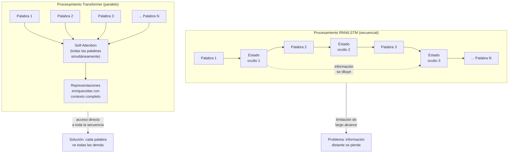
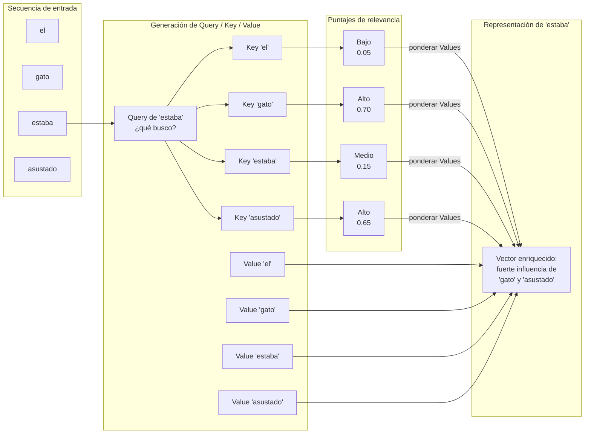

# Ingeniería de IA desde los Fundamentos

## Módulo I — Los Fundamentos de la Inteligencia Artificial

## Capítulo 6 — Transformers y el Mecanismo de Atención

---

## Objetivos de aprendizaje

Al finalizar este capítulo serás capaz de:

1. Explicar qué es la arquitectura Transformer y por qué emergió como respuesta a las limitaciones de modelos anteriores.
2. Identificar las limitaciones concretas de las RNN (Redes Neuronales Recurrentes) y las LSTM en el procesamiento de secuencias largas.
3. Describir el mecanismo de Atención (Attention) conceptualmente, sin necesidad de fórmulas matemáticas.
4. Distinguir entre Self-Attention, Multi-Head Attention, Encoder y Decoder como componentes arquitectónicos con responsabilidades específicas.
5. Relacionar la arquitectura Transformer con los Large Language Models (LLM) modernos: qué comparten y qué los diferencia.
6. Aplicar un modelo preentrenado con HuggingFace Transformers para realizar inferencia básica sobre texto.
7. Analizar un caso empresarial real donde los Transformers aportan valor diferencial respecto a enfoques anteriores.

---

## Introducción

Si tuviéramos que identificar un único avance técnico responsable de la explosión de la Inteligencia Artificial (IA) generativa en los últimos años, ese avance es la arquitectura Transformer. No porque sea perfecta, sino porque resolvió un problema que durante décadas limitó severamente la capacidad de las máquinas para procesar lenguaje a escala: la incapacidad de capturar relaciones de largo alcance dentro de un texto.

ChatGPT, Claude, Gemini, Llama, Qwen, Gemma. Estos modelos, a pesar de sus diferencias en tamaño, datos de entrenamiento y decisiones de ingeniería, comparten un fundamento arquitectónico común. Todos procesan lenguaje mediante variantes del mismo mecanismo central: la Atención (Attention). Entender qué es Attention, por qué fue necesario inventarlo y cómo se organiza dentro de la arquitectura Transformer no es un detalle de implementación. Es la base para razonar con rigor sobre cualquier sistema de IA de lenguaje que existe hoy.

Este capítulo no pretende convertirte en investigador de arquitecturas de redes neuronales. Pretende darte el vocabulario conceptual y la intuición suficiente para que, cuando alguien mencione "encoder-decoder", "multi-head attention" o "fine-tuning de un transformer", puedas participar de esa conversación con precisión técnica —y distinguir lo que importa de lo que es ruido.

---

## Motivación del problema: por qué las arquitecturas anteriores llegaron a su límite

### El lenguaje no funciona palabra por palabra

Consideremos esta oración: *"El banco cerró temprano hoy."*

¿A qué banco se refiere? ¿A una entidad financiera o al banco de madera de una plaza? Un lector humano utiliza el contexto completo para resolverlo. Si el párrafo anterior hablaba de finanzas, la interpretación es una. Si hablaba de un parque, es otra.

Ahora extendamos el problema: *"La abogada revisó el contrato por tercera vez. Notó que la cláusula de rescisión, incluida en el anexo B al que se hace referencia en el artículo 7, no contemplaba el caso de fuerza mayor según la definición del artículo 2 del mismo documento. Ella decidió solicitar una enmienda antes de firmar."*

¿A quién se refiere "ella" en la última oración? A "la abogada", mencionada veintitantas palabras atrás. Para un ser humano, la referencia es obvia. Para una máquina que procesa texto de forma secuencial y tiene memoria limitada, recuperar esa conexión de largo alcance era —antes de los Transformers— un desafío genuino.

### El modelo secuencial: RNN y LSTM

Las arquitecturas que dominaron el procesamiento de lenguaje antes de 2017 fueron las Redes Neuronales Recurrentes (RNN) y su variante mejorada, las Long Short-Term Memory (LSTM). La idea era elegante: al procesar cada palabra, el modelo mantiene un "estado oculto" que resume lo que leyó hasta ese momento y lo combina con la palabra actual.

```
palabra₁ → [estado₁] → palabra₂ → [estado₂] → palabra₃ → [estado₃] → ...
```

Este enfoque tiene tres limitaciones estructurales que se volvieron críticas a medida que los textos crecían en longitud y complejidad:

**1. Procesamiento estrictamente secuencial.** Cada palabra debe procesarse después de la anterior. No se puede paralelizar. En textos largos, el tiempo de entrenamiento escala de forma prohibitiva. Mientras las GPUs modernas son extraordinariamente buenas para operaciones paralelas, las RNN no podían aprovechar esa capacidad.

**2. Degradación de la memoria en distancias largas.** Aunque las LSTM mejoraron la memoria de corto plazo con mecanismos de compuertas, seguían degradando la información a medida que la distancia entre palabras relacionadas aumentaba. El estado oculto es un vector de tamaño fijo que debe comprimir toda la información del texto procesado hasta ese punto. Inevitablemente, información relevante se pierde o diluye.

**3. Cuello de botella en el vector de contexto.** En tareas de traducción, el sistema debía comprimir todo el significado del texto de origen en un único vector —llamado vector de contexto— antes de generar la traducción. Este cuello de botella degradaba la calidad notablemente en textos de más de veinte o treinta palabras.

Estas no eran fallas de implementación. Eran consecuencias directas del diseño secuencial. Para superarlas, se necesitaba un cambio de paradigma.

---

## Desarrollo conceptual desde primeros principios

### La pregunta que cambió todo

En 2017, un equipo de Google Brain y Google Research publicó un artículo titulado *"Attention Is All You Need"*. Su propuesta era radical: ¿qué ocurre si en lugar de procesar las palabras una por una, el modelo puede observar todas las palabras simultáneamente y calcular, para cada una, qué tan relevantes son las demás?

Eso es, en esencia, la Atención (Attention).

### ¿Qué es Attention?

Consideremos la oración: *"El perro persiguió al gato porque estaba asustado."*

Cuando leemos "estaba", automáticamente buscamos a qué entidad se refiere. Nuestra intuición dice "el gato", no "el perro", porque inferimos que quien persigue no suele estar asustado. Hacemos eso sin procesar la oración desde el principio: simplemente conectamos "estaba" con "gato" de forma directa, ignorando o ponderando menos las otras palabras.

El mecanismo de Atención formaliza exactamente eso. Para cada palabra en el texto, calcula un puntaje de relevancia con respecto a cada otra palabra. Esos puntajes se convierten en pesos: las palabras con mayor relevancia reciben más "atención" al construir la representación de la palabra actual.

El resultado es que la representación de "estaba" incorpora fuertemente el significado de "gato" y "asustado", con menor influencia de "perro" y "persiguió". El modelo captura la relación directamente, sin importar cuántas palabras separen a los términos relacionados.

Esto resuelve de raíz el problema del largo alcance: la distancia entre palabras deja de importar porque el mecanismo opera sobre todas las posiciones a la vez.

### Self-Attention: cada palabra mira a todas las demás

La variante de Attention que usan los Transformers se llama **Self-Attention** (auto-atención). "Self" porque la atención se aplica dentro de la misma secuencia: cada palabra de un texto calcula su relevancia con respecto a todas las otras palabras del mismo texto.

El proceso conceptual para cada palabra es:
1. Generar tres representaciones derivadas: una Consulta (Query), una Clave (Key) y un Valor (Value).
2. Comparar la Consulta de esta palabra con las Claves de todas las demás para obtener puntajes de relevancia.
3. Usar esos puntajes para ponderar los Valores de todas las palabras.
4. Combinar los Valores ponderados para producir una representación enriquecida de la palabra actual.

Sin entrar en la matemática matricial, la intuición es ésta: la Query es "lo que esta palabra está buscando", la Key es "lo que cada palabra ofrece como información", y el Value es "el contenido real que se transfiere si hay coincidencia". La similitud entre Query y Key determina cuánto del Value se incorpora.

### Multi-Head Attention: múltiples perspectivas simultáneas

Una sola operación de Self-Attention captura un tipo de relación. Pero en lenguaje, las relaciones son múltiples y simultáneas: una palabra puede relacionarse con otra por proximidad sintáctica, por correferencia semántica, por rol gramatical, por tema compartido.

**Multi-Head Attention** (atención de múltiples cabezales) resuelve esto ejecutando varias operaciones de Self-Attention en paralelo, cada una con sus propios parámetros. Cada "cabezal" aprende a especializarse en un tipo diferente de relación. Al final, las representaciones producidas por todos los cabezales se concatenan y proyectan en una representación unificada.

El resultado es que el modelo captura simultáneamente múltiples dimensiones de relación entre palabras, con una riqueza representacional que un solo cabezal de atención no podría lograr.

### Encoder y Decoder: dos módulos con responsabilidades distintas

La arquitectura Transformer original tiene dos grandes bloques: el Encoder (codificador) y el Decoder (decodificador). Comprenderlos conceptualmente es fundamental porque muchos modelos modernos usan solo uno de los dos.

**El Encoder** recibe una secuencia de entrada —por ejemplo, una oración en español— y produce una representación interna rica en contexto. Ese proceso no genera texto: transforma las palabras de entrada en vectores que codifican su significado considerando el contexto de todas las demás palabras. Es un proceso de comprensión.

**El Decoder** recibe la representación producida por el Encoder y genera la secuencia de salida token por token —por ejemplo, la traducción al inglés. Al generar cada nuevo token, el Decoder aplica Attention sobre la representación del Encoder (para acceder al contenido de entrada) y también sobre los tokens que ya generó (para mantener coherencia con lo que viene produciendo).

En términos prácticos:

- Modelos como **BERT** usan solo el Encoder. Son excelentes para tareas donde necesitamos entender texto completo: clasificación, extracción de información, similitud semántica.
- Modelos como **GPT** usan solo el Decoder. Son excelentes para generación de texto: completar, resumir, responder preguntas.
- Modelos de traducción como los primeros **T5** o el Transformer original usan ambos: Encoder para procesar el texto fuente, Decoder para generar el texto destino.

### Paralelización: por qué Transformer escala

A diferencia de las RNN, donde cada paso depende del anterior, Self-Attention puede calcularse para todas las posiciones de la secuencia simultáneamente. Esto transforma el entrenamiento: una GPU puede procesar en paralelo las relaciones entre todas las palabras del texto al mismo tiempo.

Esta capacidad de paralelización fue lo que permitió entrenar modelos con miles de millones de parámetros sobre cantidades masivas de texto. No es solo una mejora de velocidad: es el factor que habilitó la escala que hace posibles los Large Language Models (LLM).

### Transformer y LLM: arquitectura vs. modelo

Es un error frecuente usar "Transformer" y "LLM" como sinónimos. La relación es más precisa:

```
Grandes cantidades de texto
+ Arquitectura Transformer
+ Entrenamiento masivo (preentrenamiento)
+ Ajuste fino (fine-tuning)
= Large Language Model (LLM)
```

El Transformer es la arquitectura. El LLM es el sistema completo resultante de aplicar esa arquitectura a escala, con datos específicos y objetivos de entrenamiento particulares. Lo que diferencia a ChatGPT de Claude no es que uno sea "más Transformer" que el otro: es el entrenamiento, los datos, el tamaño, el ajuste fino y las decisiones de ingeniería propias de cada organización.

---

## Analogía: la reunión con muchos participantes

Imaginá que estás en una reunión de trabajo donde diez personas hablan a la vez. Para comprender lo que está pasando, no prestás la misma atención a todos. Automáticamente priorizás a quienes están diciendo algo directamente relevante para el tema que te interesa en ese momento. El resto entra como ruido de fondo.

Ahora imaginá que podés escuchar a todos simultáneamente y asignarles un nivel de atención diferente según cuánto aportan a tu comprensión del momento. Y que podés hacer eso para múltiples temas al mismo tiempo —como si tuvieras diez oyentes internos especializados cada uno en un aspecto diferente de la conversación.

Eso es lo que hace Multi-Head Attention: múltiples "oyentes" especializados operando en paralelo, cada uno capturando un tipo diferente de relación entre las palabras del texto.

---

## Diagrama 1: Transformer vs RNN en el flujo de procesamiento



---

## Diagrama 2: Mecanismo de Atención conceptual



---

## Ejemplo real: procesamiento de documentos legales

### El problema

Una firma de abogados corporativos con 300 profesionales procesa mensualmente alrededor de 4.000 contratos: acuerdos de confidencialidad, contratos de licencia de software, acuerdos de nivel de servicio, contratos de distribución. Cada documento tiene entre 15 y 80 páginas. El proceso de revisión inicial, donde un abogado junior identifica cláusulas de riesgo y genera un resumen ejecutivo, demanda entre dos y cuatro horas por contrato.

El equipo de tecnología evaluó automatizar esa revisión inicial con IA.

### Por qué enfoques anteriores no alcanzaban

Un sistema basado en reglas o expresiones regulares puede detectar la presencia de palabras clave ("cláusula de rescisión", "fuerza mayor", "responsabilidad limitada"). Pero no puede interpretar el alcance de esas cláusulas en su contexto. Una cláusula de responsabilidad limitada en un contrato de software de bajo valor tiene implicancias muy distintas que la misma cláusula en un acuerdo de servicios críticos de infraestructura.

Un modelo RNN/LSTM podría capturar algo de contexto local, pero un contrato de 50 páginas tiene miles de tokens. Las referencias cruzadas entre artículos —"según lo dispuesto en el Anexo B mencionado en el artículo 7"— separan conceptos relacionados por cientos de párrafos. La degradación de memoria de las LSTM se vuelve un problema real en esa escala.

### La solución con Transformers

El equipo implementó un pipeline basado en un modelo Transformer preentrenado (variante BERT) ajustado finamente sobre un corpus de contratos anotados por abogados senior. El sistema:

1. Divide cada contrato en secciones estructurales (encabezados, cláusulas, anexos).
2. Aplica Self-Attention para identificar referencias cruzadas entre secciones, incluso cuando están separadas por decenas de páginas.
3. Extrae y clasifica cláusulas por categoría (rescisión, responsabilidad, confidencialidad, penalidades) con una representación contextual de cada una.
4. Genera un resumen ejecutivo con los hallazgos de riesgo ordenados por severidad.

### Resultado

La revisión inicial automatizada redujo de 3 horas promedio a 25 minutos por contrato el tiempo de trabajo del abogado junior, que ahora revisa el output del sistema en lugar de leer el documento completo desde cero. La tasa de detección de cláusulas de riesgo mejoró respecto al proceso manual: el modelo no se fatiga ni omite secciones en contratos extensos.

El punto crítico del éxito fue la capacidad del Transformer para capturar referencias de largo alcance dentro de documentos de alta densidad textual. Ese es exactamente el problema para el que la arquitectura fue diseñada.

---

## Conversación con un arquitecto

**Desarrollador:** Escuché que ChatGPT y Claude "son básicamente lo mismo por dentro". ¿Es cierto?

**Arquitecto:** Depende de qué querés decir con "por dentro". En cuanto a arquitectura base, sí: ambos son Transformers basados en variantes del mecanismo de Attention. Pero eso es como decir que dos autos son "básicamente lo mismo" porque ambos tienen motor de combustión. Lo que los diferencia es el entrenamiento: los datos, el volumen, el proceso de ajuste fino, los objetivos de optimización, las decisiones de seguridad. Esas diferencias importan más que la arquitectura base cuando evaluás el comportamiento del modelo.

**Desarrollador:** Entonces el Transformer es solo una parte del puzzle.

**Arquitecto:** Es la parte estructural. El Transformer es la arquitectura sobre la que se construye el LLM, no el LLM en sí. Del mismo modo que React es un framework para construir interfaces, no una interfaz por sí solo. Tener la arquitectura no te da el modelo; te da la posibilidad de construirlo, si también tenés los datos, el cómputo y el proceso de entrenamiento correctos.

**Desarrollador:** ¿Y cuándo me conviene usar solo el Encoder versus el Decoder?

**Arquitecto:** Pensalo en términos de la tarea. Si necesitás entender texto para clasificarlo, extraer información o comparar semántica, usás un modelo Encoder como BERT. Si necesitás generar texto —continuar, resumir, traducir, responder— usás un modelo Decoder como GPT. Si tu tarea implica transformar texto de un formato a otro con comprensión profunda del origen —traducción compleja, reformulación estructurada— ahí el sistema Encoder-Decoder completo tiene sentido.

**Desarrollador:** ¿Qué pasa con Multi-Head Attention? ¿Cuántos cabezales hay que usar?

**Arquitecto:** Esa es una decisión de diseño del modelo preentrenado, no tuya como usuario. Cuando usás un modelo de HuggingFace o una API, la arquitectura ya está definida. Lo que sí te corresponde decidir es si ese modelo preentrenado es apropiado para tu tarea, si necesitás fine-tuning con tus datos, y qué tipo de inferencia querés hacer. No tenés que configurar cabezales de atención; tenés que entender qué hacen para poder interpretar el comportamiento del modelo y diagnosticar cuando algo falla.

**Desarrollador:** ¿Tiene alguna limitación importante el Transformer?

**Arquitecto:** Varias. La más práctica: la Self-Attention tiene costo cuadrático en longitud de secuencia. Eso significa que si duplicás el número de tokens del texto, el cómputo se cuadruplica. Por eso existe la noción de "ventana de contexto" —el límite de tokens que un modelo puede procesar a la vez. Hay investigación activa en variantes de atención más eficientes para superar esto. También son costosos de entrenar desde cero: miles de GPUs durante semanas. Por eso la práctica dominante es usar modelos preentrenados y ajustarlos, no construir desde cero.

---

## Errores frecuentes

**Error 1: Confundir Transformer con LLM.**
El Transformer es una arquitectura. Un LLM es el resultado de aplicar esa arquitectura a escala masiva con datos y entrenamiento específicos. Decir "vamos a usar un Transformer" cuando se quiere decir "vamos a usar GPT-4 o Claude" es impreciso. Un Transformer sin entrenamiento es solo una estructura matemática vacía.

**Error 2: Asumir que más cabezales de atención siempre es mejor.**
El número de cabezales en Multi-Head Attention es un hiperparámetro de diseño. No existe una regla universal. Más cabezales implican más parámetros y más cómputo, con retornos decrecientes a partir de cierto punto. Los diseñadores de arquitecturas hacen ablation studies para encontrar el balance adecuado.

**Error 3: Ignorar la ventana de contexto en producción.**
Cada modelo tiene un límite de tokens que puede procesar en un solo paso. Pasar ese límite no produce un error elegante: puede producir truncación silenciosa, degradación de calidad o fallas. Antes de llevar un sistema a producción, hay que medir si los documentos típicos caben en la ventana de contexto del modelo elegido —y tener una estrategia de chunking si no es así.

**Error 4: Asumir que el modelo preentrenado ya "sabe" tu dominio.**
Un modelo preentrenado en texto general aprende distribuciones de lenguaje general. Si tu caso de uso es altamente especializado —terminología legal, médica, técnica de nicho— el rendimiento puede ser decepcionante sin fine-tuning o sin ejemplos bien seleccionados en el prompt. Preentrenado no significa especializado.

**Error 5: Tratar la salida del modelo como verdad sin validación.**
Un Transformer es un sistema probabilístico que produce la continuación estadísticamente más probable del texto, dado su entrenamiento. No verifica hechos, no consulta fuentes externas a menos que esté diseñado para hacerlo, y puede producir texto fluido e incorrecto con alta confianza. La validación de output es una responsabilidad de diseño del sistema, no una garantía de la arquitectura.

---

## Buenas prácticas

**1. Elegir el modelo según la tarea, no según la popularidad.**
BERT para comprensión y clasificación. GPT para generación. T5 o modelos seq2seq para transformación de texto. Usar el modelo más famoso para todo es una decisión de marketing, no de ingeniería.

**2. Evaluar la ventana de contexto antes de elegir el modelo.**
Calculá el tamaño promedio y máximo de los documentos que procesarás (en tokens, no en palabras —la proporción varía según el tokenizador). Elegí un modelo cuya ventana de contexto cubra tus casos de uso con margen. Diseñá una estrategia de segmentación para los casos que excedan ese límite.

**3. Empezar con modelos preentrenados antes de considerar fine-tuning.**
En la mayoría de los casos, un modelo preentrenado bien promoteado supera a un modelo con fine-tuning mal configurado. Primero agotá las posibilidades del prompting, luego evaluá si fine-tuning con datos propios mejora métricas concretas.

**4. Versionar los modelos como si fueran código.**
Un cambio de versión del modelo base puede alterar el comportamiento de tu sistema de formas inesperadas. Tratar los modelos como dependencias versionadas —igual que tratás las versiones de una librería— es práctica obligatoria en sistemas de producción.

**5. Medir latencia e impacto económico desde el inicio.**
La inferencia con modelos grandes tiene costo computacional real. En sistemas de alta demanda, la latencia por request y el costo por token son métricas de diseño, no de operaciones. Definir presupuestos de latencia y costo antes de elegir el modelo evita sorpresas costosas en producción.

**6. Documentar las limitaciones conocidas del modelo en uso.**
Cada modelo tiene sesgos, puntos ciegos y distribuciones de error características. Documentar qué casos se sabe que maneja mal —y tener estrategias de fallback— es parte del diseño responsable de un sistema de IA.

---

## Laboratorio estructurado

### Objetivo

Usar un modelo Transformer preentrenado para analizar la influencia contextual de palabras en dos párrafos de diferente complejidad, reflexionando sobre cómo el mecanismo de Atención conecta términos semánticamente relacionados.

### Nivel

Inicial — no requiere conocimientos matemáticos profundos.

### Tiempo estimado

60-90 minutos.

### Prerrequisitos

- Python 3.9 o superior instalado.
- Comprensión básica de listas y diccionarios en Python.
- Haber leído las secciones de Attention y Self-Attention de este capítulo.

### Herramientas

- Biblioteca `transformers` de HuggingFace.
- Biblioteca `torch` (PyTorch).
- Entorno virtual Python (recomendado: `venv` o `conda`).
- Editor de código o Jupyter Notebook.

### Instalación

```bash
pip install transformers torch
```

### Escenario

Trabajás en el equipo de tecnología de una consultora legal. El equipo de abogados pregunta: "¿Cómo sabe el modelo qué palabras son más importantes para entender una cláusula contractual?" Tu tarea es demostrar el concepto usando dos textos: uno simple y uno extraído de un contrato real.

### Pasos

#### Paso 1: Inferencia básica con un modelo preentrenado

El siguiente código carga un modelo Transformer preentrenado de HuggingFace y realiza análisis de sentimiento sobre dos oraciones. El objetivo es verificar que el entorno funciona y observar cómo el modelo procesa texto completo como unidad.

```python
from transformers import pipeline

# Cargar un pipeline de análisis de sentimiento (descarga el modelo automáticamente)
clasificador = pipeline("text-classification", model="distilbert-base-uncased-finetuned-sst-2-english")

# Texto simple
texto_simple = "The contract terms are clear and favorable."

# Texto complejo (fragmento legal)
texto_complejo = (
    "The indemnification clause in Section 7.3, "
    "cross-referenced with the liability limitations in Annex B, "
    "effectively transfers all operational risk to the counterparty."
)

resultado_simple = clasificador(texto_simple)
resultado_complejo = clasificador(texto_complejo)

print("Texto simple:")
print(f"  Input: {texto_simple}")
print(f"  Resultado: {resultado_simple}")

print("\nTexto complejo:")
print(f"  Input: {texto_complejo}")
print(f"  Resultado: {resultado_complejo}")
```

#### Paso 2: Explorar pesos de atención

El siguiente código extrae los pesos de atención del modelo para visualizar qué palabras "miran" más a cuáles otras durante el procesamiento.

```python
from transformers import AutoTokenizer, AutoModel
import torch

# Cargar modelo y tokenizador con salida de atención habilitada
modelo_nombre = "distilbert-base-uncased"
tokenizador = AutoTokenizer.from_pretrained(modelo_nombre)
modelo = AutoModel.from_pretrained(modelo_nombre, output_attentions=True)
modelo.eval()

def analizar_atencion(texto):
    """Tokeniza el texto y extrae pesos de atención del primer cabezal."""
    inputs = tokenizador(texto, return_tensors="pt")
    tokens = tokenizador.convert_ids_to_tokens(inputs["input_ids"][0])

    with torch.no_grad():
        outputs = modelo(**inputs)

    # outputs.attentions: tupla con un tensor por capa
    # Tomamos la última capa, primer cabezal de atención
    atencion = outputs.attentions[-1][0, 0].numpy()

    return tokens, atencion

# Analizar ambos textos
tokens_simple, atencion_simple = analizar_atencion("The contract terms are clear and favorable.")
tokens_complejo, atencion_complejo = analizar_atencion(
    "The indemnification clause transfers all risk to the counterparty."
)

print("Tokens del texto simple:")
print(tokens_simple)
print("\nDimensión de la matriz de atención:", atencion_simple.shape)
print("Cada fila = qué atiende un token. Cada columna = cuánto es atendido.")
```

#### Paso 3: Identificar las palabras más "atendidas"

```python
import numpy as np

def palabras_mas_atendidas(tokens, atencion, top_n=3):
    """
    Calcula qué tokens reciben más atención en promedio
    (suma de columnas de la matriz de atención).
    """
    # Suma de cuánta atención recibe cada token desde todos los demás
    atencion_recibida = atencion.sum(axis=0)

    # Normalizar para comparar
    atencion_normalizada = atencion_recibida / atencion_recibida.sum()

    # Ordenar por relevancia
    indices_ordenados = np.argsort(atencion_normalizada)[::-1]

    print(f"{'Token':<20} {'Atención recibida':>20}")
    print("-" * 42)
    for idx in indices_ordenados[:top_n]:
        token = tokens[idx]
        peso = atencion_normalizada[idx]
        print(f"{token:<20} {peso:>20.4f}")

print("=== Texto simple ===")
palabras_mas_atendidas(tokens_simple, atencion_simple)

print("\n=== Texto complejo ===")
palabras_mas_atendidas(tokens_complejo, atencion_complejo)
```

### Validación

El laboratorio está completo cuando podés responder:

1. ¿Qué tokens reciben más atención en el texto simple? ¿Coincide con tu intuición sobre qué palabras son más centrales en esa oración?
2. ¿Cambia el patrón de atención en el texto complejo? ¿Qué palabras del fragmento legal concentran más influencia?
3. ¿El token `[CLS]` (marcador de inicio) aparece entre los más atendidos? ¿Por qué tiene sentido?
4. ¿Cuántas capas de atención tiene el modelo? ¿Cómo cambian los patrones entre la primera y la última capa?

### Reflexión

Después de ejecutar el laboratorio, pensá en estas preguntas:

- En el texto legal, ¿las palabras que reciben más atención son las técnicamente más importantes para un abogado? ¿O hay diferencias?
- ¿Qué limitación tiene usar solo un cabezal de atención para este análisis? ¿Qué información podría estar capturando otro cabezal?
- Si el modelo fue entrenado principalmente en texto general de internet, ¿esperás que capture la terminología legal con la misma precisión que capturaría texto periodístico?

### Desafíos opcionales

1. **Visualización:** Usar `matplotlib` para generar un heatmap de la matriz de atención completa. Las filas son los tokens que "atienden" y las columnas los que son "atendidos".
2. **Comparación de capas:** Repetir el análisis para la primera capa de atención y compararla con la última. ¿Capturan tipos de relaciones diferentes?
3. **Fine-tuning conceptual:** Buscar en HuggingFace Hub un modelo específicamente ajustado para documentos legales (por ejemplo, `nlpaueb/legal-bert-base-uncased`) y repetir el análisis. ¿Cambian los patrones de atención en el texto legal?
4. **Texto en español:** Usar un modelo multilingüe (como `bert-base-multilingual-cased`) y analizar un fragmento de contrato en español. ¿Cómo tokeniza términos compuestos como "responsabilidad civil" o "fuerza mayor"?

---

## Preguntas de reflexión

1. ¿Por qué el procesamiento secuencial de las RNN es una limitación estructural y no solo una ineficiencia de implementación? ¿Qué debería cambiar fundamentalmente en el diseño para superarla?

2. El mecanismo de Self-Attention tiene costo cuadrático en longitud de secuencia. ¿Qué implica esto en la práctica para sistemas que deben procesar documentos de cientos de páginas? ¿Qué estrategias de ingeniería existen para mitigarlo?

3. Dos modelos basados en Transformer tienen rendimientos muy diferentes en la misma tarea de análisis de contratos. Listá al menos cinco variables (no arquitectónicas) que podrían explicar esa diferencia.

4. Multi-Head Attention permite que diferentes cabezales se especialicen en distintos tipos de relaciones. ¿Podés hipotetizar qué tipo de relación podría estar capturando cada cabezal en un texto legal? ¿Y en una partitura musical representada como texto?

5. Un equipo propone entrenar un Transformer desde cero usando contratos de su empresa. ¿Qué preguntas harías antes de aprobar esa decisión? ¿Cuándo tendría sentido y cuándo no?

6. El artículo original se llama "Attention Is All You Need". ¿Es ese título literalmente preciso? ¿Qué otros componentes del Transformer son igualmente necesarios para su funcionamiento?

7. Si un modelo Transformer produce una respuesta incorrecta pero muy fluida y bien construida gramaticalmente, ¿qué dice eso sobre la naturaleza del mecanismo de Atención? ¿Qué implicación tiene para el diseño de sistemas en producción?

---

## Resumen narrativo

La arquitectura Transformer nació de una pregunta concreta: ¿cómo puede un sistema procesar relaciones entre palabras distantes sin depender de que la información viaje paso a paso a través de toda la secuencia?

Las RNN y las LSTM representaron avances genuinos, pero cargaban con limitaciones estructurales: el procesamiento secuencial impedía la paralelización, la memoria degradaba con la distancia y el cuello de botella del vector de contexto limitaba la calidad en secuencias largas. Esas limitaciones no eran bugs; eran consecuencias directas del diseño.

El mecanismo de Atención resolvió el problema de raíz: en lugar de transmitir información de forma secuencial, permite que cada elemento de la secuencia calcule directamente su relevancia con respecto a todos los demás. Self-Attention lleva eso a cada posición dentro del texto. Multi-Head Attention añade la capacidad de capturar múltiples tipos de relaciones en paralelo. El Encoder transforma el texto de entrada en representaciones ricas en contexto. El Decoder las usa para generar la salida token por token.

La consecuencia de diseño más importante fue la paralelización: el entrenamiento de Transformers puede aprovechar el hardware moderno de forma que las RNN nunca pudieron. Eso es lo que habilitó la escala necesaria para construir Large Language Models con miles de millones de parámetros entrenados sobre cantidades masivas de texto.

Comprender Transformers no significa conocer la matemática de los productos punto o la notación matricial de las operaciones de Query, Key y Value. Significa saber qué problema resuelve, cómo lo resuelve conceptualmente, qué decisiones de arquitectura existen (Encoder vs Decoder vs ambos), y qué limitaciones reales tiene en sistemas de producción. Ese es el nivel de comprensión que permite tomar decisiones de ingeniería informadas.

---

## Checklist del capítulo

- [ ] Identifico las tres limitaciones principales de las RNN/LSTM en el procesamiento de secuencias largas.
- [ ] Puedo explicar qué es el mecanismo de Atención sin usar fórmulas matemáticas.
- [ ] Distingo entre Self-Attention y Multi-Head Attention, y puedo explicar para qué sirve cada uno.
- [ ] Comprendo la diferencia conceptual entre Encoder y Decoder, y sé cuándo se usa cada configuración.
- [ ] Puedo relacionar la arquitectura Transformer con los LLM modernos y explicar qué los diferencia más allá de la arquitectura.
- [ ] Ejecuté el laboratorio y analicé los patrones de atención en al menos dos textos de diferente complejidad.
- [ ] Puedo describir al menos tres errores frecuentes en el uso de modelos Transformer en sistemas reales.
- [ ] Identifico la limitación del costo cuadrático de Self-Attention y su implicación práctica en sistemas de producción.

---

## Glosario breve

**Transformer:** Arquitectura de red neuronal presentada en 2017 ("Attention Is All You Need") que reemplaza el procesamiento secuencial por mecanismos de atención paralela. Es la base arquitectónica de los LLM modernos.

**Attention (Atención):** Mecanismo que permite a cada elemento de una secuencia calcular su relevancia con respecto a todos los demás elementos, asignando pesos diferenciados en lugar de tratar todas las posiciones por igual.

**Self-Attention (Auto-atención):** Variante de Attention donde cada posición de una secuencia calcula su relación de relevancia con todas las otras posiciones de la misma secuencia. Permite capturar dependencias de largo alcance sin procesamiento secuencial.

**Multi-Head Attention (Atención de múltiples cabezales):** Extensión de Self-Attention que ejecuta múltiples operaciones de atención en paralelo, cada una con parámetros propios, para capturar simultáneamente distintos tipos de relaciones entre elementos de la secuencia.

**Encoder (Codificador):** Componente del Transformer que procesa la secuencia de entrada y produce representaciones internas ricas en contexto. Utilizado en modelos como BERT para tareas de comprensión de texto.

**Decoder (Decodificador):** Componente del Transformer que genera la secuencia de salida token por token, atendiendo tanto a la representación del Encoder como a los tokens ya generados. Utilizado en modelos como GPT para generación de texto.

**Ventana de contexto:** Límite máximo de tokens que un modelo puede procesar en una sola inferencia. Documentos que exceden este límite deben segmentarse, lo que puede afectar la captura de referencias de largo alcance.

**Fine-tuning (Ajuste fino):** Proceso de continuar el entrenamiento de un modelo preentrenado sobre datos específicos de un dominio o tarea, para adaptar su comportamiento sin entrenar desde cero.

**RNN (Red Neuronal Recurrente):** Arquitectura de red neuronal diseñada para procesar secuencias de forma iterativa, manteniendo un estado oculto que resume la información procesada hasta el momento. Predecesora de los Transformers en tareas de lenguaje.

**LSTM (Long Short-Term Memory):** Variante de RNN que incorpora mecanismos de compuertas para controlar qué información mantener o descartar en el estado oculto, mejorando la memoria sobre secuencias más largas que las RNN estándar.

---

## Próximo capítulo

**Capítulo 7 — Large Language Models: escala, preentrenamiento y emergencia**

El Transformer es la arquitectura. Pero ¿qué ocurre cuando se entrena esa arquitectura con cientos de miles de millones de parámetros sobre trillones de tokens de texto? El próximo capítulo explora cómo surge el comportamiento de los LLM modernos, qué significa el preentrenamiento, qué son las capacidades emergentes y por qué los modelos de mayor escala exhiben comportamientos que modelos más pequeños no pueden replicar. También examinaremos el proceso de ajuste por instrucciones (instruction tuning) y el aprendizaje por refuerzo desde retroalimentación humana (RLHF), los mecanismos que transforman un modelo que completa texto en un asistente que sigue instrucciones.

---

> "Un arquitecto no memoriza respuestas. Comprende problemas para poder diseñar soluciones."
