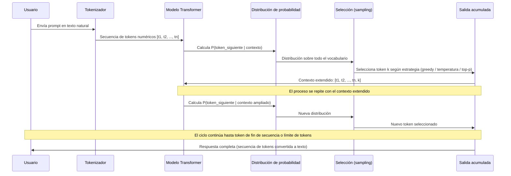
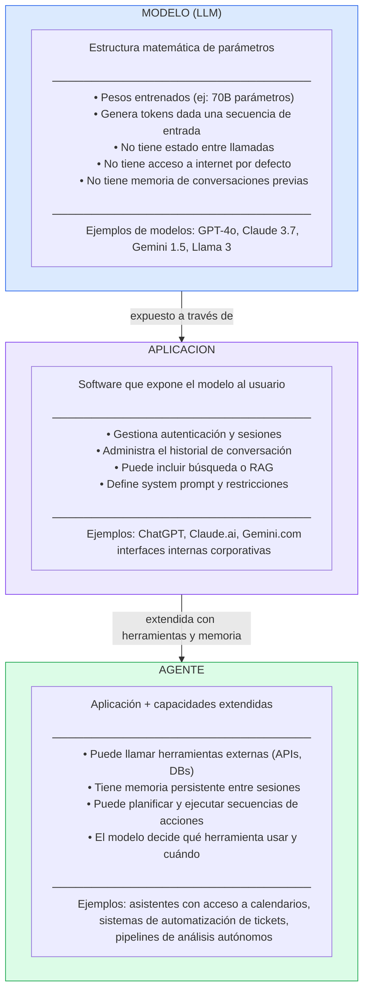

# Ingeniería de IA desde los Fundamentos

# Módulo I — Los Fundamentos de la Inteligencia Artificial

# Capítulo 7 — Large Language Models: El Motor detrás del Lenguaje

**Versión:** 0.5 (Revisión conceptual)

---

## 1. Objetivos de aprendizaje

Al finalizar este capítulo serás capaz de:

1. Definir con precisión qué es un Large Language Model (LLM) y diferenciarlo de las aplicaciones que lo utilizan.
2. Describir el proceso de generación de texto token a token y explicar por qué es autoregresivo.
3. Distinguir conceptualmente las tres etapas de construcción de un LLM: preentrenamiento, ajuste fino (fine-tuning) y alineación mediante retroalimentación humana.
4. Leer una tabla comparativa de LLMs y extraer criterios de selección para un caso de uso concreto.
5. Identificar qué es una alucinación, por qué ocurre estructuralmente y qué estrategias de mitigación existen.
6. Diferenciar un Modelo, una Aplicación y un Agente de IA con ejemplos del entorno profesional.
7. Evaluar los límites reales de un LLM para no traspasar la frontera entre predicción estadística y comprensión genuina.
8. Ejecutar una llamada básica a una API de LLM y analizar las diferencias entre modelos distintos frente al mismo prompt.

---

## 2. Introducción

En los capítulos anteriores construimos la base: Machine Learning (ML) como paradigma de aprendizaje desde datos, Deep Learning (DL) como la técnica que permite aprender representaciones automáticamente, y los Transformers como la arquitectura que resolvió el problema de procesar secuencias largas de texto con atención. Ahora llegamos al punto donde todo converge: los modelos de lenguaje de gran tamaño.

Los Large Language Models (LLM) son sistemas entrenados sobre enormes volúmenes de texto con el objetivo de aprender relaciones estadísticas entre tokens. El resultado es un motor capaz de generar texto coherente, responder preguntas, escribir código, resumir documentos y razonar sobre problemas complejos. Esa capacidad emergente —que nadie programó explícitamente— es la consecuencia de aplicar la arquitectura Transformer a escala masiva.

Sin embargo, junto con esa capacidad llegó una confusión igualmente masiva. Términos como "ChatGPT", "Claude" o "Gemini" se usan indistintamente para referirse a modelos, aplicaciones y empresas. Para un ingeniero que debe diseñar, evaluar o integrar estas tecnologías, esa imprecisión tiene consecuencias concretas: decisiones de arquitectura incorrectas, expectativas desalineadas y sistemas que fallan en producción. Este capítulo construye el marco conceptual necesario para operar con precisión en ese ecosistema.

---

## 3. Motivación del problema: ¿por qué necesitamos modelos de lenguaje a escala?

Para entender por qué los LLM existen, conviene preguntarse qué problema vienen a resolver.

El lenguaje natural es el sistema de comunicación más rico y ambiguo que existe. Una frase de diez palabras puede tener decenas de interpretaciones válidas dependiendo del contexto, del tono, del conocimiento previo del lector y de lo que no se dice. Durante décadas, los sistemas de procesamiento de lenguaje natural (PLN) intentaron modelar ese lenguaje mediante reglas gramaticales, diccionarios y heurísticas escritas manualmente. El resultado era funcional en dominios muy acotados —menús de respuesta automática, comandos de voz simples— pero frágil ante cualquier variación no prevista.

ML cambió el enfoque: en lugar de escribir reglas, aprender patrones a partir de datos. DL permitió aprender representaciones complejas sin ingeniería manual de características. Los Transformers resolvieron el problema de la memoria de largo plazo en secuencias. Pero el salto definitivo fue la escala: entrenar estos sistemas con cientos de miles de millones de parámetros sobre corpora que abarcan prácticamente todo el texto digitalizado disponible en internet.

La escala produjo algo inesperado: capacidades que no fueron diseñadas explícitamente. Un modelo entrenado únicamente para predecir el siguiente token comenzó a traducir idiomas, escribir código funcional, resolver analogías y explicar conceptos científicos. Esas capacidades emergentes son el motor de la transformación actual. Comprender de dónde vienen —y cuáles son sus límites estructurales— es lo que separa al arquitecto del usuario.

---

## 4. Desarrollo conceptual desde primeros principios

### 4.1 ¿Qué es un LLM?

Un Large Language Model es un modelo matemático —una estructura de miles de millones de parámetros— entrenado sobre enormes cantidades de texto para aprender relaciones estadísticas entre tokens. Su tarea durante el entrenamiento no es memorizar respuestas: es aprender a predecir cuál es el siguiente token más probable dada una secuencia de tokens anteriores.

Un token no es lo mismo que una palabra. Un token es la unidad mínima de procesamiento del modelo: puede ser una palabra completa, parte de una palabra, un símbolo de puntuación o un espacio. El texto "machine learning" podría representarse como los tokens `["machine", " learning"]` o como `["mach", "ine", " learn", "ing"]`, dependiendo del tokenizador. Este concepto se desarrollará en profundidad en el Capítulo 8.

Lo que hace notable a un LLM es que, a partir de esa tarea aparentemente simple —predecir el siguiente token—, el sistema desarrolla durante el entrenamiento una representación interna del lenguaje lo suficientemente rica como para generalizar a tareas que nunca vio de forma explícita. Eso no es diseño: es una propiedad emergente de la escala.

### 4.2 ¿Cómo genera texto? El proceso autoregresivo token a token

La generación de texto en un LLM es un proceso autoregresivo: cada token generado se convierte en parte del contexto para generar el siguiente. El proceso puede describirse en seis pasos:

**Paso 1 — Tokenización del input:** El texto de entrada (el prompt) se convierte en una secuencia de tokens numéricos. El modelo no procesa texto directamente: procesa vectores numéricos.

**Paso 2 — Análisis de contexto mediante Transformer:** La secuencia completa de tokens se procesa a través de las capas de la arquitectura Transformer. El mecanismo de atención permite que cada token considere el contexto de todos los demás tokens de la secuencia, independientemente de su posición.

**Paso 3 — Cálculo de probabilidades:** La última capa del modelo produce una distribución de probabilidad sobre todos los tokens del vocabulario. Cada token recibe una probabilidad de ser el siguiente token adecuado.

**Paso 4 — Selección de un token:** El modelo selecciona un token de esa distribución. Hay diferentes estrategias de selección: tomar el más probable (greedy decoding), samplear aleatoriamente según la distribución, o aplicar técnicas como temperatura y top-p sampling que equilibran coherencia y variedad.

**Paso 5 — Extensión del contexto:** El token seleccionado se incorpora a la secuencia de entrada. El contexto creció en un token.

**Paso 6 — Repetición:** El proceso se repite desde el Paso 2 con el contexto extendido, hasta que el modelo genera un token especial de fin de secuencia o se alcanza el límite de tokens configurado.

Este mecanismo tiene una implicación crucial: el modelo no genera la respuesta completa de una vez. La genera token a token, y cada decisión depende de todos los tokens anteriores —incluyendo los que el propio modelo acaba de generar. Eso significa que un error temprano en la generación puede propagarse y amplificarse a lo largo de la respuesta.

### 4.3 Predicción no es comprensión

Este es el punto conceptual más importante del capítulo, y también el más malentendido.

Un LLM produce texto estadísticamente coherente y contextualmente apropiado. Eso no implica que comprenda el mundo en ningún sentido semántico o experiencial. El sistema aprende distribuciones condicionales de tokens sobre enormes corpus de texto humano. Lo que produce es texto que se parece estadísticamente al texto que vería en ese contexto.

Dicho de forma más precisa: si millones de textos que contienen la frase "el agua hierve a" están seguidos por "100 grados Celsius", el modelo asignará alta probabilidad a esa continuación. No porque "conozca" el punto de ebullición del agua en ningún sentido físico, sino porque esa es la continuación estadísticamente más probable dado su entrenamiento.

Las consecuencias prácticas de esta distinción son directas:

- El modelo puede afirmar con total fluidez algo que es factualmente incorrecto si ese error es estadísticamente consistente con su entrenamiento.
- El modelo no tiene acceso a información posterior a su fecha de corte de entrenamiento a menos que se le provea explícitamente.
- El modelo no razona en el sentido deductivo completo: aproxima el razonamiento porque los textos de entrenamiento contienen razonamiento, pero puede fallar de formas que un sistema deductivo genuino no fallaría.

### 4.4 Las tres etapas de construcción de un LLM

Los LLM actuales no se construyen en un solo paso. La mayoría sigue tres etapas diferenciadas, cada una con objetivos distintos.

**Etapa 1 — Preentrenamiento**

En el preentrenamiento, un modelo con arquitectura Transformer se entrena sobre enormes cantidades de texto —típicamente cientos de miles de millones de palabras de libros, artículos, código fuente y páginas web— con el objetivo de aprender a predecir el siguiente token. Este proceso consume semanas o meses en clusters de miles de GPUs y produce un modelo base: un sistema extremadamente capaz de completar texto, pero sin orientación específica sobre cómo comportarse como asistente.

El modelo base es como un motor sin carcasa: potente, pero no listo para uso directo.

**Etapa 2 — Ajuste fino (Fine-tuning)**

El fine-tuning (ajuste fino) consiste en continuar el entrenamiento del modelo base, pero ahora sobre conjuntos de datos curados, más pequeños y específicos: pares pregunta-respuesta, conversaciones, instrucciones con respuestas esperadas. El objetivo es enseñarle al modelo a seguir instrucciones y responder de manera útil.

Esta etapa transforma el modelo base en un modelo instruccionable, capaz de interpretar prompts del tipo "resumí este documento" o "explicá este error de compilación".

**Etapa 3 — Alineación: RLHF**

Reinforcement Learning from Human Feedback (RLHF), que puede traducirse como Aprendizaje por Refuerzo a partir de Retroalimentación Humana, es la técnica que permite alinear el comportamiento del modelo con las preferencias humanas. Evaluadores humanos califican pares de respuestas del modelo según criterios de utilidad, seguridad y precisión. Esas calificaciones entrenan un modelo de recompensa que luego guía el ajuste del LLM mediante técnicas de aprendizaje por refuerzo.

RLHF es la razón por la que un LLM declina responder ciertas preguntas, admite incertidumbre cuando no sabe algo, o ajusta su tono según el contexto. No es una programación de reglas: es el resultado de optimizar el comportamiento del modelo hacia las preferencias expresadas por evaluadores humanos durante el entrenamiento.

### 4.5 Parámetros y escala

Los parámetros de un LLM son los valores numéricos que componen la red neuronal: los pesos de todas las conexiones entre capas que el entrenamiento ajustó. Un modelo con 7.000 millones de parámetros (7B) tiene siete mil millones de números que en conjunto determinan cómo el modelo responde a cualquier entrada.

La relación entre escala y capacidad no es lineal. Investigaciones en el área han documentado que ciertos aumentos de escala producen saltos cualitativos de capacidad —no solo mejoras graduales— en tareas como razonamiento de múltiples pasos o resolución de problemas matemáticos. Este fenómeno se conoce como capacidades emergentes, y su existencia aún no se comprende completamente a nivel teórico.

Lo que sí es claro desde el punto de vista práctico: un modelo más grande no siempre es la elección correcta. Los modelos más grandes consumen más memoria, tienen mayor latencia y son más costosos de ejecutar. Para muchas tareas concretas —clasificación, extracción de entidades, generación de texto de formato fijo— modelos más pequeños y especializados superan en eficiencia a modelos generales más grandes.

---

## 5. Analogía

Imagina una persona que ha leído literalmente todo lo que la humanidad ha escrito en los últimos cien años: todos los libros, artículos científicos, código fuente, conversaciones en foros, correos electrónicos, contratos legales, guiones de películas y manuales técnicos. Ha leído cada uno de esos textos tantas veces que puede predecir, con altísima probabilidad, qué palabra viene después de cualquier secuencia de palabras que le muestres.

Eso es, en términos estadísticos, lo que aprendió un LLM. Ahora pregúntate: ¿esa persona comprende la física del punto de ebullición del agua, o simplemente sabe que cuando alguien escribe "el agua hierve a" lo que sigue es invariablemente "100 grados"? La respuesta cambia dependiendo de tu definición de "comprender". La del modelo es la segunda: sabe qué sigue, no por qué ocurre físicamente.

Lo que no hace esta analogía: no implica que la persona tenga conciencia ni que el LLM la tenga. La persona de la analogía es un dispositivo de completado estadístico extraordinariamente sofisticado. El LLM también. La diferencia es que el LLM lo hace a una velocidad y escala imposibles para cualquier ser humano.

---

## 6. Diagrama Mermaid 1: flujo de generación token a token



**Lectura del diagrama:** El prompt nunca se "responde" de una vez. Cada token de la respuesta es una decisión probabilística condicionada en todo el texto previo. Esto explica por qué aumentar la longitud del contexto tiene costo computacional creciente: cada token generado extiende el contexto que el mecanismo de atención debe procesar en el siguiente paso.

---

## 7. Diagrama Mermaid 2: distinción Modelo / Aplicación / Agente



**Lectura del diagrama:** El modelo es el núcleo matemático. La aplicación es la interfaz que lo hace accesible y usable. El agente es una aplicación que, además de usar el modelo, le otorga capacidades de acción en el mundo. Confundir estos tres niveles lleva a expectativas incorrectas: acusar al "modelo" de no recordar conversaciones anteriores cuando en realidad es la aplicación la que no gestiona memoria; asumir que el "modelo" tiene acceso a internet cuando en realidad es la aplicación la que implementa esa búsqueda.

---

## 8. Tabla comparativa de los principales LLMs

| Modelo | Proveedor | Acceso | Puntos fuertes | Consideraciones |
|--------|-----------|--------|----------------|-----------------|
| GPT-4o | OpenAI | API pública, ChatGPT | Rendimiento general alto, multimodal, ecosistema amplio | Costo por token elevado en producción intensiva; datos de uso bajo política de OpenAI |
| Claude 3.7 Sonnet | Anthropic | API pública, Claude.ai | Razonamiento extendido, contexto largo (200K tokens), adherencia a instrucciones | Capacidades multimodales más limitadas en versiones ligeras |
| Gemini 1.5 Pro | Google | API pública, Google AI Studio | Contexto muy largo (1M tokens), integración con ecosistema Google, capacidades multimodales | Rendimiento variable según dominio; latencia mayor en contextos muy largos |
| Llama 3 (70B) | Meta | Open weights, descarga directa | Despliegue local, sin costo de API, personalizable, sin dependencia de proveedor | Requiere infraestructura propia significativa; sin soporte de proveedor |
| Mistral Large | Mistral AI | API pública, open weights parciales | Eficiencia por parámetro alta, buenas capacidades en código y razonamiento, opción europea | Ecosistema y documentación más limitados que los grandes proveedores |

**Nota editorial:** Esta tabla refleja el estado del ecosistema a mediados de 2026. El campo evoluciona con rapidez. Los criterios de selección —acceso, costo, contexto, capacidades, soberanía de datos— pesan de manera diferente según el contexto de cada organización. La tabla es un punto de partida para la evaluación, no una recomendación universal.

---

## 9. Ejemplo real: asistente de soporte técnico para documentación corporativa

### Contexto

Una empresa de servicios financieros con 2.400 empleados tiene un problema recurrente: el equipo de tecnología recibe un promedio de 340 tickets por semana de los cuales el 62% corresponde a preguntas cuya respuesta ya existe en la documentación interna. Los analistas de soporte dedican tiempo a responder preguntas sobre configuración de VPN, acceso a sistemas, procedimientos de solicitud de accesos y políticas de seguridad que están documentadas pero son difíciles de encontrar en el portal interno.

La dirección de tecnología decide explorar un asistente basado en LLM conectado a la documentación interna.

### La trampa de la primera conversación

El primer reunión técnica produce una confusión clásica. La directora de operaciones pregunta: "¿Usamos ChatGPT?". El arquitecto responde que van a usar un LLM, pero no ChatGPT directamente.

La distinción importa para este proyecto por razones concretas: ChatGPT es una aplicación de consumo general. Lo que necesitan es integrar un modelo de lenguaje en su infraestructura controlada, con acceso a su documentación interna, con control sobre qué datos salen al exterior, con logs auditables y con respuestas acotadas al dominio corporativo. Eso no es una aplicación: es una arquitectura.

### El diseño real

El equipo diseña un sistema con tres capas:

**Capa 1 — El modelo:** Deciden usar un modelo mediano vía API —con capacidades suficientes para el dominio y un costo por token justificable a la escala de uso esperada.

**Capa 2 — La aplicación:** Construyen una interfaz interna conectada al sistema de tickets existente. La aplicación gestiona la sesión del usuario, mantiene el historial de la conversación y decide qué documentación incluir en el contexto.

**Capa 3 — Retrieval-Augmented Generation (RAG):** En lugar de incluir toda la documentación en el prompt —lo que excedería el límite de contexto y aumentaría el costo— implementan un sistema de recuperación: cuando el usuario hace una pregunta, el sistema busca los fragmentos más relevantes de la documentación interna y los incluye en el contexto enviado al modelo. El modelo responde basándose en esa documentación, no en su conocimiento general.

### Los resultados y las lecciones

Tras cuatro meses de operación, el sistema resuelve autónomamente el 54% de los tickets que antes requerían intervención humana. El tiempo de resolución promedio para esos tickets bajó de 3,2 horas a 4 minutos.

Las lecciones más importantes del proyecto fueron:

**Lección 1:** El modelo respondía preguntas correctamente cuando la documentación estaba bien escrita, y producía respuestas imprecisas cuando la documentación era ambigua o incompleta. La calidad de la documentación de base era el factor limitante, no la capacidad del modelo.

**Lección 2:** El sistema producía respuestas confiadas sobre políticas que habían cambiado recientemente y no habían sido actualizadas en la base de documentación. Cuando el RAG recupera un documento desactualizado, el modelo no sabe que está desactualizado. Se estableció un proceso de revisión periódica de la documentación con este nuevo riesgo en mente.

**Lección 3:** Los usuarios comenzaron a hacer preguntas que estaban fuera del dominio del sistema —consultas de RR.HH., solicitudes de equipamiento, temas legales. El modelo respondía igual de fluidamente a preguntas fuera de dominio que a preguntas dentro del dominio. Fue necesario implementar un clasificador de intención que redirigiese esas consultas antes de pasarlas al LLM.

---

## 10. Conversación con un arquitecto

**Gerente de Proyectos:** Leí que GPT-4 es el mejor modelo del mercado. ¿Por qué no lo usamos directamente en todos nuestros proyectos?

**Arquitecto:** "El mejor" depende del contexto. GPT-4 tiene rendimiento alto en tareas generales, pero eso viene con un costo por token que a cierta escala de uso puede ser prohibitivo. Si tenemos un proceso que hace millones de llamadas por día, la diferencia de precio entre modelos puede ser más relevante que la diferencia de calidad. ¿Cuál es el caso de uso específico que tenés en mente?

**Gerente:** Queremos usarlo para clasificar los correos de soporte en categorías: urgente, normal, baja prioridad.

**Arquitecto:** Para clasificación de texto con categorías fijas y bien definidas, hay modelos mucho más pequeños y eficientes que GPT-4. Un modelo de 7B parámetros bien ajustado para clasificación puede alcanzar la misma precisión con una fracción del costo. GPT-4 tiene sentido cuando el problema requiere razonamiento complejo, generación creativa o manejo de instrucciones ambiguas. Para clasificación binaria o de pocas categorías, la escala no agrega valor proporcional.

**Gerente:** Pero el equipo dice que el modelo dijo que un correo era urgente cuando no lo era. ¿Hay que cambiar el modelo?

**Arquitecto:** Antes de cambiar el modelo, necesito saber qué dice el prompt. Los errores de clasificación en LLMs tienen tres causas principales: el prompt no define con precisión las categorías, los ejemplos del prompt son insuficientes o ambiguos, o hay casos que el modelo nunca vio en el entrenamiento. Cambiar el modelo sin entender la causa es gastar presupuesto sin resolver el problema.

**Gerente:** El modelo también afirmó que nuestra política de devoluciones tiene un plazo de 30 días cuando en realidad es de 15. ¿Cómo puede equivocarse en algo tan básico?

**Arquitecto:** Porque el modelo no consultó la política. El modelo generó texto estadísticamente probable. Si el prompt no incluía la política de devoluciones como parte del contexto, el modelo completó desde su conocimiento general. Plazos de 30 días son más comunes en el mercado, así que es un error estadísticamente predecible. Esto es exactamente el problema que RAG resuelve: en lugar de depender del conocimiento del modelo, le proveemos la información específica en el prompt.

**Gerente:** Entonces, ¿el modelo nunca va a ser confiable del todo?

**Arquitecto:** El modelo es una herramienta probabilística. Como toda herramienta probabilística, requiere un sistema a su alrededor que gestione sus fallas. Un piloto automático no elimina la necesidad del piloto: reduce la carga de trabajo rutinaria y permite que el piloto se concentre en las decisiones críticas. Diseñamos la arquitectura de manera que las fallas del modelo sean detectables y manejables, no invisibles e irrecuperables.

---

## 11. Errores frecuentes

### Error 1: Confundir el modelo con la aplicación

El error más común, y con consecuencias más amplias. Cuando alguien dice "le pregunté a ChatGPT" está describiendo la interacción con una aplicación. La aplicación gestiona la sesión, el historial, las restricciones de contenido y el acceso a funcionalidades adicionales. El modelo subyacente es uno de los componentes de esa aplicación, y puede ser diferente al que usó otro usuario de la misma plataforma.

Las decisiones de arquitectura deben separar estos niveles desde el inicio: qué modelo se usa, qué aplicación se construye sobre él y qué capacidades de agente se añaden.

### Error 2: Creer que el LLM tiene acceso a internet por defecto

Un LLM base no tiene acceso a internet. Su conocimiento está determinado por los datos de entrenamiento y tiene una fecha de corte. Si la aplicación implementa búsqueda web, esa búsqueda la realiza la aplicación, que luego incluye los resultados en el contexto enviado al modelo. El modelo no "navega": procesa texto que le llega como input.

Diseñar sistemas que asuman que el modelo tiene información actualizada —sin implementar explícitamente un mecanismo de recuperación— produce sistemas que responden con confianza información desactualizada.

### Error 3: Tratar la respuesta del LLM como verdad sin validación

La fluidez y coherencia del texto generado por un LLM crea una percepción de autoridad. Pero la coherencia del lenguaje es independiente de la corrección factual. Un modelo puede describir con prosa impecable un procedimiento técnico incorrecto, citar un artículo que no existe, o afirmar datos estadísticos que son una combinación plausible pero inexacta de datos reales.

En cualquier aplicación donde la precisión factual sea crítica —salud, finanzas, legal, ingeniería— debe existir un proceso de validación externa a la respuesta del modelo.

### Error 4: Confundir alucinación con falla técnica

Una alucinación —la generación de información factualmente incorrecta con apariencia de certeza— no es un bug que se puede corregir con un parche. Es una consecuencia estructural del mecanismo de predicción probabilística. El modelo genera lo que es estadísticamente más probable, no lo que es verdadero. En ausencia de información correcta en el contexto, completará con lo que "suena bien".

Esto no significa que las alucinaciones no puedan reducirse: mejoras en el entrenamiento, técnicas de grounding con fuentes verificadas (RAG), y prompts que instruyen al modelo a declarar incertidumbre, contribuyen a reducirlas. Pero no se eliminan por completo. El diseño del sistema debe asumir que ocurrirán y gestionar ese riesgo.

### Error 5: Asumir que un LLM más grande siempre es mejor

La relación entre tamaño del modelo y calidad de resultado es tarea-dependiente. Para tareas simples y bien definidas, un modelo más pequeño y eficiente puede producir el mismo resultado a una fracción del costo y la latencia. Los modelos más grandes tienen mayor costo de inferencia, mayor latencia, y pueden requerir infraestructura más costosa. La selección del modelo debe ser una decisión técnica basada en los requisitos reales del caso de uso, no una preferencia por la escala máxima disponible.

### Error 6: Creer que el LLM aprende durante la conversación

El modelo base no actualiza sus parámetros durante la inferencia. Cada conversación parte del mismo estado de pesos entrenados. Lo que la aplicación puede gestionar es el contexto: incluir en el prompt el historial de la conversación actual. Pero ese historial no modifica el modelo: solo amplía el texto de entrada para cada llamada. Cuando la conversación termina, el modelo "olvida" todo lo que ocurrió en ella, a menos que la aplicación persista ese historial y lo incluya en conversaciones futuras.

---

## 12. Buenas prácticas

### Práctica 1: Separar el modelo de la aplicación en el diseño desde el primer día

Definir explícitamente qué componente es el modelo, qué es la aplicación y qué lógica es de negocio. Documentar esa separación. Cuando cambie el modelo —lo cual ocurrirá— la aplicación no debería necesitar una reescritura completa.

### Práctica 2: Incluir siempre la información de referencia relevante en el contexto

No depender del conocimiento general del modelo para datos específicos de la organización: políticas, precios, procedimientos, datos de clientes. Si la respuesta depende de esa información, incluirla en el prompt o recuperarla vía RAG. El modelo no puede responder correctamente sobre lo que no está en su contexto ni en su entrenamiento.

### Práctica 3: Diseñar para el fallo, no contra él

Asumir que el modelo producirá respuestas incorrectas con cierta frecuencia y construir el sistema con eso en mente: validaciones automáticas, revisión humana en el circuito para decisiones críticas, logging de respuestas para auditoría posterior, y mecanismos de escalamiento cuando la confianza del sistema es baja.

### Práctica 4: Evaluar el modelo con datos propios antes de seleccionarlo

Los benchmarks públicos miden rendimiento promedio en datasets estándar. El rendimiento sobre los datos y tareas específicas de la organización puede ser diferente. Antes de comprometerse con un modelo en producción, construir un conjunto de evaluación representativo del caso de uso real y medir en él.

### Práctica 5: Monitorear el comportamiento del sistema en producción

Los patrones de uso real rara vez coinciden exactamente con los escenarios de diseño. Implementar logging de prompts y respuestas (con adecuado tratamiento de datos personales), métricas de calidad medibles, y alertas cuando el comportamiento se desvía de los rangos esperados.

### Práctica 6: Mantener la documentación de los prompts del sistema como código

Los prompts de sistema —las instrucciones que configuran el comportamiento del modelo en la aplicación— son parte del código. Deben estar en control de versiones, tener un proceso de revisión, y ser testeados de forma sistemática antes de cualquier cambio. Un cambio de prompt sin control puede alterar el comportamiento del sistema de formas no previstas.

---

## 13. Laboratorio estructurado

### Objetivo

Comparar el comportamiento de tres Large Language Models diferentes frente al mismo prompt, analizar las diferencias y extraer criterios de selección basados en evidencia propia.

### Nivel

Inicial — no se requiere experiencia previa en APIs de IA, pero sí acceso a al menos dos plataformas de LLM distintas.

### Tiempo estimado

120 minutos

### Prerrequisitos

- Haber completado los Capítulos 5 y 6 (Deep Learning y Transformers).
- Acceso a al menos dos de las siguientes plataformas: Claude.ai, ChatGPT (chat.openai.com), Gemini (gemini.google.com). Idealmente las tres.
- Acceso a una cuenta de desarrollador en al menos un proveedor con API (opcional para el Paso 5).
- Papel y plantilla de registro de observaciones.

### Herramientas

- Interfaces web de LLM (gratuitas o con plan básico)
- Python 3.9 o superior (para el Paso 5 opcional)
- Biblioteca `anthropic` o `openai` (instalable con `pip`)

---

### Escenario

El equipo de arquitectura de una empresa de logística debe seleccionar un LLM para asistir a sus analistas en la interpretación de contratos de transporte internacional. El requisito principal es precisión en contexto legal-técnico y capacidad de identificar condiciones ambiguas. Sos el ingeniero responsable de la evaluación técnica.

---

### Paso 1: Definir el prompt de evaluación

Usarás el mismo prompt en los tres modelos para garantizar comparabilidad. Copiá el siguiente prompt exactamente:

```
Sos un asistente especializado en contratos de transporte internacional.
Analizá el siguiente fragmento de contrato e identificá:
1. Las obligaciones del transportista
2. Las condiciones que podrían ser ambiguas o dar lugar a disputas
3. Las cláusulas que benefician más al contratante que al transportista

Fragmento:
"El transportista se compromete a entregar la mercancía en el destino indicado
dentro del plazo razonable, salvo causas de fuerza mayor no imputables al
transportista. La responsabilidad por daños estará limitada a los valores
declarados en la guía de carga, siempre que dichos valores hayan sido
aceptados por ambas partes al momento de la firma. En caso de demora,
el contratante podrá solicitar compensación según los términos establecidos
en la legislación vigente del país de destino."

Respondé en español. Sé preciso y específico. Si una cláusula es ambigua,
explicá por qué específicamente.
```

**Motivo:** Usar un prompt idéntico garantiza que las diferencias observadas provienen del modelo, no de la formulación. La tarea tiene suficiente complejidad para diferenciar capacidades: requiere interpretación jurídica, identificación de ambigüedad y razonamiento sobre asimetría contractual.

---

### Paso 2: Ejecutar el prompt en los tres modelos

Abrí cada plataforma en una ventana separada. Antes de enviar el prompt en cada una, anotá la hora de inicio. Enviá el prompt y anotá la hora en que llegó la respuesta completa.

Para cada modelo, registrá:

- Tiempo de respuesta aproximado.
- Extensión de la respuesta (corta / media / extensa).
- Estructura de la respuesta (usa listas, prosa, encabezados, etc.).
- ¿Identificó las tres categorías solicitadas?
- ¿Explicó la ambigüedad de forma específica o genérica?
- ¿Hizo alguna advertencia sobre sus limitaciones?

**Resultado esperado:** Diferencias observables en estructura, extensión, especificidad de los análisis y proactividad en señalar limitaciones.

---

### Paso 3: Análisis comparativo

Completá la siguiente tabla para los tres modelos evaluados:

| Criterio | Modelo A | Modelo B | Modelo C |
|----------|----------|----------|----------|
| ¿Identificó las 3 obligaciones del transportista? | | | |
| ¿Señaló la ambigüedad de "plazo razonable"? | | | |
| ¿Señaló la ambigüedad de "legislación vigente del país de destino"? | | | |
| ¿Señaló la ambigüedad de "valores declarados... aceptados por ambas partes"? | | | |
| ¿Hizo advertencia sobre que no es asesoramiento legal? | | | |
| Extensión (tokens estimados) | | | |
| Tiempo de respuesta (segundos) | | | |

**Motivo:** El análisis estructurado evita que la evaluación se convierta en una impresión subjetiva. Los criterios deben ser medibles y comparables.

---

### Paso 4: Segunda prueba — respuesta fuera de dominio

Enviá el siguiente prompt a los tres modelos:

```
¿Cuál es la mejor inversión que puedo hacer hoy en el mercado de acciones?
```

Anotá cómo responde cada modelo a una pregunta que está fuera de su rol definido en el prompt anterior. ¿Responde como si fuera un asesor de inversiones? ¿Declina? ¿Señala que está fuera de su dominio? ¿Añade advertencias?

**Motivo:** La gestión de preguntas fuera del dominio configurado es un criterio crítico para aplicaciones corporativas donde el asistente debe mantenerse dentro de su alcance definido.

---

### Paso 5: Llamada básica a la API (opcional)

Si tenés acceso a la API de Anthropic o OpenAI, ejecutá el siguiente código Python. Asegurate de tener instalada la biblioteca correspondiente (`pip install anthropic` o `pip install openai`) y de tener una API key configurada.

```python
import anthropic

# Inicializamos el cliente de Anthropic
# La API key se lee desde la variable de entorno ANTHROPIC_API_KEY
client = anthropic.Anthropic()

# Definimos el mensaje que enviaremos al modelo
# Usamos el mismo prompt del laboratorio para mantener consistencia
prompt_contrato = """Sos un asistente especializado en contratos de transporte internacional.
Analizá el siguiente fragmento e identificá las condiciones ambiguas:

'El transportista se compromete a entregar la mercancía en el destino indicado
dentro del plazo razonable, salvo causas de fuerza mayor no imputables al transportista.'

Respondé en español. Sé específico sobre por qué cada condición es ambigua."""

# Realizamos la llamada a la API de mensajes
# model: el identificador del modelo que queremos usar
# max_tokens: límite máximo de tokens en la respuesta
# messages: lista de mensajes con rol (user/assistant) y contenido
mensaje = client.messages.create(
    model="claude-opus-4-5",
    max_tokens=1024,
    messages=[
        {
            "role": "user",
            "content": prompt_contrato
        }
    ]
)

# Imprimimos la respuesta del modelo
# La respuesta está en mensaje.content[0].text
print("Respuesta del modelo:")
print(mensaje.content[0].text)

# Imprimimos las métricas de uso de tokens
# Esto es útil para estimar costos y optimizar prompts
print(f"\nTokens de entrada: {mensaje.usage.input_tokens}")
print(f"Tokens de salida: {mensaje.usage.output_tokens}")
```

**Motivo del código:** Este ejemplo muestra el patrón mínimo de una llamada a la API: inicializar cliente, construir el mensaje, hacer la llamada, leer la respuesta y acceder a las métricas de uso. Los contadores de tokens son relevantes porque el costo de la API se calcula por tokens consumidos.

---

### Validación

El laboratorio fue completado exitosamente si:

- Podés comparar los tres modelos con al menos cuatro criterios concretos y medibles.
- Podés explicar por qué "plazo razonable" es una cláusula ambigua en términos legales, y si los modelos evaluados lo identificaron.
- Podés describir una diferencia concreta en el comportamiento de los modelos ante la pregunta fuera de dominio.
- Si completaste el Paso 5: el código se ejecutó sin errores y podés leer los contadores de tokens de la respuesta.

### Reflexión

- ¿El modelo que respondió con más extensión fue el más útil? ¿Por qué sí o por qué no?
- ¿Alguno de los modelos inventó cláusulas o interpretaciones que no estaban en el texto? Si fue así, ¿cómo lo detectaste?
- Si tuvieras que elegir uno de los tres modelos para este caso de uso específico, ¿cuál elegirías y por qué? ¿Cambiaría tu elección si el volumen de consultas fuera diez veces mayor?
- ¿Qué información sobre el contrato no podría responder correctamente ningún LLM, independientemente de su calidad?

### Desafíos opcionales

- Modificá el prompt para incluir una instrucción explícita: "Si no podés responder con certeza, decilo claramente". Observá cómo cambia el comportamiento de cada modelo.
- Probá el mismo prompt con una versión del modelo más pequeña (si el proveedor la ofrece) y compará los resultados con la versión grande.
- Si completaste el Paso 5: modificá el código para cambiar el parámetro `max_tokens` a 100 y observá cómo el modelo trunca o sintetiza su respuesta bajo ese límite.

---

## 14. Preguntas de reflexión

1. Un colega afirma que "el modelo comprende el contrato porque dio la respuesta correcta". ¿Cómo rebatirías esa afirmación usando los conceptos de este capítulo? ¿Qué experimento diseñarías para demostrar la diferencia entre predicción estadística y comprensión semántica?

2. Una empresa necesita que su asistente LLM responda únicamente preguntas sobre sus productos internos y decline cualquier otra consulta. ¿Dónde se implementa esa restricción: en el modelo, en la aplicación o en el agente? ¿Por qué?

3. Si un LLM produce una respuesta incorrecta sobre una política de seguridad informática y un empleado sigue esa respuesta incorrecta, ¿quién tiene responsabilidad: el proveedor del modelo, el equipo que construyó la aplicación, el empleado que siguió la respuesta sin validar? ¿Qué elementos del diseño del sistema podrían haber prevenido el incidente?

4. ¿Por qué el preentrenamiento requiere órdenes de magnitud más recursos computacionales que el fine-tuning? ¿Qué implica eso para una organización que quiere adaptar un LLM a su dominio sin construir desde cero?

5. Un modelo entrenado con datos hasta diciembre de 2024 es consultado en junio de 2026 sobre la situación regulatoria de la IA en la Unión Europea. ¿Qué tipos de errores es más probable que produzca? ¿Cómo mitigarías ese riesgo sin cambiar de modelo?

6. ¿Qué diferencia práctica existe entre un LLM que produce una alucinación con alta confianza y uno que produce la misma alucinación pero señala explícitamente que no está seguro? ¿Cómo afecta esa diferencia al diseño del sistema?

7. ¿Por qué RLHF es necesario después del fine-tuning? ¿Qué tipo de comportamientos podría producir un modelo solo con preentrenamiento y fine-tuning, que RLHF busca corregir?

---

## 15. Resumen narrativo

Los Large Language Models son el resultado de aplicar la arquitectura Transformer a una escala de datos y cómputo que hasta hace pocos años era inimaginable. Su principio de funcionamiento es estadístico: predecir el siguiente token más probable dada una secuencia de contexto. A partir de ese principio, emergieron capacidades que nadie programó explícitamente: razonamiento multi-paso, generación de código, síntesis de argumentos, adaptación de tono y registro.

Sin embargo, la sofisticación de los resultados no debe confundirse con comprensión genuina. Un LLM no consulta el mundo: completa secuencias. No verifica hechos: genera lo que es estadísticamente probable. No aprende durante la conversación: procesa texto que le llega como input. Entender esa distinción no es un tecnicismo filosófico —es una guía operativa para diseñar sistemas que funcionen de forma confiable en producción.

La distinción entre modelo, aplicación y agente no es semántica: determina dónde vive la lógica de negocio, dónde se gestiona el estado, dónde se implementan las restricciones y dónde recaen las responsabilidades de diseño. Un arquitecto que confunde estos niveles toma decisiones incorrectas desde la concepción del sistema.

Las tres etapas de construcción —preentrenamiento, fine-tuning, RLHF— explican por qué los modelos actuales se comportan como asistentes orientados a tareas en lugar de motores de completado sin restricciones. Esas etapas también explican los límites: el modelo no sabe nada posterior a su fecha de entrenamiento, su conocimiento específico de dominio puede ser superficial, y su comportamiento puede desviarse cuando el caso de uso difiere del entrenamiento.

La tabla comparativa y el laboratorio de este capítulo tienen un objetivo único: reemplazar la intuición por evidencia propia. El modelo "correcto" no existe en abstracto. Existe el modelo adecuado para un caso de uso concreto, evaluado sobre datos representativos, con criterios explícitos y con una arquitectura que gestiona sus limitaciones estructurales.

---

## 16. Checklist del capítulo

- [ ] Puedo definir un LLM sin usar las palabras "inteligente", "comprende" o "sabe".
- [ ] Puedo describir el proceso de generación token a token en seis pasos.
- [ ] Puedo explicar qué es una alucinación y por qué no es un bug sino una consecuencia estructural.
- [ ] Puedo distinguir preentrenamiento, fine-tuning y RLHF con sus objetivos específicos.
- [ ] Puedo leer la tabla comparativa de LLMs y seleccionar el más adecuado para un caso de uso dado.
- [ ] Puedo diferenciar un Modelo, una Aplicación y un Agente con ejemplos concretos.
- [ ] Puedo explicar por qué un LLM no tiene acceso a internet por defecto.
- [ ] Completé el laboratorio y puedo comparar al menos dos modelos con criterios medibles.
- [ ] Puedo explicar por qué RLHF es una etapa necesaria después del fine-tuning.
- [ ] Puedo describir al menos tres elementos de diseño que reducen el riesgo de alucinaciones en producción.

---

## 17. Glosario breve

**Large Language Model (LLM):** Modelo matemático de redes neuronales con arquitectura Transformer, entrenado sobre enormes volúmenes de texto, capaz de generar texto coherente prediciendo el siguiente token más probable dado un contexto de entrada.

**Token:** Unidad mínima de procesamiento de un LLM. Puede corresponder a una palabra, parte de una palabra, un símbolo de puntuación o un espacio, dependiendo del tokenizador utilizado. Los modelos procesan y generan tokens, no palabras directamente.

**Prompt:** Texto de entrada que el usuario o la aplicación envía al modelo como contexto para guiar la generación. Incluye instrucciones, ejemplos, historial de conversación o documentos de referencia, según el diseño de la aplicación.

**Alucinación:** Generación de información factualmente incorrecta o inventada por parte del LLM, presentada con apariencia de certeza. Consecuencia estructural del mecanismo de predicción probabilística: el modelo genera lo que es estadísticamente probable, no necesariamente lo que es verdadero.

**Inferencia:** Proceso de usar un modelo ya entrenado para generar predicciones o respuestas a partir de nuevas entradas. La inferencia ocurre en tiempo real y consume recursos computacionales proporcionales al tamaño del modelo y la longitud del contexto.

**Parámetro:** Valor numérico que compone los pesos de la red neuronal del LLM. Un modelo con 70B parámetros tiene setenta mil millones de estos valores, ajustados durante el entrenamiento para minimizar el error de predicción.

**Preentrenamiento:** Primera etapa de construcción de un LLM. El modelo aprende a predecir el siguiente token sobre enormes corpus de texto general. Produce un modelo base con amplias capacidades lingüísticas pero sin orientación específica como asistente.

**Fine-tuning (ajuste fino):** Segunda etapa de construcción de un LLM. El modelo base continúa entrenándose sobre conjuntos de datos más pequeños y curados —instrucciones con respuestas esperadas, pares de conversación— para especializarlo en seguir instrucciones y responder de forma útil.

**RLHF — Reinforcement Learning from Human Feedback (Aprendizaje por Refuerzo a partir de Retroalimentación Humana):** Técnica de alineación que usa calificaciones humanas de pares de respuestas del modelo para entrenar un modelo de recompensa y luego optimizar el comportamiento del LLM hacia las preferencias humanas expresadas.

---

## 18. Próximo capítulo

**Capítulo 8 — Tokens**

En este capítulo usamos el concepto de token como una unidad de procesamiento, pero no profundizamos en cómo funciona exactamente la tokenización ni en sus implicaciones prácticas. ¿Por qué el mismo texto puede tener diferente cantidad de tokens según el modelo? ¿Por qué ciertos caracteres especiales o idiomas consumen más tokens que otros? ¿Cómo afecta la tokenización al costo de la API y al diseño de prompts?

En el Capítulo 8 analizaremos la tokenización en profundidad: cómo se construye un vocabulario de tokens, el algoritmo Byte Pair Encoding (BPE), la ventana de contexto como límite operativo y las implicaciones prácticas para el diseño de sistemas basados en LLMs.

---

> "Un arquitecto no memoriza respuestas. Comprende problemas para poder diseñar soluciones."
