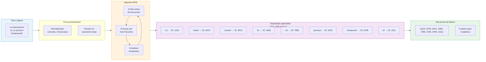
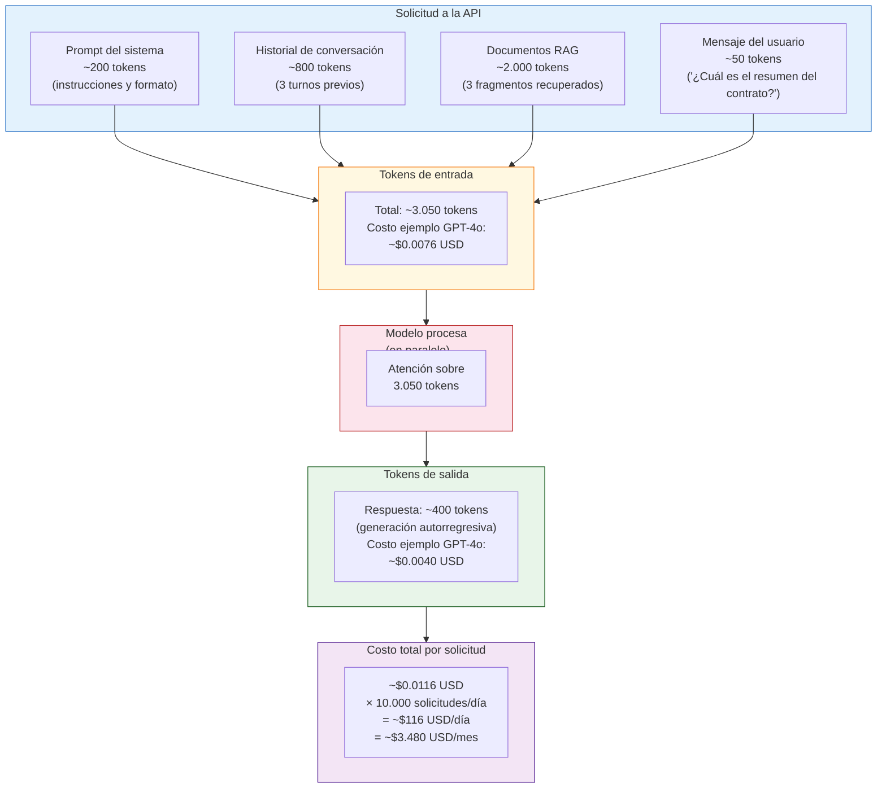

# Ingeniería de IA desde los Fundamentos

# Módulo I — Los Fundamentos de la Inteligencia Artificial

# Capítulo 8 — Tokens: La Unidad de Medida de la Inteligencia Artificial

**Versión:** 0.5 (Revisión conceptual)

---

## 1. Objetivos de aprendizaje

Al finalizar este capítulo serás capaz de:

1. Definir con precisión qué es un token y distinguirlo del concepto cotidiano de "palabra".
2. Explicar conceptualmente cómo funciona el algoritmo Byte-Pair Encoding (BPE) y por qué fue adoptado como estándar en los modelos de lenguaje modernos.
3. Analizar el impacto diferencial de la tokenización en distintos idiomas y calcular la implicancia económica de ese impacto.
4. Distinguir entre tokens de entrada y tokens de salida, y aplicar esa distinción al diseño de un presupuesto de API.
5. Estimar el consumo de tokens de un sistema RAG (Retrieval-Augmented Generation) en un caso real de negocio.
6. Optimizar un prompt para reducir tokens sin degradar la calidad de la respuesta.
7. Usar código Python para contar tokens antes de enviar una solicitud a la API.

---

## 2. Introducción

Cuando una persona escribe "¿Cuánto cuesta implementar esto?" en un chat de asistente de IA, tiene la sensación de haber enviado una pregunta. Siete palabras. Algo simple.

El modelo no procesa esa pregunta como siete palabras. La procesa como una secuencia de unidades más pequeñas, con límites que no coinciden exactamente con los espacios en blanco del texto. A esas unidades las llamamos **tokens**.

Esta diferencia entre lo que el usuario percibe y lo que el modelo realmente procesa no es un detalle de implementación que pueda ignorarse. Es el fundamento sobre el que descansan tres decisiones críticas en todo proyecto de IA:

- **Cuánto cuesta** usar el modelo.
- **Cuánto puede procesar** de forma simultánea.
- **Qué tan rápido** responde bajo carga.

Un profesional que no comprende los tokens toma decisiones de arquitectura en la oscuridad. Estima costos que luego resultan ser el doble. Diseña conversaciones que se truncan en producción. Atribuye comportamientos extraños del modelo a factores equivocados.

Este capítulo no es sobre un detalle técnico menor. Es sobre la unidad de medida que gobierna todo el sistema.

---

## 3. Motivación: ¿por qué tokens y no palabras?

La pregunta parece obvia en retrospectiva, pero merece un análisis honesto. ¿Por qué los investigadores que diseñaron los primeros modelos de lenguaje moderno no usaron palabras como unidad de procesamiento? ¿O letras? ¿O frases?

### 3.1 El problema con las palabras

Si el modelo procesara palabras completas, su vocabulario tendría que cubrir todas las palabras posibles en todos los idiomas y dominios relevantes. Eso supone varios problemas concretos.

**El vocabulario crece sin control.** Solo el español tiene más de 90.000 palabras registradas en el diccionario de la Real Academia Española. El inglés supera las 170.000. Y eso sin considerar jerga técnica, neologismos, nombres propios, términos médicos, siglas o variantes regionales. Un modelo multilingüe necesitaría vocabularios que sumarian millones de entradas.

**Las palabras desconocidas paralizan el sistema.** Si aparece una palabra que no estaba en el vocabulario durante el entrenamiento —un nombre de empresa, un término científico nuevo, una palabra con error tipográfico— el modelo basado en palabras no puede procesarla. Queda sin representación.

**Las variaciones morfológicas multiplican el problema.** "Correr", "corriendo", "corrí", "correrán" son formas de la misma raíz. Para un sistema basado en palabras, son cuatro entidades distintas que ocupan cuatro posiciones distintas en el vocabulario. Idiomas con morfología rica —como el español, el alemán o el turco— generan miles de variantes por raíz verbal.

### 3.2 El problema con las letras

El extremo opuesto tampoco funciona. Si el modelo trabajara letra por letra, cualquier texto corto se convertiría en una secuencia muy larga. El modelo necesitaría aprender implícitamente que "i", "n", "t", "e", "l", "i", "g", "e", "n", "c", "i", "a" son una unidad semántica coherente. Las secuencias se volverían tan largas que los límites de memoria se alcanzarían con textos triviales.

### 3.3 Por qué los tokens son la solución adecuada

Los tokens representan un punto de equilibrio: son unidades más pequeñas que las palabras pero más grandes que las letras. Permiten:

- Mantener un **vocabulario de tamaño manejable** (típicamente entre 32.000 y 100.000 tokens).
- Representar **cualquier palabra**, incluyendo desconocidas, dividiéndola en subtokens conocidos.
- Capturar **patrones morfológicos** sin necesidad de reglas lingüísticas explícitas.
- **Compartir representaciones** entre idiomas que tienen raíces o morfemas comunes.

La pregunta entonces no es "¿por qué tokens?" sino "¿cómo se decide dónde poner los límites entre tokens?". Esa decisión la toma el algoritmo de tokenización.

---

## 4. Desarrollo conceptual desde primeros principios

### 4.1 Qué es un token

Un token es la unidad mínima con la que un modelo de lenguaje representa el texto. No es una unidad lingüística definida por la gramática. Es una unidad estadística, definida por el algoritmo de tokenización a partir de los patrones más frecuentes en el corpus de entrenamiento.

Un token puede ser:

- Una **palabra completa** frecuente: "el", "de", "que", "the", "and".
- **Una parte de palabra**: "pre", "ción", "ing", "mente".
- Un **símbolo de puntuación**: ".", ",", ":", "?".
- Un **número**: "42", "2024".
- Un **espacio** u otro carácter especial.
- Una **combinación de espacio + palabra** en algunos tokenizadores.

La misma palabra puede tokenizarse de forma distinta según el contexto, el idioma y el tokenizador específico del modelo. "Tokenización" podría dividirse en ["Token", "ización"] o en ["Token", "iz", "ación"] dependiendo del vocabulario entrenado.

### 4.2 Byte-Pair Encoding (BPE): cómo se construye el vocabulario

El algoritmo más usado en modelos de lenguaje modernos para definir los tokens es Byte-Pair Encoding (BPE). Fue adoptado masivamente a partir de GPT-2 y es la base de los tokenizadores de la mayoría de los modelos actuales.

La idea central de BPE es sorprendentemente simple: empieza con el vocabulario más pequeño posible y lo expande de forma iterativa uniendo los pares de unidades que aparecen juntos con mayor frecuencia.

**Ejemplo paso a paso con un corpus mínimo:**

Supongamos un corpus de entrenamiento con solo cuatro frases:
- "baja el costo"
- "baja la calidad"
- "sube el precio"
- "sube la demanda"

**Paso 1: Inicialización.** El vocabulario comienza con caracteres individuales más un símbolo especial de fin de palabra. Las palabras se representan así:
```
b-a-j-a, e-l, c-o-s-t-o, l-a, c-a-l-i-d-a-d, s-u-b-e, p-r-e-c-i-o, d-e-m-a-n-d-a
```

**Paso 2: Contar pares.** Se cuentan todos los pares de unidades consecutivas en el corpus. El par "b-a" aparece 2 veces (en "baja"). El par "a-j" aparece 2 veces (en "baja"). El par "j-a" aparece 2 veces (en "baja").

**Paso 3: Fusionar el par más frecuente.** Si "ba" es el par más frecuente, se fusiona en una sola unidad. Ahora el vocabulario incluye "ba" y las palabras que lo contienen pasan a representarse como:
```
ba-j-a
```

**Paso 4: Repetir.** El proceso continúa miles de veces. Después de suficientes iteraciones, las palabras frecuentes quedan como un solo token, las infrecuentes como varios subtokens, y las palabras nuevas que no aparecieron en el entrenamiento se dividen en sus partes más cercanas.

En la práctica, BPE se aplica sobre corpus de miles de millones de caracteres y produce vocabularios de decenas de miles de tokens que capturan los patrones morfológicos y estadísticos del lenguaje sin requerir reglas lingüísticas explícitas.

### 4.3 Impacto diferencial por idioma

Uno de los aspectos más relevantes para proyectos reales es que **el mismo texto en idiomas diferentes consume cantidades diferentes de tokens**. Esto tiene implicancias directas en los costos de operación.

La razón es estructural: la mayoría de los modelos de lenguaje de gran escala fueron entrenados principalmente con texto en inglés. El vocabulario de tokens está optimizado para representar eficientemente las unidades del inglés. Cuando el mismo contenido se expresa en español, el tokenizador necesita más tokens para cubrir la misma información semántica.

La siguiente tabla ilustra las diferencias observadas empíricamente para texto equivalente en distintos idiomas:

| Idioma | Tokens aproximados para 100 palabras | Factor vs. inglés | Impacto en costo relativo |
|---|---|---|---|
| Inglés | 75–85 | 1.0× (referencia) | Base |
| Español | 95–115 | ~1.25–1.35× | +25 a +35% |
| Portugués | 90–110 | ~1.20–1.30× | +20 a +30% |
| Francés | 90–110 | ~1.20–1.30× | +20 a +30% |
| Alemán | 85–110 | ~1.15–1.30× | +15 a +30% |
| Árabe | 130–180 | ~1.70–2.10× | +70 a +110% |
| Chino | 60–80 | ~0.80–0.95× | –5 a –20% |
| Japonés | 65–90 | ~0.85–1.05× | Similar o menor |

*Nota: los valores son aproximaciones observadas con tokenizadores tipo cl100k_base (GPT-4) y varían según el texto específico y el modelo. Los idiomas con escritura no latina presentan mayor variabilidad.*

Para un proyecto en producción con miles de solicitudes diarias en español, este 25-35% adicional de tokens respecto al inglés se traduce directamente en un incremento equivalente en el costo de la API. Un sistema que presupuestó en base a benchmarks en inglés puede encontrar costos significativamente mayores cuando opera sobre contenido en español.

### 4.4 Tokens de entrada y tokens de salida

Toda interacción con la API de un modelo de lenguaje involucra dos flujos de tokens distintos:

**Tokens de entrada (input tokens):** Todo lo que se envía al modelo en una solicitud. Incluye:
- El prompt del sistema (instrucciones y comportamiento deseado).
- El historial de la conversación (mensajes previos).
- Documentos o fragmentos recuperados por el sistema RAG.
- La pregunta o mensaje actual del usuario.

**Tokens de salida (output tokens):** Todo lo que el modelo genera como respuesta.

Este es el detalle crítico: **en la mayoría de los proveedores de API, los tokens de salida cuestan más que los tokens de entrada**. La razón es técnica: generar tokens requiere ejecución autorregresiva (el modelo produce un token a la vez, condicionado en todos los anteriores), mientras que procesar los tokens de entrada puede hacerse en paralelo.

La siguiente tabla muestra precios de referencia aproximados al momento de redacción de este capítulo. **Los precios cambian con frecuencia; verificar siempre la documentación oficial del proveedor antes de estimar costos de proyecto.**

| Modelo | Tokens de entrada (por 1M) | Tokens de salida (por 1M) | Ratio salida/entrada |
|---|---|---|---|
| GPT-4o (OpenAI) | ~$2.50 USD | ~$10.00 USD | 4× |
| Claude Sonnet 4 (Anthropic) | ~$3.00 USD | ~$15.00 USD | 5× |
| Gemini 1.5 Flash (Google) | ~$0.075 USD | ~$0.30 USD | 4× |
| GPT-4o mini (OpenAI) | ~$0.15 USD | ~$0.60 USD | 4× |

*Precios orientativos en USD, junio 2026. Sujetos a cambio. Fuentes: documentación oficial de OpenAI, Anthropic y Google.*

La diferencia de ratio entre entrada y salida tiene implicancias de diseño directas: si una aplicación genera respuestas largas pero recibe prompts cortos, el costo de salida dominará el presupuesto. Si el sistema incorpora documentos extensos en el contexto (como hace RAG), el costo de entrada puede ser el factor dominante.

---

## 5. Analogía: el ancho de banda como token

Imaginar los tokens como ancho de banda de red es útil para desarrollar intuición sobre su comportamiento.

Cuando diseñás una arquitectura de red, sabés que el ancho de banda es un recurso finito y con costo. Tenés un límite máximo de transferencia por segundo. Cada byte que viaja por la red consume ese ancho de banda. Si enviás datos redundantes, estás pagando por capacidad que no aporta valor. Si enviás datos comprimidos y precisos, llegás al mismo resultado consumiendo menos recurso.

Los tokens funcionan de la misma manera:

- **La ventana de contexto** es el equivalente al buffer de transferencia: hay un límite máximo de tokens que el modelo puede procesar simultáneamente.
- **El prompt del sistema** es el overhead de protocolo: siempre está presente en cada solicitud.
- **Los documentos recuperados por RAG** son como archivos adjuntos: útiles cuando son relevantes, costosos cuando son demasiado grandes o irrelevantes.
- **Optimizar el prompt** es como comprimir datos antes de enviarlos: se reduce el volumen sin perder la información esencial.

La diferencia clave con el ancho de banda de red es que en los tokens de salida hay un factor adicional: el modelo no sabe de antemano cuántos tokens producirá. El costo de salida es menos predecible que el de entrada, lo que complica la estimación presupuestaria para casos con respuestas de longitud variable.

---

## 6. Diagrama Mermaid: proceso de tokenización



El diagrama muestra el flujo completo desde el texto original hasta la secuencia de IDs numéricos que el modelo efectivamente procesa. El vocabulario aprendido durante el entrenamiento actúa como tabla de traducción: cada token tiene un identificador numérico único que el modelo usa internamente.

---

## 7. Diagrama Mermaid: tokens de entrada vs. salida con costos



El diagrama ilustra una solicitud típica de un sistema RAG y la composición de sus costos. Nótese que el prompt del sistema y el historial son tokens que se envían en cada solicitud aunque no hayan cambiado. En sistemas de alta frecuencia, optimizar estos componentes fijos tiene un impacto acumulativo significativo.

---

## 8. Caso real: estimación de costos en un proyecto RAG empresarial

### Contexto

Una empresa de servicios financieros contrata un equipo para construir un asistente de IA capaz de responder preguntas sobre sus 1.200 contratos de clientes corporativos. El sistema propuesto es RAG: los contratos se dividen en fragmentos, se indexan en una base vectorial y, cuando el usuario hace una pregunta, el sistema recupera los fragmentos más relevantes y los incluye en el contexto del modelo.

El equipo presenta al cliente una estimación inicial de costos basada en el supuesto de "aproximadamente 10.000 consultas diarias durante los primeros tres meses".

### El problema de la estimación inicial

El estimador junior del equipo calcula: "Una pregunta tiene unas 20 palabras, la respuesta unas 100 palabras. Son unos 120 tokens por solicitud. Con Claude Sonnet 4 a $3 USD por millón de tokens de entrada, son $0.00036 USD por solicitud. Por 10.000 consultas diarias son $3.60 USD por día. Perfecto, presupuestamos $400 USD por mes."

El arquitecto del equipo revisa la estimación y encuentra cuatro problemas:

**Problema 1: Se ignoró el prompt del sistema.** El sistema tiene instrucciones de comportamiento, restricciones legales, formato de respuesta y ejemplos. Al medirlo, son 850 tokens que se envían en cada solicitud.

**Problema 2: Se ignoró el historial de conversación.** Las consultas no son aisladas. Los usuarios tienen conversaciones de 3 a 5 turnos en promedio. El historial acumulado de una sesión promedio agrega 1.200 tokens por solicitud.

**Problema 3: Se ignoraron los documentos RAG.** El sistema recupera 4 fragmentos por consulta, cada uno de aproximadamente 400 tokens. Son 1.600 tokens adicionales de entrada por solicitud.

**Problema 4: Se subestimaron los tokens de salida.** Las respuestas sobre contratos financieros son explicaciones detalladas. La longitud promedio real es de 350 tokens, no 100. Y los tokens de salida cuestan 5 veces más que los de entrada.

### Estimación corregida

| Componente | Tokens | Tipo | Costo por solicitud (Claude Sonnet 4) |
|---|---|---|---|
| Prompt del sistema | 850 | Entrada | $0.00255 USD |
| Historial de conversación | 1.200 | Entrada | $0.00360 USD |
| Documentos RAG (4 × 400) | 1.600 | Entrada | $0.00480 USD |
| Pregunta del usuario | 50 | Entrada | $0.00015 USD |
| **Total entrada** | **3.700** | | **$0.01110 USD** |
| Respuesta generada | 350 | Salida | $0.00525 USD |
| **Total por solicitud** | **4.050** | | **$0.01635 USD** |

Con 10.000 solicitudes diarias:
- **Costo diario:** $163.50 USD
- **Costo mensual:** ~$4.905 USD
- **Diferencia vs. estimación original:** 12.3 veces mayor

### Lecciones del caso

**Lección 1: El prompt del sistema es costo fijo por solicitud.** Cada instrucción, cada ejemplo, cada restricción que se agrega al prompt del sistema multiplica su impacto por el número total de solicitudes. Un prompt del sistema de 2.000 tokens en lugar de 850 tokens casi duplica el costo de entrada.

**Lección 2: El historial de conversación crece.** En un sistema conversacional, los tokens de contexto no son constantes. Aumentan con cada turno. Un sistema sin estrategia de gestión del historial verá sus costos crecer linealmente durante cada sesión.

**Lección 3: Más contexto RAG no siempre mejora la respuesta.** El equipo evaluó si recuperar 4 fragmentos era realmente mejor que recuperar 2 fragmentos bien seleccionados. En sus pruebas, la calidad de la respuesta con 2 fragmentos de alta relevancia fue comparable a la de 4 fragmentos con relevancia mixta. Reducir los fragmentos recuperados de 4 a 2 redujo el costo de entrada en un 25%.

**Lección 4: Presupuestar con benchmarks en inglés para contenido en español subestima el costo.** Los contratos estaban en español. El equipo verificó que el mismo contenido en español consumía aproximadamente un 28% más de tokens que su equivalente en inglés. Esto no estaba contemplado en ninguna de las dos estimaciones previas.

**Estimación final ajustada por idioma:** $4.905 × 1.28 = **~$6.278 USD/mes**.

La diferencia total entre la estimación inicial ($400/mes) y la estimación correcta ($6.278/mes) es de casi 16 veces. Esa diferencia no surge de un problema técnico. Surge de no comprender cómo se compone el consumo real de tokens en un sistema de producción.

---

## 9. Conversación con el arquitecto

---

**Desarrollador:** El cliente se queja de que la API es muy cara. Pedimos presupuesto para un nivel superior del plan pero ya superamos eso también.

**Arquitecto:** Antes de escalar el plan, necesito entender qué estamos enviando. ¿Cuántos tokens tiene en promedio cada solicitud?

---

**Desarrollador:** No lo medimos. Asumimos que los prompts eran cortos porque las preguntas de los usuarios son cortas.

**Arquitecto:** Eso es el error más común. La pregunta del usuario es la parte más pequeña de la solicitud. ¿Tienen el prompt del sistema documentado?

---

**Desarrollador:** Sí, acá lo tengo. Es bastante largo porque el cliente quería muchas instrucciones específicas.

**Arquitecto:** Lo leo... son 2.400 tokens. Ese texto se envía completo en cada solicitud. Si tienen 15.000 consultas por día, solo el prompt del sistema les cuesta 36 millones de tokens de entrada por día. ¿Cuántos de esos 2.400 tokens creen que son realmente necesarios?

---

**Desarrollador:** No lo sabemos. Nunca lo analizamos sistemáticamente. El cliente fue agregando instrucciones a medida que surgían casos edge.

**Arquitecto:** Eso es crecimiento orgánico sin control de costos. Lo que hay que hacer es auditar el prompt: identificar qué instrucciones son realmente necesarias, cuáles se pueden inferir del contexto, y cuáles son redundantes. En mi experiencia, la mayoría de los prompts del sistema se pueden reducir entre un 30% y un 50% sin perder funcionalidad si se hace con criterio.

---

**Desarrollador:** ¿Y qué hacemos con el historial? La conversación con cada usuario puede tener hasta 20 turnos.

**Arquitecto:** Ese es el otro problema. Una conversación de 20 turnos puede representar 8.000 o 10.000 tokens de historial. No toda esa información es relevante para responder la pregunta actual. Hay tres estrategias: truncar el historial manteniendo solo los últimos N turnos, resumir el historial cada cierto número de turnos para comprimir la información, o usar una memoria selectiva que solo mantiene los hechos relevantes. Ninguna de las tres es perfecta, pero todas son mejores que enviar el historial completo sin pensar. El objetivo no es el historial más largo. Es el contexto más útil.

---

## 10. Errores frecuentes

### Error 1: Asumir que el costo es proporcional a la longitud de la respuesta

Muchos equipos calculan el costo de una solicitud mirando solo la respuesta generada. Ignoran que el prompt del sistema, el historial y los documentos RAG pueden representar el 85-90% del total de tokens de una solicitud. Una respuesta de 200 tokens sobre un contexto de 3.000 tokens de entrada cuesta mucho más que lo que la respuesta sola sugiere.

**Heurística:** medir el costo real de una solicitud requiere sumar todos los tokens de entrada más todos los tokens de salida, aplicando las tarifas correspondientes a cada tipo.

### Error 2: No considerar el ratio de costos entrada/salida en el diseño

Cuando el precio de los tokens de salida es 4 o 5 veces mayor que el de entrada, el diseño del sistema importa. Pedirle al modelo que genere respuestas exhaustivas cuando el usuario necesita respuestas concisas no es solo un problema de usabilidad. Es un problema de costos.

**Heurística:** incluir en el prompt instrucciones explícitas sobre la longitud esperada de la respuesta. "Responder en no más de 3 oraciones" reduce el costo de salida de forma directa y predecible.

### Error 3: Presupuestar en inglés para sistemas en español

Los benchmarks y las calculadoras de costos de los proveedores suelen usar texto en inglés como referencia. Si el sistema opera en español, el presupuesto debe ajustarse al factor de penalización del idioma, que para español ronda el 25-35% adicional.

**Heurística:** contar siempre los tokens del contenido real en el idioma real antes de finalizar cualquier estimación de costos.

### Error 4: No versionar ni auditar el prompt del sistema

El prompt del sistema suele crecer de forma orgánica: cada caso edge que aparece en producción genera una nueva instrucción. Después de meses, puede tener el doble de tokens que cuando se lanzó, y nadie recuerda para qué sirve cada sección.

**Heurística:** tratar el prompt del sistema como código: tenerlo en control de versiones, documentar el propósito de cada sección y auditarlo periódicamente para eliminar instrucciones obsoletas.

### Error 5: Suponer que más contexto siempre mejora la respuesta

Existe la intuición de que darle al modelo más información siempre produce mejores respuestas. Los experimentos muestran que esto no es correcto. Cuando el contexto incluye información irrelevante o redundante, el modelo puede tener dificultades para identificar qué es importante. El fenómeno conocido como "lost in the middle" describe cómo los modelos tienden a dar menos atención a información ubicada en el medio de un contexto muy largo.

**Heurística:** para sistemas RAG, evaluar si 2 fragmentos muy relevantes producen respuestas de mejor calidad que 5 fragmentos de relevancia mixta. La precisión de la recuperación importa tanto como su volumen.

---

## 11. Buenas prácticas

### Práctica 1: Medir antes de optimizar

Antes de intentar reducir el consumo de tokens, medir el consumo real de una muestra representativa de solicitudes en producción. Identificar qué componente representa la mayor proporción del total: prompt del sistema, historial, documentos RAG o respuesta. Optimizar primero el componente con mayor impacto.

Herramienta concreta: la librería `tiktoken` de OpenAI permite contar tokens localmente antes de enviar la solicitud, sin costo de API.

### Práctica 2: Diseñar el prompt del sistema como un contrato

Cada instrucción en el prompt del sistema es un costo fijo que se paga en cada solicitud. Tratarlo como un recurso escaso. Documentar el propósito de cada sección. Eliminar instrucciones que puedan inferirse del contexto o que correspondan a casos que ya no existen en producción.

### Práctica 3: Implementar una estrategia de gestión del historial

En sistemas conversacionales, definir desde el diseño cómo se gestiona el historial: cuántos turnos se mantienen completos, cuándo se activa la compresión por resumen, y cuál es el límite máximo de tokens de historial por sesión. No dejar que el historial crezca sin control hasta que el costo se vuelva un problema.

### Práctica 4: Instruir explícitamente sobre la longitud de la respuesta

Cuando la longitud de la respuesta es variable y el modelo tiende a ser verboso, incluir una instrucción explícita de longitud en el prompt: "Responder en forma concisa, no más de 150 palabras" o "Usar solo los párrafos necesarios para responder la pregunta". Esta práctica reduce directamente el costo de salida y en muchos casos mejora la utilidad de la respuesta para el usuario.

### Práctica 5: Ajustar el presupuesto al idioma del contenido

Para cualquier proyecto que opere sobre contenido en español u otros idiomas con penalización de tokenización, ajustar el presupuesto de tokens hacia arriba en el factor correspondiente. Documentar este ajuste explícitamente en la estimación para que sea visible y trazable.

### Práctica 6: Revisar la estrategia RAG con criterio de tokens

Para sistemas RAG, evaluar la relación entre número de fragmentos recuperados, su tamaño y la calidad de la respuesta. Encontrar el punto de equilibrio donde recuperar fragmentos más cortos y más precisos produce respuestas equivalentes o mejores con menor consumo de tokens. Este es un parámetro de diseño, no un dato fijo.

---

## 12. Código Python: contando tokens con tiktoken

La librería `tiktoken` permite contar tokens de forma local, sin necesidad de hacer una llamada a la API. Es la misma librería que usa internamente OpenAI. También es compatible con el tokenizador cl100k_base que usan GPT-4 y GPT-4o.

```python
import tiktoken

# Cargar el codificador para GPT-4o (cl100k_base)
# Este mismo tokenizador aplica para GPT-4, GPT-4o y GPT-4o-mini
encoder = tiktoken.encoding_for_model("gpt-4o")

# Texto de ejemplo: un prompt del sistema típico
prompt_sistema = """Sos un asistente especializado en contratos financieros.
Respondé siempre en español. Sé conciso y preciso.
Si no encontrás la información en el contexto provisto, decilo claramente.
No inventes información que no esté en los documentos."""

# Texto del usuario
pregunta_usuario = "¿Cuál es la cláusula de penalización por rescisión anticipada?"

# Contar tokens de cada componente por separado
tokens_sistema = encoder.encode(prompt_sistema)
tokens_pregunta = encoder.encode(pregunta_usuario)

print(f"Tokens en prompt del sistema: {len(tokens_sistema)}")
print(f"Tokens en pregunta del usuario: {len(tokens_pregunta)}")
print(f"Total tokens de entrada: {len(tokens_sistema) + len(tokens_pregunta)}")

# Ver cómo se tokeniza una frase en español
frase = "La tokenización es fundamental"
tokens = encoder.encode(frase)
print(f"\nFrase: '{frase}'")
print(f"IDs de tokens: {tokens}")
print(f"Tokens decodificados: {[encoder.decode([t]) for t in tokens]}")
# Resultado típico: ['La', ' token', 'iz', 'ación', ' es', ' fundamental']
# Nótese que 'tokenización' se divide en múltiples subtokens

# Calcular costo estimado (precios de ejemplo, verificar documentación oficial)
PRECIO_ENTRADA_POR_MILLON = 2.50  # USD, ejemplo GPT-4o
total_tokens = len(tokens_sistema) + len(tokens_pregunta)
costo_estimado = (total_tokens / 1_000_000) * PRECIO_ENTRADA_POR_MILLON
print(f"\nCosto estimado de entrada: ${costo_estimado:.6f} USD")
```

**Lo que este código demuestra:**

1. Contar tokens antes de enviar permite detectar prompts excesivamente largos sin gastar en la API.
2. La tokenización de palabras en español produce subtokens que no coinciden con las sílabas. "Tokenización" puede dividirse en ["token", "iz", "ación"], lo que confirma el impacto en el conteo.
3. Calcular el costo estimado por solicitud permite construir proyecciones de costos mensuales antes de poner el sistema en producción.

Para usuarios de Claude de Anthropic, la librería oficial es `anthropic` y expone el método `count_tokens` directamente a través de la API. Para Gemini, Google provee la librería `google-generativeai` con funcionalidad equivalente.

---

## 13. Laboratorio completo: optimizar un prompt para reducir tokens sin perder calidad

### Objetivo

Aplicar el proceso de auditoría y optimización de tokens a un prompt real, reducir su tamaño en al menos un 30% y verificar que la calidad de la respuesta generada no se degrada.

### Nivel

Intermedio (requiere acceso a la API de al menos un proveedor de modelos de lenguaje).

### Tiempo estimado

60-90 minutos.

### Prerrequisitos

- Python 3.9 o superior.
- Cuenta activa en al menos un proveedor de API (OpenAI, Anthropic o Google).
- La librería `tiktoken` instalada (`pip install tiktoken`).
- Acceso básico a la API del proveedor elegido.

### Herramientas

- `tiktoken` para conteo local de tokens.
- API del proveedor elegido para validar la calidad de las respuestas.
- Texto de prompt real (usar el proporcionado en el Paso 1 o uno propio del lector).

### Escenario

El equipo de una empresa de e-commerce construyó un asistente de atención al cliente. El prompt del sistema fue creciendo de forma orgánica durante 6 meses. Hoy tiene 1.847 tokens y nadie sabe con certeza qué instrucciones son necesarias. El objetivo es auditarlo, comprimirlo y verificar que el asistente siga funcionando correctamente.

---

### Paso 1: Establecer la línea base

**Acción:** Tomar el siguiente prompt del sistema (o uno propio de mayor longitud) y contar sus tokens.

```
Sos un asistente de atención al cliente de TiendaMax, una empresa de comercio
electrónico especializada en electrónica y tecnología. Tu objetivo es ayudar
a los clientes con sus preguntas, reclamos, consultas sobre productos, estados
de pedidos, políticas de devolución y cualquier duda que puedan tener sobre
sus compras.

Debés responder siempre en español. Si el cliente escribe en otro idioma,
respondé en ese idioma pero también ofrecé continuar en español.

Tenés que ser amable, profesional y empático. Usá un tono cordial pero no
demasiado informal. No uses jerga. Respondé de forma clara y directa.

Si el cliente pregunta por el estado de un pedido, pedile el número de pedido
antes de dar cualquier información. Si no tiene el número de pedido, decile
que puede encontrarlo en el correo de confirmación que recibió al comprar.

Si el cliente quiere hacer una devolución, explicale que tiene 30 días desde
la fecha de entrega para iniciar el proceso. Debe completar el formulario en
la sección "Mis pedidos" de la web o app. El producto debe estar en su
embalaje original y sin señales de uso.

Si el cliente pregunta por garantías, informale que todos los productos tienen
garantía oficial del fabricante. La garantía de un año cubre defectos de
fabricación. No cubre daños por mal uso, accidentes o roturas. Para activar
la garantía debe conservar la factura de compra.

Para reclamos por productos defectuosos recibidos, el cliente debe enviarnos
fotos del producto y del embalaje en las primeras 48 horas desde la recepción.
Puede hacerlo respondiendo el correo de confirmación de entrega o escribiendo
a defectos@tiendamax.com.

Si el cliente pregunta por métodos de pago, aceptamos tarjetas de crédito y
débito de todos los bancos, transferencia bancaria, Mercado Pago y pago en
efectivo a través de Rapipago y Pago Fácil.

Si el cliente quiere hablar con un agente humano, decile que puede hacerlo de
lunes a viernes de 9 a 18 horas llamando al 0800-333-8626 o por el chat en
vivo en la web durante ese mismo horario.

No des información que no tengas. Si no sabés la respuesta, decí que vas a
consultar con el equipo y que le responderán en menos de 24 horas.

No hagas promesas de fechas de entrega específicas si no tenés esa información
confirmada.

No hables mal de la competencia ni compares precios con otras tiendas.

Siempre ofrecer ayuda adicional al final de cada respuesta. Preguntar si hay
algo más en lo que puedas ayudar.
```

**Motivo:** Establecer la métrica base (número de tokens) antes de cualquier modificación permite medir el impacto de los cambios de forma objetiva.

**Resultado esperado:** Conteo de tokens del prompt original usando tiktoken. Anotar el número.

```python
import tiktoken
encoder = tiktoken.encoding_for_model("gpt-4o")
# Pegar aquí el prompt del sistema completo
prompt_original = """[texto del prompt]"""
print(f"Tokens originales: {len(encoder.encode(prompt_original))}")
```

---

### Paso 2: Auditar el prompt por secciones

**Acción:** Dividir el prompt en secciones temáticas y contar los tokens de cada una. Clasificar cada sección como: esencial / mejorable / redundante.

| Sección | Tokens aprox. | Clasificación |
|---|---|---|
| Presentación del rol | 45 | Esencial |
| Idioma de respuesta | 35 | Mejorable |
| Tono y estilo | 60 | Mejorable |
| Proceso de pedidos | 75 | Esencial |
| Proceso de devoluciones | 90 | Esencial |
| Garantías | 85 | Esencial |
| Productos defectuosos | 75 | Esencial |
| Métodos de pago | 60 | Mejorable |
| Atención humana | 65 | Mejorable |
| Limitaciones del asistente | 70 | Mejorable |
| Instrucciones de cierre | 40 | Redundante |

**Motivo:** La auditoría por secciones permite identificar dónde hay oportunidades de compresión sin afectar funcionalidad.

**Resultado esperado:** Una tabla con la clasificación de cada sección y una hipótesis sobre qué puede eliminarse o comprimirse.

---

### Paso 3: Escribir la versión optimizada

**Acción:** Reescribir el prompt eliminando:
- Instrucciones que el modelo puede inferir del contexto (como "respondé en el idioma del cliente").
- Redundancias (como "sé amable" y "sé empático" cuando uno incluye al otro).
- Instrucciones sobre comportamientos que son el valor por defecto del modelo (como "no des información que no tengas").

Objetivo: reducir al menos un 30% el número de tokens.

**Criterio de optimización:** Para cada instrucción que se elimina o comprime, formular la pregunta "¿El modelo se comportaría incorrectamente sin esta instrucción?". Si la respuesta es no, la instrucción es candidata a eliminación.

**Resultado esperado:** Una versión del prompt con al menos 30% menos tokens, donde cada instrucción que permanece tiene una justificación clara de por qué es necesaria.

---

### Paso 4: Validar la calidad con preguntas de prueba

**Acción:** Enviar a la API las siguientes preguntas usando el prompt original y el prompt optimizado. Registrar ambas respuestas.

Preguntas de prueba:
1. "¿Puedo devolver un producto que compré hace 45 días?"
2. "Recibí un teléfono roto, ¿qué hago?"
3. "Quiero hablar con una persona."
4. "¿Aceptan pagos en cuotas?"
5. "Mi pedido no llegó y no sé cuándo llega."

**Motivo:** Comparar respuestas entre la versión original y la optimizada permite verificar que la compresión no degradó la funcionalidad del sistema.

**Resultado esperado:** Una tabla comparativa. Si las respuestas son equivalentes o mejores en la versión optimizada, el ejercicio fue exitoso.

---

### Paso 5: Calcular el impacto económico

**Acción:** Con los datos de tokens del prompt original y del prompt optimizado, calcular el ahorro mensual proyectado para diferentes volúmenes de uso.

```python
tokens_original = 420  # Ajustar con el valor real del Paso 1
tokens_optimizado = 280  # Ajustar con el valor real del Paso 3
ahorro_por_solicitud = tokens_original - tokens_optimizado

# Calcular ahorro mensual a distintos volúmenes
precio_por_millon = 3.00  # USD, ejemplo Claude Sonnet 4 entrada

for solicitudes_diarias in [1_000, 10_000, 100_000]:
    solicitudes_mensuales = solicitudes_diarias * 30
    tokens_ahorrados = ahorro_por_solicitud * solicitudes_mensuales
    ahorro_usd = (tokens_ahorrados / 1_000_000) * precio_por_millon
    print(f"{solicitudes_diarias:>8,} solicitudes/día → ahorro mensual: ${ahorro_usd:,.2f} USD")
```

**Resultado esperado:** El lector comprende que una optimización de 140 tokens por solicitud puede representar cientos o miles de dólares mensuales dependiendo del volumen de uso.

---

### Validación del laboratorio

El laboratorio está completo cuando:
- [ ] Se documentó el número de tokens del prompt original.
- [ ] Se clasificaron todas las secciones del prompt.
- [ ] El prompt optimizado tiene al menos un 30% menos tokens.
- [ ] Las 5 preguntas de prueba obtuvieron respuestas equivalentes o mejores con el prompt optimizado.
- [ ] Se calculó el ahorro económico mensual para al menos dos volúmenes de uso.

### Reflexión

¿Qué instrucciones del prompt original resultaron ser realmente innecesarias? ¿Por qué el equipo las había incluido en su momento? ¿Qué proceso se podría establecer para evitar que el prompt del sistema crezca de forma descontrolada en el futuro?

### Desafíos opcionales

**Desafío 1 (Avanzado):** Repetir el ejercicio con el mismo contenido en inglés y comparar el conteo de tokens. Cuantificar la diferencia porcentual entre el prompt en español y en inglés.

**Desafío 2 (Avanzado):** Implementar un script que al inicio de cada sesión de desarrollo cuente los tokens del prompt del sistema y emita una advertencia si supera un umbral definido (por ejemplo, 500 tokens).

**Desafío 3 (Muy avanzado):** Para un sistema RAG propio, medir el impacto en la calidad de la respuesta al variar el número de fragmentos recuperados (1, 2, 3, 4 y 5 fragmentos). Encontrar el punto de equilibrio entre calidad y costo.

---

## 14. Preguntas de reflexión

1. Un sistema de atención al cliente procesa 50.000 solicitudes diarias en español. El arquitecto propone traducir el prompt del sistema al inglés para reducir costos. ¿Qué ventajas y qué riesgos tendría esa decisión? ¿Cuándo sería razonable y cuándo no?

2. En un sistema RAG, ¿cuál es la diferencia entre recuperar muchos fragmentos cortos versus pocos fragmentos largos, en términos de consumo de tokens y calidad de respuesta? ¿Qué factores determinarían cuál estrategia es superior en cada caso?

3. ¿Por qué el costo de los tokens de salida es generalmente mayor que el de los tokens de entrada en las APIs comerciales? ¿Qué implicancias tiene esto para el diseño de aplicaciones que generan documentos largos versus aplicaciones que responden preguntas cortas?

4. Si el vocabulario de tokens de un modelo está optimizado para inglés, ¿qué características de un idioma lo hacen más o menos eficiente en tokens? ¿Un idioma con morfología más rica (más formas verbales, más variantes de género y número) consume más o menos tokens? ¿Por qué?

5. Una empresa tiene dos alternativas para su sistema conversacional: (a) mantener el historial completo de cada conversación en el contexto, o (b) resumir el historial cada 5 turnos y enviar solo el resumen. ¿Cómo evaluaría cuál de las dos opciones es mejor? ¿Qué métricas mediría?

6. El fenómeno "lost in the middle" describe que los modelos tienden a procesar mejor la información al principio y al final del contexto que en el medio. ¿Cómo debería influir esto en la forma de estructurar el prompt en un sistema RAG? ¿Dónde ubicaría los documentos recuperados en relación al prompt del sistema y a la pregunta del usuario?

7. ¿En qué escenarios tendría sentido elegir un modelo más costoso por token (como GPT-4o o Claude Sonnet 4) sobre uno más económico (como GPT-4o mini o Gemini Flash), incluso considerando el costo adicional? ¿Qué criterios técnicos y de negocio guiarían esa decisión?

---

## 15. Resumen narrativo

Los tokens son la unidad de procesamiento que gobierna todo lo que ocurre en un modelo de lenguaje. No son palabras ni letras: son fragmentos estadísticos definidos por el algoritmo BPE a partir de los patrones más frecuentes en el corpus de entrenamiento. Un token puede ser una palabra completa, parte de una palabra, un signo de puntuación o incluso un espacio.

Esta definición tiene consecuencias prácticas inmediatas. Los distintos idiomas generan cantidades diferentes de tokens para el mismo contenido semántico, con el español consumiendo entre un 25% y un 35% más tokens que el inglés para texto equivalente. Los tokens de salida cuestan más que los de entrada en la mayoría de los proveedores, porque su generación es secuencial en lugar de paralela. Y la composición real de una solicitud a la API —prompt del sistema, historial, documentos recuperados, pregunta del usuario— puede triplicar o cuadruplicar la estimación de tokens si solo se considera la pregunta visible.

Para un arquitecto de soluciones de IA, los tokens no son un detalle técnico de bajo nivel. Son la unidad de medida del costo, del límite de memoria y del rendimiento del sistema. Diseñar un sistema RAG, presupuestar una solución, optimizar un asistente conversacional o evaluar si un modelo es "muy caro" requiere, en todos los casos, razonar en términos de tokens.

La práctica de medir, auditar y optimizar el consumo de tokens antes de que se convierta en un problema en producción es una de las diferencias más visibles entre un equipo que implementa IA de forma ad hoc y uno que la ingenia con criterio.

---

## 16. Checklist del capítulo

- [ ] Puedo explicar qué es un token y por qué no coincide exactamente con una palabra.
- [ ] Puedo describir el funcionamiento de BPE con un ejemplo propio sin consultar notas.
- [ ] Sé que el español consume aproximadamente un 25-35% más tokens que el inglés para texto equivalente.
- [ ] Distingo entre tokens de entrada y tokens de salida y sé que tienen precios distintos.
- [ ] Puedo enumerar los componentes de una solicitud RAG típica y su contribución al total de tokens.
- [ ] Sé usar `tiktoken` para contar tokens localmente antes de hacer una llamada a la API.
- [ ] Conozco al menos tres estrategias para reducir el consumo de tokens en un sistema conversacional.
- [ ] Puedo estimar el impacto económico mensual de una optimización de tokens dado un volumen de solicitudes.
- [ ] Entiendo por qué más contexto no siempre produce mejores respuestas.
- [ ] Aplicaría el criterio de tokens antes de concluir que "el modelo es muy caro".

---

## 17. Glosario

**Token:** Unidad mínima con la que un modelo de lenguaje representa y procesa el texto. No equivale a una palabra: puede ser una palabra completa, parte de una palabra, un símbolo de puntuación, un número o un espacio, según lo determine el algoritmo de tokenización del modelo.

**Tokenización:** El proceso de convertir texto en lenguaje natural en una secuencia de tokens. Es el primer paso de procesamiento en cualquier modelo de lenguaje. El resultado es una lista de identificadores numéricos que el modelo usa internamente.

**BPE (Byte-Pair Encoding):** Algoritmo de tokenización que construye el vocabulario de tokens de forma iterativa, fusionando los pares de unidades que aparecen juntos con mayor frecuencia en el corpus de entrenamiento. Permite representar cualquier texto con un vocabulario de tamaño finito y manejable, incluyendo palabras que no aparecieron durante el entrenamiento.

**Vocabulario:** El conjunto completo de tokens que un modelo puede reconocer y generar. Los modelos modernos tienen vocabularios de entre 32.000 y 100.000 tokens. Todo texto posible se representa como una combinación de los tokens en este vocabulario.

**Context Window (ventana de contexto):** El límite máximo de tokens que un modelo puede procesar en una sola solicitud, sumando tanto los tokens de entrada como los de salida. Si el total supera este límite, el modelo no puede procesar la solicitud completa.

**Tokens de entrada (input tokens):** Los tokens que componen todo lo que se envía al modelo en una solicitud: prompt del sistema, historial de conversación, documentos recuperados y mensaje del usuario. En la mayoría de los proveedores tienen un precio inferior al de los tokens de salida.

**Tokens de salida (output tokens):** Los tokens que el modelo genera como respuesta. Su generación es secuencial (autorregresiva): el modelo produce un token a la vez, condicionado en todos los tokens anteriores. Por esta razón son más costosos que los tokens de entrada en la mayoría de los proveedores.

**RAG (Retrieval-Augmented Generation):** Arquitectura de sistema de IA que combina un motor de búsqueda semántica con un modelo de lenguaje generativo. Ante cada consulta, el sistema recupera fragmentos relevantes de una base de conocimiento y los incluye en el contexto del modelo antes de generar la respuesta. El consumo de tokens en RAG incluye los fragmentos recuperados además de todos los demás componentes de la solicitud.

---

## Próximo capítulo

**Capítulo 9 — Ventana de Contexto**

Los tokens definen la unidad de medida. La ventana de contexto define el límite máximo. En el próximo capítulo estudiaremos qué ocurre cuando una conversación o un documento superan ese límite, qué estrategias existen para gestionar ese límite de forma inteligente, y por qué aumentar el tamaño de la ventana de contexto no es siempre la mejor solución al problema.

---

> "Un arquitecto no memoriza respuestas. Comprende problemas para poder diseñar soluciones."
