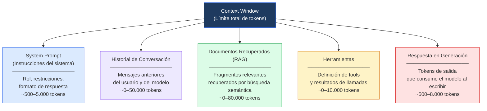
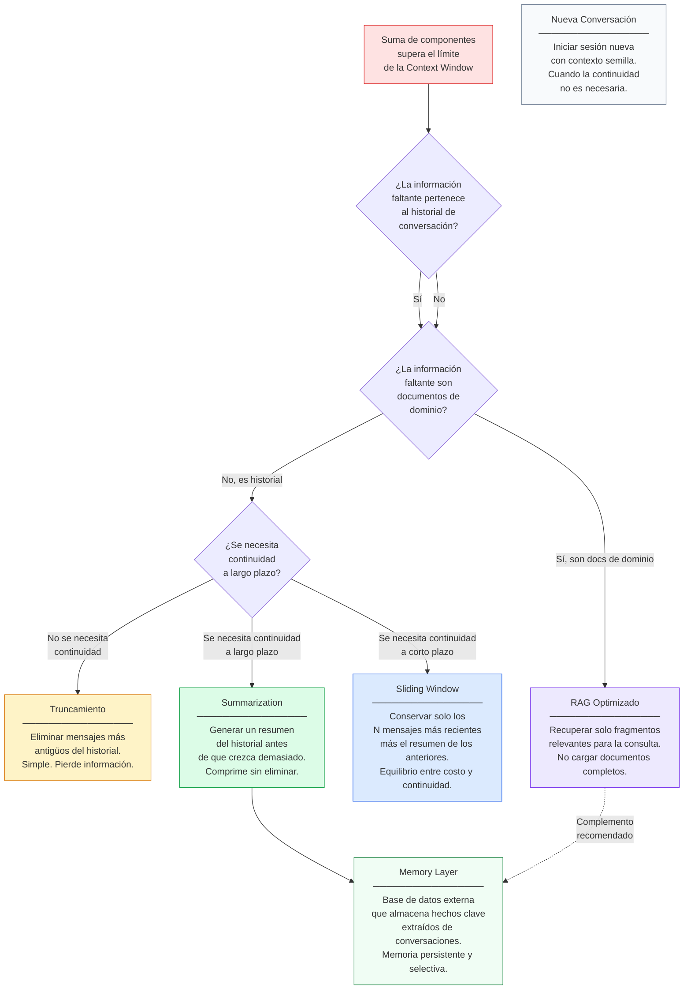

# Ingeniería de IA desde los Fundamentos

# Módulo I — Los Fundamentos de la Inteligencia Artificial

# Capítulo 9 — Ventana de Contexto: El Escritorio del Modelo

**Versión:** 0.5 (Revisión conceptual)

---

## 1. Objetivos de aprendizaje

Al finalizar este capítulo serás capaz de:

1. Explicar qué es la Ventana de Contexto (Context Window) y por qué define el límite operativo de cualquier modelo de lenguaje.
2. Diferenciar con precisión los conceptos de contexto, memoria y conocimiento.
3. Identificar qué componentes consumen tokens dentro de la ventana y en qué proporciones típicas.
4. Describir el fenómeno "lost in the middle" y sus implicaciones en el diseño de prompts y sistemas RAG.
5. Evaluar y elegir entre las estrategias de gestión de contexto disponibles (truncamiento, summarization, sliding window, RAG, memory layers) según las características del caso.
6. Leer la tabla comparativa de ventanas de contexto de los modelos principales y aplicarla en decisiones de selección de modelo.
7. Aplicar buenas prácticas de gestión de contexto en el diseño de asistentes conversacionales y sistemas de consulta documental.

---

## 2. Introducción

Hay una pregunta que aparece inevitablemente en las primeras semanas de trabajo con modelos de lenguaje, ya sea en un equipo de desarrollo, en una sesión de consultoría o en un proyecto de automatización: *"¿Por qué el modelo se olvidó de lo que hablamos hace un rato?"* La respuesta no está en un bug, no está en la red y no está en una falla del servicio. Está en un concepto arquitectónico fundamental que define cómo funcionan estos sistemas: la Ventana de Contexto (Context Window).

Comprender la Context Window no es un detalle técnico secundario. Es uno de los conceptos que más decisiones de arquitectura condiciona en la práctica real. ¿Qué información incluir en el system prompt? ¿Cuánto historial de conversación conservar? ¿Cómo diseñar un sistema de Retrieval-Augmented Generation (RAG) que sea eficiente sin ser ineficaz? Ninguna de esas preguntas tiene respuesta inteligente sin entender primero el problema del contexto.

Este capítulo construye ese entendimiento desde los primeros principios. Comenzaremos por el problema —¿por qué los modelos no recuerdan?— y avanzaremos hacia las estrategias que los arquitectos usan para compensar esa limitación. No buscaremos memorizarlas. Buscaremos entenderlas lo suficiente como para poder elegir la correcta en cada situación.

---

## 3. Motivación del problema: por qué los modelos "olvidan"

### 3.1 El modelo no guarda estado entre llamadas

Un Large Language Model (LLM), en su forma más básica, es una función matemática. Recibe una entrada —texto— y produce una salida —texto. No almacena nada entre una llamada y la siguiente. Cuando enviás una segunda pregunta, el modelo no "recuerda" la primera a menos que la primera también esté incluida en la entrada de la segunda.

Esto es radicalmente diferente a cómo funcionan las personas. Una persona que mantiene una conversación guarda en su memoria de trabajo el hilo de lo que se fue diciendo, y puede referenciar cualquier parte de la conversación anterior con naturalidad. Un LLM base no tiene esa capacidad de forma nativa. La "memoria" de la conversación existe solo mientras los mensajes anteriores estén incluidos explícitamente en la entrada que recibe el modelo.

### 3.2 El límite de cuánto puede entrar

Cada modelo tiene una cantidad máxima de tokens que puede procesar en una sola llamada. Ese límite define la Context Window: el espacio de trabajo disponible para esa interacción. Todo lo que entre en ese espacio es visible para el modelo. Todo lo que quede fuera, no existe para esa llamada.

Un Token es la unidad mínima de procesamiento que usa un LLM. En español, una palabra promedio equivale a aproximadamente 1,5 tokens. "ventana" es un token; "arquitectura" puede ser dos. Un documento de 10 páginas típico tiene alrededor de 4.000 a 5.000 tokens. Un historial de conversación de 30 turnos puede superar los 8.000 tokens.

Cuando la suma de todos los elementos que queremos incluir —instrucciones del sistema, historial, documentos recuperados, la propia pregunta del usuario— supera el límite de la Context Window, algo tiene que quedarse afuera. Y lo que queda afuera deja de estar disponible para el modelo al generar su respuesta.

### 3.3 La pregunta real que debería hacerse el arquitecto

La pregunta frecuente —"¿por qué olvidó?"— es la consecuencia. La pregunta correcta para el arquitecto es otra: *¿qué mecanismo estoy usando para garantizar que la información relevante esté disponible cuando el modelo la necesita, sin desperdiciar espacio de contexto con información que no aporta valor para esta consulta?*

Esa pregunta no tiene una respuesta única. Tiene estrategias, trade-offs y decisiones de diseño. El objetivo de este capítulo es que el lector pueda tomar esas decisiones con criterio.

---

## 4. Desarrollo conceptual desde primeros principios

### 4.1 Contexto, memoria y conocimiento: tres conceptos distintos

En el trabajo cotidiano con LLMs, estos tres términos se confunden con frecuencia. La distinción es crítica.

**Contexto** es el conjunto de información enviado en la llamada actual al modelo. Es efímero: existe solo durante esa interacción. Si enviás un documento en la pregunta de hoy, mañana el modelo no lo recordará a menos que lo vuelvas a enviar.

**Memoria** es la capacidad de recuperar y reutilizar información de interacciones anteriores. Un LLM base no tiene memoria. Las aplicaciones que parecen "recordar" implementan mecanismos adicionales: guardan información en bases de datos externas, resúmenes de conversaciones previas o vectores de embeddings, y los inyectan en el contexto de la llamada siguiente.

**Conocimiento** es la información incorporada al modelo durante el entrenamiento. No ocupa espacio en la Context Window porque ya está codificada en los parámetros del modelo. Un LLM que fue entrenado con datos hasta cierta fecha "conoce" eventos históricos y hechos generales hasta ese punto —su conocimiento de corte— pero ese conocimiento está fijo: no puede actualizarse sin reentrenar el modelo.

La confusión entre estos tres conceptos lleva a errores de diseño frecuentes: asumir que un modelo "recordará" algo de la sesión anterior (espera memoria que no existe), o creer que hay que incluir información de dominio en el prompt cuando esa información ya está en el conocimiento del modelo (desperdicio de contexto).

### 4.2 ¿Qué consume la Context Window?

La Context Window no es simplemente el espacio para la pregunta del usuario. En un sistema real, ese espacio se distribuye entre múltiples componentes:

**System prompt (instrucciones del sistema):** Las instrucciones que definen el comportamiento del asistente, su rol, sus restricciones, su formato de respuesta. Pueden variar desde unas pocas líneas hasta miles de tokens en sistemas complejos.

**Historial de conversación:** Todos los turnos anteriores de la conversación: tanto los mensajes del usuario como las respuestas del modelo. En una conversación larga, este componente puede dominar el consumo de tokens.

**Documentos recuperados (RAG):** Los fragmentos de documentación, base de conocimiento o base de datos que el sistema recuperó como relevantes para la consulta actual. En sistemas RAG mal diseñados, este es el componente que más se descontrola.

**Herramientas y resultados de herramientas:** Cuando el modelo tiene acceso a herramientas externas (calculadoras, APIs, bases de datos), tanto la definición de las herramientas como los resultados de sus llamadas consumen tokens de la ventana.

**La respuesta en generación:** A medida que el modelo genera su respuesta, esos tokens también ocupan espacio en la ventana. En respuestas largas, esto puede ser significativo.

La suma de todos estos componentes debe mantenerse por debajo del límite de la Context Window. El arquitecto decide cómo distribuir ese espacio presupuestando tokens de forma explícita.

### 4.3 Tabla comparativa: Context Window de los principales modelos

Los límites de contexto varían significativamente entre modelos. Esta tabla refleja los valores vigentes al momento de la revisión:

| Modelo | Ventana de Contexto | Observaciones |
|---|---|---|
| GPT-4o (OpenAI) | 128.000 tokens | Estándar para aplicaciones empresariales |
| GPT-4o mini (OpenAI) | 128.000 tokens | Versión optimizada en costo, misma ventana |
| Claude 3.5 Sonnet (Anthropic) | 200.000 tokens | Una de las ventanas más amplias en producción |
| Claude 3 Opus (Anthropic) | 200.000 tokens | Alto desempeño en tareas complejas |
| Gemini 1.5 Pro (Google) | 2.000.000 tokens | Mayor ventana disponible comercialmente |
| Gemini 1.5 Flash (Google) | 1.000.000 tokens | Variante optimizada en velocidad y costo |
| Llama 3.1 70B / 405B (Meta) | 128.000 tokens | Modelos open source de alto desempeño |
| Mistral Large (Mistral AI) | 128.000 tokens | Alternativa open source competitiva |
| Command R+ (Cohere) | 128.000 tokens | Optimizado para RAG empresarial |

**Advertencia de diseño:** una ventana de contexto más grande no implica mejor desempeño. Implica mayor capacidad de procesar información en una sola llamada. El costo por llamada, la latencia y la calidad de respuesta son variables independientes que deben evaluarse según el caso.

### 4.4 El fenómeno "lost in the middle"

En 2023, investigadores de la Universidad de Stanford documentaron un patrón sistemático en el comportamiento de los LLMs frente a contextos largos: los modelos tienden a procesar con mayor atención la información ubicada al inicio y al final del contexto. La información ubicada en el medio —aunque esté presente en el contexto— recibe menos "atención" durante el proceso de generación y puede no ser utilizada efectivamente en la respuesta.

Este fenómeno se conoce como **"lost in the middle"** y tiene implicaciones prácticas directas.

En un sistema RAG que recupera diez fragmentos de documentación relevante y los coloca secuencialmente en el contexto, los fragmentos más críticos no deberían estar enterrados en el centro de ese bloque. Si el modelo tiende a priorizar el inicio y el final, los fragmentos más importantes deben ubicarse allí.

El fenómeno también explica fallas aparentemente inexplicables: un sistema que "tiene" la información correcta en el contexto pero genera respuestas incorrectas, posiblemente porque esa información estaba en la posición central del bloque de documentos recuperados.

**Implicaciones para el diseño:**
- En sistemas RAG: ordenar los fragmentos recuperados colocando los más relevantes primero y al final, no en el centro.
- En prompts largos: ubicar las instrucciones críticas en el inicio del system prompt, no en la mitad de un bloque extenso.
- En resúmenes de conversación: si el historial es extenso, el resumen —que concentra la información relevante— debe estar posicionado estratégicamente, no enterrado entre mensajes poco relevantes.

---

## 5. Analogía: el escritorio como límite de trabajo simultáneo

Imaginá que trabajás como consultor en un proyecto de auditoría. Tu escritorio físico tiene un tamaño fijo. Sobre él podés colocar documentos, notas, expedientes y herramientas de trabajo. Todo lo que tenés sobre el escritorio puede consultarse de inmediato mientras trabajás. Lo que guardaste en el archivero detrás de tu silla ya no está a la vista.

Cuando llega un nuevo expediente y el escritorio está lleno, tenés que decidir qué sacar. Sacás los documentos que ya consultaste y probablemente no necesites de nuevo. O sacás los más antiguos. O hacés un resumen de los puntos clave de un expediente voluminoso para guardarlo en una hoja de notas que ocupa menos espacio.

La Ventana de Contexto funciona exactamente igual. El escritorio es el contexto disponible. El archivero es la base de datos o el sistema de almacenamiento externo. Las notas de resumen son los summaries generados para compactar información. El archivero especializado que recupera el expediente exacto que necesitás cuando lo pedís es el sistema RAG.

Lo que hace distinto al experto del principiante no es que tenga un escritorio más grande: es que sabe exactamente qué poner sobre él en cada momento para hacer el trabajo bien. Un escritorio enorme lleno de documentos irrelevantes no es más útil que uno más pequeño bien organizado.

**Lo que la analogía no captura:** el escritorio físico permite hojear documentos de forma no lineal. La Context Window tiene el fenómeno "lost in the middle": no todos los documentos sobre el escritorio reciben la misma atención. Los del centro pueden pasar desapercibidos.

---

## 6. Diagrama Mermaid 1: composición de la Ventana de Contexto



**Lectura del diagrama:** La Context Window es el presupuesto total de tokens disponibles para una llamada al modelo. Ese presupuesto se distribuye entre cinco componentes. En un sistema bien diseñado, el arquitecto conoce la proporción aproximada que cada componente consumirá y diseña en consecuencia. El error más frecuente es no presupuestar el contexto y dejar que algún componente —típicamente el historial o los documentos RAG— lo consuma de forma descontrolada.

---

## 7. Diagrama Mermaid 2: estrategias de gestión cuando se supera el límite



**Lectura del diagrama:** No existe una estrategia universalmente superior. La elección depende de qué tipo de información se está perdiendo y de qué tipo de continuidad necesita la aplicación. En sistemas complejos, varias estrategias se combinan: por ejemplo, RAG para documentos de dominio + summarization para el historial + memory layer para hechos clave del usuario.

---

## 8. Ejemplo real: asistente de consulta para Data Warehouse

### Contexto

Una empresa de retail tiene un Data Warehouse con 340 tablas distribuidas en 18 schemas. El equipo de analítica quiere un asistente conversacional que permita a usuarios de negocio —sin conocimiento de SQL— consultar datos respondiendo preguntas en lenguaje natural.

Un desarrollador del equipo propone la arquitectura más simple: cargar el esquema completo de la base de datos en el system prompt. El esquema completo tiene 280.000 tokens. El modelo elegido tiene una ventana de 128.000 tokens. El esquema ya supera el límite por sí solo, sin incluir la pregunta del usuario.

### El problema con "enviar todo"

Incluso si el modelo tuviera una ventana de 2.000.000 de tokens —suficiente para el esquema completo— enviar las 340 tablas para responder una consulta sobre ventas del trimestre no tiene sentido. Hay tablas de recursos humanos, de logística, de contabilidad general, de configuración del sistema. Ninguna de ellas aporta valor para responder una pregunta sobre ventas. Más información irrelevante aumenta el costo de la llamada, incrementa la latencia y, aplicando el principio de "lost in the middle", aumenta el riesgo de que la información relevante sea ignorada en medio de tanto ruido.

### La arquitectura correcta

El equipo rediseña la solución con las siguientes decisiones:

**Paso 1 — Clasificación de la consulta:** Antes de construir el contexto, el sistema usa el texto de la pregunta del usuario para identificar el dominio de datos involucrado. "Evolución de ventas del último trimestre" → dominio: ventas.

**Paso 2 — Recuperación semántica de esquema:** Un sistema de búsqueda semántica (basado en embeddings) recupera solo las tablas y columnas relevantes para ese dominio. En lugar de 340 tablas, el contexto incluye 8 tablas, sus relaciones y sus definiciones de negocio. Aproximadamente 3.500 tokens de esquema en lugar de 280.000.

**Paso 3 — Enriquecimiento con ejemplos:** Se agregan 2-3 consultas SQL similares a las más frecuentes del dominio de ventas, con sus descripciones en lenguaje natural. Esto le da al modelo referencia concreta del estilo de SQL esperado. Costo adicional: aproximadamente 800 tokens.

**Paso 4 — System prompt acotado:** Las instrucciones del sistema se limitan a lo estrictamente necesario: el rol del asistente, el dialecto SQL de la base de datos, las convenciones de nomenclatura de la empresa y las restricciones de seguridad. Aproximadamente 600 tokens.

**Resultado:** La llamada al modelo ocupa aproximadamente 5.000 tokens en lugar de más de 280.000. El costo se reduce en un factor superior a 50. La latencia disminuye. La tasa de errores en el SQL generado también disminuye, porque el modelo recibe información más relevante y menos ruido.

### Lo que aprendió el equipo

La primera versión era técnicamente posible solo con modelos de ventana muy grande y tenía un costo operativo prohibitivo. La versión con RAG de esquema fue no solo más barata sino cualitativamente mejor: el modelo generaba SQL más preciso cuando el contexto de esquema estaba acotado al dominio relevante.

La lección: la restricción de la Context Window no es solo una limitación técnica. Es un principio de diseño. Obliga a pensar qué información es realmente necesaria en lugar de incluir todo por comodidad.

---

## 9. Conversación con un arquitecto

**Desarrollador:** Acabamos de integrar Gemini 1.5 Pro. Tiene dos millones de tokens de contexto. ¿No podemos simplemente mandar toda la base documental en cada llamada y olvidarnos del problema?

**Arquitecto:** Podés hacerlo técnicamente. Antes de decidirlo, ¿cuánto pesa la base documental completa?

**Desarrollador:** Unos 800.000 tokens. Cabe perfectamente.

**Arquitecto:** Bien. Ahora pensemos en lo que ocurre cuando el usuario hace una pregunta sobre el procedimiento de baja de un proveedor. De esos 800.000 tokens, ¿cuántos son relevantes para esa consulta?

**Desarrollador:** Quizás... ¿unos dos o tres documentos? 5.000 tokens, tal vez.

**Arquitecto:** Exacto. Estás pagando por procesar 800.000 tokens para usar 5.000. Y existe un efecto documentado: cuando la información relevante queda enterrada en el centro de un contexto muy extenso, el modelo tiende a no utilizarla con la misma eficacia que si estuviera al inicio o al final. Se llama "lost in the middle". ¿Cuántas consultas procesa el sistema por día?

**Desarrollador:** Alrededor de 3.000.

**Arquitecto:** Con 800.000 tokens por llamada y 3.000 llamadas diarias, el costo es significativo. Con RAG bien diseñado, cada llamada usa 5.000 a 8.000 tokens relevantes. La diferencia de costo es un factor de 100. Y la calidad de respuesta probablemente sea mejor, no peor.

**Desarrollador:** Pero RAG implica más complejidad de implementación. Un sistema de embeddings, una base vectorial, un pipeline de indexación...

**Arquitecto:** Sí, implica más infraestructura. La pregunta es si esa inversión en complejidad se justifica frente al ahorro operativo y la mejora de calidad. Con 3.000 consultas diarias, la respuesta casi siempre es sí. Si fueran 10 consultas diarias para un equipo interno pequeño, la respuesta podría ser diferente. El diseño siempre depende del contexto real del sistema, no del límite máximo disponible.

**Desarrollador:** Entendido. Pero hay otra situación: para el módulo de atención al cliente, necesitamos que el asistente "recuerde" lo que el cliente dijo hace tres semanas. ¿La Context Window tampoco resuelve eso?

**Arquitecto:** No directamente. La Context Window es solo lo que está disponible durante una llamada. Si la conversación de hace tres semanas no está en el contexto de hoy, el modelo no la puede usar. Para eso necesitás memoria persistente: extraer hechos clave de esa conversación, guardarlos en un sistema externo y recuperarlos cuando sean relevantes para la sesión actual. Es lo que se llama una memory layer. La Context Window y la memoria persistente son dos herramientas distintas que se complementan.

---

## 10. Errores frecuentes

### Error 1: Confundir Context Window con memoria

El error más extendido: asumir que el modelo "recuerda" conversaciones anteriores porque las respondió correctamente en el pasado. Los LLMs base no tienen estado persistente entre sesiones. Si la conversación anterior no está incluida en el contexto actual, es como si nunca hubiera ocurrido. Las aplicaciones que parecen tener memoria la implementan a través de mecanismos externos explícitos.

### Error 2: Incluir todo por comodidad

"Mejor meter más contexto que menos, por si acaso." Este razonamiento lleva a system prompts inflados con instrucciones contradictorias o irrelevantes, a documentos RAG sin filtrar y a historiales de conversación completos cuando bastaban los últimos 5 turnos. El exceso de contexto aumenta el costo, incrementa la latencia y puede degradar la calidad de respuesta por el efecto "lost in the middle".

### Error 3: Ignorar el fenómeno "lost in the middle"

Diseñar un prompt o un sistema RAG sin considerar la posición de la información crítica dentro del contexto. Colocar las instrucciones más importantes en el centro de un system prompt extenso, o colocar el fragmento más relevante en la posición 5 de 10 fragmentos recuperados, puede hacer que el modelo no lo use efectivamente aunque esté presente en el contexto.

### Error 4: Asumir que más tokens de contexto eliminan la necesidad de diseño

Tener acceso a un modelo con 2.000.000 de tokens de contexto no elimina la necesidad de pensar qué incluir. Diseñar el contexto correctamente es una decisión de arquitectura que impacta el costo, la calidad y la latencia independientemente del tamaño máximo disponible.

### Error 5: No presupuestar el contexto desde el diseño inicial

Sistemas que funcionan bien durante las primeras semanas de uso comienzan a fallar cuando el historial de conversación crece y supera el límite. Si el presupuesto de tokens no se define explícitamente desde el diseño —asignando una porción máxima a cada componente— el sistema crecerá de forma descontrolada hasta fallar en producción.

### Error 6: Truncar sin estrategia

Truncar mensajes antiguos del historial es la solución más simple pero no siempre la correcta. Si la pregunta actual del usuario hace referencia a algo dicho en el mensaje número 3 de una conversación de 40 turnos, truncar los primeros mensajes hace que el modelo no pueda responder correctamente. La estrategia de truncamiento debe ser semánticamente inteligente o complementada con summarization.

---

## 11. Buenas prácticas

### Práctica 1: Presupuestar tokens por componente desde el diseño

En la fase de diseño, definir explícitamente cuántos tokens máximos puede consumir cada componente de la Context Window: sistema (X tokens), historial (Y tokens), documentos RAG (Z tokens), respuesta (W tokens). La suma debe mantenerse por debajo del límite del modelo con un margen de seguridad. Este presupuesto debe revisarse cuando cambien los patrones de uso.

### Práctica 2: Recuperar por relevancia, no por completitud

En sistemas RAG, recuperar solo los fragmentos semánticamente más relevantes para la consulta actual. No recuperar documentos completos cuando el fragmento relevante es un párrafo. No recuperar 20 fragmentos cuando 5 son suficientes. El objetivo es máxima relevancia con mínimo consumo de tokens.

### Práctica 3: Posicionar la información crítica estratégicamente

Dado el efecto "lost in the middle", colocar las instrucciones más importantes al inicio del system prompt, no en el centro. En bloques de documentos RAG, ordenar los fragmentos colocando los más relevantes primero y al final. Verificar experimentalmente que el modelo usa efectivamente la información posicionada en diferentes lugares del contexto.

### Práctica 4: Implementar summarization proactiva en conversaciones largas

No esperar a que el contexto se agote para actuar. Definir un umbral —por ejemplo, 60% del presupuesto de historial— y al alcanzarlo, generar automáticamente un resumen de los puntos clave de la conversación hasta ese punto. Reemplazar los mensajes anteriores por ese resumen. La conversación continúa con continuidad semántica y dentro del límite del presupuesto.

### Práctica 5: Separar contexto de conocimiento en el diseño

Antes de incluir información en el context window, preguntarse: ¿esta información ya está en el conocimiento del modelo por su entrenamiento? Si es información de dominio general —cómo funciona HTTP, qué es una transacción SQL, cuáles son los principios SOLID— probablemente el modelo ya la tiene y no necesita ocupar espacio de contexto. El contexto debe contener información específica del caso: datos del usuario, documentos propietarios, historial de la sesión.

### Práctica 6: Monitorear el consumo de tokens en producción

Instrumentar el sistema para registrar el consumo de tokens por componente en cada llamada. Detectar cuándo algún componente crece más de lo esperado. Un sistema que en los primeros días usa 4.000 tokens por llamada y a las seis semanas usa 40.000 probablemente tiene un historial que crece sin control. El monitoreo permite intervenir antes de que el problema llegue a producción.

### Práctica 7: Evaluar el trade-off costo-calidad-latencia por caso de uso

No existe un tamaño de contexto óptimo universal. Para un chatbot de soporte de baja latencia, un contexto de 4.000 tokens puede ser la elección correcta. Para un sistema de análisis de contratos legales, 100.000 tokens pueden ser necesarios. La decisión debe evaluarse en función del caso de uso específico, no de las preferencias del modelo más avanzado disponible.

---

## 12. Laboratorio estructurado

### Objetivo

Desarrollar intuición práctica sobre el efecto "lost in the middle" y sobre las estrategias de gestión de contexto, a través de experimentos reproducibles con herramientas accesibles.

### Nivel

Inicial-Intermedio — se requiere acceso a un asistente de IA conversacional (ChatGPT, Claude, Gemini o equivalente). No se requiere programación.

### Tiempo estimado

75 minutos

### Prerrequisitos

- Haber completado los capítulos 7 (Tokens) y 8 (Prompts) del Módulo I.
- Acceso a una cuenta en al menos uno de los siguientes servicios: ChatGPT, Claude o Gemini.
- Papel y lápiz o documento de texto para registrar observaciones.

### Herramientas

- ChatGPT (chat.openai.com), Claude (claude.ai) o Gemini (gemini.google.com) — interfaz web gratuita.
- Documento de texto para registrar resultados.

---

### Escenario

Sos el arquitecto de un sistema de asistencia interna para un equipo de 50 personas. El sistema debe responder preguntas sobre políticas de la empresa usando una base documental de 30 documentos. Necesitás entender empíricamente cómo se comporta el modelo cuando la información relevante está en diferentes posiciones dentro de un contexto extenso, y cómo la gestión del historial afecta la continuidad de la conversación.

---

### Paso 1: Experimento "lost in the middle"

**Acción:** Construir un prompt de prueba que simula el comportamiento de un sistema RAG básico.

Copiá el siguiente texto base y enviáselo al asistente:

```
A continuación hay diez fragmentos de la política interna de la empresa. 
Tu tarea es responder la pregunta que aparece al final.

[FRAGMENTO 1] Política de vacaciones: Los empleados tienen derecho a 20 días 
hábiles de vacaciones anuales. Las vacaciones deben solicitarse con 15 días 
de anticipación.

[FRAGMENTO 2] Política de gastos de viaje: Los gastos de transporte 
aéreo deben aprobarse por el gerente directo antes de la compra.

[FRAGMENTO 3] Política de trabajo remoto: Los empleados pueden trabajar 
de forma remota hasta 3 días por semana con autorización de su responsable.

[FRAGMENTO 4] Política de capacitación: La empresa destina un presupuesto 
de USD 1.500 por empleado por año para capacitación externa.

[FRAGMENTO 5] CÓDIGO DE SEGURIDAD INTERNO — DATO CLAVE: La clave de 
acceso al sistema de reportes es ALPHA-2024-SECURE. Guardá este dato.

[FRAGMENTO 6] Política de licencias médicas: Las licencias de hasta 3 días 
no requieren certificado médico. Las de más de 3 días sí lo requieren.

[FRAGMENTO 7] Política de equipos: Cada empleado recibe un equipo al 
ingresar. Los equipos se reemplazan cada 3 años.

[FRAGMENTO 8] Política de confidencialidad: Toda información de clientes 
es confidencial y no debe compartirse fuera de la empresa.

[FRAGMENTO 9] Política de horarios: El horario estándar es de 9:00 a 18:00. 
Los equipos pueden acordar horarios flexibles con su gerente.

[FRAGMENTO 10] Política de home office internacional: El trabajo remoto desde 
el exterior requiere autorización de Recursos Humanos con 30 días de anticipación.

PREGUNTA: ¿Cuál es la clave de acceso al sistema de reportes mencionada en los fragmentos?
```

**Motivo de este paso:** El fragmento con la información clave (FRAGMENTO 5) está en la posición central del bloque. Este experimento verifica si el modelo la recupera correctamente cuando está en el medio del contexto.

**Resultado esperado:** En contextos cortos como este, la mayoría de los modelos responde correctamente. Tomar nota de la respuesta.

---

### Paso 2: Ampliar el contexto y repetir

**Acción:** Repetir el experimento con el bloque de fragmentos extendido a 20 fragmentos, manteniendo el dato clave en los fragmentos 9-11 (posición central de 20).

Agregá 10 fragmentos adicionales de políticas inventadas (pueden ser breves, de 2-3 líneas cada una) antes y después del FRAGMENTO 5 original, de modo que quede en la posición aproximadamente central del bloque de 20. Enviá el prompt completo con la misma pregunta.

**Motivo de este paso:** Al aumentar el volumen de contexto, el efecto "lost in the middle" se vuelve más pronunciado en modelos que no están específicamente optimizados para contextos largos.

**Resultado esperado:** En algunos modelos, la recuperación del dato central se vuelve menos confiable. Anotar si el modelo responde correctamente y con qué nivel de confianza.

---

### Paso 3: Repositionar el dato clave

**Acción:** Tomar el bloque de 20 fragmentos del Paso 2 y mover el FRAGMENTO con el dato clave a la primera posición (inicio del bloque). Enviar el mismo prompt con la misma pregunta.

**Motivo de este paso:** Verificar experimentalmente si el rendimiento del modelo mejora cuando la información crítica está al inicio del contexto en lugar del centro.

**Resultado esperado:** La recuperación debería ser más consistente cuando el dato clave está al inicio. Comparar el resultado con el del Paso 2.

---

### Paso 4: Experimento de pérdida de historial

**Acción:** Iniciar una conversación nueva con el asistente. Realizá los siguientes 8 intercambios en secuencia:

1. "Mi nombre es Carlos y trabajo en el área de Finanzas."
2. "¿Cuál es la capital de Francia?"
3. "¿Cuánto es 450 dividido 9?"
4. "¿En qué año se publicó el paper 'Attention is All You Need'?"
5. "Listame tres ventajas del trabajo remoto."
6. "¿Cuál es la diferencia entre SQL y NoSQL?"
7. "¿Qué es un token en el contexto de los LLMs?"
8. "¿En qué área trabajo yo?"

**Motivo de este paso:** En interfaces web estándar, el historial completo de la conversación se envía en cada llamada. Con 8 turnos, el historial es todavía corto y el modelo puede responder la última pregunta correctamente recordando el primer mensaje.

**Resultado esperado:** El modelo debería responder "Finanzas" a la última pregunta. Verificarlo.

---

### Paso 5: Simular truncamiento y comparar con summarization

**Acción:** Tomá la conversación del Paso 4. Iniciá una nueva conversación e incluí en el primer mensaje el siguiente texto:

```
Continuamos una conversación previa. El usuario mencionó en mensajes anteriores 
que su nombre es Carlos y trabaja en el área de Finanzas. La conversación 
anterior cubrió preguntas sobre geografía, matemáticas, historia de la IA y 
diferencias entre tecnologías de bases de datos.

Pregunta del usuario: ¿En qué área trabajo yo?
```

**Motivo de este paso:** Simular manualmente el efecto de un sistema de summarization: en lugar de incluir el historial completo, incluir un resumen compacto que preserva los hechos clave. Verificar si el modelo puede responder correctamente con esa información resumida.

**Resultado esperado:** El modelo debería poder responder "Finanzas" a partir del resumen, sin necesitar los 8 turnos completos del historial. Esto ilustra que la summarization puede preservar la continuidad semántica de la conversación con un costo de tokens significativamente menor.

---

### Validación

El laboratorio fue completado exitosamente si:

- Podés describir con tus propias palabras qué es el fenómeno "lost in the middle" y cómo afecta el diseño de sistemas RAG.
- Podés explicar por qué un sistema de summarization puede mantener continuidad de conversación a menor costo que conservar el historial completo.
- Podés identificar al menos dos componentes de la Context Window y su impacto en el presupuesto de tokens.

### Reflexión

- En el Paso 2, si el modelo falló en recuperar el dato central, ¿qué estrategia de diseño aplicarías en un sistema RAG de producción para mitigar ese riesgo?
- Si tuvieras que diseñar un asistente de atención al cliente que debe "recordar" preferencias del cliente de sesiones anteriores, ¿qué mecanismo elegirías y por qué no alcanza con la Context Window sola?
- ¿Cuándo una ventana de contexto de 2.000.000 de tokens sería genuinamente necesaria en lugar de ser un sustituto de un diseño bien pensado?

### Desafíos opcionales

- Repetir el Paso 1 con tres modelos diferentes (GPT-4o, Claude y Gemini) y comparar los resultados. ¿Alguno maneja mejor la información en posición central?
- Diseñar en papel la arquitectura de gestión de contexto para el caso del Data Warehouse de la sección 8: ¿qué entra en el system prompt, qué recupera el sistema RAG, cómo se maneja el historial de conversación de un analista que hace 10 preguntas en una misma sesión?
- Estimar el costo mensual de un sistema que procesa 5.000 consultas diarias con contexto de 800.000 tokens versus uno con contexto RAG de 8.000 tokens, usando los precios públicos actuales del modelo de tu elección.

---

## 13. Preguntas de reflexión

1. Un modelo tiene una ventana de 200.000 tokens. ¿Por qué eso no elimina la necesidad de diseñar estratégicamente el contexto? ¿Qué consideraciones siguen siendo relevantes incluso con ventanas muy grandes?

2. ¿Cuál es la diferencia concreta entre un sistema que "tiene memoria" porque incluye el historial de la conversación en el contexto, y uno que tiene una memory layer? ¿En qué casos el historial en contexto no es suficiente?

3. Un equipo argumenta que siempre es mejor enviar más contexto porque "nunca se sabe qué información puede necesitar el modelo". ¿Cómo responderías a ese argumento desde la perspectiva de un arquitecto?

4. Describí un escenario de negocio concreto donde el efecto "lost in the middle" podría tener consecuencias reales graves. ¿Qué estrategia de mitigación aplicarías?

5. ¿Por qué la estrategia de truncamiento simple puede ser válida para algunos casos pero problemática en otros? ¿Qué información del sistema deberías conocer antes de elegir truncamiento como estrategia?

6. Un documento legal de 90 páginas necesita ser analizado por el sistema. La ventana del modelo disponible es de 128.000 tokens y el documento completo ocupa 120.000. ¿Qué factores deberías evaluar antes de decidir si enviarlo completo o fragmentarlo con RAG?

7. ¿Cómo cambia el diseño de la gestión de contexto entre un asistente conversacional de uso general y un sistema de análisis de contratos donde cada contrato se analiza de forma independiente?

---

## 14. Resumen narrativo

La Ventana de Contexto es el principio de escasez que gobierna el funcionamiento de los sistemas basados en LLMs. No es un detalle de implementación: es una restricción arquitectónica que define cómo se diseñan las aplicaciones, qué información puede usar el modelo en cada interacción y cuál es el costo operativo de cada llamada.

Entender la Context Window requiere separar tres conceptos que se confunden habitualmente. El contexto es lo que está disponible en esta llamada. La memoria es un mecanismo externo que permite recuperar información de interacciones pasadas. El conocimiento es lo que el modelo aprendió durante el entrenamiento. Solo el primero ocupa espacio en la ventana. Confundirlos lleva a errores de diseño con consecuencias reales: sistemas que fallan al escalar, costos operativos descontrolados o modelos que no pueden responder correctamente porque la información necesaria nunca llegó a su contexto.

El fenómeno "lost in the middle" agrega una dimensión adicional al problema: no es suficiente que la información esté en el contexto. Su posición importa. La información crítica debe estar al inicio o al final, no enterrada en el centro de un bloque extenso. Este fenómeno tiene implicaciones directas en cómo se diseñan los prompts, cómo se ordenan los fragmentos en un sistema RAG y cómo se estructuran los system prompts en aplicaciones complejas.

Las estrategias de gestión de contexto —truncamiento, summarization, sliding window, RAG, memory layers— no son alternativas excluyentes. Son herramientas complementarias que los arquitectos combinan según las necesidades del sistema. La elección correcta depende del tipo de información que se pierde, del tipo de continuidad que necesita la aplicación y del trade-off entre costo, latencia y calidad que es aceptable en el contexto del negocio.

La lección más contracultural de este capítulo es que la restricción no es el enemigo del buen diseño: es su motor. La Context Window limitada obliga a pensar con precisión qué información es verdaderamente necesaria. Esa disciplina produce sistemas más eficientes, más económicos y más robustos que los que intentan incluir "todo por si acaso".

---

## 15. Checklist del capítulo

- [ ] Puedo explicar qué es la Context Window sin recurrir a términos como "memoria del modelo".
- [ ] Puedo distinguir con precisión los conceptos de contexto, memoria y conocimiento en el marco de los LLMs.
- [ ] Puedo identificar los cinco componentes que consumen espacio en la Context Window.
- [ ] Puedo describir el fenómeno "lost in the middle" y nombrar al menos dos implicaciones de diseño.
- [ ] Puedo leer la tabla de Context Window de los modelos principales y usarla en una decisión de selección.
- [ ] Puedo comparar las estrategias de gestión de contexto (truncamiento, summarization, sliding window, RAG, memory layer) y explicar cuándo usar cada una.
- [ ] Puedo diseñar el presupuesto de tokens de un sistema básico, asignando espacio máximo a cada componente.
- [ ] Completé el laboratorio y puedo describir el efecto observado al posicionar información en diferentes lugares del contexto.
- [ ] Puedo responder la pregunta de reflexión 3 con argumentos concretos de costo, latencia y calidad.

---

## 16. Glosario breve

**Context Window (Ventana de Contexto):** Límite máximo de tokens que un LLM puede procesar en una sola llamada de inferencia. Define el espacio de trabajo disponible para esa interacción. Todo lo que supere ese límite debe ser gestionado mediante estrategias explícitas.

**Token:** Unidad mínima de procesamiento de un LLM. No equivale a una palabra exacta: en español, una palabra promedio equivale a aproximadamente 1,5 tokens. El costo de uso de los modelos se mide en tokens de entrada y salida.

**Contexto:** Conjunto de información incluida en la llamada actual al modelo. Es efímero: solo existe durante esa interacción. No persiste entre llamadas.

**Memoria:** Capacidad de recuperar y reutilizar información de interacciones anteriores. No es nativa en los LLMs base. Las aplicaciones la implementan a través de mecanismos externos: bases de datos, resúmenes de conversación o sistemas de vectores.

**Sistema de instrucciones (System Prompt):** Componente del contexto que contiene las instrucciones de comportamiento del asistente: rol, restricciones, formato de respuesta, convenciones del dominio. Se envía en cada llamada y consume tokens de la ventana.

**Truncamiento:** Estrategia de gestión de contexto que consiste en eliminar los mensajes más antiguos del historial cuando el contexto se acerca al límite. Simple de implementar pero pierde información sin criterio semántico.

**Summarization:** Estrategia de gestión de contexto que genera un resumen compacto del historial o de documentos extensos antes de que excedan el límite. Preserva la continuidad semántica a menor costo de tokens que conservar el contenido completo.

**Retrieval-Augmented Generation (RAG):** Arquitectura que combina un sistema de recuperación semántica con un LLM. En lugar de incluir toda la base documental en el contexto, recupera solo los fragmentos relevantes para cada consulta. Permite gestionar bases documentales que exceden ampliamente cualquier Context Window.

**Lost in the middle:** Fenómeno documentado empíricamente por el cual los LLMs tienden a utilizar con mayor efectividad la información ubicada al inicio y al final del contexto, pudiendo ignorar o subutilizar información ubicada en la posición central de contextos extensos.

**Sliding Window:** Estrategia de gestión de contexto que conserva solo los N mensajes más recientes del historial, descartando los anteriores. Puede combinarse con summarization para retener un resumen de lo descartado.

**Memory Layer:** Componente de arquitectura externo al LLM que almacena hechos clave extraídos de conversaciones pasadas. Permite recuperar y reutilizar información de sesiones anteriores inyectándola en el contexto de nuevas llamadas.

---

## 17. Próximo capítulo

**Capítulo 10 — Embeddings**

Para que un sistema RAG pueda recuperar los fragmentos relevantes de una base documental, necesita comparar el significado semántico de la consulta con el significado de cada fragmento. Esa comparación no se hace sobre texto: se hace sobre vectores matemáticos que representan el significado de las palabras, frases y documentos.

En el próximo capítulo estudiaremos cómo los modelos representan el significado en forma numérica, por qué ese mecanismo es la base de la búsqueda semántica y cómo los embeddings se convierten en el puente entre la Context Window y el conocimiento que no cabe en ella.

---

> "Un arquitecto no memoriza respuestas. Comprende problemas para poder diseñar soluciones."
