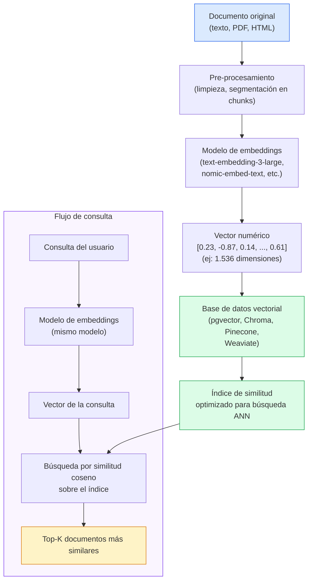
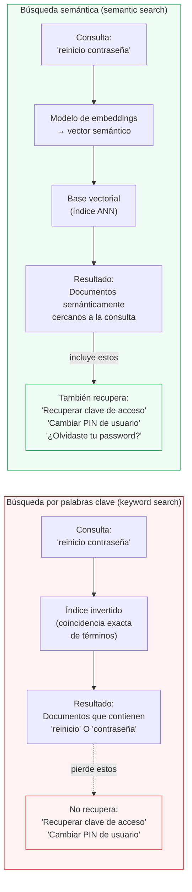

# Ingeniería de IA desde los Fundamentos

# Módulo I — Los Fundamentos de la Inteligencia Artificial

# Capítulo 10 — Embeddings: Representar el Significado como Geometría

**Versión:** 0.5 (Revisión conceptual)

---

## 1. Objetivos de aprendizaje

Al finalizar este capítulo serás capaz de:

1. Explicar qué es un Embedding (representación vectorial) sin recurrir a fórmulas matemáticas.
2. Describir cómo un modelo de embeddings transforma texto en un vector numérico que preserva relaciones de significado.
3. Diferenciar la búsqueda por palabras clave de la búsqueda semántica, identificando cuándo cada enfoque es apropiado.
4. Explicar conceptualmente qué es la similitud coseno y por qué es útil para comparar vectores.
5. Reconocer el rol de los embeddings en un pipeline de Retrieval-Augmented Generation (RAG).
6. Evaluar qué base de datos vectorial (Vector Database) conviene usar según el contexto del proyecto.
7. Identificar al menos tres errores de diseño frecuentes al incorporar embeddings en una arquitectura.
8. Leer e interpretar código Python básico que calcula similitud semántica entre textos.

---

## 2. Introducción

En los capítulos anteriores aprendiste que los Large Language Models (LLM) procesan texto como tokens y que su capacidad de razonamiento está acotada por la ventana de contexto. Esos conceptos explican cómo un modelo genera una respuesta cuando ya tiene la información necesaria frente a él. Pero queda una pregunta anterior, más fundamental: ¿cómo llega la información correcta al modelo en primer lugar?

El problema no es trivial. Las organizaciones tienen miles de documentos: manuales de producto, historiales de soporte, políticas internas, reportes financieros. Cuando un usuario hace una pregunta, no tiene sentido enviar toda esa documentación al LLM: sería prohibitivamente caro, lento y contraproducente. Es necesario recuperar previamente solo los fragmentos relevantes. Pero "relevante" no significa "que contiene las mismas palabras que la pregunta": significa "que expresa significado relacionado". Y esa distinción es la que hacen los embeddings posible.

Un Embedding, o representación vectorial, es una técnica que transforma texto, imágenes u otros objetos en coordenadas numéricas dentro de un espacio matemático de alta dimensión, diseñadas de tal manera que los objetos con significado similar quedan geométricamente próximos. Es la base de la búsqueda semántica, el corazón de Retrieval-Augmented Generation (RAG) y uno de los conceptos más influyentes en la arquitectura de sistemas de IA modernos.

---

## 3. Motivación: el límite de la búsqueda por palabras

### 3.1 El problema concreto

Considerá estas dos preguntas:

- "¿Cómo reinicio mi contraseña?"
- "Olvidé mi clave de acceso."

Para cualquier persona que lea ambas frases es inmediato que expresan exactamente la misma intención. Sin embargo, no comparten ninguna palabra relevante: "reinicio" y "olvidé" son distintos; "contraseña" y "clave de acceso" son sinónimos pero léxicamente diferentes.

Un motor de búsqueda tradicional basado en coincidencia de términos —el tipo de búsqueda que realiza SQL con LIKE, o un índice de texto completo sin semántica— trataría estas preguntas como consultas distintas. Si la base de conocimiento tiene documentos indexados bajo "contraseña" pero no bajo "clave de acceso", la segunda consulta podría devolver resultados irrelevantes o vacíos.

### 3.2 Por qué esto importa en producción

El volumen real del problema se vuelve evidente en los sistemas de soporte empresarial. Un portal de ayuda de software ERP puede tener 3.000 artículos de conocimiento. Cuando un usuario escribe "el sistema me tira error al facturar", un buscador por palabras clave busca documentos con esas palabras. Si el artículo correcto dice "Error de validación fiscal en comprobantes electrónicos", la búsqueda puede fallar aunque ese artículo responda exactamente la pregunta.

El coste no es solo la respuesta incorrecta: es que el usuario llama al soporte humano, el ticket demora horas en resolverse y el costo operativo se multiplica. Resolver este problema a escala requiere pasar de buscar palabras a buscar significado.

### 3.3 La solución conceptual

En lugar de comparar qué palabras aparecen en el documento, necesitamos una representación que capture qué significa el documento. Esa representación debe ser numérica para poder calcular distancias y ordenar resultados. Y debe ser construida de manera que textos con significado similar produzcan representaciones numéricamente similares.

Eso es exactamente un embedding.

---

## 4. Desarrollo conceptual desde primeros principios

### 4.1 ¿Qué es un vector?

Antes de definir qué es un embedding, conviene establecer qué es un vector en este contexto. Un vector es una lista ordenada de números. En geometría de dos dimensiones, un vector podría ser `[3, 7]`: una posición en un plano con dos ejes. En tres dimensiones, `[3, 7, 2]` define una posición en el espacio.

Los modelos de embeddings trabajan con espacios de cientos o miles de dimensiones. Un vector de 1.536 dimensiones es simplemente una lista de 1.536 números. Aunque no podemos visualizar ese espacio directamente, todas las operaciones geométricas que conocemos —distancia, ángulo, proximidad— siguen siendo válidas matemáticamente.

### 4.2 La idea central: espacio semántico

Un modelo de embeddings fue entrenado sobre enormes volúmenes de texto con el objetivo de producir vectores que preserven relaciones de significado. Después de ese entrenamiento, el modelo aprendió a asignar vectores de manera que:

- Textos con significado similar quedan cerca en ese espacio (sus vectores son numericamente similares).
- Textos con significado diferente quedan lejos (sus vectores son numéricamente distintos).

La analogía geométrica es directa: si dos documentos quedan "cerca" en ese espacio matemático de alta dimensión, es porque el modelo encontró que sus contenidos son semánticamente relacionados. "Reinicio de contraseña" y "clave de acceso olvidada" quedarán cerca. "Reinicio de contraseña" y "receta de pasta carbonara" quedarán lejos.

Lo importante es lo que esta representación no es: no es un resumen, no es una traducción, no es una versión comprimida del texto. Es una coordenada en un espacio matemático que captura relaciones de significado.

### 4.3 Cómo medir similitud: similitud coseno

Una vez que tenemos dos vectores, necesitamos cuantificar qué tan similares son. La técnica más usada en este contexto es la **similitud coseno**.

La idea conceptual es la siguiente: en lugar de medir la distancia directa entre dos puntos (que depende de cuán "largo" es cada vector), medimos el ángulo entre los dos vectores desde el origen. Si los dos vectores apuntan en la misma dirección, el ángulo entre ellos es cero y la similitud es máxima (valor 1.0). Si apuntan en direcciones opuestas, la similitud es mínima (valor -1.0). Si son perpendiculares (sin relación), la similitud es 0.

La analogía con un mapa es útil: imaginá que ambos vectores son flechas que parten del mismo punto. Si dos flechas apuntan casi en la misma dirección —aunque una sea más larga que otra— los conceptos que representan son similares. La similitud coseno mide esa "dirección compartida" independientemente de la magnitud de cada vector.

En la práctica, para textos semánticamente relacionados la similitud coseno suele estar por encima de 0.8. Para textos no relacionados, suele estar por debajo de 0.3. Estos umbrales varían según el modelo y el dominio.

### 4.4 El proceso de generación de un embedding

El proceso que convierte texto en vector sigue estos pasos:

1. El texto entra al modelo de embeddings como input.
2. El modelo procesa ese texto a través de sus capas internas.
3. La capa final del modelo produce un vector de dimensión fija (por ejemplo, 1.536 números para `text-embedding-3-large` de OpenAI).
4. Ese vector es el embedding: la representación numérica del significado del texto.

El modelo no produce una descripción del texto. Produce coordenadas en un espacio semántico. El proceso es determinístico: el mismo texto, pasado por el mismo modelo, producirá siempre el mismo vector.

### 4.5 Qué no hace un embedding

Este punto es crítico y es fuente de errores frecuentes en arquitecturas:

- **Un embedding no genera texto.** No es un LLM. No puede responder preguntas.
- **Un embedding no comprende.** Produce un vector numérico basado en los patrones estadísticos aprendidos durante su entrenamiento.
- **Un embedding no almacena información.** Es una transformación de texto a número. La información original sigue siendo el texto.
- **Un embedding no decide qué es relevante para el negocio.** Solo calcula proximidad semántica según lo que aprendió durante el entrenamiento. La definición de "relevante" para un caso de uso específico es una decisión de arquitectura, no una propiedad del modelo.

---

## 5. Analogía: el mapa semántico y el barrio de las ideas

Imaginá un mapa de una ciudad. Cada punto del mapa tiene coordenadas: latitud y longitud. Dos puntos están cerca si sus coordenadas son similares. Un barrio es un conjunto de puntos con coordenadas próximas entre sí.

Ahora imaginá un mapa no de edificios, sino de ideas. Cada concepto ocupa una posición en ese mapa. Los conceptos relacionados viven en el mismo barrio: "contraseña", "clave de acceso", "autenticación" y "recuperación de cuenta" quedan todos en el mismo vecindario del mapa semántico. "Receta de pasta", "ingredientes", "tiempo de cocción" y "temperatura del horno" viven en otro barrio, muy alejado del primero.

Cuando buscás un documento relevante, convertís tu consulta en coordenadas de ese mapa y buscás los documentos cuyas coordenadas están más cerca. No buscás los que usan las mismas palabras: buscás los que viven en el mismo barrio de ideas.

Los embeddings son el sistema que asigna coordenadas a los conceptos. Los modelos de embeddings aprendieron durante su entrenamiento cómo debe verse ese mapa: qué queda cerca de qué, qué queda lejos, qué barrios existen.

Lo que esta analogía no captura: el mapa semántico tiene cientos o miles de dimensiones, no dos. Y las "coordenadas" no las asignó un cartógrafo humano sino un proceso de optimización estadística sobre enormes volúmenes de texto. El mapa es útil pero no perfecto: puede cometer errores en dominios muy especializados, en idiomas con pocos datos de entrenamiento o en terminología técnica muy reciente.

---

## 6. Diagrama 1: Pipeline de embeddings — del documento a la base vectorial



**Lectura del diagrama:** El flujo superior representa la indexación: convertir documentos en vectores y almacenarlos. Esto ocurre una sola vez (o cuando se actualiza la base de conocimiento). El flujo inferior representa cada consulta del usuario: convertir la pregunta en vector y buscar los documentos más cercanos. Ambos flujos usan el mismo modelo de embeddings para que los vectores sean comparables.

---

## 7. Diagrama 2: Búsqueda por palabras clave vs. búsqueda semántica



**Lectura del diagrama:** La búsqueda por palabras clave es exacta pero rígida: solo recupera lo que coincide léxicamente. La búsqueda semántica es aproximada pero robusta: recupera por proximidad de significado. En arquitecturas híbridas, ambos enfoques se combinan para maximizar tanto precisión como cobertura.

---

## 8. Modelos de embeddings: opciones y criterios de selección

No todos los modelos de embeddings son iguales. La elección del modelo afecta la calidad de la búsqueda semántica, los costos operativos y la viabilidad de ejecutar el sistema en infraestructura propia.

| Modelo | Proveedor | Dimensiones | Multilingüe | Ejecución | Caso de uso principal |
|---|---|---|---|---|---|
| `text-embedding-3-large` | OpenAI | 3.072 (ajustable) | Sí | API | Alta calidad, inglés y multilingüe, producción cloud |
| `text-embedding-3-small` | OpenAI | 1.536 | Sí | API | Balance costo/calidad, volúmenes altos |
| `embed-v3.0` | Cohere | 1.024 | Sí (100+ idiomas) | API | Soporte multilingüe robusto, enterprise |
| `nomic-embed-text` | Nomic AI | 768 | Limitado | Local / API | Open source, on-premises, sin costo de API |
| `all-MiniLM-L6-v2` | Sentence Transformers | 384 | Limitado | Local | Prototipado rápido, bajo recurso, open source |

**Notas clave:**
- Anthropic no ofrece modelos de embeddings propios. Sus modelos Claude son LLMs generativos. Para usar embeddings en arquitecturas con Claude, se combina con un modelo de embeddings de otro proveedor (OpenAI, Cohere, o modelos open source).
- Más dimensiones no garantizan mejor calidad en todos los casos. Un modelo de 384 dimensiones bien entrenado puede superar a uno de 1.536 en dominios específicos donde fue fine-tuneado.
- La elección entre API y ejecución local involucra un trade-off entre costo, latencia, privacidad de datos y complejidad operativa. Datos sensibles (salud, legales, financieros) a menudo requieren ejecución local.

---

## 9. Bases de datos vectoriales: almacenar y consultar vectores a escala

Una **base de datos vectorial** (Vector Database) es un sistema de almacenamiento especializado en guardar vectores de alta dimensión y permitir búsquedas eficientes por similitud. La búsqueda exacta del vector más cercano en millones de documentos sería computacionalmente prohibitiva; las bases vectoriales implementan algoritmos de búsqueda aproximada del vecino más cercano (Approximate Nearest Neighbor, ANN) que permiten encontrar los resultados más similares en milisegundos.

Las opciones más usadas en producción:

**pgvector** — Extensión de PostgreSQL que agrega soporte nativo para vectores. Ideal cuando ya se usa Postgres y el volumen de vectores es manejable (hasta pocos millones). Permite combinar búsquedas vectoriales con consultas SQL relacionales en la misma query. Menor overhead operativo al evitar una base de datos adicional.

**Chroma** — Base vectorial open source diseñada para prototipado rápido. Puede correr en memoria o en disco, se integra con Python con muy pocas líneas y no requiere infraestructura adicional. Opción natural para laboratorios y MVPs.

**Pinecone** — Servicio gestionado en la nube (SaaS). Sin operaciones, escalado automático, SLA garantizado. Costo variable según uso. Opción para producción cuando el equipo no quiere gestionar infraestructura.

**Weaviate** — Base vectorial open source con capacidades avanzadas: búsqueda híbrida (vectorial + BM25), módulos de vectorización integrados, GraphQL API. Despliegue propio o nube gestionada. Adecuado para arquitecturas complejas con múltiples tipos de datos.

La decisión de cuál usar depende de tres variables: el volumen de vectores, el stack tecnológico existente y los requisitos de privacidad. Para un proyecto que ya usa PostgreSQL y tiene menos de 5 millones de documentos, pgvector suele ser la opción de menor fricción.

---

## 10. Ejemplo real: sistema de soporte del Data Warehouse de Finnegans

### Contexto

Finnegans desarrolla software ERP para pequeñas y medianas empresas latinoamericanas. Su plataforma de Data Warehouse permite a los usuarios construir reportes y dashboards sobre sus datos operativos. El equipo de soporte recibe a diario cientos de consultas de usuarios que preguntan cómo construir métricas, qué tablas usan ciertos datos, cómo interpretar errores del pipeline y cómo configurar vistas.

La base de conocimiento incluye: documentación técnica de las tablas del modelo de datos, guías de uso de la plataforma, respuestas a preguntas frecuentes históricas y ejemplos de consultas SQL. En total, aproximadamente 4.200 documentos.

El equipo tenía un buscador de texto tradicional integrado en el portal de soporte. El feedback de los usuarios era consistente: "no encuentra lo que busco". Análisis de las búsquedas fallidas reveló que el problema era de vocabulario: los usuarios preguntaban en lenguaje coloquial ("¿cuánto facturamos el trimestre pasado?") mientras que la documentación usaba terminología técnica ("acumulado de comprobantes fiscales por período fiscal").

### El pipeline implementado

El equipo construyó un sistema de búsqueda semántica con la siguiente arquitectura:

1. **Preprocesamiento:** Los 4.200 documentos fueron segmentados en fragmentos (chunks) de aproximadamente 512 tokens con solapamiento de 50 tokens entre fragmentos consecutivos, para preservar contexto en los bordes.

2. **Generación de embeddings:** Cada chunk fue procesado por `text-embedding-3-small` de OpenAI, produciendo un vector de 1.536 dimensiones. El proceso completo tomó 47 minutos y tuvo un costo de USD 1,80 (aproximadamente 8 millones de tokens procesados).

3. **Almacenamiento:** Los vectores fueron almacenados en pgvector dentro de la misma base de datos PostgreSQL que ya usaba la aplicación, evitando la operación de una base de datos adicional.

4. **Búsqueda:** Cuando un usuario escribe una consulta, la aplicación genera su embedding usando el mismo modelo y busca los 5 chunks con mayor similitud coseno. Esos chunks se presentan como resultados de búsqueda.

5. **Integración con LLM (RAG):** En el flujo de asistente conversacional, esos 5 chunks se incluyen en el prompt del LLM junto con la pregunta del usuario. El LLM genera una respuesta basándose únicamente en ese contexto recuperado. El embedding no generó la respuesta: encontró la información. El LLM sintetizó la respuesta a partir de esa información.

### Resultado

La tasa de resolución sin escalado a soporte humano subió del 34% al 61% en las primeras dos semanas. Los tickets de soporte relacionados con búsqueda de documentación cayeron un 40%. Los usuarios que antes escribían consultas exactas de tres palabras comenzaron a escribir preguntas completas en lenguaje natural.

### Lo que aprendió el equipo de arquitectura

**Primera lección: el chunking es una decisión de diseño crítica.** Fragmentos demasiado cortos pierden contexto. Fragmentos demasiado largos diluyen el significado específico en ruido general. El tamaño óptimo depende del tipo de contenido y requiere experimentación.

**Segunda lección: el modelo de embeddings debe ser consistente.** Los vectores de los documentos indexados y los de las consultas deben generarse con el mismo modelo. Cambiar de modelo implica re-indexar toda la base de conocimiento.

**Tercera lección: la búsqueda semántica no reemplaza siempre a SQL.** Cuando un usuario pregunta "¿cuántos tickets se resolvieron en mayo de 2025?", la respuesta correcta viene de una consulta SQL a una tabla de tickets, no de recuperar documentación. Saber cuándo usar búsqueda semántica y cuándo usar una consulta estructurada es una decisión de arquitectura que no delega en el modelo.

---

## 11. Código Python: calcular similitud semántica entre textos

El siguiente código muestra cómo generar embeddings y calcular similitud coseno entre dos textos usando la biblioteca `sentence-transformers`, que permite ejecución local sin costo de API.

```python
# Instalar con: pip install sentence-transformers numpy
from sentence_transformers import SentenceTransformer
import numpy as np

# 1. Cargar el modelo de embeddings (se descarga la primera vez, ~90 MB)
# all-MiniLM-L6-v2: modelo liviano, open source, bueno para prototipado
modelo = SentenceTransformer("all-MiniLM-L6-v2")

# 2. Definir los textos a comparar
texto_a = "¿Cómo reinicio mi contraseña?"
texto_b = "Olvidé mi clave de acceso."
texto_c = "¿Cuál es la receta de la pasta carbonara?"

# 3. Generar embeddings (vectores numéricos) para cada texto
# encode() devuelve un array numpy de shape (384,) por cada texto
embedding_a = modelo.encode(texto_a)
embedding_b = modelo.encode(texto_b)
embedding_c = modelo.encode(texto_c)

# 4. Función para calcular similitud coseno entre dos vectores
def similitud_coseno(vec1, vec2):
    # El producto punto entre los vectores normalizados da el coseno del ángulo
    # numpy lo calcula eficientemente con operaciones vectorizadas
    norma1 = np.linalg.norm(vec1)
    norma2 = np.linalg.norm(vec2)
    return np.dot(vec1, vec2) / (norma1 * norma2)

# 5. Calcular y mostrar similitudes
sim_ab = similitud_coseno(embedding_a, embedding_b)
sim_ac = similitud_coseno(embedding_a, embedding_c)

print(f"Similitud '{texto_a}' vs '{texto_b}': {sim_ab:.4f}")
print(f"Similitud '{texto_a}' vs '{texto_c}': {sim_ac:.4f}")

# Resultado esperado (valores aproximados):
# Similitud 'contraseña' vs 'clave de acceso': ~0.82  (semánticamente cercanos)
# Similitud 'contraseña' vs 'pasta carbonara': ~0.08  (semánticamente lejanos)
```

**Qué muestra este código:**
- Un valor cercano a 1.0 indica textos semánticamente similares.
- Un valor cercano a 0.0 indica textos semánticamente no relacionados.
- El mismo código, usando `text-embedding-3-small` de OpenAI con la biblioteca `openai`, produciría resultados de mayor calidad a costa de una llamada API por cada texto.

---

## 12. Conversación con un arquitecto

**Product Manager:** Queremos que el asistente responda preguntas sobre nuestros productos. Dijeron que los embeddings resuelven esto. ¿Instalo una base vectorial y listo?

**Arquitecto:** Los embeddings son parte de la solución, pero no toda. Antes de hablar de tecnología, necesito entender el flujo completo. ¿Quién genera las respuestas? ¿Qué tipo de preguntas esperas recibir? ¿Qué documentación existe como fuente?

**PM:** El asistente tiene que responder sobre precios, características técnicas y procedimientos de instalación. Tenemos un PDF de 300 páginas y una wiki interna con 800 artículos.

**Arquitecto:** Bien. Los embeddings resuelven el problema de recuperación: encontrar los fragmentos del PDF y la wiki que son relevantes para cada pregunta. Un LLM resuelve el problema de generación: sintetizar esos fragmentos en una respuesta coherente. Necesitás ambas piezas. Esto se llama RAG. La base vectorial almacena los embeddings de tus documentos y hace la búsqueda eficiente.

**PM:** ¿Y si los documentos cambian? Actualizamos la wiki cada semana.

**Arquitecto:** Buen punto que mucha gente ignora. Cuando un artículo cambia, el embedding correspondiente queda desactualizado. Necesitás un pipeline de re-indexación que detecte cambios y actualice los vectores. No es complicado, pero tiene que estar diseñado desde el principio. Un sistema de RAG sin estrategia de mantenimiento de índice produce respuestas sobre información vieja.

**PM:** ¿Qué pasa si el asistente no encuentra la respuesta en los documentos?

**Arquitecto:** El sistema puede recuperar los chunks más similares aunque la similitud sea baja. Si no hay ningún documento realmente relevante, el LLM puede alucinar: inventar una respuesta plausible pero incorrecta. La arquitectura robusta incluye un umbral mínimo de similitud: si ningún chunk supera ese umbral, el asistente responde "No tengo información sobre eso" en lugar de inventar. Eso requiere definir ese umbral, lo cual requiere datos de evaluación. ¿Tienen ejemplos de preguntas reales de usuarios con las respuestas correctas?

**PM:** No teníamos pensado eso. ¿Es crítico?

**Arquitecto:** Es la diferencia entre un sistema que parece funcionar y uno que realmente funciona. Sin un conjunto de evaluación no podés medir si el sistema mejora o empeora cuando hacés cambios. En un asistente de producto, una respuesta incorrecta con alta confianza es peor que no responder. El esfuerzo de armar 50 pares pregunta-respuesta correctas es mucho menor que el costo de un cliente que recibe información errónea sobre precios.

---

## 13. Errores frecuentes

### Error 1: Confundir embeddings con LLMs

El error más común es creer que el modelo de embeddings y el LLM son la misma cosa o intercambiables. Son herramientas con propósitos distintos:

- El **modelo de embeddings** transforma texto en vectores. No genera texto. No responde preguntas.
- El **LLM** genera texto. No hace búsquedas. No compara documentos.

En una arquitectura RAG, el modelo de embeddings encuentra los documentos relevantes y el LLM los usa para generar la respuesta. Eliminar uno de los dos hace colapsar el sistema. Usarlos en el rol incorrecto produce resultados incorrectos.

### Error 2: Creer que los embeddings responden preguntas

Un embedding es una coordenada, no una respuesta. Calcula qué documentos están semánticamente cerca de una consulta. La respuesta la genera el LLM, basándose en esos documentos. Confundir estas responsabilidades lleva a diseños donde se le pide al sistema de recuperación que genere respuestas, o se omite el LLM creyendo que la búsqueda semántica sola es suficiente.

### Error 3: Usar búsqueda vectorial donde alcanza con SQL

No toda búsqueda requiere embeddings. Si el usuario pregunta "¿cuántos pedidos se procesaron en marzo?" la respuesta correcta viene de `SELECT COUNT(*) FROM pedidos WHERE mes = 'marzo'`. Reemplazar esa consulta por búsqueda semántica es un error de diseño: la búsqueda semántica es imprecisa por naturaleza; SQL es exacto. Una buena arquitectura sabe cuándo derivar al motor vectorial y cuándo al motor relacional.

### Error 4: Indexar sin estrategia de chunking

Convertir documentos completos en un solo embedding diluye su contenido. Un documento de 20 páginas producirá un vector que promedia demasiados temas, perdiendo precisión en la recuperación. La solución es segmentar los documentos en fragmentos (chunks) antes de generar los embeddings. Pero la estrategia de chunking —tamaño de cada fragmento, solapamiento entre fragmentos, cómo manejar secciones con tablas o código— tiene impacto directo en la calidad de la búsqueda y requiere experimentación deliberada.

### Error 5: No contemplar la actualización del índice vectorial

Un sistema que indexa documentos una sola vez y nunca los actualiza responde sobre información potencialmente desactualizada. Si los precios cambian, si los procedimientos se modifican, si se agrega nueva documentación, el índice vectorial debe actualizarse. Diseñar el pipeline de indexación como un proceso one-shot en lugar de como un proceso continuo es una deuda técnica que aparece en producción.

### Error 6: Asumir que más dimensiones siempre es mejor

Un vector de 3.072 dimensiones no es automáticamente mejor que uno de 768. La calidad del embedding depende del modelo que lo generó y de qué tan bien fue entrenado para el dominio de aplicación. Para texto en español técnico de un dominio muy específico, un modelo open source fine-tuneado con datos del dominio puede superar a un modelo de alta dimensión entrenado principalmente con texto en inglés.

---

## 14. Buenas prácticas

### Práctica 1: Usar el mismo modelo para indexar y para consultar

Los vectores de los documentos y los vectores de las consultas deben ser generados por el mismo modelo, con los mismos parámetros. Un vector producido por `text-embedding-3-large` no es comparable con uno producido por `nomic-embed-text`. La similitud coseno entre vectores de modelos distintos no tiene significado semántico. Si cambiás de modelo, re-indexás todo.

### Práctica 2: Experimentar con el tamaño y solapamiento de chunks

No existe un tamaño de chunk universalmente óptimo. Como regla general de inicio: 256-512 tokens por chunk con 10-20% de solapamiento. Luego evaluá la calidad de la recuperación con preguntas reales y ajustá. Documentar la estrategia elegida y el criterio de esa elección es parte del diseño, no un detalle de implementación.

### Práctica 3: Definir un umbral mínimo de similitud

Establecé un umbral bajo el cual el sistema declara que no tiene información en lugar de devolver el resultado menos malo. Este umbral debe calibrarse con datos de evaluación reales, no asignarse arbitrariamente. Un sistema que siempre responde algo —aunque la similitud sea 0.1— produce más daño que uno que admite sus límites.

### Práctica 4: Construir un conjunto de evaluación antes de ir a producción

Antes de desplegar el sistema, armar un conjunto de 50-100 pares (pregunta, documentos esperados) permite medir la calidad de la recuperación con métricas concretas (precisión, recall, MRR). Sin este conjunto, cualquier cambio —de modelo, de chunking, de umbral— es ciego. Con él, los cambios son decisiones informadas.

### Práctica 5: Considerar búsqueda híbrida para producción

En muchos sistemas de producción, la búsqueda semántica pura no es suficiente. Una búsqueda híbrida combina resultados de búsqueda vectorial (semántica) con resultados de búsqueda BM25 (keyword). Los resultados se fusionan usando técnicas de re-ranking. Esta combinación captura tanto la robustez semántica de los embeddings como la precisión léxica del keyword search, mejorando la cobertura general del sistema.

### Práctica 6: Versionar el modelo de embeddings junto con el índice

Si actualizás el modelo de embeddings, el índice anterior es incompatible. Tratar el modelo y el índice como una unidad versionada —registrar qué modelo generó qué versión del índice— evita mezclas accidentales y facilita el rollback.

---

## 15. Laboratorio: mini buscador semántico

### Objetivo

Construir un buscador semántico básico desde cero sobre un corpus de 5 documentos, comprendiendo cada paso del pipeline: generación de embeddings, comparación por similitud coseno y recuperación del documento más relevante.

### Nivel

Inicial — requiere Python instalado y familiaridad básica con la línea de comandos.

### Tiempo estimado

60 minutos

### Prerrequisitos

- Haber completado los Capítulos 1 a 9.
- Python 3.9 o superior instalado.
- Conexión a internet para descargar dependencias.

### Herramientas

```bash
pip install sentence-transformers numpy
```

---

### Paso 1: Entender el corpus

**Acción:** Leer y reflexionar sobre los 5 documentos del corpus de prueba antes de escribir código.

```
Documento 1: "Para recuperar tu contraseña, hacé clic en '¿Olvidaste tu clave?' 
              en la pantalla de inicio de sesión y seguí los pasos del email."

Documento 2: "Las facturas del mes se cierran el último día hábil. 
              Podés consultar el resumen en el módulo de Facturación."

Documento 3: "Para exportar un reporte a Excel, seleccioná el ícono de descarga 
              en la esquina superior derecha de cualquier dashboard."

Documento 4: "Si el sistema muestra error 403, significa que tu usuario no tiene 
              permisos para acceder a esa sección. Contactá a tu administrador."

Documento 5: "El módulo de Inventario permite registrar ingresos y egresos de stock 
              en tiempo real con trazabilidad por lote."
```

**Reflexión:** ¿Qué documentos te parece que deberían aparecer si alguien busca "olvidé mi password"? ¿Y si busca "no puedo entrar al sistema"?

---

### Paso 2: Generar embeddings para el corpus

```python
from sentence_transformers import SentenceTransformer
import numpy as np

# Cargar modelo (se descarga ~90 MB la primera vez)
modelo = SentenceTransformer("all-MiniLM-L6-v2")

# Corpus de documentos
documentos = [
    "Para recuperar tu contraseña, hacé clic en '¿Olvidaste tu clave?' en la pantalla de inicio de sesión y seguí los pasos del email.",
    "Las facturas del mes se cierran el último día hábil. Podés consultar el resumen en el módulo de Facturación.",
    "Para exportar un reporte a Excel, seleccioná el ícono de descarga en la esquina superior derecha de cualquier dashboard.",
    "Si el sistema muestra error 403, significa que tu usuario no tiene permisos para acceder a esa sección. Contactá a tu administrador.",
    "El módulo de Inventario permite registrar ingresos y egresos de stock en tiempo real con trazabilidad por lote.",
]

# Generar embeddings para todos los documentos
# encode() acepta una lista y devuelve una matriz (5, 384)
embeddings_corpus = modelo.encode(documentos)

print(f"Corpus: {len(documentos)} documentos")
print(f"Dimensiones por embedding: {embeddings_corpus.shape[1]}")
```

**Resultado esperado:** Verás "5 documentos" y "384" dimensiones. Cada documento quedó representado como un vector de 384 números.

---

### Paso 3: Implementar el buscador

```python
def buscar(consulta, documentos, embeddings_corpus, modelo, top_k=2):
    """
    Busca los documentos más similares a una consulta.
    
    Args:
        consulta: texto de búsqueda del usuario
        documentos: lista de textos originales del corpus
        embeddings_corpus: matriz de embeddings pre-calculados
        modelo: modelo de embeddings
        top_k: número de resultados a devolver
    
    Returns:
        lista de (documento, similitud) ordenada de mayor a menor similitud
    """
    # 1. Convertir la consulta en embedding
    embedding_consulta = modelo.encode(consulta)
    
    # 2. Calcular similitud coseno con cada documento
    similitudes = []
    for i, emb_doc in enumerate(embeddings_corpus):
        # Similitud coseno: producto punto de vectores normalizados
        norma_consulta = np.linalg.norm(embedding_consulta)
        norma_doc = np.linalg.norm(emb_doc)
        sim = np.dot(embedding_consulta, emb_doc) / (norma_consulta * norma_doc)
        similitudes.append((documentos[i], float(sim)))
    
    # 3. Ordenar por similitud descendente y devolver top_k
    similitudes.sort(key=lambda x: x[1], reverse=True)
    return similitudes[:top_k]
```

---

### Paso 4: Realizar búsquedas y observar resultados

```python
# Consultas de prueba con vocabulario diferente al del corpus
consultas = [
    "olvidé mi password",
    "no puedo entrar al sistema",
    "quiero bajar datos a una planilla",
    "problema de acceso sin autorización",
]

for consulta in consultas:
    print(f"\nConsulta: '{consulta}'")
    print("-" * 50)
    resultados = buscar(consulta, documentos, embeddings_corpus, modelo)
    for doc, sim in resultados:
        print(f"  Similitud: {sim:.4f} | {doc[:70]}...")
```

**Resultado esperado:** Las consultas como "olvidé mi password" deberían recuperar el Documento 1 con similitud alta (~0.70-0.85). La consulta "problema de acceso sin autorización" debería recuperar el Documento 4 (error 403). Las palabras usadas en la consulta son diferentes a las del documento, pero el buscador las relaciona por significado.

---

### Paso 5: Analizar los límites del sistema

**Tarea:** Construí al menos dos consultas donde el sistema falle o devuelva un resultado incorrecto. Por ejemplo:

- Términos muy técnicos del dominio que el modelo no conoce.
- Preguntas en idioma diferente al del corpus.
- Preguntas con negación ("¿qué no debo hacer para...?").

**Registro:** Para cada caso de falla, anotá:
1. Cuál fue la consulta.
2. Qué documento recuperó el sistema.
3. Por qué creés que falló.

---

### Validación del laboratorio

El laboratorio fue completado exitosamente si:

- [ ] Podés explicar qué representa cada número en el vector de 384 dimensiones.
- [ ] Podés describir por qué la búsqueda recupera documentos con vocabulario diferente al de la consulta.
- [ ] Identificaste al menos un caso donde el sistema falla y podés formular una hipótesis de por qué.
- [ ] Podés articular la diferencia entre lo que hace `modelo.encode()` y lo que haría un LLM ante la misma consulta.

---

### Desafíos opcionales

1. Agregar 5 documentos propios de tu dominio laboral y evaluar si el sistema recupera correctamente ante consultas en lenguaje coloquial.
2. Reemplazar `all-MiniLM-L6-v2` por `paraphrase-multilingual-MiniLM-L12-v2` (soporte multilingüe) y comparar los resultados con consultas en inglés y español mezclados.
3. Implementar un umbral mínimo: si la similitud máxima está por debajo de 0.5, que el sistema devuelva "No encontré información relevante" en lugar del resultado menos malo.

---

## 16. Preguntas de reflexión

1. Si indexás los mismos documentos con dos modelos de embeddings distintos, ¿podés mezclar los vectores resultantes en la misma base de datos vectorial y hacer búsquedas? ¿Por qué?

2. Un sistema de RAG responde correctamente el 80% de las veces en pruebas internas pero el 55% en producción. ¿Cuáles son las hipótesis más probables? ¿Qué datos recopilarías para confirmar cada hipótesis?

3. ¿En qué situaciones un administrador de base de datos debería preferir pgvector sobre Pinecone, aunque Pinecone sea más fácil de escalar? ¿Qué factores influyen en esa decisión?

4. Una empresa quiere construir un asistente de búsqueda sobre documentación legal. Los documentos cambian regularmente cuando hay actualizaciones normativas. ¿Cómo diseñarías la estrategia de re-indexación para minimizar el tiempo con información desactualizada?

5. ¿Por qué la similitud coseno es preferible a la distancia euclidiana para comparar embeddings de texto? ¿Qué propiedad de los vectores de texto hace que el ángulo sea más informativo que la distancia absoluta?

6. Un usuario del sistema de FAQ hace siempre consultas muy cortas ("error al pagar", "no carga", "como facturar"). Otro usuario hace consultas largas y detalladas. ¿Cómo afecta la longitud de la consulta a la calidad del embedding generado? ¿Qué podrías hacer para mitigar ese efecto?

7. Describí un caso de uso en tu organización donde la búsqueda por palabras clave actual esté produciendo resultados insatisfactorios y la búsqueda semántica podría mejorarlos. ¿Qué datos necesitarías para validar esa mejora?

---

## 17. Resumen narrativo

Los embeddings, o representaciones vectoriales, son la solución al problema de buscar por significado en lugar de por palabras. Al transformar texto en coordenadas dentro de un espacio matemático de alta dimensión —diseñado para que conceptos similares queden geométricamente próximos— hacen posible recuperar información relevante aunque la consulta del usuario use vocabulario completamente diferente al de los documentos almacenados.

La similitud coseno es el mecanismo que cuantifica esa proximidad: mide el ángulo entre dos vectores, capturando la dirección semántica compartida con independencia de la magnitud de cada vector. Cuanto más pequeño el ángulo, más alta la similitud. Cuanto más alta la similitud, más relacionados semánticamente son los textos.

Este mecanismo es el corazón de Retrieval-Augmented Generation (RAG): los documentos de la organización se convierten en vectores y se almacenan en una base de datos vectorial. Cuando llega una consulta, se convierte en vector, se buscan los documentos más cercanos, y solo esos documentos se envían al LLM para generar la respuesta. El LLM no lee toda la base de conocimiento: lee solo lo que el sistema de embeddings consideró relevante.

Como toda herramienta, los embeddings tienen límites. No generan texto, no comprenden, no deciden qué es relevante para el negocio: solo calculan proximidad semántica. La calidad del sistema depende del modelo elegido, de la estrategia de chunking de documentos, del umbral de similitud mínima y de la capacidad de mantener el índice actualizado cuando los documentos cambian. Un arquitecto que entiende estas variables puede construir sistemas de recuperación de información robustos y mantenibles. Uno que no las entiende construirá sistemas que funcionan en el laboratorio y fallan en producción.

---

## 18. Checklist del capítulo

- [ ] Puedo explicar qué es un Embedding (representación vectorial) sin usar la palabra "IA" ni fórmulas.
- [ ] Puedo describir por qué textos con vocabulario diferente pueden tener embeddings similares.
- [ ] Puedo explicar conceptualmente la similitud coseno usando la analogía de la dirección en el mapa.
- [ ] Puedo describir el pipeline completo de un sistema RAG: indexación, consulta, recuperación, generación.
- [ ] Puedo identificar al menos dos escenarios donde la búsqueda vectorial no es la herramienta correcta.
- [ ] Puedo nombrar al menos tres opciones de modelos de embeddings y un criterio de selección para cada una.
- [ ] Puedo nombrar al menos tres bases de datos vectoriales y describir cuándo usar cada una.
- [ ] Completé el laboratorio y pude recuperar documentos con vocabulario diferente al de la consulta.
- [ ] Identifiqué al menos un caso de falla en el laboratorio y formulé una hipótesis explicativa.
- [ ] Puedo articular la diferencia entre lo que hace un modelo de embeddings y lo que hace un LLM.

---

## 19. Glosario breve

**Embedding (representación vectorial):** Representación numérica de texto, imagen u otro objeto en forma de vector de alta dimensión, diseñada para que objetos con significado similar produzcan vectores numéricamente próximos.

**Vector:** Lista ordenada de números que representa una posición en un espacio matemático de múltiples dimensiones. En el contexto de embeddings, cada número captura una dimensión del significado del texto.

**Similitud coseno:** Medida de similitud entre dos vectores basada en el coseno del ángulo que forman. Varía entre -1 (opuestos) y 1 (idénticos en dirección). Mide la "dirección semántica compartida" con independencia de la magnitud de cada vector.

**Base de datos vectorial (Vector Database):** Sistema de almacenamiento especializado en vectores de alta dimensión que permite búsquedas eficientes por similitud mediante algoritmos de búsqueda aproximada del vecino más cercano (ANN).

**Búsqueda semántica (semantic search):** Método de recuperación de información que compara el significado de la consulta con el significado de los documentos, en lugar de buscar coincidencias léxicas exactas.

**Retrieval-Augmented Generation (RAG):** Arquitectura que combina recuperación de información (mediante embeddings y base vectorial) con generación de texto (mediante LLM). El sistema recupera los documentos relevantes antes de enviarlos al LLM para que genere la respuesta.

**Chunk (fragmento):** Segmento de texto en que se divide un documento antes de generar su embedding. El tamaño y el solapamiento entre chunks afectan directamente la calidad de la recuperación semántica.

---

## 20. Próximo capítulo

**Capítulo 11 — Temperatura, Top-K, Top-P y Sampling**

Ahora que entendemos cómo los sistemas recuperan información relevante mediante embeddings, el siguiente paso es comprender cómo los LLMs usan esa información para generar texto. No todos los modelos generan siempre el mismo texto ante el mismo input: el comportamiento varía según parámetros de sampling como temperatura, Top-K y Top-P.

En el próximo capítulo analizaremos por qué un mismo modelo puede producir respuestas completamente diferentes frente al mismo prompt y cómo controlar ese comportamiento para distintos tipos de aplicaciones.

---

> "Un arquitecto no memoriza respuestas. Comprende problemas para poder diseñar soluciones."
