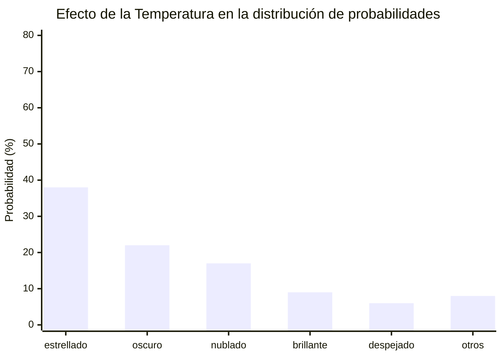
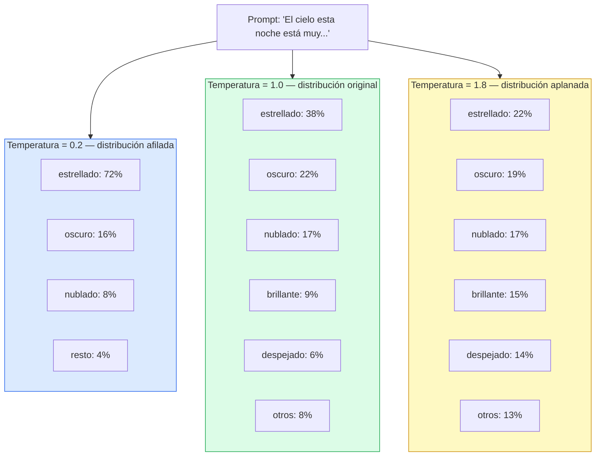
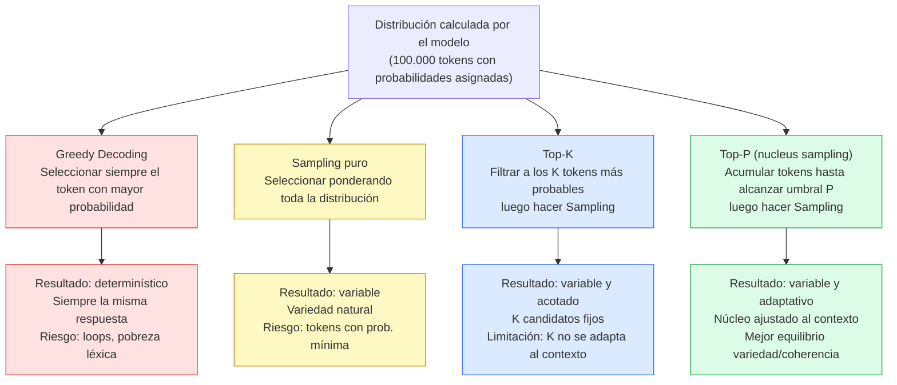

# Ingeniería de IA desde los Fundamentos

# Módulo I — Los Fundamentos de la Inteligencia Artificial

# Capítulo 11 — Temperatura, Top-K, Top-P y Sampling

**Versión:** 0.5 (Revisión conceptual)

---

## 1. Objetivos de aprendizaje

Al finalizar este capítulo serás capaz de:

1. Explicar por qué el mismo prompt puede producir respuestas distintas en distintas ejecuciones.
2. Describir intuitivamente qué es la distribución de probabilidades sobre el vocabulario y cómo el modelo la utiliza.
3. Diferenciar greedy decoding, Sampling, Top-K y Top-P como estrategias de selección de tokens.
4. Explicar la intuición de la Temperatura como mecanismo de afilamiento o aplanamiento de una distribución.
5. Seleccionar configuraciones adecuadas de Temperatura, Top-K y Top-P según el tipo de aplicación.
6. Identificar los errores más frecuentes al configurar estos parámetros en sistemas productivos.
7. Aplicar el parámetro seed para lograr reproducibilidad en entornos donde la consistencia es crítica.

---

## 2. Introducción

Hay una pregunta que aparece inevitablemente cuando alguien trabaja con un Large Language Model (LLM) por primera vez:

> "Le hice el mismo prompt dos veces y me respondió distinto. ¿El modelo está fallando?"

No está fallando. Está funcionando exactamente como fue diseñado.

La variabilidad en las respuestas de un LLM no es un defecto de implementación ni una señal de inestabilidad. Es el resultado directo de cómo el modelo toma decisiones token a token: a través de distribuciones de probabilidad y estrategias de selección que pueden configurarse con precisión.

Entender temperatura, sampling, Top-K y Top-P no es un detalle técnico avanzado. Es una competencia fundamental para cualquier profesional que diseñe sistemas basados en LLMs. Estos parámetros determinan si un asistente de programación responde siempre de la misma forma confiable o si un generador de ideas produce variedad real. Configurarlos mal puede resultar en un chatbot empresarial que alucina, en un generador de código que cambia su estilo constantemente, o en un sistema creativo que siempre repite las mismas dos respuestas.

En este capítulo vamos desde los primeros principios: cómo el modelo representa sus opciones como probabilidades, qué estrategias existen para elegir entre ellas, y cómo cada parámetro modifica ese proceso. Al final, estarás en condiciones de tomar decisiones de configuración informadas, no empíricas al azar.

---

## 3. Motivación: ¿por qué el mismo prompt produce respuestas distintas?

Para responder esta pregunta hay que entender cómo genera texto un LLM.

Un LLM no escribe oraciones de una sola vez. Genera texto de a un token (Token) por vez. Un Token es la unidad mínima de texto que el modelo procesa: puede ser una palabra completa, parte de una palabra, un signo de puntuación o un espacio. La palabra "temperatura" podría representarse como un único token o como dos tokens dependiendo del modelo y su vocabulario.

Cada vez que el modelo necesita generar el siguiente token, calcula una distribución de probabilidad sobre todo su vocabulario. Si el vocabulario tiene 100.000 tokens posibles, el modelo asigna un valor de probabilidad a cada uno de ellos, reflejando cuán probable es que ese token sea el siguiente dado el contexto actual.

El proceso se repite token a token hasta que el modelo genera un token de fin de secuencia o alcanza el límite de longitud configurado.

La pregunta crítica es: dado que el modelo calcula esas probabilidades, ¿cómo decide cuál token seleccionar?

Esa decisión no es única. Hay varias estrategias posibles, y cada una produce comportamientos radicalmente distintos. Temperatura, Top-K y Top-P son los parámetros que controlan esa estrategia de selección.

---

## 4. Desarrollo conceptual desde primeros principios

### 4.1 La distribución de probabilidades sobre el vocabulario

Imaginemos un modelo que acaba de leer la frase: "El cielo esta noche está muy". Ahora debe elegir el siguiente token. Su distribución de probabilidades podría verse así:

| Token       | Probabilidad |
|-------------|-------------|
| "estrellado" | 0.38        |
| "oscuro"     | 0.22        |
| "nublado"    | 0.17        |
| "brillante"  | 0.09        |
| "despejado"  | 0.06        |
| (otros 99.995 tokens) | 0.08 total |

El modelo no tiene "intención" ni "creencia". Tiene números. El proceso de entrenamiento ajustó millones de parámetros para que esos números reflejen patrones estadísticos en grandes volúmenes de texto.

La distribución de probabilidades es el resultado de ese entrenamiento aplicado al contexto actual. Y es sobre esa distribución donde operan los parámetros que estudiaremos.

### 4.2 Greedy Decoding: la trampa de elegir siempre al ganador

La estrategia más intuitiva es elegir siempre el token con mayor probabilidad. Esto se llama Greedy Decoding.

El nombre viene de los algoritmos codiciosos en ciencias de la computación: en cada paso local se toma la mejor decisión posible, sin considerar consecuencias futuras.

Greedy Decoding produce respuestas completamente determinísticas: dado el mismo prompt y el mismo modelo, siempre se obtiene exactamente la misma respuesta.

Esto suena atractivo. ¿No queremos consistencia?

El problema es que Greedy Decoding tiene fallos sistémicos conocidos:

**Loops repetitivos.** Si en algún punto el token más probable lleva a un estado donde el mismo token vuelve a ser el más probable, el modelo entra en un ciclo. Texto como "y además además además además..." es consecuencia directa de este fenómeno.

**Pobreza léxica.** El modelo tiende a usar siempre el mismo vocabulario limitado, incluso cuando existen alternativas igualmente válidas y más apropiadas para el contexto.

**Pérdida de coherencia global.** Una secuencia de decisiones localmente óptimas no garantiza un resultado globalmente coherente. El modelo puede tomar giros narrativos que son localmente probables pero que destruyen la cohesión del texto completo.

En la práctica, Greedy Decoding tiene usos legítimos en contextos muy controlados donde la reproducibilidad exacta es más importante que la calidad del texto. Pero para la mayoría de las aplicaciones, produce resultados inferiores a las alternativas con Sampling.

### 4.3 Sampling: elegir con ponderación probabilística

Sampling es la alternativa al Greedy Decoding. En lugar de siempre seleccionar el token más probable, el modelo selecciona un token de acuerdo con su distribución de probabilidades.

El token más probable tiene más chances de ser seleccionado, pero no tiene garantía. Un token con probabilidad 0.38 será seleccionado aproximadamente el 38% de las veces. Uno con probabilidad 0.22, aproximadamente el 22%.

Esto introduce variabilidad controlada. No es aleatoriedad pura: las probabilidades actúan como pesos. El modelo "prefiere" los tokens más probables, pero ocasionalmente elige alternativas, lo cual produce texto más natural y variado.

El Sampling puro (sin filtros adicionales) tiene su propio problema: en un vocabulario de 100.000 tokens, muchos tienen probabilidades minúsculas. El Sampling puede ocasionalmente seleccionar tokens con probabilidad 0.0001, produciendo texto incoherente. Aquí entran Top-K y Top-P como mecanismos de filtrado.

### 4.4 Temperatura: aplanar o afilar la distribución

La Temperatura es el parámetro más fundamental de todos porque modifica la forma de la distribución de probabilidades antes de que se aplique cualquier estrategia de selección.

La intuición matemática, sin fórmulas, es esta:

Imaginemos la distribución de probabilidades como un paisaje con montañas y valles. Los picos son los tokens más probables; los valles, los menos probables.

**Temperatura baja (por ejemplo, 0.2):** aplana las diferencias entre alturas, pero en el sentido inverso: los picos se vuelven más pronunciados y los valles se profundizan. El token más probable concentra una fracción aún mayor de la probabilidad total. El paisaje se vuelve una aguja: casi todo el peso cae en un punto.

**Temperatura = 1.0:** no modifica la distribución. El modelo opera con las probabilidades exactas que calculó durante el forward pass.

**Temperatura alta (por ejemplo, 1.8):** aplana el paisaje. Los picos bajan y los valles suben. La diferencia entre el token más probable y los alternativos se reduce. Todos los candidatos tienen probabilidades más similares entre sí.

Esto tiene consecuencias directas:

- Temperatura baja hace que el modelo sea más predecible y consistente. En el límite extremo (temperatura cercana a cero), converge a comportamiento greedy.
- Temperatura alta hace que el modelo explore más alternativas, produciendo texto más variado y creativo, pero también con mayor riesgo de incoherencia.

**Punto crítico:** la Temperatura no cambia el conocimiento del modelo. No lo hace más inteligente, más creativo ni más preciso. Solo modifica cómo selecciona tokens dado lo que ya sabe. Un modelo con temperatura alta que no tiene conocimiento sobre un dominio no producirá respuestas correctas: producirá respuestas inventadas con mayor variedad.

### 4.5 Top-K: limitar el campo de candidatos

Top-K es un filtro que restringe el Sampling a los K tokens más probables.

Si Top-K = 5, el modelo descarta todos los tokens excepto los cinco con mayor probabilidad antes de realizar la selección. Luego redistribuye la probabilidad entre esos cinco candidatos y elige uno.

Esto resuelve el problema del Sampling puro: elimina la posibilidad de seleccionar tokens con probabilidades extremadamente bajas.

El valor de K es configurable. Valores bajos (K=1 equivale a Greedy Decoding) producen respuestas más conservadoras. Valores altos aumentan la variedad pero también el riesgo de tokens inapropiados.

La limitación de Top-K es que aplica el mismo número de candidatos independientemente del contexto. En algunos momentos, la distribución puede estar muy concentrada en dos o tres tokens claros: en ese caso, Top-K=50 incluiría muchos candidatos irrelevantes. En otros momentos, la distribución puede estar genuinamente distribuida entre veinte opciones válidas: en ese caso, Top-K=5 cortaría candidatos legítimos.

### 4.6 Top-P (nucleus sampling): candidatos por probabilidad acumulada

Top-P, también llamado nucleus sampling, resuelve la limitación de Top-K con un enfoque adaptativo.

En lugar de seleccionar un número fijo de candidatos, Top-P acumula tokens ordenados por probabilidad descendente hasta alcanzar un umbral P de probabilidad total.

Ejemplo con Top-P = 0.9:

| Token       | Probabilidad | Acumulado |
|-------------|-------------|-----------|
| "estrellado" | 0.38        | 0.38      |
| "oscuro"     | 0.22        | 0.60      |
| "nublado"    | 0.17        | 0.77      |
| "brillante"  | 0.09        | 0.86      |
| "despejado"  | 0.06        | 0.92 ← supera 0.90 |

Con Top-P = 0.9, el conjunto de candidatos incluiría los primeros cinco tokens porque en ese punto la probabilidad acumulada supera el 90%. El modelo elegiría uno de esos cinco.

La ventaja es la adaptabilidad: cuando la distribución está muy concentrada (pocos tokens con alta probabilidad), el núcleo es pequeño. Cuando la distribución está dispersa (muchos candidatos plausibles), el núcleo es más grande. El tamaño del conjunto de candidatos se ajusta automáticamente al contexto.

### 4.7 El parámetro seed: reproducibilidad controlada

El Sampling introduce variabilidad, pero hay contextos donde se necesita reproducibilidad: debugging, evaluaciones comparativas, sistemas de auditoría, pruebas automatizadas.

El parámetro seed (semilla) inicializa el generador de números aleatorios en un estado predeterminado. Con el mismo modelo, mismo prompt, misma configuración de temperatura/Top-K/Top-P y mismo seed, la respuesta será idéntica en cada ejecución.

Esto no elimina los beneficios del Sampling para la calidad del texto: simplemente congela la secuencia de decisiones aleatorias. La respuesta generada con seed puede ser creativa y variada, pero siempre será la misma respuesta creativa.

El seed es esencial para:
- Reproducir errores reportados por usuarios.
- Comparar el efecto de cambios en el prompt manteniendo constante el comportamiento del sampler.
- Auditar respuestas en sistemas regulados.

---

## 5. Analogía: el dado cargado

Imaginemos que completamos la frase: "Hoy está haciendo mucho..."

Las palabras más probables podrían ser: calor, frío, viento, ruido, tráfico.

Construyamos un dado especial: no tiene caras iguales. "Calor" ocupa el 40% de la superficie, "frío" el 25%, "viento" el 15%, y el resto se distribuye entre las demás opciones.

**Greedy Decoding** sería no tirar el dado: siempre elegir "calor" porque es el resultado más probable. Todas las respuestas serían iguales.

**Sampling puro** sería tirar el dado sin restricciones: casi siempre obtenemos "calor", frecuentemente "frío" o "viento", pero ocasionalmente podría salir una cara con probabilidad 0.1% que genera texto incoherente.

**Temperatura baja** equivale a hacer el dado más extremo: "calor" pasa a ocupar el 85% de la superficie. Casi siempre sale lo mismo.

**Temperatura alta** achata el dado: todas las caras se aproximan al mismo tamaño. La variedad aumenta, pero también la posibilidad de resultados sorpresivos.

**Top-K=3** equivale a tapar con cinta todas las caras excepto las tres más grandes ("calor", "frío", "viento"). Solo se puede obtener uno de esos tres resultados.

**Top-P=0.8** equivale a tapar las caras hasta que la superficie descubierta represente el 80% del dado. Si "calor" y "frío" juntos ya cubren el 65%, necesitamos agregar "viento" para llegar al 80%. Ese sería nuestro núcleo.

---

## 6. Diagrama Mermaid: distribución de probabilidades con distintas temperaturas





**Lectura del diagrama:** con temperatura baja, casi toda la probabilidad colapsa en uno o dos tokens. Con temperatura = 1.0, se mantiene la distribución calculada por el modelo. Con temperatura alta, los pesos se redistribuyen y candidatos alternativos ganan terreno.

---

## 7. Diagrama Mermaid: comparación de estrategias de sampling



---

## 8. Ejemplo real: configuraciones óptimas por tipo de aplicación

La siguiente tabla resume configuraciones recomendadas para los casos más frecuentes. No son valores universales ni definitivos: son puntos de partida para iteración.

| Tipo de aplicación        | Temperatura | Top-K | Top-P | Seed  | Fundamento                                                                                  |
|---------------------------|-------------|-------|-------|-------|---------------------------------------------------------------------------------------------|
| Generación de código      | 0.1 – 0.3   | 10    | 0.85  | Fijo  | El código tiene sintaxis determinística. La variabilidad introduce errores.                 |
| QA empresarial (FAQ)      | 0.1 – 0.2   | 5     | 0.80  | Fijo  | Las respuestas deben ser consistentes entre usuarios. La variedad genera desconfianza.      |
| Chatbot de atención       | 0.5 – 0.7   | 40    | 0.90  | No    | Necesita sonar natural y variado pero sin riesgo de respuestas inapropiadas.                |
| Escritura creativa        | 0.9 – 1.2   | 80    | 0.95  | No    | La creatividad requiere explorar alternativas menos probables. La coherencia sigue siendo clave. |
| Análisis de datos (texto) | 0.0 – 0.2   | 5     | 0.80  | Fijo  | Los insights deben ser reproducibles y verificables. La variabilidad dificulta la auditoría.|
| Lluvia de ideas           | 1.0 – 1.4   | 100   | 0.97  | No    | El objetivo es cantidad y diversidad. La calidad individual importa menos.                  |
| Resumen de documentos     | 0.3 – 0.5   | 20    | 0.88  | No    | El resumen debe ser fiel al original pero con variación lingüística natural.                |

**Nota sobre combinación de parámetros:** Top-K y Top-P pueden usarse juntos. En ese caso, se aplican secuencialmente: primero se filtra por Top-K (descartando todos los tokens fuera de los K mejores), luego se aplica Top-P sobre ese conjunto reducido. Muchas APIs aplican primero el filtro más restrictivo.

---

## 9. Conversación con el arquitecto

**Escena:** sesión de revisión técnica. Un desarrollador reporta un problema con el sistema en producción.

---

**Desarrollador:** Necesito entender algo. Le mandé exactamente el mismo prompt al modelo dos veces seguidas y me dio dos respuestas completamente distintas. Una era perfecta para el caso de uso; la otra era un delirio. ¿Cómo puede pasar eso?

**Arquitecto:** Primero, dame contexto. ¿Qué configuración de temperatura y sampling tenés en ese endpoint?

**Desarrollador:** No sé exactamente. Creo que pusimos temperatura 1.2 o algo así, porque alguien dijo que era "más creativo".

**Arquitecto:** Ahí está el problema. Temperatura 1.2 aplana fuertemente la distribución. El modelo tiene casi la misma probabilidad de elegir un token coherente que uno marginal. En un vocabulario de 100.000 tokens, eso abre la puerta a combinaciones que nadie anticipó. ¿Qué tipo de aplicación es?

**Desarrollador:** Es un asistente para responder consultas de clientes sobre contratos de servicio. El texto tiene que ser preciso, formal, sin ambigüedades.

**Arquitecto:** Entonces temperatura 1.2 es exactamente lo contrario de lo que necesitás. Para ese caso necesitás temperatura entre 0.1 y 0.3, Top-K reducido, Top-P en 0.80 y seed fijo. El objetivo es que la respuesta sea virtualmente idéntica cada vez que alguien hace la misma pregunta. La variabilidad en contratos no es creatividad: es riesgo legal.

**Desarrollador:** ¿Y si baj amos demasiado la temperatura? ¿Qué pasa?

**Arquitecto:** Con temperatura muy baja te acercás al Greedy Decoding. Las respuestas son determinísticas, lo cual parece bueno, pero el texto puede volverse mecánico, con tendencia a loops repetitivos o construcciones rígidas. El punto óptimo para texto formal preciso suele estar entre 0.1 y 0.3, no en cero. También revisá el seed: si no lo tenés fijo, incluso con temperatura baja podés tener variación entre ejecuciones.

**Desarrollador:** ¿Y Top-P versus Top-K? En el código actual usamos Top-K=50.

**Arquitecto:** Top-K=50 con temperatura baja para un asistente de contratos es demasiado abierto. Con temperatura 0.2 ya la distribución es muy concentrada: el núcleo de Top-P=0.80 probablemente incluiría entre 3 y 8 tokens en la mayoría de los contextos. Top-K=50 está incluyendo candidatos que tienen probabilidad mínima aun después del afilamiento de la temperatura. Yo bajaría a Top-K=10 o directamente uso solo Top-P. Y pasaría la configuración completa al equipo como parámetros de infraestructura, no hard-coded en el código.

---

## 10. Errores frecuentes

### Error 1: Confundir temperatura alta con inteligencia aumentada

**Descripción:** el equipo sube la temperatura porque quieren que el modelo "piense más creativamente" o "busque mejor la respuesta". Creen que temperatura alta hace al modelo más capaz.

**Por qué es un error:** la Temperatura no modifica el conocimiento del modelo ni su capacidad de razonamiento. Solo cambia cómo selecciona tokens. Un modelo con temperatura alta que no tiene información sobre un tema no producirá respuestas más correctas: producirá respuestas inventadas con más variedad estilística. El resultado es mayor tasa de alucinaciones en un rango más amplio de formulaciones.

**Heurística:** si el modelo no responde bien con temperatura 0.7, el problema no se resuelve subiendo a 1.5. El problema está en el prompt, el contexto o el modelo elegido.

### Error 2: Usar la misma configuración para toda la aplicación

**Descripción:** se elige una configuración de temperatura y sampling "razonable" y se aplica a todos los endpoints del sistema, independientemente de si responden preguntas técnicas, generan contenido creativo o resumen documentos.

**Por qué es un error:** cada tarea tiene requerimientos distintos de variabilidad y precisión. Una configuración válida para un generador de ideas produce resultados inaceptables en un asistente de código. Tratar los parámetros de sampling como una variable global del sistema es una decisión de arquitectura incorrecta.

**Heurística:** cada tipo de tarea debería tener su propio perfil de configuración. El código de la aplicación no debería hardcodear temperatura: debería recibirla como parámetro de configuración por tarea.

### Error 3: Ignorar los efectos de Top-K y Top-P cuando se combinan

**Descripción:** el equipo configura Top-K=100 y Top-P=0.95 pensando que los dos parámetros "se suman" en beneficio de la diversidad, sin entender que se aplican secuencialmente y que pueden interactuar de formas no intuitivas.

**Por qué es un error:** Top-K=100 con Top-P=0.95 sobre una distribución muy concentrada puede resultar en que Top-K sea el factor dominante (porque los 100 tokens incluyen muchos con probabilidad mínima), haciendo que Top-P pierda efectividad. El resultado es una configuración más permisiva de lo intencional.

**Heurística:** en la mayoría de los casos productivos, basta con usar Top-P con un valor entre 0.85 y 0.95 y ajustar la temperatura. Top-K adicional es útil para restricciones de seguridad duras en dominio acotado.

### Error 4: No usar seed en contextos que requieren reproducibilidad

**Descripción:** el sistema de auditoría o testing intenta reproducir una respuesta específica que causó un problema, pero sin seed fijo es imposible replicar exactamente el comportamiento, incluso con los mismos parámetros.

**Por qué es un error:** sin seed, el Sampling produce secuencias distintas en cada ejecución. Los errores son difíciles de diagnosticar, las comparaciones entre versiones de prompt son ruidosas, y los sistemas regulados no pueden demostrar que un caso específico fue manejado de una forma determinada.

**Heurística:** para debugging, evaluaciones A/B de prompts y cualquier sistema sujeto a auditoría, incluir seed fijo en el perfil de configuración. Documentar el seed utilizado junto con el log de la respuesta.

### Error 5: Bajar la temperatura para "corregir" alucinaciones

**Descripción:** el modelo produce información incorrecta o inventada. El equipo baja la temperatura pensando que la aleatoriedad es la causa de las alucinaciones.

**Por qué es un error:** las alucinaciones no son principalmente un problema de temperatura: son el resultado de que el modelo genera texto plausible estadísticamente, independientemente de si ese texto corresponde a hechos reales. Bajar la temperatura puede hacer que el modelo alucine siempre la misma cosa en lugar de alucinaciones variadas, lo cual es apenas una mejora superficial.

**Heurística:** las alucinaciones se abordan con grounding (contexto factual explícito), retrieval-augmented generation o restricciones en el prompt. La temperatura es un parámetro de estilo de generación, no de veracidad.

---

## 11. Buenas prácticas

### Práctica 1: Definir perfiles de configuración por tipo de tarea

Documentar y versionar configuraciones de temperatura, Top-K, Top-P y seed para cada tipo de tarea en el sistema. Estas configuraciones deben ser parámetros de infraestructura (variables de entorno, archivos de configuración), no constantes en el código de aplicación. Cada cambio de configuración debe tratarse como un cambio de comportamiento del sistema y pasar por revisión.

### Práctica 2: Establecer un baseline con seed fijo antes de optimizar

Al desarrollar o evaluar un nuevo prompt, comenzar siempre con seed fijo. Esto permite comparar el efecto de cambios en el prompt de forma aislada, sin ruido introducido por la variabilidad del sampler. Una vez que el prompt es satisfactorio, se puede remover el seed para entornos de producción donde la variedad es deseable.

### Práctica 3: Validar el comportamiento en los extremos de temperatura

Antes de deployar una nueva configuración, probar el mismo prompt con temperatura 0.1 y temperatura 1.5 además de la temperatura de producción elegida. Esto revela:
- Con temperatura muy baja: si el texto se vuelve mecánico, repetitivo o pierde naturalidad.
- Con temperatura muy alta: si el modelo produce contenido inapropiado, incoherente o fuera del dominio esperado.

Los extremos actúan como pruebas de estrés que revelan fragilidades de la configuración elegida.

### Práctica 4: Preferir Top-P sobre Top-K como filtro primario

En la mayoría de los escenarios productivos, Top-P con valores entre 0.85 y 0.95 ofrece mejor equilibrio que Top-K con un valor fijo. La razón es la adaptabilidad: Top-P ajusta automáticamente el tamaño del conjunto de candidatos según el contexto, mientras que Top-K aplica un corte fijo que puede ser demasiado restrictivo o demasiado permisivo dependiendo de la distribución específica en cada paso.

### Práctica 5: Documentar la razón de ser de cada parámetro de configuración

Las configuraciones de sampling son decisiones de diseño con consecuencias de negocio. Cada parámetro debería tener un comentario o entrada en el ADR (Architecture Decision Record) que explique por qué se eligió ese valor y cuál es el trade-off aceptado. Esto es especialmente importante cuando el equipo cambia o cuando se necesita auditar el comportamiento del sistema.

### Práctica 6: No usar Greedy Decoding como valor por defecto

Aunque algunos frameworks inicializan la temperatura en 0 o usan Greedy Decoding como default, esto rara vez es la configuración óptima para aplicaciones reales. El Greedy Decoding tiene riesgo real de loops y texto mecánico. Establecer temperatura 0.2–0.3 con Top-P=0.85 como mínimo inicial, incluso para tareas que requieren alta consistencia.

---

## 12. Laboratorio: el mismo prompt, tres temperaturas

### Objetivo

Observar empíricamente cómo la Temperatura cambia las respuestas de un LLM para el mismo prompt, y desarrollar criterio sobre qué configuración resulta adecuada para distintos casos de uso.

### Materiales

- Acceso a una API de LLM (OpenAI, Anthropic, Google, o una alternativa local como Ollama).
- Un entorno donde puedas configurar temperatura y seed (la mayoría de las APIs permiten esto en el body de la request).

### Paso 1: Seleccionar un prompt ambiguo

Elegir un prompt que admita múltiples respuestas válidas. Ejemplo:

```
Describí en dos oraciones cómo debería ser el onboarding ideal de un nuevo empleado en una empresa de tecnología.
```

Este prompt es lo suficientemente abierto para mostrar variabilidad, pero lo suficientemente acotado para que el resultado sea evaluable.

### Paso 2: Ejecutar con temperatura baja (0.2)

Configurar:
- temperatura: 0.2
- top_p: 0.85
- seed: 42 (el mismo en todos los experimentos)

Ejecutar el prompt tres veces. Anotar las respuestas. Observar:
- ¿Son idénticas o muy similares entre sí?
- ¿El vocabulario es variado o repetitivo?
- ¿El tono es formal y predecible?

### Paso 3: Ejecutar con temperatura media (0.7)

Configurar:
- temperatura: 0.7
- top_p: 0.90
- seed: 42

Ejecutar el prompt tres veces. Comparar con las respuestas del paso anterior:
- ¿Hay más variedad léxica?
- ¿Las respuestas siguen siendo coherentes?
- ¿Alguna resulta claramente mejor que las de temperatura baja?

### Paso 4: Ejecutar con temperatura alta (1.3)

Configurar:
- temperatura: 1.3
- top_p: 0.95
- seed: 42

Ejecutar el prompt tres veces. Observar:
- ¿Alguna respuesta usa vocabulario o estructuras inesperadas?
- ¿Alguna pierde coherencia o introduce ideas que no tienen relación con el prompt?
- ¿Hay respuestas sorprendentemente buenas? ¿Y sorprendentemente malas?

### Paso 5: Repetir sin seed fijo

Remover el seed en la temperatura que produjo los mejores resultados en tu criterio. Ejecutar cinco veces. Observar cuánta variabilidad natural aparece cuando el sampler no está fijo.

### Registro esperado

Completar la siguiente tabla al finalizar:

| Temperatura | Respuesta 1 (resumen) | Respuesta 2 (resumen) | Respuesta 3 (resumen) | Evaluación |
|-------------|----------------------|----------------------|----------------------|------------|
| 0.2         |                      |                      |                      |            |
| 0.7         |                      |                      |                      |            |
| 1.3         |                      |                      |                      |            |

### Reflexión post-laboratorio

- ¿Para qué tipo de tarea usarías temperatura 0.2 en producción?
- ¿En qué escenario sería aceptable temperatura 1.3?
- ¿Cómo cambiaría tu configuración si el prompt fuera para generar código Python en lugar de texto descriptivo?

---

## 13. Preguntas de reflexión

1. Un equipo de desarrollo reporta que su asistente de generación de código a veces produce funciones que no compilan. El modelo es de buena calidad y el prompt es correcto. Antes de revisar el modelo o el prompt, ¿qué configuración de sampling revisarías primero y por qué?

2. Tenés que elegir entre Top-K=20 fijo o Top-P=0.90 para un chatbot de atención al cliente en una empresa financiera. ¿Cuál elegirías y cuál es el argumento que le darías al equipo de negocio para justificar esa decisión?

3. Un gerente de producto te dice: "Quiero que el modelo sea más creativo, subí la temperatura a 2.0." ¿Qué problemas anticipás con esa instrucción y cómo responderías?

4. ¿Por qué el Greedy Decoding puede producir loops repetitivos? Explicá el mecanismo paso a paso, sin usar fórmulas matemáticas.

5. Tenés un sistema de análisis de contratos legales que debe generar el mismo resumen estructurado para el mismo documento en cada ejecución. ¿Qué combinación de parámetros configurarías y por qué?

6. La Temperatura aplana o afila la distribución de probabilidades. ¿Cómo cambia ese efecto cuando la distribución original ya está muy concentrada (un token tiene 95% de probabilidad) versus cuando está muy dispersa (ningún token supera el 10%)? ¿Qué implicancias tiene eso para elegir el valor de temperatura?

7. Un sistema de recomendación de contenido usa un LLM para generar títulos creativos para artículos. Los títulos deben ser originales pero relevantes al tema. ¿Qué tensión existe entre los parámetros de sampling para lograr ese objetivo y cómo la resolverías?

---

## 14. Resumen narrativo

Cuando un LLM genera texto, no lo hace de una vez. Lo construye token a token, y en cada paso calcula una distribución de probabilidades sobre su vocabulario completo. Esa distribución es el resultado del entrenamiento aplicado al contexto actual.

El modelo tiene que tomar una decisión: ¿cuál de esos tokens selecciona? La respuesta a esa pregunta no es única. Hay varias estrategias posibles, y los parámetros de sampling permiten controlar cuál se aplica.

Greedy Decoding siempre elige el más probable. Es determinístico pero produce texto mecánico con riesgo de loops. El Sampling elige ponderando la distribución: introduce variabilidad natural pero abre la puerta a tokens marginales. Top-K restringe los candidatos a los K mejores; Top-P restringe la probabilidad acumulada a un umbral P. Ambos son filtros que hacen el Sampling más robusto.

La Temperatura modifica la forma de la distribución antes de cualquier filtro. Temperatura baja concentra el peso en pocos tokens; temperatura alta lo redistribuye. No cambia el conocimiento del modelo: cambia su disposición a explorar alternativas.

El seed permite reproducir exactamente la misma secuencia de decisiones aleatorias, habilitando debugging y auditoría.

Ningún valor es universalmente correcto. Generación de código requiere baja temperatura y alta consistencia. Escritura creativa se beneficia de temperatura alta y Top-P amplio. Chatbots empresariales necesitan equilibrio. Análisis de datos exige reproducibilidad.

La decisión sobre temperatura y sampling no es un detalle de implementación. Es una decisión de diseño que afecta directamente la calidad, la consistencia y el riesgo del sistema. Un arquitecto que no entiende estos parámetros no puede diseñar sistemas LLM confiables.

---

## 15. Checklist

Al finalizar este capítulo deberías poder responder afirmativamente a los siguientes puntos:

- [ ] Puedo explicar por qué el mismo prompt produce respuestas distintas sin decir "el modelo lo decide aleatoriamente".
- [ ] Puedo describir la distribución de probabilidades sobre el vocabulario y cómo el modelo la usa para seleccionar tokens.
- [ ] Entiendo qué es Greedy Decoding y por qué produce loops y pobreza léxica.
- [ ] Puedo explicar la diferencia entre Sampling puro, Top-K y Top-P sin usar fórmulas matemáticas.
- [ ] Comprendo la intuición de la Temperatura como afilamiento o aplanamiento de la distribución.
- [ ] Sé que la Temperatura no modifica el conocimiento del modelo ni su capacidad de razonamiento.
- [ ] Puedo seleccionar una configuración de temperatura, Top-K y Top-P adecuada para al menos tres tipos distintos de aplicación.
- [ ] Sé para qué sirve el parámetro seed y en qué contextos es obligatorio usarlo.
- [ ] Identifico al menos tres errores frecuentes en la configuración de sampling y sus consecuencias.

---

## 16. Glosario

**Temperatura (Temperature)**
Parámetro que modifica la forma de la distribución de probabilidades antes de aplicar la estrategia de selección de tokens. Temperatura baja concentra la probabilidad en los tokens más probables (comportamiento más predecible); temperatura alta redistribuye la probabilidad entre más candidatos (mayor variedad). No modifica el conocimiento del modelo.

**Sampling**
Estrategia de selección de tokens en la que el modelo elige el siguiente token de acuerdo con su distribución de probabilidades, en lugar de siempre seleccionar el más probable. Introduce variabilidad controlada y produce texto más natural que el Greedy Decoding.

**Top-K**
Filtro de Sampling que restringe la selección a los K tokens con mayor probabilidad. Descarta todos los demás tokens antes de aplicar Sampling. El valor de K es fijo e independiente del contexto, lo cual es su principal limitación.

**Top-P (nucleus sampling)**
Filtro de Sampling que acumula tokens ordenados por probabilidad descendente hasta alcanzar un umbral P de probabilidad total, y restringe la selección a ese conjunto ("núcleo"). A diferencia de Top-K, el tamaño del núcleo se adapta automáticamente a la distribución de cada paso, lo que lo hace más robusto ante variaciones de contexto.

**Greedy Decoding**
Estrategia de selección que siempre elige el token con mayor probabilidad en cada paso, produciendo respuestas completamente determinísticas. Su principal problema es la tendencia a generar texto repetitivo, mecánico y propenso a loops de retroalimentación.

**Aleatoriedad (Randomness)**
En el contexto de generación de texto con LLMs, la aleatoriedad no es ruido puro sino variabilidad ponderada: los tokens más probables tienen más chances de ser seleccionados. La Temperatura, Top-K y Top-P controlan el grado y la forma de esa aleatoriedad.

**Distribución de probabilidad**
Función que asigna un valor de probabilidad a cada elemento de un conjunto de opciones. En los LLMs, en cada paso de generación se calcula una distribución sobre el vocabulario completo del modelo: la suma de todas las probabilidades es 1, y los valores individuales reflejan cuán probable es cada token dado el contexto actual.

**Seed (semilla)**
Valor inicial del generador de números aleatorios que controla el Sampling. Con el mismo modelo, prompt, configuración de parámetros y seed, la respuesta generada será idéntica en cada ejecución. Esencial para reproducibilidad en debugging, evaluaciones comparativas y sistemas sujetos a auditoría.

---

> "Un arquitecto no memoriza respuestas. Comprende problemas para poder diseñar soluciones."
